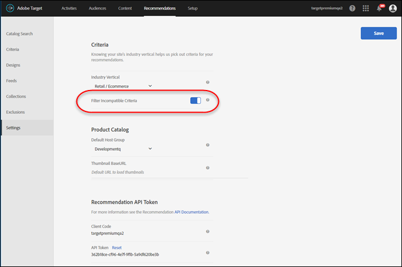

#  Veelgestelde vragen over Recommendations

Lijst met veelgestelde vragen (FAQ&#39;s) over [!DNL Adobe Target] [!DNL Recommendations] activiteiten.

## Waarom doet [!UICONTROL Catalog Search] De juiste resultaten niet weergeven wanneer ik een aangepast kenmerk met een numerieke waarde zoek?

Wanneer u een catalogusonderzoek op een douanekenmerk met een numerieke waarde uitvoert, behandelen de resultaten het douanekenmerk om een koordtype in plaats van een numerieke waarde te zijn.

Er is momenteel geen functionaliteit beschikbaar waarmee klanten het type van een kenmerk kunnen wijzigen. Als u een wijziging wilt aanbrengen, [een klantenprobleem openen](/help/main/cmp-resources-and-contact-information.md#reference_ACA3391A00EF467B87930A450050077C) het verwijzen naar de kenmerken waarvoor het type moet worden gewijzigd van tekenreeks in numeriek.

## Hoe lang duurt het voordat updates van items in mijn catalogus op mijn site worden weergegeven?

Het tijdkader en de resultaten variëren, afhankelijk van hoe de items worden bijgewerkt.

| Bron | Details |
| --- | --- |
| Itemkenmerken bijgewerkt via mbox of API | <ul><li>Recommendations wordt binnen 15 minuten bijgewerkt.</li><li>Bestaande aanbevelingen en itemkenmerken worden weergegeven totdat updates beschikbaar zijn.</li><li>Zoekopdracht in catalogus wordt bijgewerkt na catalogusindex (3-8 uur).</li></ul> |
| Itemkenmerken bijgewerkt via feed | <ul><li>Recommendations wordt bijgewerkt na inname van het voer (2-8 uur).</li><li>Bestaande aanbevelingen en itemkenmerken worden weergegeven totdat updates beschikbaar zijn.</li><li>Zoekopdracht in catalogus wordt bijgewerkt na invoer (2-8 uur) en na volgende catalogusindex (3-8 uur). Zoekopdrachten voor catalogi worden binnen 5-16 uur bijgewerkt.</li></ul> |
| Item verwijderd uit catalogus via [!DNL Target] UI of API | <ul><li>Recommendations wordt binnen 15 minuten bijgewerkt.</li><li>Bestaande aanbevelingen en itemkenmerken worden weergegeven totdat updates beschikbaar zijn.</li><li>Zoekopdracht in catalogus wordt bijgewerkt na catalogusindex (3-8 uur).</li></ul> |
| Item dat via mbox of API aan de catalogus is toegevoegd | <ul><li>Recommendations wordt bijgewerkt nadat het algoritme is uitgevoerd. Algorithm-run is elke 12 uur gepland voor algoritmes van 1 tot 2 dagen en elke 24 uur voor algoritmen van 7 of meer dagen.</li><li>Bestaande aanbevelingen worden weergegeven totdat updates beschikbaar zijn als het toegevoegde item geen gevraagde sleutel is.</li><li>Back-upaanbevelingen worden weergegeven totdat updates beschikbaar zijn als het toegevoegde item een gevraagde sleutel is.</li><li>Zoekopdracht in catalogus wordt bijgewerkt na catalogusindex (3-8 uur).</li></ul> |
| Item dat via feed aan de catalogus is toegevoegd | <ul><li>Recommendations wordt bijgewerkt na inname van het voer (2-8 uur). De volgende algoritmelooppas wordt gepland om de 12 uur voor 1-2 dagalgoritmen en om de 24 uur voor 7+ dagalgoritmen. Recommendations wordt in totaal binnen 2-32 uur bijgewerkt.</li><li>Bestaande aanbevelingen worden weergegeven totdat updates beschikbaar zijn als het toegevoegde item geen gevraagde sleutel is.</li><li>Back-upaanbevelingen worden weergegeven totdat updates beschikbaar zijn als het toegevoegde item een gevraagde sleutel is.</li><li>Zoekopdracht in catalogus wordt bijgewerkt na invoer (2-8 uur) en na catalogusindex (3-8 uur). Zoekopdrachten voor catalogi worden binnen 5-16 uur bijgewerkt.</li></ul> |

Nadat u een feed-bestand hebt geïmporteerd of nadat u eenheidupdates hebt ontvangen via API of mbox, worden de volgende wijzigingen in minder dan 60 minuten doorgevoerd:

* Als een item eerder was uitgesloten maar nu moet worden opgenomen, wordt het item opgenomen in de volgende reeks algoritmen (12-24 uur).

   Deze situatie doet zich voor omdat [!DNL Target] Hiermee past u zowel online als offline uitsluitingen toe. Wanneer een item pas wordt uitgesloten, wordt de online uitsluiting snel toegepast. Wanneer een item pas wordt opgenomen, gaat de onlineuitsluiting snel weg, maar de offline uitsluiting gaat pas weg als het volgende algoritme wordt uitgevoerd.

* Als een item eerder was opgenomen maar nu moet worden uitgesloten, wordt het item uitgesloten volgens de &quot;Itemkenmerken bijgewerkt...&quot; de hierboven besproken tijdlijn, afhankelijk van de voederbron (15 minuten via mbox/API of 12-24 uur via feed).

De volgende wijzigingen worden pas doorgevoerd wanneer het volgende algoritme wordt uitgevoerd (binnen 12-24 uur):

* Itemkenmerken die worden gebruikt in de regels voor verzamelingen die worden gebruikt voor de activiteit.
* Objectkenmerken die worden gebruikt in een speciale actie die is gebaseerd op een kenmerk of verzameling dat aan de activiteit is gekoppeld.
* Objectcategorie waarin het item wordt weergegeven voor &quot;Huidige rubriek&quot; of &quot;Favoriete rubriek&quot; in de hoogste verkopers of het meest bekeken algoritme.
* Het rangschikken van geadviseerde punten wanneer het attribuut veranderde is een douaneattribuut dat als douanetoets voor een algoritme wordt gebruikt.
* Rangschikking van aanbevolen items op basis van een of meer gewijzigde kenmerken wanneer de logica van de aanbeveling &quot;Items met vergelijkbare kenmerken&quot; is, wanneer de wegingsfactoren &quot;Gelijksoortigheid van inhoud&quot; worden gebruikt of wanneer de factoren &quot;Afweging van kenmerken&quot; worden gebruikt.

>[!NOTE]
>
>Een voederdossier wordt beschouwd als ingevoerd wanneer zijn status van &quot;het Importeren van Punten&quot;in &quot;het Voorbereiden van de Updates van de Index van het Onderzoek&quot; verandert. De updates kunnen meer dan 60 minuten vergen om in het gebruikersinterface van het Onderzoek van de Catalogus worden weerspiegeld; Zoekopdracht in catalogus is up-to-date wanneer de status van de feed verandert in &quot;Updates voltooid&quot;. Zelfs als Catalog Search nog niet bijgewerkt is, geeft uw site updates van de hierboven vermelde tijdframes weer. De meest recente update van de index van het Onderzoek van de Catalogus wordt getoond op de pagina van het Onderzoek van de Catalogus.

## Hoe lang duurt het voor een verandering in de configuratie van mijn [!UICONTROL Recommendations] activiteiten, aanbiedingen, promoties of criteria die op mijn site worden weergegeven?

* Een wijziging in de instellingen voor speciale acties kan maximaal vijf uur duren voordat deze op de site worden weergegeven.
* Een wijziging in andere criteria wordt mogelijk pas doorgevoerd bij de volgende uitvoering van het algoritme:

   * Bepaalde criteria-instellingen (bijvoorbeeld &#39;toevoeging van een regel voor dynamische insluiting&#39;) worden direct weerspiegeld.
   * Andere criteria-instellingen (bijvoorbeeld &quot;verwijdering van een regel voor dynamische insluiting&quot;, wijziging van terugzoekvenster enzovoort) kunnen pas worden opgenomen als het volgende algoritme wordt uitgevoerd.
   * De looppas van het algoritme wordt teweeggebracht door deze veranderingen maar kan tot 24 uren vergen om worden voltooid. Algoritmen lopen ook op een geplande basis om de 12-24 uur.

## Hoe lang duurt het voordat het gedrag van een gebruiker (bijvoorbeeld door op product A te klikken en product B te kopen) in de aanbevelingen wordt weerspiegeld *dat* gebruiker ontvangt?

* Bekeken/aangeschaft product/inhoud beïnvloedt momenteel de aanbevelingen die de gebruiker op de zelfde pagina ontvangt/[!DNL Target] inhoudsverzoek.
* Historisch gebruikersgedrag, zoals &quot;laatst bekeken product&quot;, &quot;meest bekeken product&quot; en de algemene weergave-/aankoopgeschiedenis worden bijgewerkt met dat verzoek en beïnvloeden de aanbevelingen die de gebruiker ontvangt op de volgende pagina/[!DNL Target] inhoudsverzoek. De algoritmen &quot;Recent bekeken items&quot; en &quot;Aanbevolen voor u&quot; werken bijvoorbeeld bij met elke productweergave/aankoop en worden weergegeven in de volgende inhoudsaanvraag.

## Hoe lang duurt het voordat het gedrag van een gebruiker (bijvoorbeeld door op product A te klikken en product B te kopen) in de aanbevelingen wordt weerspiegeld *overige* gebruikers ontvangen?

Het gedrag van geaggregeerde gebruikers wordt opgenomen in de verwerking van offlinealgoritmen, waarbij elk algoritme elke 12-24 uur wordt uitgevoerd.

## Wat moet ik doen als speciale karakters mijn serie breken? {#section_D27214116EE443638A60887C7D1C534E}

Gebruik beschermde waarden in JavaScript. Aanhalingstekens ( &quot; ) kunnen de array afbreken. Het volgende codefragment is een voorbeeld van beschermde waarden:

```
#set($String='') 
#set($escaper=$String.class.forName('org.apache.commons.lang.StringEscapeUtils')) 
<script type="text/javascript"> 
console.log("$escaper.escapeJavaScript($entity1.name)") 
console.log("$escaper.escapeJavaScript($entity2.name)") 
console.log('$escaper.escapeJavaScript($entity3.name)') 
names.push("$escaper.escapeJavaScript($entity4.name)") 
</script>
```

## Waarom zijn niet alle criteria, met inbegrip van douanecriteria, beschikbaar voor selectie wanneer het creëren van een activiteit van Recommendations? {#section_B2265AC8B8A94E0298D495A05C5D817F}

De beschikbare criteria zijn gebaseerd op de huidige categorie. Wanneer u aanbevelingen aanbiedt, geeft de algoritmekiezer criteria weer op basis van categorie-id.

Als de plaats waarop u deze criteria toepast niet de categorie ID bevat, zijn bepaalde criteria niet beschikbaar in de algoritmekiezer.

Als u een locatie gebruikt waar categorie-id aanwezig is in het vak, bevat de kiezer voor criteria alle toepasselijke criteria.

[!DNL Target] heeft een [Niet-compatibele criteria filteren](/help/main/c-recommendations/plan-implement.md#concept_C1E1E2351413468692D6C21145EF0B84) instellen om het intelligent filteren van de algoritmekiezer te beheren.

>[!NOTE]
>
>Deze instelling is van toepassing op activiteiten die zijn gemaakt in het dialoogvenster [!UICONTROL Visual Experience Composer] (VEC) alleen. Deze instelling is niet van toepassing op activiteiten die zijn gemaakt in de Form-Based Experience Composer ([!DNL Target] heeft geen locatiecontext).

Om toegang te krijgen tot [!UICONTROL Filter Incompatible Criteria] instellen, klikt u op [!UICONTROL Recommendations] > [!UICONTROL Settings]:



Als de [!UICONTROL Filter Incompatible Criteria] instelling NIET ingeschakeld is, [!DNL Target] filtert geen algoritmes in de Algorituurkiezer en alle algoritmen worden weergegeven.

Als de [!UICONTROL Filter Incompatible Criteria] de instelling is ingeschakeld bij VEC-activiteiten; [!DNL Target] leest entityId en categorie ID van de geselecteerde plaats en toont dan algoritmen die op worden gebaseerd `currentItem|currentCategory` (als de respectieve waarden op die plaats aanwezig zijn). Hierdoor worden standaard alleen compatibele algoritmen voor de geselecteerde locatie weergegeven in de algoritmekiezer.

Als de [!UICONTROL Filter Incompatible Criteria] instelling is ingeschakeld, kunt u nog steeds niet-compatibele algoritmen weergeven door de selectie van de optie [!UICONTROL Compatible] selectievakje tijdens het selecteren van criteria.


De volgende lijst bevat speciale gevallen waarin [!DNL Target] wordt niet weergegeven [!UICONTROL Compatible] selectievakje:

* Zowel entiteitskaart als categorie ID zijn aanwezig op de plaats, dan niets wordt gefilterd.
* U gebruikt [!DNL mbox.js] versie 55 of lager.
* Geen mbox vraag wordt in brand gestoken van de pagina (!config.isAutoCreateGlobalMbox &amp;&amp; !config.isRegionalMbox)
* [!DNL Target] parameters zijn niet gedefinieerd.

## Wat moet ik doen als een verzameling in Recommendations naar nul gaat (0)? {#section_E2DB2FE67CF24EEC81412BFF3FA6385D}

Overweeg de volgende informatie als u een inzameling ziet gaan naar nul die eerder niet bij nul was:

* U kunt de verzameling opnieuw opslaan en zien of het nummer wordt bijgewerkt. Door op te slaan, herstelt de inzameling alle algoritmen die die inzameling gebruiken.
* Kijk je naar de juiste omgeving? Ga naar [!DNL /target/products.html#recsSettings] om (zoals hieronder getoond) tweemaal te controleren.

   

* Is uw index up-to-date? Ga naar [!DNL /target/products.html#productSearch] en controleer hoeveel uren de index (bijvoorbeeld &quot;Geïndexeerde 3 uur geleden&quot;) is. U kunt de index naar wens vernieuwen.
* Heeft u iets in de feed of de gegevenslaag gewijzigd waardoor de entiteiten niet meer overeenkomen met de verzamelingsregels? Zorg ervoor dat uw HOOFDLETTERS overeenkomen (hoofdlettergevoelig).
* Is uw feed gelukt? Heeft iemand de FTP-map, het wachtwoord enzovoort gewijzigd?
* [!DNL Target] doet zijn best om updates aan de levering (op de pagina van de klant/app) te maken zo snel mogelijk gebeuren. Toch [!DNL Target] ook moet één of andere vertegenwoordiging in UI voor de telleraar verstrekken. [!DNL Target] zorgt ervoor dat de leveringsupdates niet worden vertraagd totdat de UI-updates gesynchroniseerd zijn. U kunt [mboxTrace](/help/main/c-activities/c-troubleshooting-activities/content-trouble.md) om te zien wat er in het systeem staat op het moment dat een verzoek wordt ingediend.

## Wat is het verschil tussen de algemene weging van de Waarden van Attributen en Inhoud gelijksoortig-specifieke attributen? {#section_FCD96598CBB44B16A4C6C084649928FF}

Kenmerkweging bestaat in twee vormen: &quot;standard attribute weight&quot; en &quot;content similarity attribute weight&quot;.

De &quot;Standaard kenmerkenweging&quot; is van toepassing op de meeste, zo niet alle, definitietypen (niet alleen de Gelijksoortigheid van de Inhoud). Dit type weging geeft meer gewicht aan bepaalde kenmerkwaarden. In het volgende voorbeeld krijgen Nike-producten een reliëf in de aanbevelingen voor uitvoer.


De &quot;weging van de gelijksoortige eigenschappen van de inhoud&quot;is slechts op de criteria van de Gelijksoortigheid van de Inhoud van toepassing.

Dit type weging is dynamischer en is gebaseerd op de huidige &quot;aanbeveling key&quot; (het momenteel bekeken item). In het volgende voorbeeld (merk x 16), als een bezoeker Nike sneakers zou bekijken, zal die bezoeker eerder andere Nike-producten (niet noodzakelijkerwijs alleen sneakers) dan concurrenten-sneakers aanraden. Als een bezoeker Adidas sneakers bekijkt, zal die bezoeker eerder Adidas producten worden geadviseerd.


## Waarom [!DNL Target] soms niet in staat om aanbevelingen te tonen? {#section_DB3F40673AED42228E407C05437D99E9}

[!DNL Target] kunnen soms geen aanbevelingen tonen wegens het lage aantal beschikbare aanbevelingen.

Het aantal waarden dat per criterium wordt gegenereerd, is driemaal zo groot als het aantal entiteiten dat in het ontwerp is opgegeven. Het filtreren van runtime (bijvoorbeeld, inventaris, mbox kenmerkenaanpassing) wordt toegepast nadat de 3x waarden worden geproduceerd, zodat is het mogelijk met minder dan 3x waarden bij leveringstijd beëindigen. Om deze situatie te verzachten, vergroot u het aantal entiteiten in het ontwerp door andere entiteiten te verbergen.

Het volgende JavaScript kan aan het begin van het ontwerp worden gebruikt om het aantal gevraagde entiteiten te verhogen. In dit voorbeeld is het aantal aangevraagde entiteiten 30 (3x10).

```
#foreach($entity in $entities) 
 #if( $foreach.count > 10 ) 
  #break 
 #end 
 #set ($foo = $entity.id) 
#end 
```

## Wat is de formaatgrens van een API vraag voor tussenvoegsel/updateproducten? Kan ik 50.000 producten in één vraag bijwerken gebruikend API in plaats van een voer? {#section_434FE1F187B7436AA39B7C14C7895168}

[!DNL Target] stelt een postlimiet van 50 MB op toepassingsniveau op; dat is echter alleen wanneer u `application/x-www-form-urlencoded` koptekst inhoudstype.

Je zou zeker kunnen proberen om 50.000 producten in één enkele vraag te verzenden. Als het ontbreekt, kunt u het in partijen verdelen. Adobe raadt klanten aan hun aanroepen op te splitsen in 5.000 of 10.000 productbatches om de kans op een time-out als gevolg van systeembelasting te verkleinen.

## Moet ik de naam van het selectievakje opgeven bij het maken van Recommendations-criteria, -promoties of -testregels voor sjablonen? {#section_FFA42ABCC5954B48A46526E32A3A88A2}

Bij het maken van Recommendations-criteria, -promoties of -testregels voor sjablonen op basis van een mbox-parameter, `mboxParameter` vraagt u niet meer om `mboxName`. mbox name is nu optioneel. Met deze wijziging kunt u parameters uit meerdere vakken gebruiken of verwijzen naar een parameter die nog niet op de rand is opgenomen.

De gewenste parameter selecteren:

* Selecteer een parameternaam in de lijst wanneer u criteria, promoties of testregels voor sjablonen maakt. Typ de eerste tekens van de gewenste parameternaam of typ de volledige naam van de gewenste parameternaam.
* Als u de naam van het selectievakje, maar niet de naam van de parameter, onthoudt, gebruikt u het selectievakje om te filteren op een bekend selectievakje dat de gewenste parameter doorgeeft.

Bij beide methoden is er geen koppeling tussen de mbox en de parameter. De criteria, de bevordering, of de malplaatje testende regel werken die op parameter over alle vakjes worden gebaseerd die die parameter overgaan.

Als u bestaande criteria, bevordering, of malplaatje het testen regel uitgeeft, tonen de het filtreren criteria met de mbox naam die tijdens verwezenlijking werd verstrekt.

## Waarom kan ik mijn oudere Recommendations-activiteit niet opslaan nadat ik een nieuw publiek heb gedefinieerd? {#section_1E47C40B1FE7479BAC3EE0F50CE7C2C4}

Zorg ervoor dat het publiek een unieke naam heeft. Als u het publiek dezelfde naam hebt gegeven als een bestaand publiek, kunt u uw oudere Recommendations-activiteit (een Recommendations-activiteit die vóór oktober 2016 is gemaakt) niet opslaan.

## Wat is de maximumgrootte van een CSV-bestand voor een feed-upload? {#section_20F1AF4839A447B9889B246D6E873538}

Het aantal rijen of de bestandsgrootte voor het uploaden van een CSV-bestand van een feed is niet hard beperkt. Adobe raadt echter aan om de CSV-bestandsgrootte te beperken tot 1 GB om fouten tijdens het uploaden van het bestand te voorkomen. Als de grootte van het bestand groter is dan 1 GB, kan het bestand idealiter in meerdere feed-bestanden worden gesplitst. Het maximumaantal kolommen voor aangepaste kenmerken is 100 en de aangepaste kenmerken zijn beperkt tot 4096 tekens. Andere limieten voor de lengte van vereiste kolommen zijn beschikbaar op de [[!DNL Target] Pagina Beperkingen](/help/main/r-troubleshooting-target/target-limits.md#reference_BEFE60C3AAA442FF94D4EBFB9D3CC9B1).

## Kan ik een entiteit dynamisch uitsluiten? {#exclude}

In het vraagkoord, kunt u entiteit IDs voor entiteiten overgaan die u van uw aanbevelingen wilt uitsluiten. U kunt bijvoorbeeld items uitsluiten die zich al in het winkelwagentje bevinden.

Als u de uitsluitingsfunctionaliteit wilt inschakelen, gebruikt u de opdracht `excludedIds` mbox-parameter. Deze parameter verwijst naar een lijst met door komma&#39;s gescheiden entiteit-id&#39;s. Bijvoorbeeld, `mboxCreate(..., "excludedIds=1,2,3,4,5")`. De waarde wordt verzonden wanneer het verzoeken van om aanbevelingen.

De uitsluiting wordt uitgevoerd voor de huidige [!DNL Target] alleen oproepen; items worden bij volgende bewerkingen niet uitgesloten [!DNL Target] roept tenzij `excludedIds` waarde wordt opnieuw doorgegeven. Als u items in het winkelwagentje wilt uitsluiten van aanbevelingen op elke pagina, gaat u door met `excludedIds` op elke pagina.

>[!NOTE]
>
>Als te veel entiteiten zijn uitgesloten, gedragen de aanbevelingen zich alsof er niet genoeg entiteiten zijn om het advisemalplaatje te vullen.

Uitsluiten `entityIds`, voegt de `&excludes=${mbox.excludedIds}` token voor de inhoud-URL van het aanbod. Wanneer de inhoud-URL wordt geëxtraheerd, worden de vereiste parameters vervangen door de huidige parameters voor mbox-aanvragen.

Deze functie is standaard ingeschakeld voor nieuwe aanbevelingen. Bestaande aanbevelingen moeten worden opgeslagen om dynamisch uitgesloten entiteiten te ondersteunen.

## Wat betekent de reactie van NO_CONTENT soms teruggekeerd in de inhoud van Recommendations spoor?

NO_CONTENT wordt geretourneerd wanneer aanbevelingen niet beschikbaar zijn voor het gevraagde algoritme en de toetsencombinatie. Over het algemeen, komt deze situatie voor wanneer de steunen voor het algoritme en één of meerdere van het volgende ook waar zijn onbruikbaar gemaakt:

* De resultaten zijn nog niet gereed.

   Deze situatie komt typisch voor wanneer eerst het bewaren van een pas gecreëerde activiteit of nadat de configuratieveranderingen in de inzameling, de criteria, of de bevorderingen worden aangebracht die in de activiteit worden gebruikt.

* De resultaten zijn klaar, maar zijn nog niet in het voorgeheugen ondergebracht bij de dichtstbijzijnde randserver, voor de gevraagde algoritme/toetsencombinatie.

   De aanvraag start een cachebewerking. Dit probleem moet dus worden opgelost nadat de pagina enkele keren opnieuw is geladen en/of een paar minuten is verstreken.

* De resultaten zijn gereed, maar niet beschikbaar voor de opgegeven sleutelwaarde.

   Deze situatie komt typisch voor wanneer het verzoeken van om aanbevelingen voor een punt dat aan de catalogus na de meest recente looppas van het algoritme werd toegevoegd en zal na de volgende algoritmelooppas oplossen.

* Gedeeltelijke sjabloonrendering is uitgeschakeld en er zijn onvoldoende resultaten beschikbaar om de sjabloon te vullen.

   Deze situatie komt typisch voor wanneer u een dynamische integratieregel hebt, die veel punten van de mogelijke resultaten agressief filtert. Om situatie te vermijden, laat steunen toe en pas niet de inclusieregel op steunen toe, of gebruik achtereenvolgens de criteria met minder-agressief gefilterde criteria.

## Blijven aanbevelingen op basis van onlangs weergegeven items op meerdere apparaten voor één bezoeker? {#persist-across-devices}

Wanneer een bezoeker een sessie start, is de sessie-id gekoppeld aan één Edge-computer en wordt een cache met een tijdelijk profiel opgeslagen op deze Edge-computer. De volgende verzoeken van de zelfde zitting lezen dit profielgeheime voorgeheugen, met inbegrip van onlangs bekeken punten.

Wanneer de sessie wordt beëindigd (doorgaans wanneer deze verloopt na 30 minuten zonder activiteit), wordt de sessiestatus, inclusief onlangs weergegeven items, voortgezet naar een meer permanente profielopslag in dezelfde geografische rand.

De volgende zittingen van verschillende apparaten kunnen dan tot deze onlangs bekeken punten toegang hebben zolang de nieuwe zitting met het klantenprofiel via zelfde Marketing Cloud ID (MCID), Experience Cloud identiteitskaart (ECID), of CustomerID/mbox3rdPartyId wordt verbonden.

Als een bezoeker twee actieve zittingen tezelfdertijd heeft, onlangs bekeken punten op één apparaat niet de onlangs bekeken punten op het andere apparaat bijwerken, tenzij de apparaten worden gedwongen om zittingsidentiteitskaart te delen. Er is een mogelijke oplossing voor dit probleem, maar [!DNL Target] biedt niet rechtstreeks ondersteuning voor het delen van een sessie-id op meerdere apparaten. De klant moet deze id zelf delen.

Dit gedrag treedt nog steeds op als een bezoeker actief is op het ene apparaat en vervolgens een paar minuten later actief wordt op het andere apparaat. De sessie van het eerste apparaat verloopt niet gedurende 30 minuten en er kan maximaal vijf minuten vertraging optreden voordat de profielstatus naar de permanente status wordt geschreven en verwerkt. 35 minuten laten verlopen voordat de sessie verloopt en het profiel moet worden opgeslagen wanneer dit gedrag wordt getest.

Als de bezoeker niet tegelijkertijd twee actieve sessies heeft, worden onlangs bekeken items op het ene apparaat bijgewerkt met de onlangs weergegeven items op het andere apparaat zolang de sessie is beëindigd. Laat 35 minuten verlopen voor de sessie wanneer u dit gedrag test.

## Kan ik een algoritme gebruiken dat is gemaakt in [!DNL Adobe Recommendations Classic] in [!DNL Recommendations Premium]?

Een algoritme gemaakt in [!DNL Recommendations Classic] wordt niet ondersteund in [!DNL Recommendations Premium]. Mogelijk kunt u het verouderde algoritme gebruiken in [!DNL Target Premium]; het algoritme kan echter synchronisatieproblemen veroorzaken wanneer de activiteit in het [!DNL Target Premium] UI. Voor meer informatie over de verschillen tussen de twee oplossingen, zie [[!DNL Recommendations Classic] versus [!DNL Recommendations] activiteiten in [!DNL Target Premium]](/help/main/c-recommendations/c-recommendations-faq/recommendations-classic-versus-recommendations-activities-target-premium.md).

## Hoe kan ik alleen nieuwe artikelen of video&#39;s aanbevelen? {#recommend-new-articles}

Sommige klanten in media en uitgevers willen ervoor zorgen dat de aanbevolen items alleen de nieuwste artikelen of video&#39;s bevatten. Als voorbeeld [!DNL Target] de klant heeft de volgende aanpak gebruikt om artikelen van minder dan 60 dagen aan te bevelen :

1. Geef de publicatiedatum van het artikel in de notatie JJMMDDD door als een attribuut van de douaneentiteit.
1. Maak een profielscript dat de datum minus 60 dagen van vandaag is, ook in de notatie JJJMMDD.
1. Gebruik een dynamisch inclusiefilter in de criteria zodat `publish date > today’s date minus 60 days`.

### Geef de publicatiedatum door als een aangepast entiteitskenmerk:

| Entiteitskenmerk | Voorbeeld |
| --- | --- |
| issueDate | 2021218 |
| lastViewDate | 2021701 |
| parentCategory | commentaar |
| publishDate | 20210113 |
| publishDateDisplay | 13 jan. 2021 |

### Configureer het profielscript:


### Configureer de insluitingsregel:


>[!NOTE]
>
>Dit voorbeeld kan ook worden uitgevoerd door parameter matching en het doorgeven van `priorDate60` waarde als een mbox-parameter.
