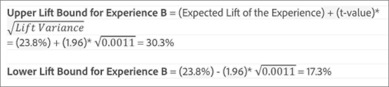

# Gemiddelde optillen, Lift Bounds en het Interval van het Vertrouwen

Rapporten bevatten verschillende gegevenspunten en visualisatieweergaven die u helpen de grenzen van de lift en het betrouwbaarheidsniveau te begrijpen die aan uw [!DNL Adobe Target] -activiteit zijn gekoppeld, zodat u nauwkeuriger kunt bepalen wie de winnaar is.

>[!NOTE]
>
>Deze functie is alleen beschikbaar wanneer u rapporten weergeeft in [!UICONTROL Table] Weergave. Deze eigenschap is niet beschikbaar voor activiteiten die [&#x200B; Analytics als rapporteringsbron (A4T) &#x200B;](/help/main/c-integrating-target-with-mac/a4t/a4t.md#concept_7540C8C04259434AB6EE33B09F47A1DE) gebruiken.

## De gegevens interpreteren {#section_62C0D7E76F3D49A7B3C371C82AEF27D5}

In de volgende afbeelding worden [!UICONTROL Lift Bounds and Confidence Level] -gegevens getoond:

De informatie over lift en betrouwbaarheid in de rapportinterface van [!DNL Target] bevat:

### Optillen

Het grote getal en de pijl geven de verwachte waarde van de lift aan. Dit getal is het middelpunt van het bereik van de grenzen van de lift. De verwachte liftpijl wordt grijs weergegeven totdat het vertrouwen 95% bereikt. Na deze drempel wordt de pijl weergegeven als rood of groen op basis van respectievelijk een negatieve of positieve lift.

### Grenzen optillen

Dit is het 95% betrouwbaarheidsinterval van de lift. Het wordt weergegeven als een bereik onder de gemiddelde lift. Zie [&#x200B; berekening van het Voorbeeld &#x200B;](#example) hieronder voor een voorbeeld van hoe deze liftgrenzen worden berekend.

### Boxplot-grafiek

De grafiek van het klokdiagram in de [!DNL Target] interface vertegenwoordigt de verwachte waarde en 95% betrouwbaarheidsinterval van succesmetrisch in kwestie. Beschouw het als een grafische manier om de informatie over de lift en de lift grenzen te bekijken.

Er zijn enkele belangrijke manieren waarop u met [!DNL Target] de vertrouwensinformatie kunt interpreteren, waaronder kleur. De grafiek toont om het even welke overlapping in het betrouwbaarheidsinterval van een specifieke ervaring met het betrouwbaarheidsinterval van de controle in grijs, en om het even welk waaier van het betrouwbaarheidsinterval van een specifieke ervaring die boven of onder dat van het interval van het controlevertrouwen als groen of rood is.

De lengte van de balk van het boxplot geeft aan hoe groot het betrouwbaarheidsinterval is op een begrijpelijke manier. Terwijl u meer gegevens verzamelt in uw activiteit, verschuift en verandert de balk. Het betrouwbaarheidsinterval wordt afgeleid van de variantie en de steekproefgrootte (aantal bezoekers). Hoe kleiner de variantie en hoe groter het monster, hoe kleiner het betrouwbaarheidsinterval.

### Vertrouwen

Het vertrouwen van een ervaring of een aanbieding die wordt getoond is een waarschijnlijkheid (uitgedrukt als percentage) van het verkrijgen van een resultaat _minder extreem_ dan die eigenlijk wordt waargenomen, _als de ongeldige hypothese waar_ is, d.w.z. als er geen verschil in omzettingspercentages tussen die ervaring of aanbieding, en de controleervaring/aanbieding is. Wat de p-waarden betreft, wordt dit vertrouwen weergegeven als `1 - p-value` . Eenvoudiger gezegd, geeft een hoger vertrouwen aan dat de gegevens minder consistent zijn met de aanname dat het aanbod/de ervaring van de controle en de niet-controle gelijke omrekeningskoersen hebben.

## Begrijp hoe het betrouwbaarheidsinterval voor lift wordt bepaald {#pdf}

Download het [&#x200B; Interval van het Vertrouwen voor Lift pdf- dossier &#x200B;](/help/main/assets/confidence_interval_lift.pdf) voor meer informatie.

## Hoe worden liftgrenzen berekend? {#section_1D360781D972483693680BE0F07AEAD1}

De grenzen van de lift vertegenwoordigen de 95% betrouwbaarheidsintervallen van de lift die de specifieke ervaring of het specifieke aanbod over de controleervaring of het aanbod heeft. Het betekent dat de eigenlijke lift ongeveer 95 procent kans heeft om tussen deze grenzen te liggen.

De grenzen van de lift worden berekend met behulp van de volgende formule:

Er is een extra berekening om de invoer aan onze liftgrenzen te bereiken:

* **t-waarde:** de kritieke statistiek voor ons 95% betrouwbaarheidsniveau is 1.96. U kunt meer over [&#x200B; t-waarden hier &#x200B;](https://en.wikipedia.org/wiki/T-statistic) leren.
* **de Variantie van het Lift:** De StandaardFout van het succes van N van de Ervaring en de StandaardFout van het succes van de Ervaring van de Controle metrische zijn nodig om de hefboomvariantie te bepalen, die gebruikend de volgende formule wordt berekend (die in het geval wordt geïllustreerd metrisch succes is omzetting).

  

* **het Tarief van de Omzetting/de Metrische Standaard van het Succes Fout:** de Standaardfout wordt berekend op de zelfde manier voor Ervaring N en de Controle, gebruikend de volgende formule (die in het geval wordt geïllustreerd metrisch succes is omzetting). U kunt meer over [&#x200B; standaardfout hier &#x200B;](https://en.wikipedia.org/wiki/Standard_error) leren.

  

  >[!NOTE]
  >
  >De standaardfout voor de metrische activiteiten van het opbrengstsucces is gebaseerd op de steekproefvariantie van de inkomsten.

## Voorbeeldberekening {#example}

Neem bijvoorbeeld een voorbeeldactiviteit met twee ervaringen en de volgende resultaten:

| Ervaring | Bezoekers | Conversies | Conversiesnelheid |
|--- |--- |--- |--- |
| Ervaring A (controle) | 219 328 | 2.466 | 1,12% |
| Ervaring B | 218 362 | 3.040 | 1,39% |

Op basis van onze formules kunnen we de inputs berekenen die we nodig hebben voor de limieten van de lift.

**StandaardFout voor Ervaring A (Controle)**

**StandaardFout voor Ervaring B**

**tilt Variantie voor Ervaring B**

**Lift Grenzen voor Ervaring B**

Verwacht optillen voor ervaring B:

De limieten voor de lift voor ervaring B zouden daarom als volgt zijn:

>[!NOTE]
>
>Verwacht kleine verschillen tussen handmatige berekeningen met behulp van de bovenstaande formules en de getallen die in het rapport worden weergegeven. Het verschil kan worden toegeschreven aan het feit dat de getallen die in handmatige berekeningen worden gebruikt, op de pagina worden afgerond. De lift die in het [!DNL Target] -rapport wordt weergegeven, is gebaseerd op de exacte getallen die zijn verkregen uit de totale betrokkenheid en de telling van de betrokkenheid. De betrokkenheidsnummers kunnen worden verkregen via de prestatierapport-API.

## Wanneer worden liftgrenzen niet weergegeven? {#section_C5622E1E94684DAD937249B51A9E42CC}

In bepaalde gevallen geeft [!DNL Target] geen liftgrenzen weer:

* Voor elke activiteit, wanneer het totale aantal bezoeken of bezoekers minder dan 30 bedraagt.
* Voor [!UICONTROL Auto-Allocate] -activiteiten worden geen liftgrenzen weergegeven totdat één ervaring een betrouwbaarheid van 60% heeft bereikt.
