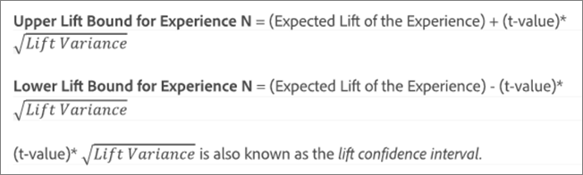
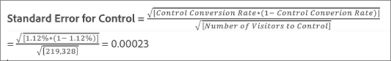

# Gemiddelde optillen, Lift Bounds en het Interval van het Vertrouwen

De rapporten omvatten verscheidene gegevenspunten en visualisatievertegenwoordiging die u helpen de liftgrenzen en het betrouwbaarheidsniveau begrijpen verbonden aan uw [!DNL Adobe Target] om je te helpen een winnaar nauwkeuriger te bepalen.

>[!NOTE]
>
>Deze functie is alleen beschikbaar als u rapporten bekijkt in [!UICONTROL Table] Weergeven. Deze functie is niet beschikbaar voor activiteiten die [Analyses als bron van rapportage (A4T)](/help/main/c-integrating-target-with-mac/a4t/a4t.md#concept_7540C8C04259434AB6EE33B09F47A1DE).

## De gegevens interpreteren {#section_62C0D7E76F3D49A7B3C371C82AEF27D5}

In de volgende afbeelding ziet u [!UICONTROL Lift Bounds and Confidence Level] informatie:

De lift en de vertrouwensinformatie in de [!DNL Target] rapportage-UI omvat:

### Optillen

Het grote getal en de pijl geven de verwachte waarde van de lift aan. Dit getal is het middelpunt van het bereik van de grenzen van de lift. De verwachte liftpijl wordt grijs weergegeven totdat het vertrouwen 95% bereikt. Na deze drempel wordt de pijl weergegeven als rood of groen op basis van respectievelijk een negatieve of positieve lift.

### Grenzen optillen

Dit is het 95% betrouwbaarheidsinterval van de lift. Het wordt weergegeven als een bereik onder de gemiddelde lift. Zie [Voorbeeldberekening](#example) hieronder vindt u een voorbeeld van de wijze waarop deze grenzen van de lift worden berekend.

### Boxplot-grafiek

De grafiek van het klokveld in de [!DNL Target] interface vertegenwoordigt de verwachte waarde en 95% betrouwbaarheidsinterval van succesmetrisch in kwestie. Beschouw het als een grafische manier om de informatie over de lift en de lift grenzen te bekijken.

Er zijn enkele manieren waarop u kunt werken [!DNL Target] helpt u bij het interpreteren van de betrouwbaarheidsinformatie, waaronder kleur. De grafiek toont om het even welke overlapping in het betrouwbaarheidsinterval van een specifieke ervaring met het betrouwbaarheidsinterval van de controle in grijs, en om het even welk waaier van het betrouwbaarheidsinterval van een specifieke ervaring die boven of onder dat van het interval van het controlevertrouwen als groen of rood is.

De lengte van de balk van het boxplot geeft aan hoe groot het betrouwbaarheidsinterval is op een begrijpelijke manier. Terwijl u meer gegevens verzamelt in uw activiteit, verschuift en verandert de balk. Het betrouwbaarheidsinterval wordt afgeleid van de variantie en de steekproefgrootte (aantal bezoekers). Hoe kleiner de variantie en hoe groter het monster, hoe kleiner het betrouwbaarheidsinterval.

### Vertrouwen

Het vertrouwen van een getoonde ervaring of aanbieding is een kans (uitgedrukt als percentage) om een resultaat te behalen _minder extreem_ dan degene die daadwerkelijk wordt waargenomen, _als de nulhypothese waar is_, d.w.z. als er geen verschil is in omrekeningskoersen tussen die ervaring of dat aanbod, en de ervaring/het aanbod van de controle. Wat p-waarden betreft, wordt dit vertrouwen weergegeven `1 - p-value`. Eenvoudiger gezegd, geeft een hoger vertrouwen aan dat de gegevens minder consistent zijn met de aanname dat het aanbod/de ervaring van de controle en de niet-controle gelijke omrekeningskoersen hebben.

## Begrijp hoe het betrouwbaarheidsinterval voor lift wordt bepaald {#pdf}

Download de [Vertrouwelijkheidsinterval voor optillen van pdf-bestand](/help/main/assets/confidence_interval_lift.pdf) voor meer informatie .

## Hoe worden liftgrenzen berekend? {#section_1D360781D972483693680BE0F07AEAD1}

De grenzen van de lift vertegenwoordigen de 95% betrouwbaarheidsintervallen van de lift die de specifieke ervaring of het specifieke aanbod over de controleervaring of het aanbod heeft. Het betekent dat de eigenlijke lift ongeveer 95 procent kans heeft om tussen deze grenzen te liggen.

De grenzen van de lift worden berekend met behulp van de volgende formule:

Er is een extra berekening om de invoer aan onze liftgrenzen te bereiken:

* **t-waarde:** De kritische statistiek voor ons 95%-betrouwbaarheidsniveau is 1,96. Meer informatie over [t-waarden hier](https://en.wikipedia.org/wiki/T-statistic).
* **Variantie optillen:** De standaardfout van het succes van N van de Ervaring en de StandaardFout van het succes van de Ervaring van de Controle metrisch zijn nodig om de hefvariantie te bepalen, die met de volgende formule wordt berekend (geïllustreerd in het geval dat succesmetrisch omzetting is).

   

* **Conversiesnelheid/fout metrische standaard met succes:** Standaardfout wordt op dezelfde manier berekend voor Experience N en de Control, met behulp van de volgende formule (geïllustreerd in het geval dat de succesparameter conversie is). Meer informatie over [standaardfout hier](https://en.wikipedia.org/wiki/Standard_error).

   

   >[!NOTE]
   >
   >De standaardfout voor de metrische activiteiten van het opbrengstsucces is gebaseerd op de steekproefvariantie van de inkomsten.

## Voorbeeldberekening {#example}

Neem bijvoorbeeld een voorbeeldactiviteit met twee ervaringen en de volgende resultaten:

| Ervaring | Bezoekers | Conversies | Omzetsnelheid |
|--- |--- |--- |--- |
| Ervaring A (controle) | 219, 328 | 2,466 | 1.12% |
| Ervaring B | 218, 362 | 3,040 | 1.39% |

Op basis van onze formules kunnen we de inputs berekenen die we nodig hebben voor de limieten van de lift.

**Standaardfout voor ervaring A (besturing)**

**Standaardfout voor ervaring B**

**Liftvariatie voor ervaring B**

**Grenzen optillen voor ervaring B**

Verwacht optillen voor ervaring B:

De limieten voor de lift voor ervaring B zouden daarom als volgt zijn:

>[!NOTE]
>
>Verwacht kleine verschillen tussen handmatige berekeningen met behulp van de bovenstaande formules en de getallen die in het rapport worden weergegeven. Het verschil kan worden toegeschreven aan het feit dat de getallen die in handmatige berekeningen worden gebruikt, op de pagina worden afgerond. De in de [!DNL Target] het rapport is gebaseerd op de exacte getallen die zijn verkregen uit de totale betrokkenheid en de telling van de betrokkenheid. De betrokkenheidsnummers kunnen worden verkregen via de prestatierapport-API.

## Wanneer worden liftgrenzen niet weergegeven? {#section_C5622E1E94684DAD937249B51A9E42CC}

In bepaalde gevallen [!DNL Target] geeft geen liftgrenzen weer:

* Voor elke activiteit, wanneer het totale aantal bezoeken of bezoekers minder dan 30 bedraagt.
* Voor [!UICONTROL Auto-Allocate] geen liftgrenzen worden weergegeven totdat één ervaring een betrouwbaarheid van 60% heeft bereikt.
