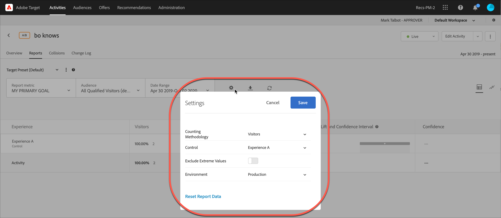

# Extreme waarden uitsluiten

U kunt extreme waarden uitsluiten van invloed op rapporten in [!DNL Adobe Target] dus een paar ongebruikelijke bestellingen hebben geen invloed op de resultaten van uw activiteit. Een voorbeeld van een ongebruikelijke bestelling zou een coach kunnen zijn die uniformen koopt voor een heel team in plaats van individuele kopers die individuele uniformen kopen.

>[!NOTE]
>
>De [!UICONTROL Exclude Extreme Values] vlag is van toepassing op activiteiten met [!UICONTROL Revenue] en [!UICONTROL Engagement] alleen metrische typen.

Extreme waarden worden automatisch gemarkeerd op basis van de onderstaande regels. U kunt schakelen tussen het zien van en het uitsluiten van de extreme waarden van uw rapporten. De extreme waarden van een activiteit worden uitgesloten nadat de activiteit gedurende een uur of na 15 orders is uitgevoerd, afhankelijk van welke het eerst komt.

Een waarde wordt als extreem beschouwd als deze meer dan +/- 3 standaardafwijkingen van de gemiddelde orderwaarde is op basis van de laatste maand van gegevens (tot het tijdstip waarop de berekening is gemaakt).

Het filter voor extreme waarden is bijvoorbeeld vaak handig bij het gebruik van RPV. RPV combineert de omrekeningskoers en de gemiddelde orderwaarde, en stelt vaak de volatiliteit van die cijfers bloot. Als u RPV gebruikt en bepaalt dat orders niet normaal verdeeld lijken te zijn, ziet u wellicht meer normale resultaten als u het filter voor extreme volgorde toepast.

Wanneer een waarde als extreem wordt gemarkeerd, wordt de waarde van de volgorde vervangen door de gemiddelde waarde van de ervaring voor de laatste maand, exclusief de uiterste waarden. De volgorde is ook als extreem gemarkeerd in het dialoogvenster [!UICONTROL Order Details] en in de CSV-download voor dagelijkse resultaten.

**Extreme waarden uitsluiten van uw rapporten:**

1. Open een activiteit die de metrische types van Inkomsten of van de Betrokkenheid omvat, dan klik **[!UICONTROL Reports]** tab.
1. Klik op het tandwielpictogram om het dialoogvenster **[!UICONTROL Settings]** in.

   

1. Schuif de **[!UICONTROL Exclude Extreme Values]** schakelen naar de aan- of uitstand.
1. Klik op **[!UICONTROL Save]**.
