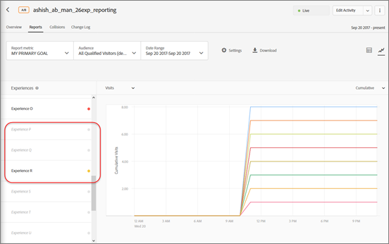

# Rapportinstellingen

Informatie om u te helpen de elementen plaatsen u in uw rapport in wilt verschijnen [!DNL Adobe Target]. Rapportinstellingen kunnen voor later gebruik worden opgeslagen.

Een rapport weergeven:

1. Klikken **[!UICONTROL Activities]** en klikt u vervolgens in de lijst op de gewenste activiteit.
1. Klik op de knop **[!UICONTROL Reports]** tab.

   

## Doelvoorinstelling {#section_51F67341465045BEB4F1A2FB638A8EB1}

U kunt maximaal tien verschillende voorinstellingen van het rapport van een afzonderlijke activiteit opslaan nadat u het naar wens hebt geconfigureerd (metriek, datumbereiken, publiek, geavanceerde instellingen, enzovoort). Alles [!DNL Target] gebruikers kunnen de verschillende voorinstellingen weergeven, bewerken en verwijderen, ongeacht wie deze heeft gemaakt.

U kunt het rapport van een individuele activiteit ook vormen zoals gewenst en dan die configuratie opslaan als uw gebrek/favoriete voorinstelling. Dit is de mening die toont wanneer u het rapport van die activiteit vooruitgaat.

### Een voorinstelling of standaardvoorinstelling maken

1. Configureer het activiteitenrapport naar wens.

   De beschikbare instellingen, zoals metriek, datumbereiken, publiek, geavanceerde instellingen, enzovoort, worden hieronder uitgelegd.

1. Volgende tot **[!UICONTROL Target Preset]**, klikt u op het pictogram drie verticale ovalen > **[!UICONTROL Save as New]**.

   

   Het dialoogvenster Nieuwe voorinstelling wordt weergegeven:

   

1. Controleer de informatie in de **[!UICONTROL Filters]** en **[!UICONTROL Settings]** secties om ervoor te zorgen dat het rapport zoals gewenst wordt gevormd, dan specificeer **[!UICONTROL Preset Name]** (maximaal 50 tekens).
1. (Voorwaardelijk) Als u dit uw standaard/favoriete rapportmening wilt zijn, dia **[!UICONTROL Set as default preset]** schakelen naar de Aan-positie.
1. Klik op **[!UICONTROL Save]**.

### Een andere voorinstelling selecteren

Selecteer de gewenste voorinstelling in het menu **[!UICONTROL Target Preset]** vervolgkeuzelijst.

### Een voorinstelling bewerken

1. Selecteer de voorinstelling die u wilt bewerken.
1. Geef de configuratie van het rapport zoals gewenst uit (metriek, datumwaaiers, publiek, geavanceerde montages, etc.).

   Nadat u op [!UICONTROL Save] na het uitgeven van de configuratie van het rapport, een asterisk ( &#42; ) wordt weergegeven na de naam van de voorinstelling om aan te geven dat de voorinstelling is gewijzigd, zoals hieronder wordt weergegeven:

   

1. Klik op het pictogram met drie verticale ovalen > **[!UICONTROL Save as New]** om een nieuwe voorinstelling te maken.

   of

   Klik op het pictogram met drie verticale ovalen > **[!UICONTROL Update]** om de huidige voorinstelling bij te werken.

   

### Een voorinstelling verwijderen

1. Selecteer de voorinstelling die u wilt verwijderen.
1. Klik op het pictogram met drie verticale ovalen > **[!UICONTROL Delete]**.

   

1. Klikken **[!UICONTROL Delete]** nogmaals ter bevestiging van uw verwijdering (verwijderde voorinstellingen kunnen niet worden hersteld).

### Foutafhandeling voorinstelling

Waarschuwingen en berichten in rapporten geven aan of een voorinstelling ongeldig wordt. Met de waarschuwing of het bericht kunt u een ander publiek, metrische groep, hostgroep of ervaring kiezen om een geldige voorinstelling te maken.

In de volgende lijst worden enkele situaties beschreven die ertoe kunnen leiden dat een voorinstelling ongeldig wordt:

* Er is een rapportagepubliek verwijderd uit de activiteit, maar er wordt naar verwezen in de definitie van de voorinstelling.
* Er is een (of meer) metrische waarde verwijderd, maar er wordt naar verwezen in de definitie van de voorinstelling. U kunt bijvoorbeeld een of meer metriek verwijderen uit de activiteit en vervolgens nieuwe metriek toevoegen.
* Een (of meer) hostgroep (omgeving) bestaat niet, maar wordt vermeld in de definitie van de voorinstelling.
* Een (of meer) ervaring is verwijderd nadat de voorinstelling is gemaakt, maar er wordt naar verwezen in de definitie van de voorinstelling.
* Een voorinstelling is semantisch ongeldig omdat de vermelde entiteiten nog bestaan, maar zijn bijgewerkt op een manier die de definitie van de voorinstelling semantisch is gewijzigd. Stel dat u in eerste instantie een voorinstelling maakt met de naam &#39;Revenue on Chrome&#39;. U werkt later de activiteit bij om metrische omzettingen in plaats van Inkomsten te meten. Door deze update van de activiteitendefinitie wordt de definitie van de voorinstelling semantisch ongeldig.

## Metrisch rapporteren {#section_894ABD7148244806B7CE556EBBA2AD62}

Klik op de knop **[!UICONTROL Report Metric]** vervolgkeuzelijst om een andere lijst te selecteren [succesmetrisch](/help/main/c-activities/r-success-metrics/success-metrics.md#reference_D011575C85DA48E989A244593D9B9924) of meerdere meetwaarden die in de grafiek en grafiek moeten worden weergegeven.

Door gebrek, wordt primaire metrisch bepaald in de opstelling van succesmetriek wanneer u de activiteit creeert. Als u de opstelling verandert en de activiteit opnieuw opslaat, wordt primaire metrisch voor het melden bijgewerkt.

Voor meer informatie over het selecteren van veelvoudige metriek om in rapporten te bekijken, zie [Meerdere metriek weergeven in een rapport](/help/main/c-reports/c-report-settings/view-multiple-metrics.md#concept_9E3C3F6F3EC1412FAF252975AC0720B7).

## Publiek {#section_70926EB4618945D9AFF2B0564FF3717B}

Klik op de knop [!UICONTROL Audience] vervolgkeuzelijst om het weergegeven publiek voor het rapport te wijzigen.

Zie voor meer informatie [Soorten publiek](/help/main/c-target/target.md#concept_A782F8481A5041EBA75103CB26376522).

## Datumbereik {#section_A410A768403C4E01891F95CB357E63ED}

De doos van de Waaier van de Datum toont de huidige de datumwaaier van het rapport. Klik het drop-down pictogram om een kalender te tonen die u de de datumwaaier van het rapport laat veranderen.

Nieuwe selecteren **[!UICONTROL Start]** en **[!UICONTROL End]** data van het verslag. U kunt ook de opdracht **[!UICONTROL From start of Activity]** en **[!UICONTROL Till end of Activity]** selectievakjes.

Klikken **[!UICONTROL Custom Dates]** om vooraf gedefinieerde datumbereiken te selecteren: Afgelopen 7 dagen, afgelopen 15 dagen, of afgelopen 30 dagen. Deze vooraf gedefinieerde datumbereiken zijn rolbereiken. Als de begindatum kleiner is dan het aantal gekozen dagen, wordt in de kalender het bereik van de begindatum weergegeven, maar wordt de kalender verschoven zodra de begindatum ouder wordt dan het aantal dagen dat wordt gekozen als de activiteitsperiode toeneemt.

Rapporten hebben de volgende datumbeperkingen:

* De begindatum van het verslag moet binnen de laatste twee jaar liggen.
* De groepsrapporten van de aanbieding zijn beperkt tot 99 dagen vanaf heden.
* Uurmeldingen zijn beperkt tot 15 dagen.

## Instellingen {#section_D99CE462107D45CABE0960F820E1E972}

Om rapportmontages te vormen:

1. Klik op het tandwielpictogram en breng de gewenste wijzigingen aan (zoals hieronder wordt uitgelegd).
1. Klikken **[!UICONTROL Save]** wanneer gereed.

In de volgende afbeelding ziet u het dialoogvenster Instellingen voor een A/B-activiteit:

Afhankelijk van het geselecteerde type activiteit, variëren de opties:

### Telmethode

Selecteer de gewenste methode:

* Bezoekers
* Bezoeken
* Activiteitenindrukkingen

### Control

Selecteer de besturingservaring die u wilt gebruiken bij het berekenen en vergelijken van lift.

### Omgeving

Selecteer de omgeving (hostgroep) die u voor het rapport wilt gebruiken. Zie voor meer informatie [Gastheren](/help/main/administrating-target/hosts.md#concept_516BB01EBFBD4449AB03940D31AEB66E).

### Rapportgegevens opnieuw instellen

Rapportgegevens opnieuw instellen om oude gegevens te verwijderen. Huidige bezoekers blijven in de activiteit.  Deze optie is alleen beschikbaar voor gebruikers met [!UICONTROL Approver] machtigingen.

>[!IMPORTANT]
>
>Dit is een permanente actie en kan niet ongedaan worden gemaakt.

### Extreme waarden uitsluiten

De [!UICONTROL Exclude Extreme Values] toggle is alleen van toepassing op activiteiten met metrische typen inkomsten en betrokkenheid. Zie voor meer informatie [Exclusief extreme bestellingen](/help/main/c-reports/c-report-settings/excluding-extreme-orders.md#task_2AE7743FFCDD466DAEEB720BE5F33DAA).

## Downloaden {#section_77E65C50BAAF4AB79242DB3A8778ADEF}

Klik op de knop **[!UICONTROL Download]** pictogram om rapportgegevens in een [!DNL .csv] formaat voor de snelle invoer in Excel, Toegang, of andere programma&#39;s van de gegevensanalyse.

Zie voor meer informatie [Gegevens downloaden in een CSV-bestand](/help/main/c-reports/c-report-settings/downloading-data-in-csv-file.md).

## Vernieuwen {#section_E203729F2F314DF3856D2EE67C60B370}

Klik op de knop **[!UICONTROL Refresh]** pictogram om de lijst en de grafiekmening van een rapport te verfrissen zonder de volledige pagina, zijn configuratie, of zijn datumwaaier te verfrissen.

## Meer opties {#section_AB1B5C695D7045A0A0AC0E2698D2E7DE}

Klik op het pictogram Meer opties (drie verticale ovalen) om het dialoogvenster [!UICONTROL Edit Activity] en [!UICONTROL View Experience URLs] opties.

## Weergaveopties

U kunt het rapport in diverse formaten, afhankelijk van het activiteitstype bekijken. Selecteer de gewenste optie.

* **Tabelweergave**: Klik op de knop **[!UICONTROL Table View]** pictogram om het rapport als lijst te bekijken.
* **Grafiekweergave**: Klik op de knop **[!UICONTROL Graph View]** pictogram om het rapport als grafiek te bekijken.
* **Geautomatiseerde segmenten**:(Alleen beschikbaar voor activiteiten van Automated Personalization (AP) en Auto-Target (AT).) Klik op **[!UICONTROL Automated Segments] pictogram om het [Rapport voor geautomatiseerde segmenten](/help/main/c-reports/c-personalization-insights-reports/automated-segments-report.md).
* **Belangrijke kenmerken**: (Alleen beschikbaar voor Automated Personalization (AP)- en Auto-Target (AT)-activiteiten.) Klik op **[!UICONTROL Important Attributes] pictogram om het [Rapport Belangrijke kenmerken](/help/main/c-reports/c-personalization-insights-reports/important-attributes-report.md).

## Gemiddelde optillen, Lift Bounds en het Interval van het Vertrouwen {#section_0D87615B1D3344B3858BA494EEBC16FB}

De rapporten omvatten verscheidene gegevenspunten en visualisatievertegenwoordiging die de liftgrenzen en het betrouwbaarheidsniveau verbonden aan uw activiteit begrijpen. Hierdoor kunt u nauwkeuriger bepalen wie de winnaar is.

Zie voor meer informatie [Statistische berekeningen voor A/Bn-tests](/help/main/c-reports/statistical-methodology/statistical-calculations.md).

Overweeg het volgende:

* Deze optie is alleen beschikbaar wanneer u rapporten weergeeft in de tabelweergave.
* Deze functie is niet beschikbaar voor activiteiten die [Analyses als bron van rapportage (A4T)](/help/main/c-integrating-target-with-mac/a4t/a4t.md).

## Locatiebijdrage {#section_5832F126AC114AE1ABFFF4D9B904393B}

Klik op de knop **[!UICONTROL Location Contribution]** pictogram om van het rapport te veranderen om bijdrage door plaats te tonen.

## Ervaringen {#section_3A450DE1FA7E43F0AAB73165EC3D1C34}

(Alleen beschikbaar bij weergave van het rapport in de Grafiekweergave)

Schakel ervaringen aan de linkerkant van het diagram in of uit om de bijbehorende ervaringen uit het diagram weer te geven of te verbergen.

Als de volgende illustratie, slechts het Gebrek, Midden-Oosten, en Totale vertoning in het rapport ervaart. De ervaring met Azië is verborgen in de grafiek.

## Doorlopende gemiddelde {#section_59066693158C4433B87D07402C2BC6CD}

(Alleen beschikbaar bij weergave van het rapport in de Grafiekweergave)

&quot;Doorlopend gemiddelde&quot; geeft de cumulatieve omrekening weer (van het begin van het rapportagevenster tot de datum die in de grafiek wordt weergegeven) gedeeld door de cumulatieve bezoekers.

Selecteer de gewenste grafiekweergave:

* Doorlopende gemiddelde
* Gemiddelde optillen uitvoeren
* Dagelijks
* Dagelijks optillen

De naam van deze vervolgkeuzelijst is afhankelijk van de geselecteerde weergave, maar het is een van de bovenstaande weergaven.

## Telmethode {#section_01B0ED5665C74AE1AE97259800190C3E}

(Alleen beschikbaar bij weergave van het rapport in de Grafiekweergave)

U kunt de telmethode voor grafieken kiezen in rapporten. Dit wordt niet ondersteund voor [!UICONTROL Automated Personalization] (AP) activiteiten.

Om toegang te krijgen tot [!UICONTROL Counting Methodology] als u een rapport in de grafiekmodus bekijkt, klikt u op de knop **[!UICONTROL My Primary Goal]** en selecteert u vervolgens de telmethode.

De telmethode zal dezelfde zijn als die welke in de [!UICONTROL Settings] hierboven beschreven.

Standaard wordt de grafiek weergegeven in [!UICONTROL Daily] in.

U kunt de modus wijzigen door op de knop [!UICONTROL Daily] vervolgkeuzelijst en selecteert u vervolgens een cumulatieve optie.

>[!NOTE]
>
>De naam van deze vervolgkeuzelijst is afhankelijk van de geselecteerde modus.

Er zijn vier modi voor Auto-Target-activiteiten: Dagelijkse controle, gerichte dagelijkse controle, cumulatieve controle, en cumulatieve gerichte gericht.

De standaardvolgorde waarin de grafiek wordt uitgezet is als volgt:

* **A/B-tests (inclusief automatische toewijzing en Automated Personalization)**: Volgorde van ervaring maken, in aflopende volgorde.
* **Gericht op ervaring (XT)**: Volgorde van ervaringen in de activiteit.
* **MVT (Multivariate Test)**: Alfabetisch op ervaringsnaam.
* **Recommendations**: Volgorde van ervaring maken, in aflopende volgorde.

Houd rekening met het volgende terwijl u werkt met de opties voor telmethoden:

* Voor [Auto-Target activiteiten](/help/main/c-activities/auto-target/auto-target-to-optimize.md)Er is echter geen mogelijkheid om &quot;Bezoekers&quot; als telmethode te kiezen. Auto-Doel is het enige type activiteit dat u niet door bezoekers kunt plotten.
* Voor activiteiten die [Analyses als bron van rapportage (A4T)](/help/main/c-integrating-target-with-mac/a4t/a4t.md)U kunt Bezoeker, Bezoek of Impressie niet achtereenvolgens plotten.

## Werken met grafieken met meer dan 16 ervaringen in de activiteit

Als een activiteit minder dan 16 ervaringen heeft, wordt elke ervaring uitgezet in een verschillende kleur in de grafiek.

Als een activiteit meer dan 16 ervaringen heeft, tonen de gekleurde lijnen voor de eerste 16 ervaringen in de grafiek. De resterende ervaringen worden grijs weergegeven in het deelvenster Ervaring aan de linkerkant en er worden geen overeenkomende plotlijnen weergegeven in de grafiek. De lijnen voor slechts 16 ervaringen kunnen op elk ogenblik worden getoond.

Als u de muis boven een van de grijze ervaringen houdt, wordt er tijdelijk een nieuwe grijze plotlijn weergegeven die overeenkomt met die ervaring. Als u de plotlijn van een grijswaardenervaring in een kleur wilt weergeven, deselecteert u een ervaring die in kleur wordt weergegeven door op de naam ervan te klikken en vervolgens de gewenste grijswaardenervaring te selecteren door op de naam ervan te klikken.

In de volgende afbeelding ziet u bijvoorbeeld een activiteitengrafiek met 26 ervaringen:

De grafiek toont de lijnen voor de eerste 16 ervaringen (sommige overlappen, zodat lijkt het dat er minder dan 16 lijnen zijn). De gekleurde stip in het deelvenster Ervaring aan de linkerkant naast elke ervaringsnaam geeft aan dat de plotlijn van de ervaring in de overeenkomstige kleur wordt weergegeven.

Als u omlaag schuift in het deelvenster Ervaring, ziet u dat de namen voor de 17e tot 26e ervaring grijs worden weergegeven, zoals in de volgende afbeelding wordt getoond:

Als u de muis boven een van de grijze ervaringen houdt, wordt er tijdelijk een nieuwe grijze plotlijn weergegeven die overeenkomt met die ervaring.

Stel dat u de plotlijn voor Ervaring R wilt tonen en u niet de lijn voor Ervaring P wilt zien. U kunt de naam van P van de Ervaring klikken om het te schrappen en dan de naam van Ervaring R klikken om het, zoals hieronder getoond te selecteren:

