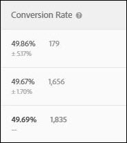
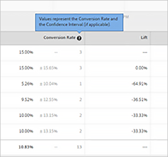

# Omrekeningskoers

Voor elke ervaring worden de omrekeningskoers, de lift, het betrouwbaarheidsinterval en het betrouwbaarheidsinterval gerapporteerd.

In de volgende afbeelding ziet u de diagramkop voor een voorbeeldactiviteit met de kopteksten [!UICONTROL Conversion Rate] , [!UICONTROL Lift] en [!UICONTROL Confidence] gemarkeerd.

>[!NOTE]
>
>In alle gegevens worden dubbele orders genegeerd als een `orderID` wordt doorgegeven. In het auditrapport worden de genegeerde dubbele orders vermeld.

## Conversiesnelheid {#section_07A36846C4E84D0881906809B9CE5A74}

Hiermee geeft u de mediaan van de conversiesnelheid, het vertrouwen, het interval en het aantal conversies weer.

Kijk bijvoorbeeld naar de volgende rapportkolom Conversiesnelheid:

De eerste regel is de besturingservaring. Het toont een 15% omzettingspercentage, met drie omzettingen. De tweede regel, Experience B, toont een 15% conversiesnelheid, met een betrouwbaarheidsinterval van 15,65% of minder en drie conversies.

>[!NOTE]
>
>Momenteel, wordt het betrouwbaarheidsinterval berekend slechts voor binaire metriek.

## Optillen {#section_0F409572C720433D9378092ABC999982}

Vergelijkt de omrekeningskoers voor elke ervaring met controle.

Lift = (Experience CR - Control CR) / Control CR

Als de controle 0 is, is er geen percentagelift.

## Detailgegevens {#section_30A674731BA6440E9BB93C421BE990EE}

AOV, RPV, en de gegevens van de Verkoop worden getoond voor elke ervaring als u een doos van de Orde van de Plaats (`orderConfirmPage`) opnam en het als omzettingsdoos selecteerde.

## Vertrouwensniveau en betrouwbaarheidsinterval {#concept_0D0002A1EBDF420E9C50E2A46F36629B}

Voor elke ervaring, worden het vertrouwen en het betrouwbaarheidsinterval getoond.

U kunt offlineberekeningen voor Analytics voor Doel (A4T) uitvoeren, maar het vereist een stap met gegevens het uitvoeren in [!DNL Analytics]. Zie &quot;Offlineberekeningen uitvoeren voor analyse voor doel (A4T)&quot; hieronder voor meer informatie.

### Vertrouwen {#section_26FE5E44BDD5478792A65FCFD83DCCDC}

Het vertrouwen van een getoonde ervaring of aanbieding is een waarschijnlijkheid (uitgedrukt als percentage) om een minder extreem resultaat te verkrijgen dan het resultaat dat daadwerkelijk wordt waargenomen, als de nulhypothese waar is (in wezen als er geen verschil is in omrekeningskoersen tussen die ervaring of dat aanbod en de ervaring/het aanbod van de controle). Wat de p-waarden betreft, wordt dit vertrouwen weergegeven als een 1-p-waarde. Eenvoudiger gezegd, geeft een hoger vertrouwen aan dat de gegevens minder consistent zijn met de aanname dat het aanbod/de ervaring van de controle en de niet-controle gelijke omrekeningskoersen hebben.

Het vertrouwen beloopt tot 100,00% wanneer het vertrouwen 99,995% of meer bedraagt.

 

Alvorens om het even welke bedrijfsbesluiten te nemen, probeer om te wachten tot uw steekproefgrootte groot genoeg is en dat de vier bars van vertrouwen op één of meerdere ervaringen voor een ononderbroken tijdsduur verenigbaar blijven om de resultaten te verzekeren stabiel zijn.

### Vertrouwelijk interval {#section_F582738DFE1648C78B93D81EBC6CACF7}

>[!NOTE]
>
>Momenteel, wordt het betrouwbaarheidsinterval berekend slechts voor binaire metriek.

Het *betrouwbaarheidsinterval* is een waaier van ramingen waarbinnen de ware waarde van metrisch op een bepaald betrouwbaarheidsniveau kan worden gevonden. Doel geeft altijd een betrouwbaarheidsinterval van 95% weer. Het betrouwbaarheidsinterval wordt weergegeven als een lichtgrijs +/- percentage in de kolom Conversiesnelheid. In het onderstaande voorbeeld is het betrouwbaarheidsinterval voor de lift van Experience B plus of min 15,65%.

**Voorbeeld:** De waargenomen RPV van een ervaring is $10, en zijn 95% **betrouwbaarheidsinterval** is $5 aan $15. Onbekend voor ons is de werkelijke RPV $12. Dan, als wij deze test veelvoudige tijden in werking stellen, zal 95% van de tijd het vertrouwensinterval wij berekenen de _ware_ waarde van RPV van $12 bevatten.

**wat beïnvloedt het betrouwbaarheidsinterval?** De formule volgt standaard statistische methoden voor het berekenen van betrouwbaarheidsintervallen.

* **grootte van de Steekproef:** aangezien de steekproef het interval uitbreidt zal krimpen of smal. Dit wordt geprefereerd aangezien het betekent uw rapporten dichter aan de ware waarde van succes metrisch raken.
* **de Standaardafwijking kleiner:** gelijkere resultaten, zoals gelijkaardige AOVs of gelijkaardige aantallen of bezoekers die elke dag omzetten, verminderen de standaardafwijking.

## De Berekening van het vertrouwen en hoe te om het off-line uit te voeren {#section_86F7C231943043A5B8B6BFE67B706E3B}

Het [&#x200B; gedownloade rapport CSV &#x200B;](/help/main/c-reports/downloading-data-in-csv-file.md#concept_3F276FF2BBB2499388F97451D6DE2E75) omvat slechts ruwe gegevens en omvat geen berekende metriek, zoals opbrengst per bezoeker, lift, of vertrouwen dat voor tests A/B wordt gebruikt.

Om deze berekende metriek te berekenen, download het Volledige dossier van het Vertrouwen van het Doel [&#128279;](/help/main/assets/complete_confidence_calculator.xlsx) Excel om de waarde van de activiteit in te voeren, of herzie [&#x200B; Statistische berekeningen in tests A/Bn &#x200B;](/help/main/c-reports/statistical-methodology/statistical-calculations.md).

>[!NOTE]
>
>Deze rekenmachine is bedoeld voor op Target gebaseerde rapportage en niet voor A4T-rapportage.

## Offlineberekeningen uitvoeren voor Analytics voor Adobe Target (A4T) {#section_B34BD016C8274C97AC9564F426B9607E}

U kunt offlineberekeningen voor A4T uitvoeren, maar het vereist een stap met gegevens het uitvoeren in [!DNL Analytics].

Voor A4T, gebruiken wij t-test van a [&#x200B; Welch &#x200B;](https://en.wikipedia.org/wiki/Welch%27s_t-test){target=_blank} berekening voor ononderbroken variabelen (eerder dan binaire metriek). In Analytics wordt een bezoeker altijd bijgehouden en wordt elke actie geteld. Daarom als de bezoeker veelvoudige tijden koopt of een succes metrisch veelvoudige tijden bezoekt, worden die extra treffers geteld. Dit maakt metrisch een ononderbroken variabele. Om de t-test-berekening van het Welch uit te voeren, is de &quot;som van de vierkanten&quot; vereist om de variantie te berekenen, die wordt gebruikt in de noemer van de t-statistiek. [&#x200B; Statistische berekeningen in tests A/Bn &#x200B;](/help/main/c-reports/statistical-methodology/statistical-calculations.md) verklaart de details van de gebruikte wiskundige formules. De som van de vierkanten kan worden opgehaald uit [!DNL Analytics] . Om de som gegevens van vierkanten te krijgen, moet u een bezoekersvlakke uitvoer voor metrisch uitvoeren u aan optimaliseert, voor een steekproeftijdspanne.

Bijvoorbeeld, als u aan paginameningen per bezoeker optimaliseert, zou u een steekproef van het totale aantal paginameningen op een per bezoekersbasis voor een gespecificeerd tijdkader uitvoeren, misschien een paar dagen (een paar duizend gegevenspunten is allen u nodig). Vervolgens vigeert u elke waarde en somt u de totalen op (de volgorde van de bewerkingen is hier van essentieel belang). Deze &quot;som van vierkanten&quot;waarde wordt dan gebruikt in de Volledige Berekening van het Vertrouwen. Gebruik de sectie &quot;opbrengst&quot; van dat spreadsheet voor deze waarden.

**om de [!DNL Analytics] eigenschap van de gegevensuitvoer te gebruiken om dit te doen:**

1. Meld u aan bij [!DNL Adobe Analytics] .
1. Klik op **[!UICONTROL Tools]** > **[!UICONTROL Data Warehouse]** .
1. Vul op het tabblad **[!UICONTROL Data Warehouse Request]** de velden in.

   Voor meer informatie over elk gebied, zie &quot;beschrijvingen van Data Warehouse&quot;in [&#x200B; Data Warehouse &#x200B;](https://experienceleague.adobe.com/docs/analytics/export/data-warehouse/data-warehouse.html?lang=nl-NL).

   | Veld | Instructies |
   |--- |--- |
   | Naam aanvraag | Geef een naam op voor uw aanvraag. |
   | Datum van rapportage | Geef een tijdsperiode en granulariteit op.  als beste praktijken, kies niet meer dan een uur of één dag van gegevens voor uw eerste verzoek.  Het duurt langer om Data Warehouse-bestanden te verwerken met een langere periode. Het is daarom altijd aan te raden om eerst gegevens over een kleine periode aan te vragen om ervoor te zorgen dat het bestand het gewenste resultaat oplevert. Ga vervolgens naar de Request Manager, dupliceer uw verzoek en vraag de tweede keer om meer gegevens. Ook, als u granularity aan om het even wat buiten &quot;niets&quot;schakelt, zal de dossiergrootte drastisch stijgen.  |
   | Beschikbare segmenten | Pas indien nodig een segment toe. |
   | Uitsplitsingen | Selecteer de gewenste afmetingen: Standaard is uit-van-de-doos (OOTB), terwijl de Douane eVars &amp; steunen omvat. Je kunt het beste &#39;Bezoeker-id&#39; gebruiken als je informatie op bezoekersidentiteitsniveau nodig hebt in plaats van &#39;Experience Cloud Bezoeker-id&#39;.<ul><li>Bezoeker-id is de laatste id die wordt gebruikt door Analytics. Het zal of identiteitskaart (als de klant erfenis is) of MID (als de klant nieuwe of ontruimde koekjes is sinds de dienst van bezoekersidentiteitskaart van MC werd gelanceerd) zijn.</li><li>De Experience Cloud Bezoeker-id wordt alleen ingesteld voor klanten die nieuwe of verwijderde cookies zijn sinds de service MC bezoeker-id is gestart.</li></ul> |
   | Metrisch | Selecteer de gewenste meetgegevens. Standaard is OOTB, terwijl Aangepast aangepaste gebeurtenissen bevat. |
   | Voorvertoning van rapport | Controleer uw instellingen voordat u het rapport plant.  |
   | Levering plannen | Voer een e-mailadres in waarnaar het bestand moet worden verzonden, geef het bestand een naam en selecteer vervolgens [!UICONTROL Send Immediately] .  Nota: Het dossier kan via FTP onder [!UICONTROL Advanced Delivery Options] . |

1. Klik op **[!UICONTROL Request this Report]**.

   De levering van het dossier kan tot 72 uren, afhankelijk van de gevraagde hoeveelheid gegevens vergen. U kunt de voortgang van uw verzoek op elk gewenst moment controleren door te klikken op [!UICONTROL Tools] > [!UICONTROL Data Warehouse] > [!UICONTROL Request Manager] .

   Als u gegevens die u in het verleden hebt aangevraagd opnieuw wilt aanvragen, kunt u zo nodig een oude aanvraag van [!UICONTROL Request Manager] dupliceren.

Raadpleeg de volgende koppelingen in de Help van [!DNL Data Warehouse] voor meer informatie over [!DNL Analytics] :

* [&#x200B; creeer een verzoek van Data Warehouse &#x200B;](https://experienceleague.adobe.com/docs/analytics/export/data-warehouse/t-dw-create-request.html?lang=nl-NL)
* [&#x200B; de beste praktijken van Data Warehouse &#x200B;](https://experienceleague.adobe.com/docs/analytics/export/data-warehouse/data-warehouse-bp.html?lang=nl-NL)

## Telmethode {#concept_EC19BC897D66411BABAF2FA27BCE89AA}

U kunt ervoor kiezen om rapporten te bekijken met verschillende telmethoden om te begrijpen hoe uw activiteiten van invloed zijn op uw gebruikers gedurende hun levensduur of tijdens één sessie.

De telmethode wordt ondersteund voor de volgende soorten activiteiten:

* A/B-test

  Bij wijze van uitzondering ondersteunen Auto-Target A/B-activiteiten alleen de standaardmethode voor het tellen van bezoekers.

* Gericht op ervaring (XT)
* MVT (Multivariate Test)

  Voor het MVT Element Contribution Report ondersteunt Target geen Activity Impressions voor de Metrische types van Ontvangsten.

* Aanbevelingen

Momenteel wordt alleen de standaardtelmethode (Visits) ondersteund voor Automated Personalization-activiteiten (AP).

U kunt rapporten weergeven met de volgende telmethoden:

* **Bezoeker:** Een unieke deelnemer in de activiteit, voor het leven van de activiteit.

  Een persoon wordt als een nieuwe deelnemer geteld als hij of zij de site bezoekt vanaf een nieuwe computer of een nieuwe browser, de cookie verwijdert of de activiteit met dezelfde cookie converteert en terugkeert. Een deelnemer wordt door de PCID geïdentificeerd in het cookie van de bezoeker. Als de PCID verandert, wordt de persoon beschouwd als een nieuwe bezoeker.

* **Bezoek:** Een unieke deelnemer in een ervaring tijdens één enkele 30 minieme browser zitting.

  Als een conversie is bereikt of een bezoeker na minimaal 30 minuten weer naar de site terugkeert, telt een terugkerende bezoeker als een nieuw bezoek. Een bezoek wordt aangegeven door de `sessionID` in het cookie van de bezoeker. Wanneer `sessionID` verandert, wordt het bezoek beschouwd als nieuw.

* **Indrukking/de Mening van de Pagina:** telde telkens als een bezoeker om het even welke pagina van de activiteit laadt.

  Eén bezoek kan verschillende indrukken van bijvoorbeeld uw homepage bevatten.

>[!NOTE]
>
>Meestal worden tellingen bepaald door cookies en sessieactiviteit. Als u echter het laatste conversiepunt van een activiteit bereikt en vervolgens de activiteit weer betreedt, wordt u beschouwd als een nieuwe deelnemer en een nieuw bezoek aan de activiteit. Dit geldt ook als de PCID- en `sessionID`-waarden niet veranderen.

## Waarom raadt [!DNL Target] aan om Welch&#39;s t-tests te gebruiken? {#t-test}

A/B-tests zijn experimenten om de gemiddelde waarde van bepaalde metrische bedrijfswaarden in een besturingsvariant (ook wel een ervaring genoemd) te vergelijken met de gemiddelde waarde van die metrische waarde in een of meer alternatieve ervaringen.

[!DNL Target] adviseert het gebruiken van [&#x200B; Welch t-test &#x200B;](https://en.wikipedia.org/wiki/Welch%27s_t-test), aangezien deze minder veronderstellingen dan alternatieven zoals z-tests vereisen, en de aangewezen statistische test voor het doen van paarsgewijze vergelijkingen van (kwantitatieve) bedrijfsmetriek tussen een controleervaringen en afwisselende ervaringen zijn.

### Meer details

Wanneer het runnen van online A/B tests, wordt elke gebruiker/bezoeker willekeurig toegewezen aan één enkele variant. Vervolgens meten we de relevante maatstaven voor het bedrijf (bijvoorbeeld omzettingen, bestellingen, inkomsten, enz.) voor bezoekers in elke variant. De statistische test die we vervolgens gebruiken, test de hypothese dat de gemiddelde maatstaf van het bedrijf (bijvoorbeeld conversiesnelheid, orders per gebruiker, inkomsten per gebruiker, enz.) gelijk is voor de controle en een bepaalde alternatieve variant.

Hoewel zaken metrisch zelf volgens één of andere willekeurige distributie zou kunnen worden verdeeld, zou de distributie van het gemiddelde van dit metrisch (binnen elke variant) in een normale distributie via de [&#x200B; Centrale Grenswaarden Theorem &#x200B;](https://en.wikipedia.org/wiki/Central_limit_theorem) moeten samenkomen. Hoewel er geen garantie is voor de snelheid waarmee deze bemonsteringsspreiding van het gemiddelde zal converteren naar normaal, wordt deze voorwaarde doorgaans bereikt gezien de omvang van de bezoekers bij online testen.

Gezien deze normaliteit van het gemiddelde kan worden aangetoond dat de te gebruiken teststatistiek een t-verdeling volgt, omdat het de verhouding is tussen een normaal verdeelde waarde (het verschil in gemiddelden) en een schaaltermijn op basis van een schatting op basis van de gegevens (de standaardfout van het verschil in gemiddelden). **t-test** is dan de aangewezen hypothesetest, gezien de teststatistiek een t-distributie volgt.

### Waarom geen andere tests worden gebruikt

A **z-test** is technisch ongepast omdat in het typische A/B testende scenario, de noemer van de teststatistiek geen afgeleid uit een bekende variantie is, en in plaats daarvan moet worden geschat van de gegevens. Voor grote monsters zijn de z-test en de t-test echter identiek.

**Chi-kwadraat de tests** worden niet gebruikt omdat deze voor het bepalen van of er een kwalitatief verband tussen twee varianten (d.w.z. een ongeldige hypothese zijn dat er geen verschil tussen varianten is) aangewezen zijn. T-tests zijn geschikter voor het scenario van _kwantitatief_ vergelijkend metriek.

De **Mann-Whitney test van U** is een nonparametric test, die aangewezen is wanneer de steekproefdistributie van gemiddelde zaken metrisch (voor elke variant) niet normaal wordt verdeeld. Nochtans zoals eerder besproken, gezien de omvang van verkeer betrokken bij online het testen, typisch de Centrale Grenswaarden van Theorem van toepassing, en zodat kan t-test veilig worden toegepast.

Complexere methodes zoals **ANOVA** (die t-tests aan meer dan twee varianten generaliseren) kunnen worden toegepast wanneer een test meer dan twee ervaringen heeft (&quot;tests A/Bn&quot;). Nochtans, beantwoordt ANOVA de vraag van &quot;of alle varianten het zelfde gemiddelde hebben,&quot;terwijl in de typische test A/Bn wij meer geinteresseerd in _zijn welke specifieke variant_ best is. Daarom passen we in [!DNL Target] regelmatig t-tests toe waarbij elke variant op een besturingselement wordt vergeleken, met een Bonferroni-correctie voor meerdere vergelijkingen.