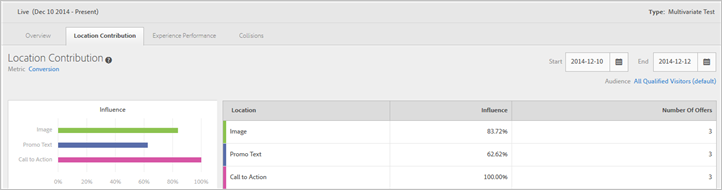
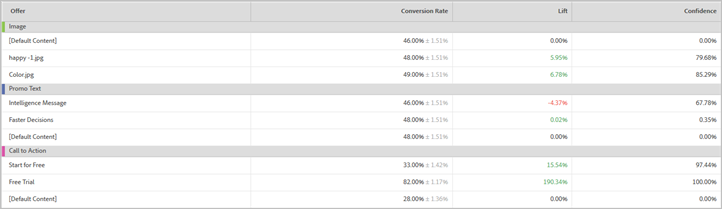

# Locatiebijdrage (MVT)

Het rapport Locatiebijdrage geeft de prestaties van elk element en elke aanbieding weer.

Bovenaan het rapport toont metrisch, begin en einddata, en publiek dat in het rapport wordt gebruikt. U kunt al deze factoren wijzigen.

>[!NOTE]
>
>De gebruikers en metrische kiezers zijn alleen beschikbaar als Analytics wordt gebruikt als de rapportbron.

Het rapport Locatiebijdrage bevat twee tabellen.

In de eerste tabel wordt de relatieve invloed van elk element weergegeven. Hier ziet u welke elementen u aanbiedingen hebt toegevoegd die de meeste omzettingen tot gevolg hebben.

De tweede lijst verstrekt een aanbod-niveau rapport. Het toont de omrekeningskoers, de lift, en het vertrouwen voor elke aanbieding in elk element. Zo kunt u bepalen welke aanbiedingen het meest succesvol zijn. In de tweede kolom worden waarden weergegeven voor de geselecteerde metrische waarde (conversiesnelheid, RPV, AOV, bestellingen of betrokkenheidswaarden) van de aanbieding en één standaardisering.

## Trainingsvideo: Een MVT-test maken 

In deze video ziet u hoe u een multivariate test maakt met behulp van de driestapige workflow met instructies voor het doel. Het rapport Locatiebijdrage wordt vanaf 8:45 beschreven.

>[!VIDEO](https://video.tv.adobe.com/v/17395)
