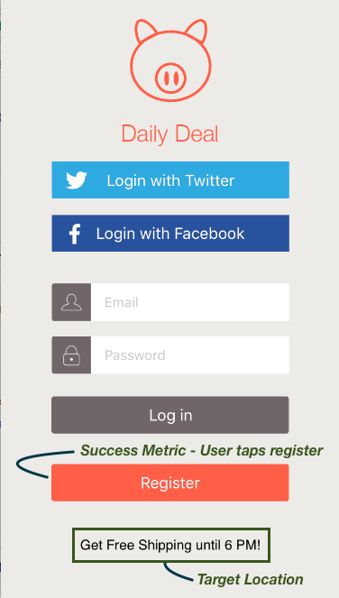

# Hoe [!DNL Target] werkt in mobiele apps

De mobiele SDK van Adobe neemt contact op met de doelserver om de inhoud samen met andere gegevenspunten op te halen en de gebruiker de juiste ervaring te laten zien.

## Doellocaties en succeswaarden {#section_A08AAB0ABA9C4568A5AFD4D27EF1CE74}

A *doellocatie* wordt ook mbox genoemd. Een geïdentificeerde locatie in de app is geschikt voor testen of personalisatie (bijvoorbeeld het welkomstbericht op het thuisscherm). Deze locaties worden tijdens het maken van de test geïdentificeerd.

A *[succesmetrisch](/help/main/c-activities/r-success-metrics/success-metrics.md#reference_D011575C85DA48E989A244593D9B9924)* is een actie die door de gebruiker wordt uitgevoerd en die aangeeft of een bepaalde activiteit succesvol was (zoals aanmelden, kopen, een ticket boeken, enzovoort).

* **Doellocatie:** De inhoud die onder de registratieknop wordt weergegeven.

   Deze gebruiker krijgt gratis verzending tot 18.00 uur aangeboden. Deze plaats kan over veelvoudige activiteiten van het Doel worden opnieuw gebruikt om tests A/B en verpersoonlijking in werking te stellen.

* **Metrisch resultaat:** De actie die wordt uitgevoerd door de gebruiker waar de gebruiker op de registratieknop tikt.

**Begrijp hoe het Doel in SDK werkt**

