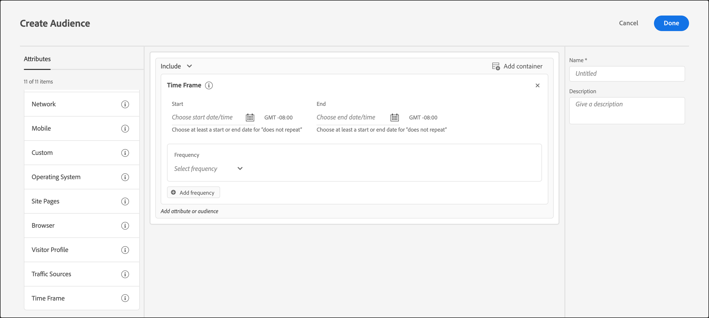

# Tijdschema

U kunt begin- en einddatums en -tijden toevoegen in [!DNL Adobe Target] om gebruikers te richten die uw plaats tijdens een specifiek tijdkader bezoeken. U kunt ook de opties voor Week- en Dagscheiding instellen om herhalende patronen te maken voor doelgroepen.

Als u bijvoorbeeld de opdracht [functie voor gecombineerd, ad-hocpubliek](/help/main/c-target/combining-multiple-audiences.md#concept_A7386F1EA4394BD2AB72399C225981E5)kunt u zich richten op low-spenders met specifieke inhoud gedurende de drie dagen voorafgaand aan de Zwarte Vrijdag en andere inhoud na Zwarte Vrijdag.

1. In de [!DNL Target] interface, klik **[!UICONTROL Audiences]** > **[!UICONTROL Create Audience]**.
1. Geef een naam op voor het publiek en voeg een optionele beschrijving toe.
1. Slepen en neerzetten **[!UICONTROL Time Frame]** in het deelvenster voor publieksopbouw.

   

1. Geef de [!UICONTROL Start] en [!UICONTROL End] data en tijden voor het publiek.

   Laat de begindatum leeg om de focus te starten volgens het schema van de activiteit. Laat de einddatum leeg om verder te gaan met zoeken tot de einddatum en -tijd van de activiteit.

   U kunt zowel de begin- als de einddatum leeg laten. Met deze functie kunt u hetzelfde publiek in meerdere activiteiten gebruiken (zonder een kopie van het publiek te maken) en tegelijk de begin- en einddatums op activiteitsniveau beheren.

   >[!NOTE]
   >
   >De tijdzone voor begin-/einddatums wordt weergegeven als GMT +/- NN:NN, waarbij NN:NN de verschuiving van GMT is en de tijdzone op accountniveau in plaats van de tijdzone van de bezoeker weerspiegelt. De tijdzone van Californië wordt bijvoorbeeld weergegeven als GMT -08:00.

1. (Voorwaardelijk) Klik **[!UICONTROL Set frequency]** om terugkerende patronen in te stellen, inclusief de dagen van de weken en tijden.

   

   U kunt [!UICONTROL Frequency] opties, bijvoorbeeld, om een &quot;optie van het Praatje&quot;aan bezoekers slechts tijdens de dagen en uren te tonen dat uw callcenter wordt bemand.

   Selecteer een of meer dagen van de week en stel vervolgens de begin- en eindtijd in. Klikken **[!UICONTROL Add frequency]** om desgewenst aanvullende patronen aan te geven.

   >[!NOTE]
   >
   >De tijdzone voor [!UICONTROL Week and Day Parting] wordt weergegeven als GMT +/- NN:NN, waarbij NN:NN de verschuiving ten opzichte van GMT is en de tijdzone op accountniveau in plaats van de tijdzone van de bezoeker weerspiegelt. Bijvoorbeeld, zou de tijdzone van Californië voor de Tijd van het Daglicht van de Stille Oceaan als GMT -07:00 worden getoond.

1. (Optioneel) Stel aanvullende regels voor het publiek in.

   Desgewenst kunt u Stap 5 voor elke regel herhalen.

1. Klik op **[!UICONTROL Done]**.

## Trainingsvideo: Soorten publiek maken 

Deze video bevat informatie over het gebruik van publiekscategorieën.

* Soorten publiek maken
* Doelcategorieën definiëren

>[!VIDEO](https://video.tv.adobe.com/v/17392)
