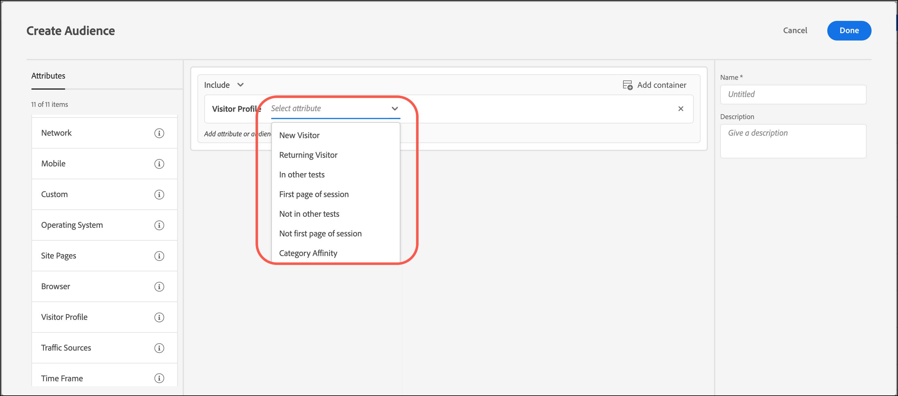

# Bezoekerprofiel

Soorten publiek maken in [!DNL Adobe Target] om bezoekers aan te wijzen die aan specifieke profielparameters voldoen.

1. In de [!DNL Target] interface, klik **[!UICONTROL Audiences]** > **[!UICONTROL Create Audience]**.
1. Geef een naam op voor het publiek en voeg een optionele beschrijving toe.
1. Slepen en neerzetten **[!UICONTROL Visitor Profile]** in het deelvenster voor publieksopbouw.

1. Klikken **[!UICONTROL Select]** Selecteer vervolgens een van de volgende opties:

   

   Bezoekerprofielparameters worden doorgegeven via het mbox (profiel). U kunt nieuwe of terugkerende bezoekers richten, of alle gebruikers omvatten.

   * [!UICONTROL New Visitor]
   * [!UICONTROL Returning Visitor]
   * [!UICONTROL In Other Tests]
   * [!UICONTROL Not In Other Tests]
   * [!UICONTROL First Page of Session]
   * [!UICONTROL Not First Page of Session]
   * [!UICONTROL Category Affinity]

   Er wordt een bezoekersprofiel gemaakt in het lokale Edge-geheugen voor elke mbox-aanroep met nieuwe `mboxPC`. Na 30 minuten inactiviteit wordt het profiel opgeslagen naar de [!DNL Target] en is toegankelijk vanaf andere randen.

   Wanneer een sitebezoeker zich halverwege de sessie aanmeldt en een `3rdpartyId`, alle eerder geladen profielkenmerken gekoppeld aan de `3rdPartyId` onmiddellijk beschikbaar zijn.

   U kunt aangepaste profielparameters en `user.` parameters. Kies de parameter die u wilt gebruiken om uw activiteit als doel in te stellen. Als de gewenste parameter niet wordt weergegeven, is de parameter niet geactiveerd door een mbox.

1. (Optioneel) Stel aanvullende regels voor het publiek in.
1. Klik op **[!UICONTROL Done]**.

## Trainingsvideo: Soorten publiek maken 

Deze video bevat informatie over het gebruik van publiekscategorieën.

* Soorten publiek maken
* Doelcategorieën definiëren

>[!VIDEO](https://video.tv.adobe.com/v/17392)
