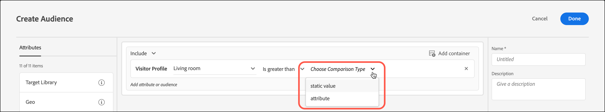

# Een vergelijkingspubliek voor profielkenmerken maken

Bepaal een publiek in [!DNL Adobe Target] om twee profielattributen voor uw [&#x200B; bibliotheek van de Publiek &#x200B;](/help/main/c-target/c-audiences/audiences.md) of in een [&#x200B; activiteit-slechts publiek &#x200B;](/help/main/c-target/creating-activity-only-audience.md) te vergelijken. Met operatoren, zoals groter dan, kleiner dan of gelijk aan, definieert u een publiek om de waarden van twee verschillende profielkenmerken dynamisch te vergelijken.

>[!NOTE]
>
>Deze functionaliteit is alleen beschikbaar voor de categorie [[!UICONTROL Visitor Profile]](/help/main/c-target/c-audiences/c-target-rules/visitor-profile.md#concept_E972690B9A4C4372A34229FA37EDA38E) .

## Overzicht {#section_303CBC78194D49A2A004945D425441E1}

Soorten publiek worden gedefinieerd door regels die bepalen wie wordt opgenomen in of uitgesloten van een [!DNL Target] -activiteit. Een publieksdefinitie kan veelvoudige regels omvatten, en elke regel kan veelvoudige parameters omvatten. Als een van de regels die u opneemt, de categorie [!UICONTROL Visitor Profile] gebruikt, kunt u een regel definiëren op basis van de specifieke waarde van een kenmerk van het bezoekersprofiel of de waarde van dat kenmerk vergelijken met een ander kenmerk van het bezoekersprofiel.

Stel bijvoorbeeld dat u voor een meubelbedrijf werkt en twee scores voor klantvriendelijkheid in [!DNL Target] uploadt:

* Mogelijkheid om in de komende 90 dagen dinerruimmeubilair te kopen
* Mogelijkheid om in de komende 90 dagen huiskamermeubilair te kopen

Je zou een publiek kunnen maken dat gedefinieerd wordt als de neiging om eetkamermeubilair te kopen groter is dan de neiging om meubilair van woonkamertjes te kopen. [!DNL Target] vergelijkt vervolgens dynamisch de scores voor de eetruimte en de dichtheid van de woonkamer voor een specifieke bezoeker om te bepalen of die bezoeker voor dit publiek in aanmerking komt.

Voor meer informatie, zie [&#x200B; Methoden om Gegevens in Doel &#x200B;](https://experienceleague.adobe.com/docs/target-dev/developer/implementation/methods/methods-to-get-data-into-target.html?lang=nl-NL){target=_blank} te krijgen.

## Een vergelijkingspubliek voor profielkenmerken maken {#section_7A62FD47D5C74C3EBC3417ACDBB85013}

1. Klik op **[!UICONTROL Audiences]** > **[!UICONTROL Create Audience]** .
1. Geef een naam op voor het publiek en voeg een optionele beschrijving toe.
1. Sleep **[!UICONTROL Visitor Profile]** naar het deelvenster van de publieksbuilder.
1. Kies een kenmerk in de vervolgkeuzelijst **[!UICONTROL Visitor Profile]** :

   

1. Kies uw evaluator:

   

1. Kies **[!UICONTROL Choose Comparison Type]** in de vervolgkeuzelijst **[!UICONTROL Attribute]** .

   Met het vergelijkingstype &quot;statische waarde&quot; kunt u het kenmerk &quot;profiel van de bezoeker&quot; vergelijken met specifieke waarden.

   

   >[!NOTE]
   >
   >Als u een van de standaardcategorieën voor bezoekersprofielen gebruikt (bijvoorbeeld Nieuwe bezoeker of Bezoeker terugsturen), kunt u alleen de optie voor statische waarden kiezen. De opties voor dynamische vergelijking zijn niet beschikbaar voor standaardcategorieën. Andere voorbeelden waarbij de dynamische vergelijkingsopties niet beschikbaar zijn, zijn &quot;Eerste pagina van sessie&quot;, &quot;Niet in andere tests&quot;, &quot;Niet eerste pagina van sessie&quot; en &quot;Categorie-affiniteit&quot;.

1. Kies het extra kenmerk dat u met het oorspronkelijke kenmerk wilt vergelijken.

   

1. Klik op **[!UICONTROL Done]**.

## De video van de opleiding  {#section_3BB8DBF3418F4520B3E274B6F40AF8F3}

Bekijk de volgende video voor meer informatie en een scenario waarin u deze functie kunt gebruiken:

>[!VIDEO](https://video.tv.adobe.com/v/23218/)
