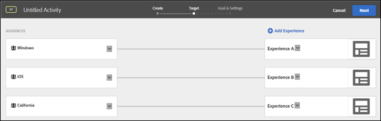

# Veelgestelde vragen over doelen en doelgroepen

Lijst met veelgestelde vragen (FAQ&#39;s) over de ervaring die doelgericht en publiek is.

## Hoe werkt [!DNL Target] URL&#39;s evalueren bij het bepalen van doelen? {#url}

Het doel evalueert URLs verschillend afhankelijk van of u publiek URL het richten tijdens het creëren van een activiteit gebruikt of of gebruikt u URL het richten terwijl het creëren van een publiek.

Neem bijvoorbeeld de volgende URL:

`http://www.example.com/path1/path2/path3?queryStringParam1=test123&queryStringParam2=test7`

### URL-doelgroep

Als u tijdens het maken van een activiteit de URL van het publiek wilt opgeven als doel, klikt u op de pagina Ervaringen (stap een van de drie stappen van de geleide workflow) op het tandwielpictogram, klikt u op Aflevering pagina en geeft u de gewenste URL op.

URL van publiek zoekt naar een exacte URL-overeenkomst. Als de URL overeenkomt, overweegt Doel geen verdere logica. Als in de bovenstaande URL de activiteit is ingesteld op branden `www.example.com`, komt de URL overeen met de volgende URL&#39;s, omdat de URL voor het publiek niet-specifiek is voor query&#39;s:

* `www.example.com?query=something`
* `www.example.com?query=anything`
* `www.example.com?query=nothing&qa=true&stuff=random&product=shoes&height=superTall`

Buiten het publiek dat op URL richt, kunt u specifieke waarden specificeren die in de vraag kunnen zijn.

URL van publiek richten en URL richten toegevoegd via [!UICONTROL Template Rules] evalueren als URL-doel (zie hieronder voor URL-doel).

### URL-doel

Als u een URL-doelverwijzing wilt toepassen tijdens het maken van een publiek, klikt u op [!UICONTROL Add Rule], klikt u op [!UICONTROL Site Pages]selecteert u een optie in de eerste vervolgkeuzelijst ([!UICONTROL Current Page], [!UICONTROL Previous Page], of [!UICONTROL Landing Page]), selecteert u [!UICONTROL URL] Geef in de tweede vervolgkeuzelijst een beoordelaar op en geef vervolgens de gewenste URL op.

URL die richt transformeert URL in een reeks regels om te evalueren:

* URL = `example.com/path1?query=something`
* URL domain = `example.com`
* Pad = pad1/pad2/pad3
* queryStringParam1 = test123
* queryStringParam2 = test7

## Wanneer u complexe URL-tekenreeksen maakt, doet dit [!DNL Target] De volledige URL evalueren?

Wanneer u dezelfde parameternaam meerdere keren gebruikt in een URL-tekenreeks, wordt door HTTP de naam van de eerste parameter beschouwd en worden de volgende parameters met dezelfde naam genegeerd.

Bijvoorbeeld in de volgende URL-tekenreeks:

`https://www.adobe.com/SearchResults.aspx?sc=BM&fi=1&fr=1&ps=0&av=0&Category=C0010438&Category=C000047`

de eerste instantie van de `Category` parameter wordt geëvalueerd en de tweede `Category` parameter wordt genegeerd.

De beste manier is om meerdere waarden aan één categorie te koppelen, zoals hieronder wordt getoond:

`https://www.adobe.com/SearchResults.aspx?sc=BM&fi=1&fr=1&ps=0&av=0&Category=C0010438,C000047`

## Waarom worden bij het opbouwen van het publiek voorgebouwde soorten publiek ondergebracht [!DNL Target] Bibliotheek gevonden onder andere categorieën? {#section_9EBF5B0F9DF94168A15B92B905CCF7E0}

Het vooraf gebouwde publiek in de categorie Doelbibliotheek is verouderd publiek en bestaat in andere categorieën. Het publiek van de oudere doelbibliotheek > Nieuwe bezoekers heeft bijvoorbeeld een bijgewerkte tegenhanger: Bezoekersprofiel > Nieuwe bezoeker.

De beste manier is om het nieuwere publiek te gebruiken omdat het betere prestaties heeft. Sommige klanten zouden erfenis kunnen gebruiken, prebuilt publiek, zodat zijn zij niet verwijderd uit de interface van het Doel.

## Hoe weet ik hoe verkeer verdeeld zal worden tussen het publiek? {#section_067EEFB956E7465CBF77EC86834470AB}

Door gebrek, is het verkeer gelijkmatig tussen ervaringen verdeeld. U kunt echter voor elke ervaring streefpercentages opgeven. In dit geval wordt een willekeurig getal gegenereerd en wordt dat nummer gebruikt om de ervaring te kiezen die moet worden weergegeven. De resulterende percentages zouden niet precies de gespecificeerde doelstellingen kunnen aanpassen, maar meer verkeer betekent dat de ervaringen dichter aan de doeldoelstellingen zouden moeten worden verdeeld.

## Welke ervaring toont als een gebruiker voor een activiteit kwalificeert die veelvoudige ervaringen met veelvoudige gekwalificeerde publiek bevat? {#section_94A60B11212D48FD8AB0803C6C7E7253}

De gebruiker komt in aanmerking voor de eerste ervaring/het eerste publiek dat wordt weergegeven op de activiteit [!UICONTROL Target] pagina.

Bijvoorbeeld, in de volgende illustratie, kwalificeert een gebruiker van Californië die een apparaat van Vensters gebruikt voor zowel Ervaring A (het publiek van Vensters) als Ervaring C (het publiek van Californië). Deze gebruiker krijgt Experience A te zien, omdat deze wordt weergegeven in de lijst hierboven Experience C op de pagina Target.

## Waarom namen maken voor hetzelfde publiek in [!DNL Target] , Adobe Audience Manager (AAM) en de Audience Library in core services verschillen? {#section_F67E61A607B6444C8DAA4F99C3E95AED}

Namen publiek in [!DNL Target] uniek zijn; in [!DNL AAM] en de [!DNL Audience Library], kunt u dezelfde naam hebben voor meerdere soorten publiek (als deze zich in verschillende mappen bevinden).Wanneer [!DNL Target] ontmoet een publieksnaam die aan een [!DNL AAM] of [!DNL Audience Library] publiek, [!DNL Target] voegt &quot;# toe&lt;number>&quot; aan de naam.

U kunt bijvoorbeeld het volgende publiek zien: &quot;PC Users&quot; (in [!DNL AAM]) en &quot;PC Users #1&quot; (in [!DNL Target]).

## Waarom kan ik een publiek niet hernoemen? {#section_54E420556F534D20836E261E253D8B97}

Sommige doelgroepen zijn vooraf gedefinieerd, zoals &quot;Nieuwe bezoekers&quot; en &quot;Terugkerende bezoekers&quot;. Gebruikers kunnen de naam van dit vooraf gedefinieerde publiek niet wijzigen.

## Waarom worden niet alle profielparameters weergegeven in het dialoogvenster [!DNL Target] gebruikersinterface? {#section_3CD947D15C984EE9AD19550220E0E8BD}

[!DNL Target] heeft een limiet van 50 unieke profielkenmerken per mbox-aanroep. Als u meer dan 50 profielkenmerken moet doorgeven aan [!DNL Target], kunt u ze doorgeven met de [!UICONTROL Profile Update] API-methode. Zie voor meer informatie [Profiel bijwerken](https://developers.adobetarget.com/api/#authentication-tokens) in de Adobe Target API-documentatie.

## Waarom zien bezoekers ervaringen voor een AP-activiteit die ze niet zouden moeten zien? {#section_41CECEAE0881446A8D9F3B016857914B}

Automated Personalization-activiteiten worden één keer per sessie geëvalueerd. Als er actieve sessies waren die in aanmerking kwamen voor een bepaalde ervaring en er nu nieuwe aanbiedingen aan zijn toegevoegd, zien gebruikers de nieuwe inhoud samen met de eerder weergegeven aanbiedingen. Omdat ze eerder gekwalificeerd waren voor die ervaringen, zouden ze ze nog steeds zien gedurende de sessie. Als u dit bij elk paginabezoek wilt evalueren, kunt u beter overschakelen op het type activiteit Experience Targeting (XT).

## Waarom worden wijzigingen aangebracht in publiek dat is gemaakt via API, niet weerspiegeld in de [!DNL Target] UI? {#section_6BEB237CAC004A06A290F9644E5BF0FB}

In tegenstelling tot aanbiedingen en profielscripts, worden wijzigingen die door API worden aangebracht in publiek dat is gemaakt via Target Standard, momenteel niet opnieuw gesynchroniseerd naar de doelinterface.

## Tekenreeksen die getallen vertegenwoordigen (drijvende-kommagetallen worden ook ondersteund) worden als getallen vergeleken.{#strings-that-represent-numbers}

Als het linker- en rechtergedeelte van de gelijksoortige expressies op een getal kunnen worden geparseerd, worden de twee delen als getallen vergeleken, niet als tekenreeksen.

Bijvoorbeeld:

| Waarde | Doelcriteria | Resultaat |
| --- | --- | --- |
| 1.0 | is gelijk aan 1 | true |
| 1 | equalsIgnoreCase 1.0 | true |
| 1.230 | is gelijk aan 1 | true |
| 1.500 | is gelijk aan 1,5 | true |
| 1.200 | is kleiner dan 2 | true |
| 2 | is groter dan 3,0 | false |
| 045 | is gelijk aan 45 | true |

Getallen die in wetenschappelijke notatie zijn geschreven, worden altijd als tekenreeksen vergeleken.

Bijvoorbeeld:

&quot;4e-2&quot; is alleen gelijk aan &quot;4e-2&quot;. Het zal *niet* gelijk aan &quot;0.04&quot;.
