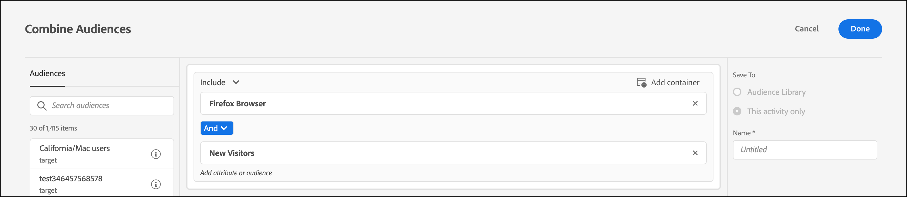

# Meerdere doelgroepen combineren

Combineer meerdere soorten publiek (inclusief [!DNL Adobe Experience Cloud] -, [!DNL Adobe Experience Platform] - en [!DNL Target] soorten publiek) tegelijk om een ad-hocpubliek te maken. U kunt ook uitsluitingsregels maken en het publiek uitsluiten van een regel.

>[!NOTE]
>
>De [!DNL Adobe Experience Platform] bron is beschikbaar aan alle [!DNL Target] klanten die [&#x200B; SDK van het Web van Adobe Experience Platform &#x200B;](https://experienceleague.adobe.com/docs/target-dev/developer/client-side/aep-web-sdk.html?lang=en){target=_blank} gebruiken. De publiek beschikbaar bij [!DNL Adobe Experience Platform] kan worden gebruikt zoals is of met bestaand publiek wordt gecombineerd, zoals die in dit onderwerp wordt verklaard.
>
>Voor meer informatie zie [&#x200B; publiek van het Gebruik van Adobe Experience Platform &#x200B;](/help/main/c-target/c-audiences/audiences.md#aep).

Stel dat u een publiek hebt met de doelgroep &#39;Nieuwe bezoekers&#39; en een publiek met de doelgroep &#39;Chrome Users&#39;. Voor een specifieke activiteit, zou u deze bestaande publiek kunnen willen combineren om nieuwe bezoekers te richten gebruikend browsers van Chrome. In plaats van een derde publiek te maken en dit op te slaan in de [!UICONTROL Audiences] -bibliotheek, kunt u deze twee soorten publiek combineren tijdens het maken van activiteiten of tijdens het bewerken van een bestaande activiteit.

Als een ander voorbeeld, kunt u alle loyaliteitklanten richten. U kunt bijvoorbeeld een specifiek [!DNL Audience Manager] -publiek opnemen voor de status van loyaliteit en dit combineren met een [!DNL Target] -publiek dat is samengesteld uit mensen die zich tijdens de huidige sessie hebben aangemeld voor uw loyaliteitsprogramma. Het combineren van deze twee soorten publiek is eenvoudiger dan het creëren van een derde, permanent publiek.

U kunt maximaal 20 soorten publiek combineren met AND en OR.

U kunt een gecombineerd publiek maken en gebruiken op verschillende plaatsen in de gehele gebruikersinterface van [!DNL Target] .

## Een gecombineerd publiek maken tijdens het maken van een activiteit {#section_2F1CE9434CC04174B4BA2BFC89B85D77}

U kunt een gecombineerd ad-hocpubliek maken op de pagina met instructies [!UICONTROL Target] van de activiteit tijdens de driestappenworkflow met instructies.

1. Terwijl het creëren van een [&#x200B; activiteit &#x200B;](/help/main/c-activities/activities.md#concept_D317A95A1AB54674BA7AB65C7985BA03), op de **[!UICONTROL Targeting]** pagina, klik de drie verticale ellipsen, dan klik **[!UICONTROL Replace Audience]**.

   

1. Selecteer op de pagina **[!UICONTROL Choose Audience]** de selectievakjes naast het gewenste publiek dat u als bouwstenen voor uw gecombineerde publiek wilt gebruiken.

   Gebruik het vak [!UICONTROL Search Audiences] om uw zoekopdracht naar het gewenste publiek te verfijnen.

   

1. Klik op **[!UICONTROL Combine Multiple Audiences]** in de rechterbovenhoek.

   

1. (Voorwaardelijk) Bewerk het nieuwe gecombineerde publiek naar wens.

   In het dialoogvenster [!UICONTROL Edit Audience] kunt u extra elementen voor publieksopbouw vanaf de linkerkant naar het nieuwe gecombineerde publiek slepen. U kunt ook uitsluitingsregels toevoegen en soorten publiek uitsluiten.

   1. Gebruik de functie slepen en neerzetten om een publiek binnen een bestaande sectie toe te voegen als bouwsteen van niveau 2.

      Stel dat u in het vorige voorbeeld nu Safari-gebruikers wilt opnemen in het gecombineerde publiek. Zoek naar en sleep het publiek &quot;Safari Browser&quot;in de Browser van Firefox&quot;doos op de rechterkant, zoals in het volgende voorbeeld:

      

      De operator tussen het twee publiek van het browsertype is AND. Selecteer de vervolgkeuzelijst [!UICONTROL And] en wijzig deze in &#39;&#39;OR&#39;&#39; om een nieuw, gecombineerd publiek te maken voor nieuwe bezoekers met Firefox of Safari. Zorg ervoor dat u geen regels maakt die alle mogelijke publieksleden uitsluiten. Het is bijvoorbeeld niet mogelijk dat iemand een pagina gelijktijdig bezoekt met Firefox en Safari.

      >[!NOTE]
      >
      >De operator (AND of OR) moet hetzelfde blijven als het publiek dat u combineert. U kunt operatoren niet mixen en koppelen.

   1. Klik op **[!UICONTROL Exclude]** om een uitsluiting aan een regel toe te voegen.

      

      Sleep een publiek.

      Als u bijvoorbeeld bezoekers uit de Verenigde Staten wilt uitsluiten van nieuwe bezoekers, kunt u het publiek Market: United States naar de doos slepen.

      Dit gecombineerde publiek omvat alle nieuwe bezoekers aan uw plaats (met uitzondering van die van San Francisco) gebruikend Safari of Firefox.

   1. Als u een publiek wilt uitsluiten van een regel, klikt u op **[!UICONTROL Exclusion]** > **[!UICONTROL Exclude this Audience.]** .

      U kunt bijvoorbeeld een gecombineerd publiek maken dat alle nieuwe bezoekers van uw site omvat, met uitzondering van bezoekers die Firefox gebruiken. Het uitsluiten van bezoekers die Firefox gebruiken is eenvoudiger en sneller dan het maken van een gecombineerd publiek dat expliciet meerdere browsers (Safari, Chrome en Internet Explorer) bevat, maar Firefox is niet inbegrepen.

1. Geef een beschrijvende naam op voor het gecombineerde publiek en klik op **[!UICONTROL Done]** .

## Een gecombineerd publiek maken voor gebruik bij metrische doelen {#section_A42E795AFCBD4575809C5942039910F0}

U kunt een gecombineerd publiek ad hoc op de pagina van de activiteit [!UICONTROL Goals & Settings] tot stand brengen voor gebruik in metrisch richten. Bijvoorbeeld om het richten tot stand te brengen die op omzetting gebruikend een gecombineerd publiek wordt gebaseerd:

1. Terwijl het uitgeven van of het creëren van een [&#x200B; activiteit &#x200B;](/help/main/c-activities/activities.md#concept_D317A95A1AB54674BA7AB65C7985BA03), op de **[!UICONTROL Goals & Settings]** pagina, selecteer **[!UICONTROL Conversion]** voor succes metrisch, dan uitgezocht **[!UICONTROL Viewed an Mbox]** als actie.
1. Selecteer het gewenste mbox in het **[!UICONTROL Search mbox]** gebied.

   

1. Klik op het tandwielpictogram en klik vervolgens op **[!UICONTROL Add Audience Targeting]** .
1. Klik op de koppeling **[!UICONTROL Add Audience/Targeting Condition]** om het dialoogvenster [!UICONTROL Choose Audience] weer te geven.

   

1. Ga met [&#x200B; Stap 2 &#x200B;](/help/main/c-target/combining-multiple-audiences.md#section_2F1CE9434CC04174B4BA2BFC89B85D77) onder &quot;creeer een Gecombineerd publiek terwijl het Creëren van een Activiteit&quot;te werk om het gecombineerde publiek tot stand te brengen.

## Een gecombineerd publiek maken voor rapportage {#section_4682D342EFBB43C38E54B99B3A1E14CD}

U kunt een gecombineerd ad-hocpubliek op de pagina [!UICONTROL Goals & Settings] van de activiteit maken dat u in de rapportage kunt gebruiken.

1. Terwijl het uitgeven van of het creëren van een [&#x200B; activiteit &#x200B;](/help/main/c-activities/activities.md#concept_D317A95A1AB54674BA7AB65C7985BA03), op de **[!UICONTROL Goals & Settings]** pagina, klik het **[!UICONTROL Add Audience]** pictogram onder [!UICONTROL Audiences for Reporting] om de [!UICONTROL Choose Audience] pagina te tonen.

   

1. Ga met [&#x200B; Stap 2 &#x200B;](/help/main/c-target/combining-multiple-audiences.md#section_2F1CE9434CC04174B4BA2BFC89B85D77) onder &quot;creeer een Gecombineerd publiek terwijl het Creëren van een Activiteit&quot;te werk om het gecombineerde publiek tot stand te brengen.

## Een gecombineerd publiek maken tijdens het bewerken van een activiteit {#section_364A12CE96E04B61B7C18113AA586C2C}

U kunt een gecombineerd ad-hocpubliek maken terwijl u een bestaande activiteit bewerkt.

1. Houd de muisaanwijzer boven de gewenste activiteit op de pagina [!UICONTROL Activities] en klik vervolgens op het pictogram **[!UICONTROL Edit]** .

   of

   Klik op de gewenste activiteit om deze te openen en klik vervolgens op **[!UICONTROL Edit Activity]** .

1. Klik op **[!UICONTROL Configure]** > **[!UICONTROL Audiences]** > **[!UICONTROL Multiple Audiences]** .

   

1. Klik op het pictogram Meer opties (drie verticale ellipsen) naast het huidige publiek van de activiteit en klik vervolgens op **[!UICONTROL Change Audience]** .

   

1. Ga met [&#x200B; Stap 2 &#x200B;](/help/main/c-target/combining-multiple-audiences.md#section_2F1CE9434CC04174B4BA2BFC89B85D77) onder &quot;creeer een Gecombineerd publiek terwijl het Creëren van een Activiteit&quot;te werk om het gecombineerde publiek tot stand te brengen.
