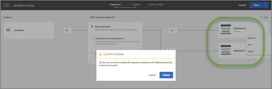
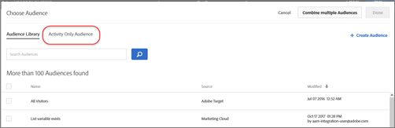
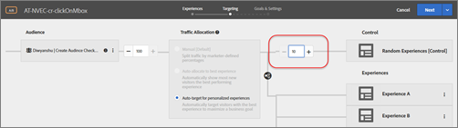
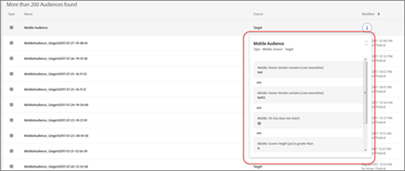
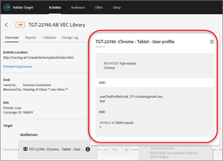

# Opmerkingen bij de release van vorige releases

Release-aantekeningen voor eerdere [!DNL Adobe Target] -releases, inclusief releaseopmerkingen voor [!DNL Target Standard/Premium] , het [!DNL Target] -platform en de [!DNL Target] Javascript-bibliotheek (at.js).

Opmerkingen bij de release worden in aflopende volgorde weergegeven per maand en jaar van de release.

>[!NOTE]
>
>Zie [ de versienota&#39;s van het Doel (huidig) ](/help/main/r-release-notes/release-notes.md#reference_8FE40B43A5A34DDF8F26A53D55EE036A) voor informatie over de versies van het Doel van de huidige maand (platform en Target Standard/Premium).

## Opmerkingen bij de release - 2025

### [!DNL Target Standard/Premium] 25.8.4 (1 september 2025)

Deze release bevat de volgende updates en oplossingen:

**[!UICONTROL Activities]**

+++Zie details
* **Klanten konden activiteit of documentnamen van[!UICONTROL Activity Overview]** niet kopiëren: Eerder, konden de klanten niet de naam van een activiteit of de bijbehorende aanbieding/document direct van [!UICONTROL Activity overview] in het bijgewerkte activiteit-creeer proces kopiëren. Deze beperking beïnvloedde de bruikbaarheid, vooral op kleinere schermen. Klanten kunnen nu gemakkelijk zowel activiteit- als documentnamen kopiëren zonder tijdelijke oplossingen. (TGT-51850)
* **Proactieve opname van gebogen [!DNL Target] klantengegevens tijdens activiteitenverwezenlijking**: Verbeter de activiteit-creeer proces door de pro-actieve inzameling van rapporten, inhoud, en screenshots van [!DNL Target] klanten toe te laten. Deze verbetering verhelpt gegevenshiaten die in bestaande gebruiksgevallen worden geïdentificeerd en helpt nauwkeurigere inzichten tijdens activiteit en experimenteeropstelling te verzekeren. (TGT-52415)
* **AP de activiteiten haalden model-klaar geen gegevens in de [!UICONTROL Reports] sectie**: De klanten die de activiteiten van Automated Personalization (AP) in de [!UICONTROL Reports] sectie bekijken konden model-klaar indicatoren op de rapportgroep en aanbiedingsniveau niet zien. Dit probleem is opgetreden omdat modelgegevens niet correct vanaf de achtergrond werden opgehaald. De functionaliteit is hersteld en modelgegevens worden nu op de verwachte manier weergegeven. (TGT-53600 &amp; TGT-53601)
* **Activiteiten die voor de toekomst worden gepland vertoonde verkeerd een &quot;[!UICONTROL Live]&quot;status in het [!UICONTROL Activity] overzicht**: De klanten merkten op dat de activiteiten die in de toekomst zouden beginnen verkeerd werden gemerkt als &quot;[!UICONTROL Live]&quot;in het [!UICONTROL Activity] overzicht. Deze statuswanverhouding werd opgelost, en de geplande activiteiten tonen nu correct als &quot;[!UICONTROL Scheduled]&quot;zonder te vereisen pagina verfrist zich. (TGT-52835)

+++

**[!UICONTROL Recommendations]**

+++Zie details
* **lijst van het Product was niet zichtbaar in de [!UICONTROL View Collection] dialoog:** Eerder, konden de klanten niet de productlijst zien wanneer het bekijken van een inzameling in [!UICONTROL Recommendations] tabel. In het dialoogvenster [!UICONTROL View Collection] worden nu correct de bijbehorende producten weergegeven, waardoor de transparantie en bruikbaarheid in de bijgewerkte gebruikersinterface van [!UICONTROL Recommendations] worden verbeterd. (TGT-50531)
* **Vaste een kwestie die case-sensitive het filtreren in [!UICONTROL Product Catalog Search] geavanceerde onderzoek** veroorzaakte: Het geavanceerde onderzoek het filtreren in de [!UICONTROL Product Catalog Search] pagina negeert nu correct casegevoeligheid, die op het gedrag van zowel de backend als de diensten van GraphQL richt. Deze update zorgt voor consistente en nauwkeurige resultaten voor suggesties voor klanten, ongeacht de tekstbehuizing. (TGT-53585)
* **het Geavanceerde onderzoek in bijgewerkte [!UICONTROL Product Catalog Search] UI verstrekte geen suggesties**: De klanten die de geavanceerde onderzoekseigenschap in bijgewerkte [!UICONTROL Product Catalog Search] UI gebruiken werden vereist om nauwkeurige waarden met correcte spelling in te gaan, aangezien geen suggesties werden getoond. Door deze kwestie werd het moeilijk om producten efficiënt te vinden. Suggesties worden nu op de verwachte manier weergegeven tijdens geavanceerde zoekinvoer. (TGT-52008)
* **Sommige fiatteurs konden geen producten in[!UICONTROL Product Catalog Search]** bekijken: Klanten met [!UICONTROL Approver] toestemmingen konden geen producten in [!UICONTROL Product Catalog Search] zien, ondanks andere gebruikers met identieke rollen die toegang hebben. Dit probleem is veroorzaakt door een inconsistentie in machtigingen die invloed heeft op de zichtbaarheid van de catalogus. Alle fiatteurs kunnen nu naar behoren producten in de sectie [!UICONTROL Recommendations] bekijken. (TGT-53617)

+++

**[!UICONTROL Reports]**

+++Zie details
* **de Rapporten slaagden er niet in om voor het publiek van de Desktop wegens een ongeldige fout van de publieksnaam** te laden: De klanten ontmoetten een fout van GraphQL toen het proberen om rapporten voor één publiek in activiteit-creeer proces te bekijken. Het systeem heeft een bericht &quot;Invalid publieksnaam: XXXXX&quot; geretourneerd, waardoor toegang tot rapportgegevens wordt voorkomen. Rapporten worden nu correct geladen voor het desktoppubliek. (TGT-53371)
* **de Omschakeling publiek op de pagina van Rapporten veroorzaakte fouten in het Doel UI**: De klanten ontmoetten fouten wanneer het selecteren van bepaalde soorten publiek in de [!UICONTROL Reports] sectie. Dit probleem werd veroorzaakt door een ongeldige verwerking van het publiek in GraphQL-aanroepen met een achtergrond, met onverwachte fouten en ontbrekende gegevens als gevolg. Het probleem is opgelost en het bureaubladpubliek wordt nu zonder fouten geladen, zelfs als er geen gegevens beschikbaar zijn. (TGT-53370)
* **[!UICONTROL Graph view]in de [!UICONTROL Reports] sectie toonde geen waarden van[!DNL Analytics]**: Klanten die tot [!UICONTROL Graph view] in de Re  havensectie toegang hebben ontleenden gegevens, met alle waarden die als nul verschijnen. Dit probleem is veroorzaakt door onjuiste gegevens die zijn opgehaald uit [!UICONTROL Analytics] . In [!UICONTROL Graph view] worden nu de juiste waarden weergegeven. (TGT-52792)
+++

**[!UICONTROL Visual Experience Composer] (VEC)**

+++Zie details
* **klikkend &quot;Accept Cookies&quot;gebruikend [!UICONTROL Enhanced Experience Composer] (EEG) ontbroken toe te schrijven aan een ontbrekende functie**: De klanten rapporteerden dat het proberen om koekjes via EEG goed te keuren in een consolefout resulteerde: `handleclickAcceptAllButton is not defined`. De functionaliteit voor het accepteren van cookies werkt nu zoals u had verwacht en zorgt voor een vloeiender ervaring tijdens het maken van activiteiten in de bijgewerkte gebruikersinterface. (TGT-52794)
* **Nieuwe E.E.G. UI slaagde er niet in om bepaalde pagina&#39;s te laden die eerder in erfenis UI** werden gesteund: De klanten rapporteerden dat nieuwe EEG sommige pagina&#39;s niet kon laden, die in erfenis UI ondanks iframe-het bouwen code aanwezig op de plaats toegankelijk waren. Het bijgewerkte activity-create proces ondersteunt nu het laden van deze pagina&#39;s en het herstellen van compatibiliteit voor workflows voor het maken van activiteiten. (TGT-53061)
* **VEC toonde een leeg wit scherm wanneer het uitgeven van ervaringen**: De klanten van een bepaalde huurder rapporteerden dat het scherm VEC leeg ging wanneer het proberen om ervaringen in bijgewerkte VEC uit te geven. Deze kwestie beïnvloedde zowel nieuw gecreëerde als oudere activiteiten, die werkschemacontinuïteit verhinderen. VEC laadt nu correct, toestaand klanten om ervaringen zonder onderbreking uit te geven. (TGT-53547)
* **VEC crashte en toonde een leeg scherm wanneer het laden van bepaalde activiteiten**: De klanten van een bepaalde huurder rapporteerden dat VEC er niet in slaagde om specifieke activiteiten te laden. De ervaringseditor bleef vastzitten op &quot;Aanvankelijke wijzigingen toepassen&quot; voordat deze vastliep en een leeg scherm weergaf. Consolefouten duiden op een fout bij het lezen van niet-gedefinieerde eigenschappen. De redacteur laadt nu betrokken activiteiten zonder fouten in bijgewerkte VEC. (TGT-53548)
* **het ontruimen van alle datumwaarden die Backspace gebruiken veroorzaakte de pagina om te crashen**: Klanten die activiteiten in de [!UICONTROL Goals & Settings] sectie plannen ervoeren een neerstorting wanneer het gebruiken van Backspace om alle waarden van &quot;[!UICONTROL Specified Date & Time]&quot;gebieden te ontruimen. Deze kwestie werd veroorzaakt door een ongeldige verwijzingsfout in de datum-behandelende logica. De pagina verwerkt lege datuminvoer probleemloos zonder vast te lopen. (TGT-53624)
* **Geen producten verschenen in [!UICONTROL Product Catalog Search] toe te schrijven aan een ongeldige lading**: De klanten die tot de [!UICONTROL Recommendations] sectie in [!UICONTROL Product Catalog Search] toegang hebben ondervonden lege resultaten die door een ongeldige lading van GraphQL worden veroorzaakt. Door deze backendfout konden de productgegevens niet correct worden geladen. Producten worden nu weergegeven zoals u had verwacht in de bijgewerkte gebruikersinterface. (TGT-53630)
* **[!DNL Scene7]-afbeeldingen zijn met een lagere resolutie opgeslagen in de bijgewerkte VEC** : klanten die ervaringen in de bijgewerkte VEC hebben bewerkt, hebben gemerkt dat [!UICONTROL Scene7] -afbeeldings-URL&#39;s zijn opgeslagen zonder resolutieparameters, waardoor afbeeldingen van lagere kwaliteit worden geleverd (400×400 in plaats van de beoogde 800×800). URL&#39;s van afbeeldingen behouden nu de juiste parameters voor een juiste resolutie. (TGT-52631)
* **de levende activiteiten konden nog in VEC** worden uitgegeven: De klanten konden tot bewerkingsopties voor levende activiteiten in bijgewerkte VEC toegang hebben, die tot onbedoelde veranderingen kon leiden. Dit probleem is opgelost door de bewerkingsfunctionaliteit voor live activiteiten uit te schakelen. De bewerkingsknoppen zijn nu verborgen in de activiteitenlijst en het overzicht voor editors, terwijl fiatteurs en andere rollen ongewijzigd blijven. (TGT-53055)
* **werd buiten bedrijf gesteld [!UICONTROL Failed] en [!UICONTROL Draft] activiteitensectie in bijgewerkte VEC**: [!UICONTROL Failed] en [!UICONTROL Draft] activiteitenopties zijn verwijderd uit bijgewerkte VEC. De nieuwe interface ondersteunt geen conceptframes meer en mislukte campagnes worden niet opgeslagen op de achtergrond. Deze opties zijn niet langer relevant. Verwante filters en achterste velden (bijvoorbeeld `uiSyncFailed` , `errorMessage` ) zijn ook verwijderd om activiteitsbeheer te stroomlijnen. (TGT-53150)
* **Onbekwaam aan login aan VEC voor een activiteit**: De klanten die aan login aan hun plaats door VEC probeerden opnieuw gericht aan de login pagina, verhinderend toegang tot activiteit het uitgeven. Dit probleem kon intern niet worden gereproduceerd en had mogelijk betrekking op de verwerking van sessies aan de site. De aanmeldstroom is gestabiliseerd en klanten hebben nu toegang tot de VEC zonder omleidingsfouten. (TGT-53524)
* **die tweemaal op de achterknoop op [!UICONTROL Browse] wijze drukken veroorzaakte VEC om te crashen**: Klanten die door [!UICONTROL Browse] wijze in VEC navigeren ervaren crashes wanneer tweemaal het drukken van de achterknoop van browser. Dit probleem heeft ertoe geleid dat de editor vastloopt en dat een pagina moet worden vernieuwd. De redacteur behandelt nu navigatie betrouwbaar terug zonder het crashen. (GT-53568)
* **de Activiteiten konden niet worden uitgegeven toe te schrijven aan niet bepaalde plaatstoewijzingen**: De klanten ontmoetten een fout toen het proberen om activiteiten uit te geven, die door ongedefinieerde plaats IDs in de `LocationMapping.behaviorTargetedActivity` logica wordt veroorzaakt. Deze kwestie resulteerde in een 400 fout en geblokkeerde activiteitenupdates. Activiteiten kunnen nu worden bewerkt zonder validatiefouten die betrekking hebben op de locatie. (TGT-53607)
* **het Opslaan activiteiten teweegbrachten een ongeldige fout van de gebruikersinput**: De klanten ontmoetten een ongeldige fout van de gebruikersinput wanneer het proberen om activiteiten na het maken van minder belangrijke wijzigingen in bijgewerkte VEC te bewaren. De fout is veroorzaakt door onjuiste locatietoewijzingen in de achtergrondvalidatielogica. Activiteiten kunnen nu met succes worden opgeslagen zonder locatiefouten te veroorzaken. (TGT-53603)

+++

### [!DNL Target Standard/Premium] 25.8.3 (21 augustus 2025)

Deze release bevat de volgende updates en oplossingen:

**[!UICONTROL Activities]**

+++Zie details
* **Vaste een kwestie waar de besparingsactiviteiten een ongeldige fout van de gebruikersinput toe te schrijven aan misvormde bezitsgegevens** teweegbrachten: De klanten ontmoetten een kritieke fout toen het proberen om bestaande activiteiten te bewaren. Het foutbericht gaf ongeldige gebruikersinvoer aan, met name door te verwijzen naar een niet-herkende eigenschapsnaam-inhoud in de JSON-payload. Met name werden nieuwe activiteiten met dezelfde eigenschap opgeslagen, wat erop wijst dat het probleem geïsoleerd was voor gegevens over oudere activiteiten. Het activity-create proces behandelt nu correct verouderde bezitsconfiguraties, die ongeldige inputfouten verhinderen en verenigbaar sparen gedrag over nieuwe en bestaande activiteiten verzekeren. (TGT-53507)
* **Vaste een kwestie die klanten verhinderde een activiteit toe te schrijven aan een fout te bewaren InvalidProperty.Json**: De klanten ontmoetten een fout toen het proberen om een activiteit in bijgewerkte UI, zelfs zonder enige wijzigingen te maken. Het foutbericht geeft een ongeldige JSON-structuur aan: &quot;Invalid Json. Niet-herkende eigenschapsnaam &#39;content&#39;. Locatie: regel - 1, kolom - 432.&quot; Dit probleem is veroorzaakt door een niet-herkende eigenschap in de payload van het verzoek en is nu opgelost. Klanten kunnen activiteiten opslaan zonder deze fout te ervaren. (TGT-53513)
* **Vaste een kwestie waar de geplande activiteiten verkeerd een [!UICONTROL Live] status tot pagina verfrissen zich**: De klanten merkten op dat wanneer het plannen van een activiteit om op een toekomstige datum en tijd te leven, de status onmiddellijk als [!UICONTROL Live] in plaats van [!UICONTROL Scheduled] verscheen. Dit heeft tot verwarring geleid, hoewel het bevestigingsbericht juist aangeeft dat de activiteit gepland was. De statusweergave is verbeterd door de pagina te vernieuwen. Dit probleem is nu opgelost, en de geplande activiteiten tonen correct de Geplande status zonder te vereisen verfrist zich. (TGT-52937)

+++

**[!UICONTROL Analytics for Target] (A4T)**

+++Zie details
* **Vaste een kwestie waar de klanten geen namen van de rapportreeks tijdens activiteit-creeer proces** konden typen: De klanten die [!DNL Adobe Analytics] als rapporteringsbron tijdens het activiteit-creeer proces gebruiken konden niet in de [!UICONTROL Report Suite] drop-down lijst typen om naar specifieke rapportsuites te zoeken. Dit beïnvloedde werkstromen voor organisaties met grote aantallen rapportreeksen, waar het handscrollen beduidend opstelling vertraagde. De vervolgkeuzelijst is niet alfabetisch geordend en reageerde niet consistent op getypte invoer, waardoor het moeilijk werd om rapportsuites zoals &quot;Office + Store - Web - Prod.&quot; op te zoeken. Dit probleem is opgelost en klanten kunnen nu efficiënt zoeken door namen van rapportsuite te typen. (TGT-53345)

+++

**[!UICONTROL Audiences]**

+++Zie details
* **Vaste een kwestie waar het verlopen &quot;Kader van de Tijd&quot;publiek activiteit blokkeerde opslaan zelfs na verwijdering**: De klanten konden activiteiten in bijgewerkte UI wegens een fout met betrekking tot verlopen &quot;Kader van de Tijd&quot;publiek niet bewaren. Zelfs na het verwijderen van het betrokken publiek bleef het foutbericht bestaan: &quot;Activiteit bevat publiek met een ongeldig tijdkader.&quot; Dit probleem is opgetreden omdat het systeem het alleen-activiteit publiek bleef valideren, zelfs als het niet langer in gebruik was. Het gedrag werd nog gecompliceerd door verschillen in de tijdzone. De validatielogica is gecorrigeerd en klanten kunnen nu activiteiten opslaan zonder deze fout te ondervinden. (TGT-53517)

+++

**[!UICONTROL Experience Fragment]s**

+++Zie details
* **Vaste een kwestie die klanten verhinderde fragmenten van de Ervaring op te nemen gebruikend [!UICONTROL Insert Before] of [!UICONTROL Insert After] in UI** Klanten ontmoetten een fout toen het proberen om [!UICONTROL Experience Fragments] in een activiteit op te nemen gebruikend &quot;Tussenvoegsel vóór&quot;of &quot;Tussenvoegsel na&quot;opties in bijgewerkte UI. Het weergegeven foutbericht was: &quot;De inhoud van het voorstel moet precies één HTML-element bevatten.&quot; Deze kwestie was specifiek voor de bijgewerkte UI en kwam niet voor in de vorige versie. Dit probleem is nu opgelost en klanten kunnen [!UICONTROL Experience Fragments] met succes invoegen zonder deze fout te ondervinden. (TGT-53442)

+++

**[!UICONTROL Offer decisions]**

+++Zie details
* **Vaste een kwestie die klanten verhinderde besluitaanbiedingen uit te geven en specifieke paginaelementen in bijgewerkte UI** te selecteren: In het bijgewerkte activiteit-creeer proces, konden de klanten bestaande besluitaanbiedingen niet uitgeven of specifieke paginaelementen in de Visuele Composer van de Ervaring (VEC) selecteren. Beslissingsvoorstellen zijn onjuist weergegeven als HTML-voorstellen en wijzigingen die tijdens het bewerken zijn aangebracht, zijn niet opgeslagen. Bovendien zijn bepaalde regionale URL&#39;s, zoals de Japan-site, niet correct geladen in VEC, waardoor het maken van activiteiten en updates worden geblokkeerd. Beslissingen worden nu correct weergegeven, pagina-elementen kunnen worden geselecteerd zoals u had verwacht en regionale URL&#39;s worden correct geladen in de VEC, zodat de volledige bewerkingsfunctionaliteit wordt hersteld. (TGT-53425)
* **Vaste een kwestie waar [!UICONTROL Offer Decision] selecteurs niet onverwacht konden worden gewijzigd en worden veranderd na sparen**: In het bijgewerkte activiteit-creeer proces, konden de klanten niet [!UICONTROL Offer Decision] selecteur wijzigen zoals bedoeld. Pogingen om de kiezer te wijzigen zijn mislukt en de kiezer heeft na het opslaan weer een onjuiste waarde ingesteld. Dit gedrag veroorzaakte de besluitaanbieding om uit Visual Experience Composer (VEC) te verdwijnen, die verdere uitgeeft blokkeert. Wijzigingen in kiezers blijven nu op de juiste wijze behouden en aanbiedingen voor beslissingen blijven zichtbaar en kunnen na het opslaan worden bewerkt in de VEC.(TGT-53433)
* **Vaste een kwestie waar [!UICONTROL Offer Decisions] van de activiteit na sparen** verdween: [!UICONTROL Offer Decisions] toegevoegd tijdens het activiteit-creeer proces werd niet bewaard na het bewaren en het heropenen van de activiteit. Dit probleem is opgetreden tijdens het bewerken van dynamische inhoud en het invoegen van [!UICONTROL Offer Decisions] met specifieke kiezers en eigenschappen. [!UICONTROL Offer Decisions] blijft nu correct na het opslaan en de kiezers blijven intact, zodat ze zich consistent kunnen richten en bewerken. (TGT-53434)

+++

**[!DNL Recommendations]**

+++Zie details
* **Vaste kwestie in [!DNL Recommendations] UI waar de download van douanecriteria CSV 404 fout** terugkeerde: Vaste een kwestie waar de klanten de douanecriteria CSV in activiteit-creeer proces niet konden downloaden. De downloadkoppeling werkt nu correct, zodat klanten aangepaste criteria kunnen exporteren zoals verwacht. (TGT-51966)
* **Vaste inconsistente beeld die in[!UICONTROL Catalog Search]** laadt: Vaste een kwestie waar de duimnagels en de beelden in [!UICONTROL &#x200B; Catalog Search] niet constant in activiteit-creeer proces laadden. Afbeeldingen kunnen alleen worden weergegeven als de kolom &quot;URL miniatuur&quot; zichtbaar is en sommige productafbeeldingen geheel of gedeeltelijk zijn geladen na navigatie- of zoekacties. Het gedrag voor het laden van afbeeldingen is gestabiliseerd en de miniaturen worden nu betrouwbaar weergegeven, ongeacht de zichtbaarheid van de kolom of de navigatiehandelingen. (TGT-52778)
* **Vaste een kwestie waar het uitgeven van een aanbeveling in een gedupliceerde ervaring beïnvloedde de originele ervaring**: De klanten rapporteerden dat het wijzigen van een aanbeveling in een gedupliceerde ervaring onbedoeld de originele ervaring veranderde. Na het dupliceren van Experience B in het activity-create proces en het bewerken van het ontwerp of de criteria, werden dezelfde wijzigingen weerspiegeld in de oorspronkelijke Experience B, hoewel ze afzonderlijke entiteiten waren. Bij gedupliceerde ervaringen blijven er nu afzonderlijke configuraties behouden, zodat bewerkingen op één ervaring geen invloed hebben op het origineel. (TGT-53369)
* **Vaste een kwestie waar de veranderingen in een gedupliceerde ervaring onbedoeld de originele ervaring in een activiteit** beïnvloedden: De klanten rapporteerden dat wanneer het dupliceren van een ervaring binnen een activiteit en het toewijzen van een nieuw publiek, om het even welke veranderingen die in het gedupliceerde ontwerp of de criteria van de ervaring werden aangebracht ook in de originele ervaring werden weerspiegeld. Dit probleem is opgetreden, ook al zijn er geen bewerkingen rechtstreeks aangebracht in de oorspronkelijke versie, wat van invloed is op de mogelijkheid om onafhankelijke variaties binnen dezelfde activiteit te maken. Het activity-create proces isoleert nu correct gedupliceerde ervaringen, die ervoor zorgen dat uitgeeft aan één ervaring niet origineel beïnvloedt. (TGT-53361)
* **Vaste een kwestie waar [!UICONTROL Recommendation Catalog] met tussenpozen er niet in slaagde om volledige gegevens van productattributen** te tonen: In bijgewerkte [!DNL Recommendations] UI, ervoeren de klanten een kwestie waar bepaalde productattributen, zoals bericht, niet constant in de [!UICONTROL Catalog Search] resultaten werden getoond, alhoewel de gegevens in het voer bestonden. In dit geval moesten klanten de zichtbaarheid van de kolommen handmatig opnieuw configureren om de ontbrekende waarden op te halen. [!UICONTROL Catalog Search] geeft nu betrouwbaar alle geconfigureerde kenmerken weer, zodat de kolom niet handmatig hoeft opnieuw te worden ingesteld. (TGT-52769)
* **Vaste een kwestie waar a [!UICONTROL Front Promotion] niet in een levende activiteit** kon worden onbruikbaar gemaakt: De pogingen om a [!UICONTROL Front Promotion] in een levende activiteit onbruikbaar te maken werden niet bewaard. Nadat u [!UICONTROL Change Promotion] hebt geselecteerd en uitgeschakeld, is de promotie actief gebleven bij het opnieuw bewerken van de activiteit, zodat updates van aanbevolen configuraties niet meer mogelijk zijn. De montages van de bevordering sparen nu correct, toestaand klanten om bevorderingen in levende activiteiten onbruikbaar te maken of te wijzigen zoals verwacht. (TGT-53231)
* **Vaste een kwestie waar het toelaten van a [!DNL Recommendations] [!UICONTROL Promotion] zonder gegevens een onduidelijk foutenmelding** teweegbracht: Het toelaten van a [!UICONTROL Front] of [!UICONTROL Back Promotion] in een [!DNL Recommendations] activiteit zonder vereiste waarden te specificeren resulteerde in een generisch &quot;Ongeldige inputfout&quot;bericht. De onderliggende kwestie was een ontbrekend configuratiegebied, maar het foutenbericht gaf niet duidelijk de oorzaak aan, die het oplossen van problemen bemoeilijkt. Het activity-create proces geeft nu een duidelijk en actionable foutenmelding wanneer de vereiste gebieden, zoals `collectionId` of regels, ontbreken, die klanten helpen configuratiekwesties snel identificeren en oplossen. (TGT-52616)
* **Vaste een kwestie die [!UICONTROL Product] verhinderde lijst in [!UICONTROL Edit] modaal binnen het [!UICONTROL Recommendations] lusje** te tonen: De klanten konden niet de gefiltreerde productlijst bekijken wanneer het uitgeven van [!UICONTROL collection] of [!UICONTROL exclusion] in [!UICONTROL Recommendations] tabel. Van de lijst werd verwacht dat deze in real time zou worden bijgewerkt op basis van toegepaste regels, maar het werd niet weergegeven zoals bedoeld. Dit probleem is opgelost en de productlijst wordt nu correct weergegeven en wordt dynamisch bijgewerkt naarmate de regels worden gewijzigd. (TGT-53481)
* **Vaste een kwestie met de lay-out van de dialoog van de Details van de Mening in bijgewerkte UI**: De lay-out van het modaal van de Details van de Mening in bijgewerkte UI is gewijzigd om duidelijkheid en bruikbaarheid te verbeteren. Het dialoogvenster bevat nu twee tabbladen:
   * [!UICONTROL Details] tabblad: geeft alle relevante informatie voor het geselecteerde item weer.
   * [!UICONTROL Inventory] tabblad: geeft alle producten weer die zijn gefilterd door de huidige regel voor verzameling en uitsluiting.

  Deze verbetering helpt klanten gemakkelijker te navigeren en item-specifieke gegevens en inventariscontext binnen activiteit-creeert proces te begrijpen. (TGT-53503)

   * **Vaste een kwestie waar verwijderde bevorderingen in aanbevelingsactiviteiten na sparen** opnieuw verschenen: De klanten meldden dat toen [!UICONTROL front] of [!UICONTROL back] bevorderingen van [!DNL Recommendations] activiteiten werden verwijderd en de activiteit werd bewaard, de bevorderingen bij het opnieuw openen bleven verschijnen. Dit probleem trad op in zowel testomgevingen als productieomgevingen en betrof het bijgewerkte proces voor het maken van activiteiten. Het probleem is opgelost. Promoties die uit een activiteit zijn verwijderd, blijven nu correct na het opslaan. (TGT-53490)

+++

**Rapporten**

+++Zie details
* **Vaste een kwestie waar het [!UICONTROL Automated Segments] rapport ongeldige publiekswaarden** toonde: De klanten rapporteerden dat [!UICONTROL Automated Segments] in activiteitenrapporten ongeldig voor publieksgegevens tonen, die nauwkeurige analyse van segmentprestaties verhinderen. Dit probleem is opgetreden tijdens het openen van de sectie [!UICONTROL Reports] en het selecteren van [!UICONTROL Automated Segments] , ook al werden geldige publieksgegevens verwacht. [!UICONTROL Automated Segments] geeft nu correct de publiekswaarden weer, zodat betrouwbare rapportage- en segmentatiedetails worden weergegeven. (TGT-52793)

+++

**de Toepassingen van de Pagina van de Rand (SPAs)**

+++Zie details
* **Vaste een kwestie waar de omschakeling tussen [!UICONTROL Browse] en [!UICONTROL Design] wijzen terugstellen de staat van het KUUROORD in bijgewerkte UI**: De klanten rapporteerden dat het schakelen tussen [!UICONTROL Browse] en [!UICONTROL Design] wijzen in bijgewerkte UI de Webredacteur veroorzaakte om opnieuw te laden, die de staat van SPAs terugstelde. Dit probleem heeft de workflows verstoord en klanten gedwongen om informatie opnieuw in te voeren. Het probleem is opgelost. De staat van het KUUROORD wordt nu bewaard wanneer het schakelen tussen wijzen, die een vlottere en consistentere ervaring tijdens activiteitenverwezenlijking verzekeren. (TGT-53074)

+++

**[!UICONTROL Visual Experience Composer] (VEC)**

+++Zie details
* **Vaste kwestie in activiteit-creeer proces dat vooruitgang aan de [!UICONTROL Targeting] stap in AP activiteiten** blokkeerde: Vaste een kwestie in activiteit-creeert proces waar de klanten niet aan de [!UICONTROL Targeting] stap in [!UICONTROL Automated Personalization] (AP) activiteiten konden te werk gaan tenzij twee plaatsen werden toegevoegd. Dit gedrag verschilde van de vorige ervaring, waar één enkele plaats met veelvoudige aanbiedingen voldoende was. Deze vereiste is gecorrigeerd, zodat klanten de Single-location-instellingen kunnen blijven gebruiken in hun AP-workflows. (TGT-53426)
* **Vaste een kwestie waar het nieuwe activiteit-creeert proces niet de fmt=png-alpha- parameter voor transparante beelden** plaatste: In bijgewerkte UI, worden de beelden opgenomen tijdens het activiteit-creeer proces niet meer inbegrepen de `fmt=png-alpha` parameter door gebrek, resulterend in verlies van transparantie. Dit gedrag verschilde van de vorige UI, die automatisch de parameter aan beeld URLs toevoegde, die transparante achtergronden handhaaft. Tijdens het proces voor het maken van activiteiten wordt de parameter `fmt=png-alpha` nu correct toegepast op afbeeldings-URL&#39;s wanneer transparantie vereist is, zodat transparante elementen consistent worden weergegeven. (TGT-52615)
* **Vaste een kwestie die klanten verhinderde rapportreeksen in bijgewerkte UI** te zoeken: In bijgewerkte UI, [!UICONTROL Report Suites] drop-down lijst in de [!UICONTROL Goals & Settings] sectie stond klanten niet toe om te typen en te zoeken, makend het moeilijk om van specifieke rapportsuites, vooral voor huurders met een groot aantal ingangen de plaats te bepalen. In tegenstelling tot de vorige interface, werd de lijst niet gesorteerd en geen input-based filtreren. Dit probleem is opgelost. Klanten kunnen nu typen om te zoeken naar en te filteren op rapportreeksen, waarbij de functionaliteit wordt hersteld die beschikbaar is in de oudere gebruikersinterface. (TGT-53514)

+++

**[!UICONTROL Workspaces]**

+++Zie details
* **Vaste een kwestie waar een klant tot één enkele werkruimte beperkt activiteiten van andere werkruimten** kon bekijken: De klanten met toegang die tot één werkruimte wordt beperkt waren onverwacht in staat om activiteiten over alle werkruimten te bekijken wanneer het selecteren [!UICONTROL All Workspaces] in activiteit-creeer proces. Deze zichtbaarheid vormde een risico op onbedoelde wijzigingen in de live activiteiten in andere werkruimten, hetgeen mogelijk van invloed was op de prestaties van de website. De toegangscontroles van Workspace zijn versterkt om ervoor te zorgen dat klanten slechts activiteiten binnen hun toegewezen werkruimte kunnen bekijken en met elkaar in wisselwerking staan. (TGT-53101)
* **Vaste een kwestie waar een klant activiteiten van [!UICONTROL Default Workspace] kon bekijken zonder toegang te hebben:** een klant met toegang die tot de het opvoeren werkruimte wordt beperkt kon activiteiten van [!UICONTROL Default Workspace] bekijken via het activiteit-creeer proces. Dit gedrag kwam ondanks correcte achtergrondconfiguratie en toegangsrechten voor. De toegangscontroles van Workspace zijn versterkt om ervoor te zorgen dat klanten activiteiten slechts binnen hun toegewezen werkruimte kunnen bekijken.(TGT-53297)

+++

### [!DNL Target Standard/Premium] 25.8.2 (14 augustus 2025)

Deze release bevat de volgende correcties en updates:

**[!UICONTROL Activities]**

+++Zie details
* **Vaste activiteit-ladende kwestie in bijgewerkte [!DNL Target] UI**: Oplossing een kwestie in bijgewerkte [!DNL Target] UI waar bepaalde activiteiten er niet in slaagden toen het proberen uit te geven. Dit probleem heeft ertoe geleid dat klanten gebruikers in een onbepaald laadscherm hebben verlaten. Deze kwestie had gevolgen voor meerdere activiteiten en zou onsamenhangend zijn voor alle klanten. Met deze oplossing worden de betrokken activiteiten nu correct geladen, zodat ze naadloos kunnen worden bewerkt en de workflows met activiteiten minder worden verstoord. (TGT-53209)
* **Vaste sparen fout in activiteit-creeer proces toe te schrijven aan `optionLocalId` bevestiging**: Vaste een kwestie in het activiteit-creeer proces dat klanten verhinderde veranderingen toe te schrijven aan een fout van de achterste plaatsbevestiging: `OptionLocalIdReferentialIntegrity.ABActivity - Invalid optionLocalIds:` Deze kwestie kwam voor wanneer het wijzigen van specifieke elementen binnen een activiteit, resulterend in ontbroken sparen verrichting. De oplossing zorgt ervoor dat `optionLocalId` -verwijzingen nu correct worden gevalideerd, zodat klanten activiteiten kunnen opslaan zonder deze fout te ondervinden. (TGT-53293)
* **Vaste neerstorting in activiteit-creeer proces dat door ongeldige optieverwijzingen wordt veroorzaakt wanneer het schakelen van pagina&#39;s**: Vaste een kwestie in het activiteit-creeer proces dat UI veroorzaakte om na het schakelen van pagina&#39;s drie keer tijdens het uitgeven te crashen. Het neerstorten werd teweeggebracht door ongeldige optieverwijzingen, resulterend in consolefouten zoals &quot;Optie met localId &quot;7&quot;niet gevonden.&quot; Met deze update kunnen klanten nu schakelen tussen pagina&#39;s en wijzigingen toepassen zonder systeemfouten of onderbrekingen te ondervinden. (TGT-53295)
* **Vaste sparen fout in activiteit-creeer proces dat door ongeldige gebruikersinput wordt veroorzaakt wanneer het uitgeven van ervaringen**: Vaste een kwestie in het activiteit-creeer proces waar de klanten veranderingen in een activiteit niet konden bewaren toe te schrijven aan een ongeldige fout van de gebruikersinput. De fout kwam bij het wijzigen van ervaringen in bijgewerkte UI voor, die updates verhinderen worden begaan. De activiteit kan nu met succes worden bewaard, toestaand klanten om zonder onderbreking uit te geven en te publiceren. (TGT-53267)
* **Vaste ladingskwestie in activiteit-creeer proces dat het blokkeerde uitgeven in bijgewerkte UI**: Vaste een kwestie in activiteit-creeert proces waar de klanten geen activiteiten in bijgewerkte UI wegens een ononderbroken ladingsscherm konden uitgeven. Klanten kunnen nu activiteiten openen en wijzigen zonder dat er problemen optreden bij het laden. (TGT-53415)
* **Vaste kwestie van het ervaringsvereiste in activiteit-creeer proces voor AP activiteiten in bijgewerkte UI**: Vaste een kwestie in activiteit-creeer proces waar [!UICONTROL Automated Personalization] (AP) activiteiten twee plaatsen in plaats van twee ervaringen in bijgewerkte UI vereiste. Door dit gedrag werden gebruiksgevallen geblokkeerd waarbij klanten één locatie met meerdere aanbiedingen configureren, hetgeen eerder werd ondersteund. Het vereiste is gecorrigeerd om de originele functionaliteit aan te passen, die klanten toestaat om met AP activiteiten te werk te gaan gebruikend twee ervaringen ongeacht plaatstelstelling. (TGT-53429)
* **Vast gevolgd gedrag van het elementengebied op de wijze van het Spoor van de Klik om niet bewaarde input te verhinderen en duidelijkheid** te verbeteren: Vaste een kwestie in activiteit-creeert proces waar het [!UICONTROL Tracked Element] gebied op [!DNL Click Track] wijze editable was maar niet de ingegaan naam bewaarde, veroorzakend verwarring voor klanten. Het veld is nu uitgeschakeld om niet-opgeslagen invoer te voorkomen en de naamgeving van geselecteerde elementen is verduidelijkt om de doelconfiguratie en de nauwkeurigheid van het bijhouden van gegevens te verbeteren.** (TGT-53458)
* **Vaste kwestie in activiteit-creeer proces dat het blokkeren van het noemen van gevolgde componenten op [!UICONTROL Click Track] wijze**: Vaste een kwestie in activiteit-creeert proces waar de klanten niet bijgehouden componenten op [!UICONTROL Click Track] wijze konden noemen. Nadat u een naam hebt ingevoerd, is het veld bewerkbaar weergegeven, maar heeft het de invoer niet behouden. Standaard worden generieke labels zoals &quot;MY PRIMARY GOAL 0&quot; in de bewerkingsmodus gebruikt. Het bijgehouden elementveld is nu uitgeschakeld en het gedrag voor naamgeving is verduidelijkt om de doelinstelling en -volgnauwkeurigheid te verbeteren. (TGT-51396)

+++

**Fragmenten van de Ervaring (XFs)**

+++Zie details
* **Vaste kwestie in activiteit-creeer proces dat onbedoelde het uitgeven van HTML van AEM-Uitgevoerde fragmenten** toeliet: Vaste een kwestie in activiteit-creeer proces dat klanten toeliet om HTML van [!DNL Experience Fragments] (XFs) uit [!DNL Adobe Experience Manager] (AEM) binnen uit te geven [!DNL Target]. Dit gedrag was onbedoeld, aangezien XFs voor het uitgeven zou moeten gesloten blijven zodra gepubliceerd van AEM. De oplossing zorgt ervoor dat de optie HTML bewerken niet langer beschikbaar is voor AEM-geëxporteerde fragmenten, zodat de integriteit van de inhoud en het verwachte beheer behouden blijven. (TGT-53286)
* **Vaste intermitterende voorproefkwestie voor inhoud XF in activiteit-creeer proces binnen bijgewerkte UI**: Vaste een kwestie in het activiteit-creeer proces waar de inhoud XF periodiek om op voorproefwijze binnen bijgewerkte UI te teruggeven ontbrak. Hoewel de inhoud correct is geleverd, is de voorvertoning niet consistent weergegeven, waardoor het voor klanten moeilijk is om de setup van de aanbieding te valideren. XF-voorvertoningen worden nu betrouwbaar geladen, waardoor het vertrouwen en de efficiëntie tijdens de activiteitenconfiguratie worden verbeterd. (TGT-53318)

+++

**wijze QA**

+++Zie details
* **Vaste kwestie in activiteit-creeer proces waar de belangrijke ruimten in URLs gebroken verbindingen QA** veroorzaakte: Vaste een kwestie in activiteit-creeer proces waar de belangrijke ruimten in de activiteit URL niet behoorlijk werden bijgesneden toen het bewaren. Dit veroorzaakte ongeldige verbindingen QA en onjuiste formatteren in het achterste eind. Na de update, worden URLs nu bewaard zuiverder, verhinderend gebroken verbindingen en verbeterend de betrouwbaarheid van QA werkschema&#39;s voor klanten. (TGT-53427)

+++

**[!UICONTROL Recommendations]**

+++Zie details
* **Vaste kwestie in catalogusonderzoek UI waar het geavanceerde onderzoek er niet in slaagde om suggesties** te verstrekken: Oplossing een kwestie in nieuwe [!UICONTROL Catalog Search] UI waar de [!UICONTROL Advanced Search] eigenschap geen suggesties kon verstrekken. De gebruikers werden vereist om nauwkeurige waarden met nauwkeurige spelling in te voeren, die de onderzoekservaring omslachtig en fout-gevoelig maken. Met deze oplossing biedt [!UICONTROL Advanced Search] nu relevante suggesties zoals gebruikers typen, die bruikbaarheid verbeteren en wrijving bij het zoeken naar producten verminderen. (TGT-52008)
* **lost veelvoudige UI en het filtreren kwesties op om ontvankelijkheid en entiteitinteractie te verbeteren**: Oplossing verscheidene kwesties, met inbegrip van slechte ontvankelijkheid van criteria details op klein-schermapparaten, gebrek aan resultaten wanneer het selecteren van &quot;Alle gastheergroepen&quot;in de filter van het Milieu, en onvermogen om met entiteiten op te treden die geen naam hebben. Deze correcties verbeteren de bruikbaarheid in verschillende schermgrootten, zorgen voor nauwkeurige filtering en maken volledige interactie met alle productentiteiten mogelijk, waardoor de algemene gebruikerservaring wordt verbeterd. (TGT-52992)
* **Vaste ontbrekende product IDs in de gedetailleerde mening van Aanbevelingen tijdens activiteitenverwezenlijking**: Vaste een kwestie in [!DNL Recommendations] activiteit-creeer proces waar product IDs van het scherm van het productdetail mist, die het voor klanten moeilijk maken om product IDs tijdens werkschema&#39;s te kopiëren of van verwijzingen te voorzien. De product-id&#39;s worden nu duidelijk weergegeven in de gedetailleerde weergave, waardoor de zichtbaarheid wordt verbeterd en een efficiënter productbeheer voor klanten wordt ondersteund. (TGT-51964)
* **Vaste kwestie in activiteit-creeer proces waar de productberichten om in aanbevelingen mening** ontbraken te tonen: Vaste een kwestie in het activiteit-creeer proces waar de [!UICONTROL Message] kolom in de [!DNL Recommendations] mening productgegevens niet vertoonde, alhoewel de berichten aanwezig waren. Klanten moesten de kolom handmatig verwijderen en opnieuw toevoegen om de inhoud tijdelijk weer te geven. Deze verdwijnt vaak weer wanneer ze schuiven of zoeken. Deze update herstelt consistente zichtbaarheid van productberichten, waardoor de workflows voor catalogusnavigatie en -revisie worden verbeterd. (TGT-52777)
* **Vaste kwestie in activiteit-creeer proces waar het selecteren van &quot;Alle gastheergroepen&quot;geen resultaten in aanbevelingen terugkeerde mening**: Vaste een kwestie in activiteit-creeer proces waar het selecteren van het &quot;Alle gastheergroepenmilieu in de [!DNL Recommendations] mening geen resultaten terugkeerde. Klanten kunnen productgegevens nu op alle hostgroepen weergeven zoals verwacht, waardoor de zichtbaarheid en filternauwkeurigheid tijdens het instellen van de activiteit worden verbeterd. (TGT-53006)
* **Vaste kwestie in activiteit-creeer proces waar de voorpromotieknevel niet na sparen** voorthield: Vaste een kwestie in het activiteit-creeer proces waar het onbruikbaar maken van de voorbevorderingsknevel in activiteitenmontages niet na besparing voorhield. Klanten die probeerden de frontbevordering te verwijderen, vonden de knevel opnieuw-toegelaten na het herzien van de activiteit, die correcte aanpassing verhinderden. Met deze update kunnen wijzigingen op betrouwbare wijze worden opgeslagen, zodat klanten de volledige controle hebben over instellingen voor speciale acties. (TGT-53215)
* **Vaste inconsistente sortering door [!UICONTROL Last Updated] kolom:** Vaste een kwestie in activiteit-creeer proces waar het sorteren van de catalogus door de [!UICONTROL Last updated] kolom inconsistente resultaten produceerde. Klanten konden productgegevens niet betrouwbaar organiseren op basis van updatetijdstempels, waardoor het reviseren en beheren van catalogi moeilijker werd. Sorteren werkt nu zoals verwacht, waardoor de nauwkeurigheid en bruikbaarheid in de bijgewerkte gebruikersinterface worden verbeterd. (TGT-53116)

+++

**Visuele Composer van de Ervaring (VEC)**

+++Zie details
* **Vaste activiteit ladend en [!UICONTROL Cancel] knoopkwesties in activiteit-creeer proces**: Vaste een kwestie in activiteit-creeer proces waar bepaalde activiteiten er niet in slaagden, verlatend klanten niet tot wijzigingen kunnen toegang hebben. Bovendien reageerde de knop [!UICONTROL Cancel] niet, waardoor klanten het laadproces niet konden stoppen of de bewerkingsweergave konden verlaten. Deze correctie zorgt ervoor dat activiteiten nu betrouwbaar worden geladen en dat de knop [!UICONTROL Cancel] naar behoren functioneert, wat de algehele stabiliteit en gebruikerservaring in de Visual Experience Composer verbetert. (VEC)(TGT-53218)
* **Vaste kwestie van de ervaringsomschakeling in bijgewerkte VEC UI die het uitgeven en gehandicapten [!UICONTROL Cancel] knoop** blokkeerde: Vaste een kwestie in bijgewerkte VEC UI waar de wijzigingen ontbraken om te laden wanneer het schakelen tussen ervaringen in een Ervaring richtend (XT) activiteit. Klanten konden de ervaringen die ze oorspronkelijk hadden ingevoerd, niet bewerken en de knop [!UICONTROL Cancel] ontbreekt of reageert niet. Deze correctie zorgt ervoor dat wijzigingen nu correct worden geladen over alle ervaringen en dat de knop [!UICONTROL Cancel] betrouwbaar werkt, zelfs zonder de Helper-extensie, waardoor bewerkingsworkflows worden verbeterd en frustratie wordt verminderd. (TGT-53256)
* **Vaste witte het schermkwestie wanneer het schakelen tussen veelvoudige ervaringen in activiteit-creeer proces**: Vaste een kwestie waar het schakelen tussen veelvoudige ervaringen een wit scherm veroorzaakte. Probleem verholpen tijdens het &#39;activity-create&#39;-proces waarbij klanten een wit scherm tegenkwamen bij het wijzigen van meerdere ervaringen binnen een activiteit. Dit probleem is opgetreden nadat u wijzigingen hebt aangebracht in twee ervaringen en vervolgens een derde ervaring hebt gekozen, waardoor verdere bewerkingen zijn voorkomen. De update zorgt voor vloeiende overgangen tussen ervaringen, waardoor klanten zonder onderbreking wijzigingen kunnen aanbrengen. (TGT-53266)
* **Vaste kwestie in VEC waar de veranderingen van de douanecode niet betrouwbaar over het uitgeven zittingen** werden bewaard: Vaste een kwestie waar de wijzigingen van de douanecode die in Visuele Composer van de Ervaring (VEC) werden aangebracht niet betrouwbaar in één enkele poging werden bewaard. Klanten meldden dat wijzigingen, zoals styling updates of HTML-bewerking, periodiek ontbraken van de website en QA-URL&#39;s, zelfs nadat ze zowel de [!UICONTROL Edit Content] - als de laatste [!UICONTROL Save] -knoppen hadden gebruikt. Deze regressie is opgelost, zodat alle wijzigingen in de aangepaste code tijdens de bewerkingssessies ongewijzigd blijven.** (TGT-53418)
* **Vaste ontbrekende `triggerViews` in bijgewerkte UI tijdens activiteitenverwezenlijking**: Vaste een kwestie in activiteit-creeer proces waar `triggerViews` niet in bijgewerkte UI verscheen, alhoewel zij correct werden uitgevoerd op de pagina. Dit beïnvloedde veelvoudige klanten en maakte het moeilijk om op mening-gebaseerde trekkers tijdens activiteitenopstelling te bevestigen. `TriggerViews` wordt nu naar behoren weergegeven, zodat klanten hun configuraties op betrouwbare wijze kunnen voltooien en testen. (TGT-53239)
* **Vaste mening-ladende kwestie in activiteit-creeer proces voor specifieke webpagina&#39;s in bijgewerkte UI**: Vaste een kwestie in het activiteit-creeer proces waar de meningen niet in bijgewerkte UI voor specifieke webpagina&#39;s geladen, ondanks correct uitgevoerd en zichtbaar in levering of interactie vraag. Dit beïnvloedde veelvoudige klanten en maakte het moeilijk om op mening-gebaseerde het richten te bevestigen. Weergaven worden nu consistent op alle ondersteunde pagina&#39;s weergegeven, wat de betrouwbaarheid tijdens het instellen van de activiteit verbetert. (TGT-53246)
* **Vaste intermitterende mening ladende kwestie in activiteit-creeer proces in bijgewerkte UI**: Vaste een kwestie in activiteit-creeer proces waar de meningen periodiek om in bijgewerkte UI tijdens activiteit het uitgeven ontbraken te verschijnen. Hoewel de correcte meningsnaam in de netwerklading aanwezig was, werd het niet constant erkend in de interface, die klanten&#39; vermogen beïnvloedt om op mening-gebaseerde verpersoonlijking te vormen. Weergaven worden nu betrouwbaar weergegeven en ondersteunen naadloze workflows voor installatie en validatie. (TGT-53223)
* **Vaste kwestie in activiteit-creeer proces waar de gevolgde actienamen niet in bijgewerkte UI** werden bewaard: Vaste een kwestie in het activiteit-creeer proces waar de gevolgde actiemetriek niet in bijgewerkte UI kon worden bewaard. Na het noemen van een gevolgd element en het bewaren van de activiteit, zou de naam aan een standaardetiket terugstellen wanneer opnieuw geopend, veroorzakend verwarring en ontwrichtend doelconfiguratie. De bijgehouden acties behouden nu hun toegewezen namen, waardoor klanten conversiemetriek nauwkeurig kunnen instellen en beheren. (TGT-53453)

+++

### [!DNL Target Standard/Premium] 25.8.1 (7 augustus 2025)

Deze release bevat de volgende verbeteringen en oplossingen:

**Activiteiten**

+++Zie details
* Oplossing voor verschillende problemen met de bijgewerkte interface, waaronder fouten bij het verwijderen van paginatypen als gevolg van de afstand in invoerwaarden, onbetrouwbare kopiëren van activiteiten tussen werkruimten en slecht functionerende regels voor het leveren van pagina&#39;s in QA-omgevingen. (TGT-52703)
* Probleem verholpen in de bijgewerkte gebruikersinterface van [!DNL Target] waar gebruikers met de [!UICONTROL Editor] -rol live activiteiten konden openen en proberen te bewerken. Dit probleem moet worden beperkt. De activiteitenlijst en overzichtsschermen onjuist weergegeven bewerkingsopties voor live activiteiten, wat tot mogelijk onbedoelde wijzigingen leidt. (TGT-53055)
* Probleem verholpen waarbij het selecteren van de operatoren &quot;value is present&quot; of &quot;value is not present&quot; in de gebruikersinterface van [!UICONTROL Advanced Search] ertoe leidde dat gebruikers een operand wilden invoeren die niet vereist was voor deze voorwaarden. (TGT-51961)
* Probleem verholpen in de bijgewerkte gebruikersinterface waarbij pogingen om activiteiten van de werkruimte van de testfase naar de productiewerkruimte consistent te kopiëren, zelfs in sandboxomgevingen, zijn mislukt. De klanten ontmoetten diverse foutenmeldingen, met inbegrip van &quot;Anoniem publiek dat reeds door de activiteit&quot;en &quot;Ongeldige publiek identiteitskaart,&quot;ondanks het gebruiken van geldige configuraties en het hebben van aangewezen werkruimtemachtigingen wordt gebruikt. (TGT-52394)

+++

**Fragmenten van de Ervaring (XFs)**

+++Zie details
* Probleem verholpen waarbij XF-inhoud (Experience Fragment) niet wordt gerenderd in de voorvertoning [!UICONTROL Visual Experience Composer] (VEC), ondanks het correct werken in de levering van inhoud. (TGT-53318)

+++

**Localization**

+++Zie details
* Probleem met lokalisatie verholpen waarbij de knop &quot;Promotie toevoegen&quot; in de sectie &quot;Promoties&quot; niet gelokaliseerd leek voor meerdere taalomgevingen in de QA-gebruiker. (TGT-53263)

+++

**Aanbiedingen**

+++Zie details
* Probleem verholpen waarbij tijdens het bewerken van een bestaand HTML-aanbod via Visual Experience Composer (VEC) alle wijzigingen werden verwijderd uit de levering van inhoud. De wijzigingen worden grijs weergegeven op het tabblad Wijzigen en worden niet weerspiegeld in QA-voorvertoningen, ondanks dat ze correct worden toegepast in de oudere gebruikersinterface. (TGT-52863)
* Probleem verholpen in de bijgewerkte gebruikersinterface van [!DNL Target] , waarbij HTML wijzigingen aanbiedt die in [!UICONTROL Visual Experience Composer] (VEC) zijn aangebracht, maar niet meer voorkomen nadat u van de tab [!UICONTROL Targeting] terug naar [!UICONTROL Experiences] bent genavigeerd. (TGT-52874)
* Probleem verholpen in de bijgewerkte gebruikersinterface van [!DNL Target] waarbij het invoegen van één HTML-aanbieding voor en een ander na dezelfde kiezer tot onjuiste locatiegeneratie leidde. Wanneer klanten van het tabblad [!UICONTROL Targeting] naar het tabblad [!UICONTROL Experience] zijn teruggekeerd, is slechts één kiezer behouden gebleven, wat heeft geleid tot verloren wijzigingen en een verbroken levering van inhoud. Dit gedrag verschilde van erfenis UI, die correct beide wijzigingen met verschillende plaatsherkenningstekens handhaaft. (TGT-52891)
* Probleem verholpen in de bijgewerkte gebruikersinterface van [!DNL Target] , waarbij het klikken op een toegevoegde aanbieding in de [!UICONTROL Modifications] rail ertoe leidde dat het rechterdeelvenster [!UICONTROL Configuration] af en toe werd weergegeven en verdwijnt, waardoor interactie met de aanbiedingsinstellingen moeilijk werd. (TGT-53288)
* Probleem verholpen waarbij HTML-aanbiedingen die binnen een activiteit aan publiekspecifieke variaties zijn toegevoegd, niet consistent werden opgeslagen of in de wijzigingssectie werden weergegeven. Nadat tijdens het bewerken is geschakeld tussen het publiek, zijn eerder toegepaste aanbiedingen soms verdwenen of zijn ze niet weergegeven, waardoor de validatie wordt verstoord en de gereedheid van de activiteit wordt vertraagd. (TGT-53440)
* Probleem verholpen waarbij door het kopiëren van een activiteit die aanbiedingen bevatte, dubbele aanbiedingen werden gemaakt in de nieuwe activiteit. Dit gedrag veroorzaakte onnodige verwarring en verwarring, vooral wanneer het bewegen van activiteiten tussen werkruimten. De oplossing zorgt ervoor dat [!DNL Target] -aanbiedingen nu correct en zonder duplicatie naar de doelwerkruimte worden gekopieerd, zodat het activiteitsbeheer wordt gestroomlijnd en de efficiëntie van de workflow wordt verbeterd. (TGT-53454)

+++

**Enige Toepassingen van de Pagina (SPAs)**

+++Zie details
* Oplossing voor een probleem in de bijgewerkte VEC dat ervoor zorgde dat klanten geen wijzigingen konden toepassen op [!UICONTROL Single Page Application] (SPA)-weergaven. Terwijl de activiteiten die in oude UI werden gecreeerd mening-specifiek het richten steunden, nieuwe UI niet om te ontdekken of toe te staan uitgeeft aan die meningen, met de mening-omschakeling controles die gehandicapt lijken. (TGT-52556)

+++

**Visuele Composer van de Ervaring (VEC)**

+++Zie details
* Correctie van een probleem waarbij wijzigingen in ervaringen binnen [!UICONTROL Visual Experience Composer] niet zichtbaar waren of inconsistent optraden in de gebruikersinterface. (TGT-TGT-53381)
* Probleem verholpen in de bijgewerkte VEC waarbij de sectie [!UICONTROL Manage Content] geen alternatieve tekst kon weergeven voor ervaringsminiaturen. Hierdoor konden gebruikers documenten moeilijk herkennen, vooral als bestandsnamen lang of ingekort waren. (TGT-52291)
* Probleem verholpen waarbij klanten onjuiste validatiefouten tegenkwamen bij het configureren van [!UICONTROL page delivery] -regels in VEC-activiteiten. Operatoren als &quot;is gelijk aan een van de items&quot; en &quot;is niet gelijk aan een van de items&quot; die worden geactiveerd &quot;Ongeldige invoer voor het operatortype&quot; bij het invoeren van tekstwaarden, ook al moet tekst worden ondersteund. (TGT-52629)
* Oplossing voor verschillende problemen die een inconsistent gedrag veroorzaakten in het deelvenster [!UICONTROL Modifications] van de bijgewerkte gebruikersinterface bij het selecteren van aanbiedingen met de knop &quot;Een aanbieding selecteren&quot;. In plaats van de bestaande aanbieding te vervangen, heeft de gebruikersinterface een duplicaat toegevoegd en geprobeerd om met een van beide aanbiedingen te communiceren, heeft dit geleid tot consolefouten zoals `selectorNotFound` . Bovendien wordt in sommige aanbiedingen de knop &quot;Een aanbieding selecteren&quot; niet weergegeven en worden alleen bewerkbare eigenschappen weergegeven. (TGT-53321)
* Probleem verholpen in de bijgewerkte gebruikersinterface van [!DNL Target] waarbij wijzigingen in de HTML-code die tijdens het instellen van de activiteit zijn aangebracht, niet meer voorkomen op variatiepagina&#39;s, ook al zijn deze op de juiste wijze opgeslagen voor controlegroepen. Ondanks meerdere pogingen en het opnieuw maken van tests zonder paginagroepen, konden de variatiepagina&#39;s voortdurend geen wijzigingen behouden, wat invloed had op de levering van inhoud en de validatie van de kwaliteitscontrole. (TGT-53436)
* Probleem verholpen in de bijgewerkte VEC waarbij de operator &quot;equals of&quot; in de leveringsregels voor pagina&#39;s geen invoerwaarden accepteerde. Wanneer het vormen van klantenparameters over alle dozen, resulteerde het selecteren van deze exploitant in een &quot;Ongeldige Input&quot;fout, verhinderend regelverwezenlijking. (TGT-52623)

+++

**Werkruimten**

+++Zie details
* Verbeterde workflow bij het kopiëren van activiteiten tussen werkruimten. De activiteiten van het exemplaar tussen werkruimten leidden eerder tot synchronisatiefouten toe te schrijven aan ontbrekend publiek en niet toegewezen eigenschappen. Deze update introduceert een slimmere, intuïtievere workflow die ervoor zorgt dat gekopieerde activiteiten correct zijn geconfigureerd en klaar zijn voor publicatie. (TGT-47094)
* Probleem verholpen waarbij klanten geen activiteiten konden kopiëren tussen werkruimten vanwege een fout in de mutatie `copyActivityBatchOperations` . Pogingen om activiteiten te dupliceren resulteerden in een serverfout (500) en een lege antwoordlading. (TGT-52405)
* Probleem verholpen waarbij activiteiten niet konden worden gesynchroniseerd wanneer aanbiedingen waarnaar in de configuratie wordt verwezen niet toegankelijk waren binnen de geselecteerde werkruimte. Hierdoor zijn publicatiefouten en linkactiviteiten mislukt. (TGT-52535)
* Meerdere problemen verholpen tijdens het kopiëren van activiteiten tussen werkruimten in de bijgewerkte gebruikersinterface van [!DNL Target] . De klanten ontmoetten fouten met betrekking tot publiekstoegang, met name met levende activiteiten, en onjuiste voorrechtbevestiging, zelfs wanneer de gebruiker &quot;[!UICONTROL Approver]&quot;rollen in zowel bron als bestemmingswerkruimten had. (TGT-53002)
* Probleem verholpen in de bijgewerkte gebruikersinterface waarbij het kopiëren van activiteiten binnen dezelfde werkruimte nodeloos gekoppelde aanbiedingen en soorten publiek dupliceerde. (TGT-53457)
* Probleem verholpen waarbij ad-hocpubliek (anoniem) niet correct werd gekopieerd tussen niet-standaardwerkruimten of van niet-standaard naar standaardwerkruimten. Terwijl de vroegere updates correcte duplicatie voor gebrek-aan-niet gebrek en zelfde-werkruimtescenario&#39;s zorgden, concentreerde deze verbetering zich op het bewaren van gecombineerde publieksconfiguraties die veelvoudige werkruimten overspannen. Deze oplossing zorgt voor consistent gedrag van het publiek en een nauwkeurige afstemming op alle overgangen in de werkruimte. (TGT-53268)

+++

### [!DNL Target Standard/Premium] 25.7.4 (1 augustus 2025)

Deze versie verhelpt recente problemen, die voornamelijk worden veroorzaakt door complexe klantaanpassingen, en bevat de volgende oplossingen en verbeteringen:

**Activiteiten**

+++Zie details
* Probleem verholpen waarbij een klant een fout tegenkwam met betrekking tot &quot;Ongeldige gebruikersinvoer&quot; tijdens een poging om een liveactiviteit op te slaan, zelfs zonder wijzigingen aan te brengen. Het GraphQL-antwoord geeft een dubbele LocalId-uitgave aan. (TGT-53329 &amp; TGT-53373 &amp; TGT-53195)
* Probleem verholpen waarbij het maken van een omleidingservaring in de bijgewerkte VEC werd voorkomen. De omleidings-URL is genegeerd en de originele pagina werd weergegeven. (TGT-53306)

+++

**Localization**

+++Zie details
* Probleem met lokalisatie in het modaal [!UICONTROL Create Criteria] verholpen. Als u de optie &quot;tussen de volgende waarden&quot; in de vervolgkeuzelijst [!UICONTROL Choose Price Rule] selecteert, is de tekenreeks &quot;naar&quot; niet vertaald in de sectie [!UICONTROL Inclusion Rules] . (TGT-49754)
* Probleem met lokalisatie verholpen met de tekenreeks &quot;[!UICONTROL All host groups]&quot; in de vervolgkeuzelijst [!UICONTROL Environment] van de wizard voor het maken van feeds is niet correct gelokaliseerd. (TGT-46737)

+++

**QA**

+++Zie details
* Probleem verholpen waarbij de QA-omgeving geen gegevens over meerdere tabbladen laadt, waardoor de interface onbruikbaar wordt. (TGT-53377)
* Probleem verholpen waarbij het maken van een activiteit in de QA-omgeving werd voorkomen. Het proces is omgeleid naar de [!UICONTROL Activities] -pagina in plaats van voltooid. (TGT-53328)

+++

**Aanbevelingen**

+++Zie details
* Probleem verholpen waarbij de pagina vastliep als u de muisaanwijzer boven de operand &quot;deep-learning&quot; hield tijdens het maken van een verzameling in [!DNL Recommendations] . (TGT-53305)
* Correctie van een probleem waarbij filtersuggesties in [!UICONTROL Catalog Search] in de bijgewerkte interface onjuist waren. (TGT-52007)
* Probleem verholpen in de gebruikersinterface van [!DNL Recommendations] waar het filter Operanden wordt weergegeven wanneer de operatoren &quot;value is present&quot; of &quot;value is not present&quot; worden gebruikt, hoewel deze moet worden verborgen. (TGT-53012)

+++

**Visuele Composer van de Ervaring (VEC)**

+++Zie details
* Probleem verholpen waarbij een gebruiker op [!UICONTROL Manage Content] klikt en vervolgens tijdens het bewerken van een Automated Personalization-activiteit (AP) op [!UICONTROL Done] klikt, wordt de pagina leeg gelaten en reageert deze niet. (TGT-53047 &amp; TGT-52993)
* Probleem verholpen waarbij het selecteren van de [!UICONTROL Viewed an mbox] omzettingsmetrische waarde onder [!UICONTROL Goals & Settings] ertoe leidde dat de pagina vastliep. (TGT-53346, TGT-53343, &amp; TGT-53348)
* Correctie van een probleem waarbij de functie [!UICONTROL Redirect to URL] niet naar behoren functioneerde. Zelfs bij geldige URL&#39;s vindt geen omleiding plaats. (TGT-53307)

+++

**Werkruimten**

+++Zie details
* Probleem verholpen waarbij het kopiëren van activiteiten tussen werkruimten dubbele &#39;Audience Copy&#39;-items en ID-conflicten veroorzaakte. Soorten publiek wordt nu gekopieerd met unieke id&#39;s, werkruimtecontext en recursieve verwerking voor gecombineerd publiek (tot 5 niveaus). (TGT-53081)
* Probleem verholpen waarbij het kopiëren van een activiteit die al bestaat in de standaardwerkruimte een fout oplevert wanneer de werkruimte is ingesteld op &quot;[!UICONTROL All Workspaces]&quot;:

  &quot;Ten minste één eigenschap moet worden opgenomen voor niet-standaardwerkruimten.&quot;

  Aangezien de kopie zich in de standaardwerkruimte bevindt, is geen eigenschap vereist. Als u probeert een eigenschap toe te voegen en op te slaan, treedt een tweede fout op:

  &quot;Ongeldige gebruikersinvoer&quot;

+++

### [!DNL Target Standard/Premium] 25.7.3 (24 juli 2025)

Vanwege recente problemen die zijn vastgesteld en die voornamelijk verband houden met complexe klantaanpassingen, bevat deze release de volgende oplossingen en updates:

**Activiteiten**

+++Zie details
* Probleem verholpen waarbij de methode `buildViews` in de klasse builder `viewMaxLocalId` onjuist instelde op het totale aantal weergaven in plaats van op het hoogste toegewezen `viewLocalId` . (TGT-53207)
* Correctie van een probleem in de bijgewerkte gebruikersinterface van [!DNL Target] waarbij verwijderde aanbiedingen in [!UICONTROL Automated Personalization] (AP)-activiteiten werden weergegeven als `Deleted option with ID: X` in plaats van als de oorspronkelijke namen (bijvoorbeeld `Offer Name [Deleted]` zoals weergegeven in de oudere gebruikersinterface). Met deze oplossing herstelt u betekenisvolle etikettering voor verwijderde aanbiedingen, waardoor de duidelijkheid wordt verbeterd en de rapportage nauwkeuriger en gebruiksvriendelijker wordt. (TGT-52921)
* Probleem verholpen waarbij bepaalde activiteiten die van [!DNL Target] frontend naar [!DNL Target] Central werden gemigreerd inconsistente metrische configuraties hadden als gevolg van een eerder opgeloste synchronisatiefout. Specifiek, behielden de activiteiten die oorspronkelijk een omzettingsmetrisch gebruikten en later aan analytisch-gebaseerde metrisch werden bijgewerkt achterhaalde waarden op `primaryMetricType` en `successCriteria` gebieden. (TGT-52643)
* Probleem verholpen waarbij de volledige inhoud van een voorvertoningspagina voor kwaliteitscontrole bewerkbaar werd vanwege de onbedoelde opname van het kenmerk `contentEditable` in HTML-wijzigingen. Hierdoor konden gebruikers op tekst op de pagina klikken en deze bewerken, waardoor layoutproblemen en verwarring tijdens kwaliteitscontrole konden ontstaan. (TGT-53247)
* Probleem verholpen waarbij het verplaatsen van een wijziging van [!DNL Page Load] naar een [!UICONTROL View] ertoe leidde dat de wijziging werd gedupliceerd, en dat deze in [!UICONTROL Page Load] bleef terwijl deze ook in de [!UICONTROL View] werd weergegeven. Bovendien, zou het verwijderen van de wijziging uit [!UICONTROL View] het verkeerd ook verwijderen uit [!UICONTROL Page Load]. (TGT-53270)

+++

**APIs**

+++Zie details
* Probleem verholpen in de achtergrondpersistentielaag waarbij verwijderde opties correct waren opgeslagen, maar niet toegankelijk waren via bestaande API-eindpunten. Dientengevolge, konden de frontend toepassingen geen zinvolle namen voor geschrapte opties terugwinnen, die historische rapporteringsmeningen beïnvloeden. Met deze correctie wordt ervoor gezorgd dat behouden verwijderde optiegegevens nu op de juiste wijze kunnen worden weergegeven in de gebruikersinterface. (TGT-52973)
* Een nieuw migratieeindpunt geïmplementeerd ter ondersteuning van de overdracht van opties voor verwijderde activiteit van op JCR gebaseerde activiteiten naar [!DNL Target] Central. Deze functionaliteit maakt consistente tracering en rapportage mogelijk voor alle systemen. Met deze functie zorgt u ervoor dat verwijderde opties behouden blijven en gesynchroniseerd blijven op de voorzijde en achterzijde van [!DNL Target] , waardoor de historische rapportage en gegevensintegriteit worden verbeterd. (TGT-53217)
* Introduceerde een nieuw API eindpunt dat gebruikers toestaat om eerder geschrapte activiteitenopties van een secundair gegevensbestand te herstellen. Deze functionaliteit maakt gebruik van de bestaande infrastructuur die door de klassen `RemovedCampaignElements` en `RemovedOptionInfo` wordt geboden, zodat verwijderde opties naadloos kunnen worden geïntegreerd in actieve activiteiten. (TGT-52903)
* Probleem verholpen waarbij [!DNL Recommendations] -activiteiten met metrische namen van meer dan 25 tekens niet konden worden geopend of bewerkt vanwege API-beperkingen. Deze correctie zorgt voor compatibiliteit met metrische namen die de tekenlimiet overschrijden en herstelt volledige toegang tot de desbetreffende activiteiten. (TGT-52839)

+++

**vorm-Gebaseerde Composer van de Ervaring**

+++Zie details
* Oplossing een kwestie in [!UICONTROL Form-Based Experience Composer] die de redacteur aan neerstorting na het klikken van het **[!UICONTROL Manage Content]** pictogram ( ) toen het creëren van of het uitgeven van een [!UICONTROL Automated Personalization] (AP) activiteit veroorzaakte. (TGT-53047)

+++

**Aanbevelingen**

+++Zie details
* Probleem verholpen waarbij [!UICONTROL Catalog Search] geen extra resultaten kon laden wanneer naar de onderkant van de lijst werd geschoven en het gedrag werd hersteld in overeenstemming met de oudere gebruikersinterface. (TGT-53088)
* Probleem verholpen waarbij het verwijderen van items uit het dialoogvenster [!UICONTROL Criteria Details] werd geblokkeerd. (TGT-53245)
* Probleem verholpen waardoor het openen van producten zonder naam niet mogelijk was. Dit probleem is opgetreden bij het selecteren van omgevingen die onbenoemde resultaten hebben opgeleverd, waardoor toegang tot productdetails niet mogelijk was. (TGT-53007)
* Probleem verholpen waarbij de pagina [!UICONTROL Catalog Search] vastliep en een leeg scherm werd weergegeven wanneer bepaalde producten werden geselecteerd. (TGT-53087)
* Probleem verholpen waarbij gebruikers de site_cart_z1 [!DNL Recommendation] -activiteit niet konden bewerken in de gebruikersinterface van [!DNL Target] . Als u de activiteit probeerde te openen, werd een fout op de pagina [!UICONTROL Overview] gegenereerd, waardoor de toegang tot de editor werd geblokkeerd. (TGT-53221)

+++

**Meldend**

+++Zie details
* Probleem verholpen waarbij het sandboxveld in de activiteitsdatabase niet werd gewist toen de rapportbron werd overgeschakeld van [!DNL Customer Journey Analytics] naar [!DNL Analytics] . [!DNL Target] Eerder heeft de gebruikersinterface de sandbox correct verzonden: null, maar de back-end heeft deze waarde genegeerd, waardoor verouderde sandboxgegevens op zijn plaats blijven. De backend ontruimt nu behoorlijk het zandbakgebied wanneer ongeldig wordt ontvangen. (TGT-52798)
* Implementeer de verwijderde optiepersistentielaag opnieuw in de doelachtergrond om nauwkeurige historische rapportage in [!UICONTROL Automated Personalization] (AP)-activiteiten te ondersteunen. Eerder, toen een optie werd geschrapt, werd zijn naam verloren, die het moeilijk maken om vroegere prestatiesgegevens te interpreteren.

  **Zeer belangrijke Verbeteringen**:

   * Verwijderde opties worden nu bijgehouden met behulp van de bestaande `RemovedCampaignElements` - en `RemovedOptionInfo` -infrastructuur.
   * Wanneer een optie uit een AP-activiteit wordt verwijderd, blijven de metagegevens (bijvoorbeeld ID en naam) behouden.
   * De rapportinterface kan nu de oorspronkelijke optienaam (bijvoorbeeld `Option Name [Deleted]` ) naast historische metriek weergeven, waardoor de duidelijkheid en bruikbaarheid worden verbeterd.

  Deze update zorgt voor consistente en betekenisvolle rapportage, zelfs nadat opties uit een activiteit zijn verwijderd. (TGT-52986)

+++

**Visuele Composer van de Ervaring (VEC)**

+++Zie details
* Probleem verholpen in de VEC waarbij het toepassen van een wijziging op een weergave dubbel werk veroorzaakte en een fout met &#39;Ongeldige gebruikersinvoer&#39; veroorzaakte. (TGT-52886)
* Probleem verholpen met [!UICONTROL Undo] functionaliteit voor de opties [!UICONTROL Insert Before] en [!UICONTROL Insert After] bij het configureren van afbeeldingsaanbiedingen in de VEC.

  Eerder leidde het ongedaan maken van een [!UICONTROL Insert Before] - of [!UICONTROL Insert After] -actie op afbeeldingsaanbiedingen tot inconsequent gedrag of tot het niet correct herstellen van de wijziging, vooral in activiteiten die zijn gemaakt in de oudere [!DNL Target] -gebruikersinterface. Dit probleem is opgelost om ervoor te zorgen dat acties voor ongedaan maken nu betrouwbaar werken voor deze wijzigingen. (TGT-52809)

* Probleem verholpen waarbij het kenmerk `contentEditable` onbedoeld werd ingesteld op true en bleef bestaan in opgeslagen HTML-inhoud. Deze update zorgt voor schonere, verwachte HTML-uitvoer zonder onbedoeld bewerkingsgedrag. (TGT-52319)
* Om permanent verlies van geschrapte opties te verhinderen en verenigbaar gedrag over de diensten te verzekeren, is de zachte schrappingsfunctionaliteit uitgevoerd voor opties in UI en verwante microservices.

  **Zeer belangrijke Veranderingen**:

   * De opties worden niet meer permanent verwijderd. In plaats daarvan worden ze gemarkeerd met een nieuwe verwijderde: ware markering in het XML-parameterobject.
   * Deze markering wordt alleen gebruikt door de bijgewerkte [!DNL Target] UI om verwijderde opties uit te sluiten van rendering en te voorkomen dat deze naar Edge-services worden verzonden.
   * Verwijderde opties blijven deel uitmaken van de taakbelasting tijdens bewerkingen, waardoor de traceerbaarheid wordt gewaarborgd en niet-bestaande opties aan klanten worden geleverd.

  Deze update verbetert de gegevensintegriteit en past de beste praktijken voor het beheren van schrappingen in verdeelde systemen aan. (TGT-52726)

+++

**Werkruimten**

+++Zie details
* Probleem verholpen bij het kopiëren van een activiteit van een niet-standaard naar een standaardwerkruimte of tussen niet-standaardwerkruimten. Aanbiedingen worden nu gedupliceerd met verbeterde tracking en naming om conflicten te voorkomen.

  **Zeer belangrijke Verbeteringen**:
   * Aanbiedingen worden opnieuw gemaakt in de doelwerkruimte met bijgewerkte id&#39;s en metagegevens.
   * De naam van gekopieerde voorstellen wordt gewijzigd in de indeling: &quot;Naam van voorstel kopiëren&quot; plus een willekeurig nummer of tijdstempel om ervoor te zorgen dat deze voorstellen uniek zijn.
   * De systeemupdates bieden de status van de activiteit en weerspiegelen deze met de nieuwe id&#39;s.
   * Deze functie voorkomt fouten die worden veroorzaakt door meerdere identieke namen voor &quot;Offertes kopiëren&quot; tijdens herhaalde kopieerhandelingen.
   * Aanbiedingen worden mogelijk niet direct weergegeven in de lijst met aanbiedingen van de doelwerkruimte, maar worden op de juiste wijze verwerkt en weergegeven.

  Deze update verbetert de betrouwbaarheid en traceerbaarheid bij het beheren van aanbiedingen in meerdere werkruimten. (TGT-53080)

+++

### [!DNL Target Standard/Premium] 25.7.2 (18 juli 2025)

Vanwege recente problemen die zijn vastgesteld en die voornamelijk verband houden met complexe klantaanpassingen, bevat deze release de volgende oplossingen en updates:

**Activiteiten**

+++Zie details
* Er is een extra bevestigingswaarschuwing toegevoegd bij het annuleren van bewerkingen met niet-opgeslagen wijzigingen: &quot;Wilt u deze activiteit echt opslaan? Als u niet opslaat, gaan alle wijzigingen verloren.&quot; Met dit bericht voorkomt u dat gegevens per ongeluk verloren gaan. (TGT-52865)
* De oude functionaliteit is hersteld naar de schuifregelaar [!UICONTROL Priority] in [!UICONTROL Goals & Settings] , zodat klanten direct een numerieke waarde kunnen invoeren. Dit wordt ondersteund in de oudere gebruikersinterface. (TGT-53185 &amp; TGT-53219)

+++

**Soorten publiek**

+++Zie details
* Probleem verholpen waarbij het opslaan of bewerken van activiteiten met aangepast publiek werd voorkomen. Klanten hebben het foutbericht &quot;We kunnen uw verzoek niet voltooien. Neem contact op met [!DNL Adobe Client Care] als het probleem zich blijft voordoen.&quot; wanneer u probeert wijzigingen in bepaalde activiteiten op te slaan, of zelfs zonder wijzigingen op te slaan. (TGT-53189)

+++

**[!UICONTROL Analytics for Target] (A4T)**

+++Zie details
* Probleem verholpen waarbij klanten rapporten voor specifieke activiteiten op de pagina [!UICONTROL Goals & Settings] weergeven, wordt met de koppeling [!UICONTROL View in Analytics] onjuist verwezen naar de QA-omgeving in plaats van naar de productieomgeving. (TGT-53163)

+++

**[!UICONTROL Experiences]en[!UICONTROL Offers]**

+++Zie details
* Probleem verholpen waarbij het aanroepen van `triggerView` via aangepaste code een oneindige lus veroorzaakte. (TGT-52885)
* Probleem verholpen waarbij een probleem optrad dat niet overeenkomt met de verschillen tussen de definities in `LocalIds` die zijn gedefinieerd voor activiteiten en die in `LocalIds` die worden gebruikt in ervaringsdefinities. (TGT-52669)
* Probleem verholpen waarbij de metrische namen ontbraken op de pagina activity [!UICONTROL Overview] en alleen &#39;Offer&#39; in plaats van de juiste metrische naam werden weergegeven. (TGT-53054)

+++

**vorm-Gebaseerde Composer van de Ervaring**

+++Zie details
* Probleem verholpen in de [!UICONTROL Form-Based Experience Composer] die het opslaan van activiteiten verhinderde en het foutbericht activeerde: &quot;Kan eigenschappen van undefined niet lezen (lees &#39;map&#39;)&quot;. (TGT-53145)

+++

**Aanbevelingen**

+++Zie details
* Probleem verholpen waarbij door te klikken op een product uit [!UICONTROL Catalog Search] de fout &#39;&#39;Kan de productdetails niet ophalen&#39;&#39; werd weergegeven en een modaal zonder sluitoptie werd geopend. (TGT-53082)
* Oplossing voor een probleem waarbij [ aanbevelingen als aanbiedingen ](/help/main/c-recommendations/recommendations-as-an-offer.md) in [!UICONTROL A/B Test] activiteiten niet correct bleven wanneer het veranderen van inzamelingen of bevorderingen. (TGT-52884)
* Probleem verholpen waarbij in de productieomgeving werd geklikt op een entiteit in de bijgewerkte interface en de fout werd weergegeven: &quot;Kan de productdetails niet ophalen. Neem contact op met [!DNL Adobe Client Care] als dit probleem zich blijft voordoen.&quot; (TGT-53071)

+++

**Rapporten**

+++Zie details
* Oplossing van een probleem waarbij het opslaan van ordergegevens naar een CSV-bestand resulteerde in een leeg bestand. (TGT-5225)

+++

**[!UICONTROL Visual Experience Composer] (VEC)**

+++Zie details
* Het probleem op de pagina [!UICONTROL Goals & Settings] waarbij kiezers die in meerdere ervaringen werden gebruikt, niet altijd als geselecteerd werden gemarkeerd, is opgelost. (TGT-53062)
* Probleem verholpen waarbij het bewerken van activiteiten werd verhinderd en het foutbericht werd geactiveerd: &quot;Kan de eigenschappen van undefined (lezen van &#39;map&#39;) niet lezen.&quot; (TGT-53161)

+++

**Werkruimten**

+++Zie details
* Verbeterde afhandeling van ad-hocaanbiedingen bij het schakelen tussen werkruimten.
   * Wanneer u van de standaardwerkruimte overschakelt op een niet-standaardwerkruimte (of tussen niet-standaardwerkruimten), worden de ad-hocaanbiedingen nu op de juiste wijze gekopieerd. Tijdens initialisatie, wordt de werkruimtecontext bijgewerkt en een nieuwe identiteitskaart wordt toegewezen aan de aanbieding om uniciteit te verzekeren.
   * Er treden geen wijzigingen op wanneer u binnen dezelfde werkruimte blijft. (TGT-53079)
* Vaste een kwestie die klanten verhinderde [ het kopiëren activiteiten tussen verschillende werkruimten ](/help/main/c-activities/edit-activity.md#section_45A92E1DD3934523B07E71EF90C4F8B6). (TGT-52753 &amp; TGT-47094)
* Probleem verholpen bij het wijzigen van eigenschappen tussen werkruimten.
   * Als de huidige eigenschap in de doelwerkruimte bestaat, blijft de eigenschap behouden wanneer wordt geschakeld tussen de standaardwerkruimte en een niet-standaardwerkruimte.
   * Als in de lijst [!UICONTROL Properties] een waarschuwing wordt weergegeven (die sommige eigenschappen mogelijk niet compatibel maakt) en de klant op [!UICONTROL Add] of [!UICONTROL Remove] klikt en vervolgens op [!UICONTROL Save] klikt, worden alle eigenschappen die zich niet in de doelwerkruimte bevinden, verwijderd. Als de klant op [!UICONTROL Cancel] klikt, blijven alle eigenschappen behouden, zelfs als ze niet bestaan in de doelwerkruimte. (TGT-47094)
   * Als u in dezelfde werkruimte blijft of van een niet-standaardwerkruimte overschakelt op de standaardwerkruimte of op een andere werkruimte, blijft alles ongewijzigd. (TGT-53078)
* Bijgewerkte logica voor entiteitsvalidatie om de oorspronkelijke werkruimtecontext van de activiteit te respecteren. Entiteiten zoals [!UICONTROL Experience Fragments] (XFs) worden nu gevalideerd op basis van de werkruimte waarin de activiteit oorspronkelijk is gemaakt. Als er bijvoorbeeld een XF-bestand aanwezig is in de standaardwerkruimte en de activiteit wordt gekopieerd van werkruimte X naar werkruimte Y, gaat de validatie nog steeds door zolang de XF-waarde geldig is in de oorspronkelijke (standaard)werkruimte. (TGT-53196)
* Verbeterde ondersteuning voor het kopiëren van ad-hocdoelgroepen tijdens dubbel werk.
   * Ad-hocdoelgroepen, zoals metriek, rapportage, pagina en alleen-activiteit, worden nu automatisch gekopieerd in de volgende scenario&#39;s:
      * Bij het kopiëren van een activiteit van de standaardwerkruimte naar een niet-standaardwerkruimte.
      * Bij het kopiëren van een activiteit binnen dezelfde werkruimte. (TGT-53197)

+++

### [!DNL Target Standard/Premium] 25.7.1 (11 juli 2025)

Vanwege recente problemen die zijn vastgesteld en die voornamelijk verband houden met complexe klantaanpassingen, bevat deze release de volgende oplossingen en updates:

**Activiteiten**

+++Zie details
* Probleem verholpen waarbij de URL van [!UICONTROL Activity QA] een overbodige queryparameter bevatte: `at_preview_evaluate_as_true_audience_ids` . (TGT-52907)
* Probleem verholpen waarbij voorvertoning-URL&#39;s ten onrechte meer soorten publiek bevatte dan expliciet door de gebruiker werd getypt. Dit gedrag is gecorrigeerd om ervoor te zorgen dat alleen het opgegeven publiek wordt toegepast wanneer een koppeling voor een kwaliteitscontrole of voorvertoning wordt gegenereerd. (TGT-52912)
* Probleem verholpen waardoor gebruikers [!UICONTROL Auto-Target] (AT)-activiteiten niet konden maken als [!UICONTROL Auto-Allocate] (AA) als eerste is geselecteerd tijdens de installatie van de verkeerstoewijzing. Dit probleem heeft geresulteerd in een validatiefout voor de back-end en voorkomt dat de activiteit wordt opgeslagen. (TGT-53096)

+++

**Soorten publiek**

+++Zie details
* Probleem verholpen waarbij gebruikers met de rol [!UICONTROL Approver] geen publieksverfijningen met alleen activiteit konden toevoegen of opslaan. Het proberen dit te doen resulteerde in een 403 Verboden fout, die dat het &quot;[ redacteur ]&quot;voorrecht werd vereist, alhoewel de gebruiker voldoende toestemmingen had om activiteiten goed te keuren en te beheren. (TGT-52984)
* Probleem verholpen waarbij een activiteitsspecifiek publiek werd verwijderd met de optie [!UICONTROL Remove Audience Refinement] , wordt het publiek niet langer weergegeven in de publiekslijst voor herselectie binnen dezelfde activiteit. Dit gedrag verhindert gebruikers het zelfde publiek opnieuw toe te voegen tenzij het van kras wordt ontspannen. (TGT-52979)
* Probleem verholpen waarbij de alleen voor activiteit bedoelde publieksverfijningen direct uit de gebruikersinterface verdwenen nadat ze van een locatie waren verwijderd, zelfs voordat de activiteit was opgeslagen. Dit gedrag druist in tegen de verwachte functionaliteit en de knopinfo-richtlijnen, die als volgt luiden: &quot;Alle ongebruikte soorten publiek uit deze bibliotheek worden verwijderd wanneer de activiteit wordt opgeslagen.&quot; (TGT-52982)
* Probleem verholpen bij pogingen om een ander publiek dan [!UICONTROL All Visitors] toe te wijzen aan een activiteit. Na het opslaan wordt het volgende foutbericht weergegeven: &quot;We kunnen uw verzoek niet voltooien. Neem contact op met [!UICONTROL Adobe Client Care] als het probleem zich blijft voordoen.&quot; (TGT-53008)
* Probleem verholpen waarbij het opslaan van een activiteit werd geblokkeerd na het maken en toewijzen van een nieuw publiek in de activity editor. Het weergegeven foutbericht was: &quot;We kunnen uw verzoek niet voltooien. Neem contact op met [!UICONTROL Adobe Client Care] als het probleem zich blijft voordoen.&quot; (TGT-52977)

+++

**[!UICONTROL Analytics for Target] (A4T)**

+++Zie details
* Probleem verholpen waarbij het kopiëren van een bestaande activiteit en het wijzigen van de rapportbron in [!DNL Adobe Analytics] (A4T) zou resulteren in een fout met betrekking tot &quot;Ongeldige gebruikersinvoer&quot;. De fout werd geactiveerd wanneer bepaalde metrische handelingen die niet compatibel zijn met [!DNL Analytics] -rapportage, zoals `restart_same_experience` , `restart_random_experience` en `restart_new_experience` , niet in de oorspronkelijke activiteit zijn opgenomen. (TGT-52900)
* Probleem verholpen waarbij klanten werden verhinderd een activiteit te maken of op te slaan wanneer ze [!DNL Adobe Analytics] (A4T) als rapportbron in de stap [!UICONTROL Goals & Settings] selecteerden. Het probleem is specifiek opgetreden bij het selecteren van een [!UICONTROL Custom Event] metrische waarde (bijvoorbeeld &#39;Aangepaste gebeurtenis 16&#39;). Dit heeft de volgende fout tot gevolg: &#39;Ongeldige gebruikersinvoer&#39;. (TGT-52910)
* Probleem verholpen waarbij gebruikers door te klikken op de koppeling &quot;[!UICONTROL View in Analytics]&quot; werden omgeleid naar de startpagina in plaats van naar het bedoelde [!DNL Analytics] -dashboard. (TGT-53092 &amp; TGT-53093)
  <!-- * Fixed an issue when cloning an existing activity and changing the reporting source from [!DNL Target] to [!DNL Adobe Analytics], users encounter a "400 - Invalid User Input" error, preventing the activity from being saved. (TGT-52875)-->
* Probleem verholpen waarbij een [!DNL Recommendations] -activiteit in de bijgewerkte [!UICONTROL Overview] UI werd weergegeven. De sectie [!UICONTROL Goals & Settings] wordt niet geladen wanneer [!DNL Adobe Analytics] (A4T) als rapportbron is geselecteerd. Het volgende foutbericht werd weergegeven: &quot;Er is iets misgegaan. Je aanvraag kan niet worden voltooid. Neem contact op met de Adobe Client Care als het probleem zich blijft voordoen.&quot; (TGT-52999)

+++

**[!UICONTROL Experiences]en[!UICONTROL Offers]**

+++Zie details
<!-- * Fixed an issue where using the [!UICONTROL Manage Content] feature in [!UICONTROL Automated Personalization] (AP) activities caused the page to crash and remain blank. This issue occurred after clicking [!UICONTROL Done] in the content manager, particularly in activities created or edited in the updated UI. (TGT-53047)-->
* Probleem verholpen waarbij de functie [!UICONTROL Manage Content] de status van een locatie niet correct valideerde nadat alle inhoudsopties waren verwijderd. Dit probleem kan leiden tot inconsistente gedragingen of fouten bij het opslaan of doorgaan met de activiteitenconfiguratie. (TGT-52801)
* Probleem verholpen waarbij gebruikers een &#39;&#39;Ongeldige invoerfout&#39;&#39; tegenkwamen bij het toevoegen van een nieuwe pagina en het verwijderen van specifieke elementen uit verschillende ervaringen. De fout wordt veroorzaakt door dubbel `LocalIds` die tijdens elementmanipulatie wordt geproduceerd, vooral wanneer het schakelen tussen ervaringen en het wijzigen van gedeelde paginastructuren. (TGT-52720)
* Het probleem waarbij het gebruik van de functie [!UICONTROL Generate Adhoc Offer] tot ongedefinieerde locaties in het deelvenster [!UICONTROL Manage Content] leidde, is opgelost. (TGT-53076 &amp; TGT-53070)
* Verduidelijkt het gedrag voor de klant waar wijzigingen die met een HTML-aanbieding zijn aangebracht, mogelijk ontbreken wanneer u van de stap [!UICONTROL Targeting] terug naar [!UICONTROL Experiences] navigeert. Voor deze klant heeft de desbetreffende website dynamisch meerdere DOM-kiezers gegenereerd die zijn gewijzigd bij het laden van elke pagina. Hierdoor kan de kiezer die oorspronkelijk voor de wijziging is gebruikt, niet worden gevonden wanneer de editor opnieuw wordt geopend, waardoor de wijziging ontbreekt of ongeldig wordt weergegeven. Dit scenario werkt zoals ontworpen. Om ervoor te zorgen dat de wijzigingen in de redacteur visueel blijven, adviseert men dat de cliënten stabiele, verenigbare selecteurs gebruiken die niet over paginaatherladingen veranderen. (TGT-52874)
* Probleem verholpen waarbij het verwijderen of deactiveren van een aanbieding die deel uitmaakte van een uitgesloten ervaring, leidde tot een fout met betrekking tot &quot;Ongeldige gebruikersinvoer&quot;. Dit probleem kwam aan de orde, ook al werd het aanbod niet actief gebruikt in de meegeleverde ervaringen. (TGT-52917)

+++

**vorm-Gebaseerde Composer van de Ervaring**

+++Zie details
* Probleem verholpen met op formulieren gebaseerde activiteiten waarbij het dupliceren van een ervaring en het bewerken van de aangepaste code in een van de gedupliceerde ervaringen onbedoeld deze wijzigingen op alle gedupliceerde ervaringen toepast. Elke ervaring behoudt nu zijn eigen aangepaste code onafhankelijk na duplicatie. (TGT-51600)

+++

**Localization**

+++Zie details
* Bijgewerkte lokalisatietekenreeksen in nieuwe UI voor Frans (fr_FR), Duits (de_DE), Italiaans (it_IT), Koreaans (ko_KO), en Vereenvoudigd Chinees (zh_CN).

+++

**[!DNL Recommendations]**

+++Zie details
* Toegevoegd een nieuwe [!DNL Recommendations] voer [ status ](/help/main/c-recommendations/c-products/feeds.md#status): [!UICONTROL Partial Import Failed]. (kB-2215)
* Probleem verholpen dat invloed had op de workflow voor het maken van activiteiten tijdens het toevoegen van [!DNL Recommendations] met [!UICONTROL promotions] . Wanneer de gebruikers &quot; [!UICONTROL Promote by Attribute]&quot;selecteerden en een het filtreren regel (bijvoorbeeld, [!UICONTROL Parameter Matching]) toevoegden, werden het geselecteerde regeltype en de operandwaarden niet bewaard na het bewaren en het heruitgeven van de activiteit. Bij het opnieuw openen zou het filterregeltype onverwacht veranderen en zouden operandwaarden ontbreken. (TGT-53059)
* Probleem verholpen in de gebruikersinterface van [!DNL Recommendations] waarbij een promotie die met één regel is gemaakt, onjuist werd geïnterpreteerd en weergegeven als een promotietype Lijst met objecten, ongeacht de logica van de regel. (TGT-53063)
* Oplossing een kwestie toen het gebruiken van bijgewerkte [!UICONTROL Overview] UI, de &quot;[!UICONTROL Download Recommendations Data]&quot;knoop mist voor [!UICONTROL Experience Targeting] (XT) activiteiten die [!DNL Recommendations] omvatten. (TGT-52730 &amp; TGT-52756)
* Eerder werd in de gebruikersinterface van Aanbevelingen alleen het aantal entiteiten weergegeven dat is geïmporteerd uit een feed. De indeling voor achterste berichten bevat echter zowel het aantal geïmporteerde entiteiten als het totale aantal entiteiten in de notatie: `# of entities imported / # of total entities` . Door deze discrepantie zagen gebruikers alleen de eerste waarde (geïmporteerd aantal) in de gebruikersinterface, wat tot verwarring leidde. In de gebruikersinterface worden nu beide getallen weergegeven. (TGT-53073)
* Oplossing een kwestie waar de klanten een het filtreren regel niet konden bewaren wanneer het vormen van een &quot;[!UICONTROL Promote by attribute]&quot;bevordering in een op vorm-gebaseerde activiteit A/B met aanbevelingen. Na het opslaan en opnieuw openen van de activiteit, ontbrak de het filtreren regel, en de activiteit kon niet met succes worden bewaard. (TGT-53057)

+++

**Rapporten**

+++Zie details
* Probleem verholpen waarbij door het selecteren van &quot;[!UICONTROL Export order details to CSV]&quot; op de [!UICONTROL Reports] -pagina een leeg bestand werd gedownload. Deze kwestie kwam zelfs voor wanneer de geldige ordegegevens in de activiteit aanwezig waren. (TGT-5225)
* Probleem verholpen tijdens het opslaan van een activiteit na het maken en toewijzen van een nieuw rapportagepubliek. Het geretourneerde foutbericht is: &quot;Toegang geweigerd. Om deze verrichting uit te voeren, worden alle volgende voorrechten vereist: [ redacteur ].&quot; Dit probleem is opgetreden ondanks het feit dat de gebruiker toegang op goedkeuringsniveau heeft. (TGT-53103)

+++

**[!UICONTROL Visual Experience Composer] (VEC)**

+++Zie details
* Oplossing voor een probleem waarbij het toepassen van een wijziging op een weergave ertoe zou leiden dat de weergave wordt gedupliceerd en dat de activiteit een fout met &quot;Ongeldige gebruikersinvoer&quot; retourneert. Met deze correctie zorgt u ervoor dat weergavewijzigingen correct worden toegepast zonder dat er fouten optreden bij het dupliceren of valideren. (TGT-52886)
* Probleem verholpen waarbij aangepaste codewijzigingen onjuist werden weergegeven voor een verkeerde ervaring. Met name veranderingen die voor één ervaring bedoeld waren, werden in een andere ervaring aangetoond, wat tot verwarring en mogelijke verkeerde configuratie van de activiteiten in het leven heeft geleid. (TGT-52776)
* Probleem verholpen waarbij het bewerken of opslaan van aangepaste codewijzigingen in de nieuwe VEC-interface werd voorkomen. Specifiek:

   * Nadat u een aangepast codeblok hebt bewerkt en opgeslagen, zijn de wijzigingen niet doorgevoerd in de gebruikersinterface of in de voorvertoning van de kwaliteitscontrole.
   * In sommige gevallen kunnen wijzigingen alleen worden verwijderd als de activiteit wordt gesloten en opnieuw wordt geopend.
   * Als tussenoplossing moesten gebruikers de code kopiëren, de wijziging verwijderen en handmatig opnieuw maken met de bijgewerkte inhoud. (TGT-53072)

* Probleem verholpen waarbij het bewerken en opslaan van aangepaste code ertoe leidde dat het deelvenster [!UICONTROL Modifications] niet meer reageerde. (TGT-53075)
* Correctie van een probleem waarbij wijzigingen die in ervaringen met varianten in aangepaste code zijn aangebracht, onbedoeld in de [!UICONTROL Control] -ervaring werden doorgevoerd. Dit leidde tot onbedoelde veranderingen in het gedrag van de bevalling. De ervaring van [!UICONTROL Control] blijft nu geïsoleerd van aangepaste code-bewerkingen die op andere ervaringen zijn toegepast. (TGT-52413)
* Probleem verholpen waarbij wijzigingen die zijn aangebracht in een ervaring (bijvoorbeeld Experience B) per ongeluk werden gedupliceerd naar een andere ervaring (Experience A) als de gebruiker op de tweede ervaring had geklikt voordat de editor volledig geladen was. Dit gedrag kan er ook toe leiden dat wijzigingen verloren gaan als de oorspronkelijk geselecteerde ervaring geen wijzigingen bevat. (TGT-52597)
* Correctie van een probleem waarbij wijzigingen die zijn aangebracht in de stap [!UICONTROL Modifications] voor het maken van activiteiten, niet consistent werden opgeslagen. In sommige gevallen zou het aangepaste script dat u in de sectie [!UICONTROL Save] hebt toegevoegd, na alle stappen te hebben voltooid en op [!UICONTROL Modifications] te hebben geklikt, niet meer op de livesite worden weerspiegeld, ondanks geen zichtbare fouten tijdens het opslagproces. (TGT-52661)
* Probleem verholpen waarbij wijzigingen in aangepaste code niet correct werden opgeslagen en onbedoeld werden weerspiegeld in meerdere ervaringen binnen dezelfde activiteit. Bovendien stuitten gebruikers op toegangsproblemen bij het openen of vernieuwen van bepaalde activiteiten, wat leidde tot lege schermen. Deze problemen zijn nu opgelost om te zorgen voor een stabiele bewerking van activiteiten en een nauwkeurige isolatie van ervaringen. (TGT-52594)
* Probleem verholpen waarbij gebruikers in [!UICONTROL Browse Mode] niet naar een andere URL konden bladeren. Hierdoor konden testers en editors geen alternatieve pagina&#39;s valideren of voorvertonen binnen dezelfde activiteitensessie. (TGT-53052)
* Probleem verholpen waarbij meerdere [!UICONTROL Visual Experience Composer] (VEC) instanties tegelijkertijd werden geopend tijdens het maken van activiteiten. Dit probleem is opgetreden wanneer gebruikers [!UICONTROL Enhanced Experience Composer] (EEC) hadden uitgeschakeld en de slash van de URL van de website in de stap [!UICONTROL Page Delivery] hadden verwijderd. (TGT-52782)
* Probleem verholpen waarbij de [!UICONTROL Revenue] metrische vervolgkeuzelijst in de stap [!UICONTROL Goals & Settings] onjuist zou worden standaard op [!UICONTROL Revenue per Visit] (RPVISIT), zelfs nadat de gebruiker een andere maatstaf had geselecteerd.  Het probleem trad op bij het samenvouwen en opnieuw uitvouwen van het configuratievenster voor metrische gegevens, waardoor de eerder geselecteerde waarde opnieuw werd ingesteld. (TGT-52811 &amp; TGT-52878)
* Oplossing voor verschillende problemen in de workflow voor het maken van activiteiten met betrekking tot het aanbieden van naamgeving en het vertalen van inhoud in [!UICONTROL Automated Personalization] (AP)- en [!UICONTROL Multivariate Testing] (MVT)-activiteiten:

  Belangrijkste problemen opgelost:

   * Het maken van meerdere HTML-aanbiedingen met dezelfde naam (bijvoorbeeld &#39;Experience&#39;) heeft geleid tot de fout &#39;Dubbele aanbiedingsnamen zijn niet toegestaan&#39;, maar de interface gaf niet duidelijk aan welke aanbiedingen het conflict veroorzaakten.
   * Als de naam van aanbiedingen wordt gewijzigd via het rechterdeelvenster, wordt de naam bijgewerkt in de gebruikersinterface, maar de wijziging wordt niet doorgevoerd op het tabblad [!UICONTROL Manage Content] of [!UICONTROL Offers] , waardoor er permanente validatiefouten optreden.
   * In MVT-activiteiten bleef de fout met de dubbele naam weliswaar niet bestaan na het wijzigen van de naam, maar de interface gaf nog steeds geen consistente weerspiegeling van bijgewerkte aanbiedingsnamen op de verschillende tabbladen. (TGT-52933)

+++

### [!DNL Target Standard/Premium] 25.6.4 (27 juni 2025)

Deze release bevat de volgende correcties en updates:

* De optie [!UICONTROL Rearrange] is toegevoegd aan de bijgewerkte interface van [!UICONTROL Visual Experience Composer] (VEC), zodat deze kan worden uitgelijnd met de functionaliteit die beschikbaar is in de oudere VEC. (TGT-46957 &amp; TGT-52876)
* Correctie van een probleem waarbij wijzigingen die zijn aangebracht in ervaringen met varianten (bijvoorbeeld Experience B) in een [!UICONTROL A/B Test] -activiteit niet werden behouden. Na omschakeling tussen ervaringen, zouden de veranderingen in de variant verdwijnen. Dit probleem had geen invloed op de ervaring met controle. (TGT-52664)
* Probleem verholpen waarbij bepaalde klanten geen activiteiten konden maken of opslaan, terwijl andere klanten dezelfde acties zonder problemen konden uitvoeren. Het probleem was inconsistent tussen de accounts.(TGT-52842)
* Probleem verholpen waarbij gebruikers in de bijgewerkte VEC geen wijzigingen konden verplaatsen naar de [!UICONTROL Page Load event] , een mogelijkheid die bestond in de oudere gebruikersinterface. (TGT-52617)
* Probleem verholpen waarbij [!UICONTROL page load] -gebeurtenissen niet zichtbaar waren in [!DNL Target] tijdens het maken van wijzigingen. Updates worden alleen toegepast op weergaven. (TGT-52604)
* Probleem verholpen waardoor sommige wijzigingen in de activiteit niet correct werden weergegeven in de bijgewerkte VEC. (TGT-52818)
* Oplossing voor een null pointer-uitzondering die optrad bij het ophalen van rapportgegevens voor [!UICONTROL Automated Personalization] (AP)-activiteiten. (TGT-52362)
* Probleem verholpen waarbij details op aanbiedingsniveau niet konden worden weergegeven in het CSV-bestand voor [!UICONTROL Automated Personalization] (AP)-activiteiten. (TGT-52675)
* Correctie van een probleem bij het toepassen van wijzigingen in de bijgewerkte VEC, worden wijzigingen in eerste instantie correct weergegeven, inclusief de verwachte [!UICONTROL Experience Fragment] . Nochtans, na omschakelingservaringen of het aanbrengen van extra uitgeeft, ontbreken sommige veranderingen om toe te passen toe te schrijven aan selecteurkwesties. (TGT-52679)
* Probleem verholpen waarbij de pagina-URL&#39;s van de oorspronkelijke activiteit niet werden behouden wanneer een nieuwe activiteit werd gemaakt door een bestaande activiteit te klonen. Dit probleem is nu opgelost. (TGT-52775)
* Probleem opgelost waarbij [!UICONTROL On-device Decisioning] per ongeluk niet beschikbaar was in de bijgewerkte VEC. (TGT-52371)
* Probleem verholpen waarbij het bewerken van een product [!DNL Recommendations] -activiteit werd verhinderd. Wanneer u via de doelinterface toegang probeert te krijgen tot de VEC, verschijnt er een fout op de pagina [!UICONTROL Overview] , waardoor bewerkingen worden voorkomen. (TGT-52823)
* Probleem verholpen waarbij het opslaan van een [!DNL Recommendations] -activiteit werd voorkomen wanneer namen langer dan 50 tekens voorkomen. (TGT-52619)
* Probleem verholpen waarbij klanten geen activiteit met aanbevelingen konden opslaan nadat ze de criteria in de nieuwe gebruikersinterface hadden gewijzigd. De kwestie lijkt op toestemming-verwant te zijn en beïnvloedt niet alle gebruikers met gelijkaardige rollen. (TGT-52816)
* Probleem verholpen waarbij gebruikers met de rol [!UICONTROL Editor] een [!DNL Recommendations] -activiteit niet konden bewerken. Het proberen om het ontwerp te veranderen en de activiteit te bewaren resulteerde in een 403 Verboden fout, verklarend dat &quot;[ redacteur ]&quot;voorrecht werd vereist, alhoewel de gebruiker reeds die rol in de relevante werkruimte had. (TGT-52836)

### [!DNL Target Standard/Premium] 25.6.3 (20 juni 2025)

Deze release bevat de volgende correcties en updates:

* Probleem verholpen waarbij het kopiëren van een activiteit van de ene werkruimte naar een andere werkruimte tot fouten leidde zoals &quot;mag niet null zijn&quot; of &quot;Er is iets fout gegaan&quot;. (TGT-52474)
* Probleem verholpen waarbij [!UICONTROL Automated Segments] - en [!UICONTROL Important Attributes] -rapporten niet werden gegenereerd voor bepaalde activiteiten. (TGT-52904)
* Probleem verholpen in de bijgewerkte VEC waarbij de standaardverwerking van inhoud in [!UICONTROL Automated Personalization] (AP)-activiteiten niet overeenkwam met de oudere UI. Het systeem voegt nu automatisch de standaardwaarde `optionGroup` &quot;Standaardinhoud&quot; toe aan `optionGroupLocalId = 0` wanneer er geen groep expliciet wordt toegevoegd. Deze groep bevat de standaardoptie (bijvoorbeeld `optionLocalId: 0` ). Als de standaardinhoud wordt verwijderd, wordt ook de corresponderende optiegroep verwijderd. (TGT-52651)
* Probleem verholpen met [!UICONTROL Multivariate Test] (MVT)-activiteiten waarbij het hergebruik van een `experienceLocalId` uit eerder verwijderde ervaringen onjuist werd verboden. (TGT-52672)
* Probleem verholpen waarbij kopiëren of bewerken van activiteiten met een ervaringsfragment werd voorkomen. Dit heeft de fout veroorzaakt: `Enum "AemOfferType" cannot represent value: "html"`. (TGT-52635)
* Probleem verholpen waarbij URL&#39;s op activiteitenlocaties geen queryparameters konden weergeven vanwege ongeldige tekens, zoals schuine strepen (/). (TNT52845)
* Het foutbericht voor de validatie van [!DNL A/B Test] activity updates via de back-end API is verbeterd. Wanneer dubbele locatienamen aanwezig zijn, staat nu duidelijk in het bericht: &quot;Dubbele namen zijn niet toegestaan&quot; voor `locations.selectors` . (TGT-52589)
* Oplossing voor een fout die optrad bij het bijwerken van een live [!UICONTROL Recommendations] -activiteit vanwege een niet-herkende eigenschap in de payload van de aanvraag. Het systeem handelt nu correct de &quot;Ongeldige JSON. Niet-herkende eigenschapsnaam&quot;. (TGT-52723)
* Probleem verholpen waarbij het maken van een [!DNL Recommendations] -ontwerp werd voorkomen. Als u op [!UICONTROL Create] klikt, wordt het bericht geactiveerd: &quot;Er moet ten minste één entiteitsvariabele in het script worden gebruikt.&quot; (TGT-52395 &amp; TGT-52899)
* Probleem opgelost waarbij het opnieuw opslaan van een [!DNL Recommendations] -ontwerp zonder wijzigingen werd geblokkeerd. (TGT-52879)
* Probleem verholpen met een validatiefout aan de achterkant die een fout van het type &quot;400 Onjuist verzoek&quot; veroorzaakte bij het opslaan van een [!UICONTROL Recommendations] -activiteit. (TGT-52716)
* Probleem verholpen in [!UICONTROL Form-Based Experience Composer] waarbij het aanwijzen van de muisaanwijzer over een box met speciale tekens in de vervolgkeuzelijst [!UICONTROL Location] ertoe leidde dat de editor leeg ging en dat er een &#39;QuerySelector&#39; kon niet worden uitgevoerd op &#39;Element&#39;. fout. (TGT-52717)
* Verbeterde nauwkeurigheid van de voederstatus met een nieuwe indicator &quot;PARTIALLY_IMPORTED&quot;. Eerder werden feeds gemarkeerd als &quot;succes&quot;, zelfs als niet alle rijen in een bestand werden geïmporteerd, wat misleidend was. (TGT-52892)
* Probleem verholpen waarbij bepaalde API-aanroepen naar `/admin/rest/ui/v1/campaigns` na de migratie naar AP V2 fouten aan de clientzijde (HTTP 4xx) veroorzaakten. (TGT-52721)

### [!DNL Target Standard/Premium] 25.6.2 (12 juni 2025)

Deze release bevat de volgende correcties en updates:

* Toegevoegd a [ nieuw artikel van Veelgestelde vragen ](/help/main/c-intro/updated-ui-faq.md) om gemeenschappelijke vragen over bijgewerkte [!DNL Target] UI en [!UICONTROL Visual Experience Composer] (VEC) te richten.
* Probleem verholpen waarbij de regel &quot;[!UICONTROL URL - does not contain]&quot; in [!UICONTROL Page Delivery] niet werkte, zodat inhoud ook kon worden weergegeven wanneer deze geblokkeerd had moeten zijn. (TGT-52754)
* Correctie van een probleem waarbij het foutbericht in [!UICONTROL Page Delivery] onjuist werd weergegeven: &quot;Dubbele pagina-URL&#39;s zijn niet toegestaan. (TGT-52765)
* Probleem verholpen waarbij publiek voor [!UICONTROL Page Delivery] URL&#39;s met ervaringsfragmenten werd gemaakt met # onjuist toegevoegd. (TGT-52786)
* Probleem verholpen waarbij het kopiëren van een activiteit en het bewerken van instellingen op de pagina [!UICONTROL Goals and Settings] ertoe leidde dat de gebruikersinterface van [!DNL Target] niet meer reageerde. (TGT-52797)
* Probleem verholpen in de bijgewerkte versie van [!UICONTROL Visual Experience Composer] (VEC) die het ten onrechte mogelijk maakte een extra pagina in een [!UICONTROL A/B Test] -activiteit om te leiden naar dezelfde URL. (TGT-51838)
* Correctie van een probleem waarbij wijzigingen in metriek op de pagina [!UICONTROL Goals and Settings] niet werden opgeslagen tijdens het bewerken van een activiteit. (TGT-52799)
* Probleem verholpen waarbij het toevoegen van een nieuwe ervaring terwijl de webeditor nog bezig was met laden, ertoe leidde dat de nieuwe ervaring inhoud uit de vorige ervaring dupliceerde. (TGT-51397)
* De mogelijkheid om aangepaste code buiten de tag `<head>` te gebruiken is hersteld, een functie die voorheen beschikbaar was in de oudere doelinterface. (TGT-52304 &amp; TGT-52300)
* Overbodige validatie is verwijderd bij het selecteren van de standaardwerkruimte tijdens het maken van activiteiten. De verplichte validatie van eigenschappen is niet meer van toepassing op de standaardwerkruimte, maar blijft wel van kracht voor niet-standaardwerkruimten. (TGT-52449)
* Probleem verholpen in de bijgewerkte versie van [!UICONTROL Visual Experience Composer] (VEC), waarbij `triggerView()` -aanroepen niet werden gedetecteerd. (TGT-52575)
* Probleem verholpen in de bijgewerkte versie van [!UICONTROL Visual Experience Composer] (VEC) die verhinderde dat gebruikers wijzigingen konden toevoegen aan [!UICONTROL Single Page Application] (SPA)-weergaven. (TGT-52556)
* Probleem verholpen in de bijgewerkte gebruikersinterface van [!DNL Target] die ervoor zorgde dat klanten de details van de aanbieding niet konden weergeven. (TGT-52607)
* Correctie van een probleem waarbij updates van aanbiedingen in [!UICONTROL Offers Library] niet werden weerspiegeld in de bijgewerkte versie van [!UICONTROL Visual Experience Composer] (VEC). (TGT-52637)
* Probleem verholpen waardoor de sectie Aanbiedingen tijdens het maken van een activiteit niet correct kon worden weergegeven. (TGT-52773)
* Toegevoegde validatie om ervoor te zorgen dat alle `optionLocalIds` waarnaar wordt verwezen in `optionGroups` , aanwezig zijn in de optiesarray. Ongeldige verwijzingen worden automatisch verwijderd tijdens het maken van activiteiten. (TGT-52687)
* Probleem verholpen waarbij rapportagegroepen en uitsluitingen niet werden behouden na toevoeging van een nieuwe aanbieding. (TGT-52728)
* Probleem verholpen waarbij activiteiten zonder de knop [!UICONTROL Activity QA] een lege optieselectie weergaven. (TGT-52733)
* Probleem verholpen waarbij met QA-koppelingen de inhoud niet correct werd gerenderd. (TGT-52718)
* Probleem verholpen waarbij het vervangen van een element door een ervaringsfragment de wijzigingen in de QA-omgeving niet correct weerspiegelde. (TGT-52762)
* Probleem verholpen in de bijgewerkte versie van [!UICONTROL Visual Experience Composer] (VEC) die een fout met betrekking tot &quot;Ongeldige invoer&quot; veroorzaakte wanneer gebruikers probeerden ervaringsfragmenten toe te voegen. (TGT-52701)
* Probleem verholpen waarbij het modaal &#39;Publiek bewerken&#39; leeg leek te zijn tijdens het bewerken van doelgroepen in het bijgewerkte [!UICONTROL Visual Experience Composer] (VEC). (TGT-52749)
* Er is een bericht toegevoegd om gebruikers te informeren wanneer een entiteit niet toegankelijk is in de geselecteerde werkruimte. (TGT-52767)
* Probleem verholpen waarbij de interface het handmatig toewijzen van een milieu-id aan een criterium niet toestaat. In plaats daarvan wordt standaard de id voor de [!UICONTROL Product Catalog Search] -hostgroep gebruikt. Deze oplossing zorgt ervoor dat de wijzigingen in de criteria nu worden toegepast in alle omgevingen en niet alleen in de standaardomgeving. (TGT-52817)
* Correctie van een probleem waarbij de optie &quot;[!UICONTROL Download Recommendations data]&quot; ontbrak voor [!UICONTROL Experience Targeting] (XT)-activiteiten met aanbevelingen. (TGT-52730 &amp; TGT-52756)

### [!DNL Target Standard/Premium] 25.6.1 (6 juni 2025)

Deze release bevat de volgende correcties en updates:

* Probleem verholpen waarbij QA-koppelingen niet de juiste ervaring voor de bijbehorende activiteit hebben opgeleverd. (TGT-52163 &amp; TGT-52790)
* Probleem opgelost waarbij voor QA-koppelingen de bijbehorende gebruikers-id ontbrak. (TGT-52722)
* Probleem verholpen om ervoor te zorgen dat ervaringen alleen worden opgedaan wanneer de geconfigureerde URL voor het leveren van pagina&#39;s correct is voldaan. (TGT-52696)
* Probleem verholpen waardoor klanten geen [!DNL Recommendations] -ontwerpsjabloon konden maken. Als u een sjabloon probeerde te maken, werd de fout geactiveerd: &quot;Er moet ten minste één entiteitsvariabele in het script worden gebruikt.&quot; (TGT-52395)
* Probleem verholpen waarbij het opslaan van [!DNL Recommendations] -ontwerpen met behulp van snelheidsarrays werd voorkomen. Het foutbericht &quot;Er moet ten minste één entiteitsvariabele in het script worden gebruikt&quot; is onjuist geactiveerd. (TGT-52734)
* Correctie van een probleem waarbij wijzigingen niet toegankelijk waren in de map [!UICONTROL Visual Experience Composer] (VEC) wanneer de pagina niet kon worden geladen voor interne webpagina&#39;s. (TGT-52488 &amp;TGT-52470)
* Probleem verholpen waarbij het deelvenster [!UICONTROL Modifications] niet zichtbaar was op kleinere schermgrootten in de VEC. (TGT-52470)
* Probleem verholpen in de bijgewerkte VEC waarbij het overschakelen van de modus [!UICONTROL Browse] naar de modus [!UICONTROL Design] een consolefout veroorzaakte en verdere interactie werd voorkomen. (TGT-52532)
* Probleem verholpen waarbij het klikken op bepaalde elementen per ongeluk de grootte ervan uitbreidde. (TGT-52497)
* Probleem verholpen waarbij bepaalde pagina-elementen niet konden worden geladen of herkend in de VEC, waardoor interactie zoals het selecteren van knoppen of banners en het verstoren van het nauwkeurig bijhouden van gebeurtenissen in activiteiten werd voorkomen. (TGT-52663)
* Probleem verholpen waardoor klanten aanbiedingen in [!UICONTROL Automated Personalization] (AP)-activiteiten niet konden verwijderen of verwijderen. (TGT-52690)
* Probleem verholpen dat inconsistente kwalificatiegedrag van activiteiten in activiteiten met meerdere pagina&#39;s veroorzaakte. (TGT-52694)
* Probleem verholpen waarbij op de pagina [!UICONTROL Overview] van de activiteit een ongeldige URL voor de [!UICONTROL Activity Location] werd weergegeven. (TGT-52695)
* Probleem verholpen in de bijgewerkte gebruikersinterface van [!DNL Target] die ervoor zorgde dat dubbele items werden weergegeven voor activiteitenlocaties. (TGT-52693)
* Probleem verholpen dat een `getAudiencesV3` -fout veroorzaakte, waardoor klanten activiteiten niet konden bewerken of kopiëren. (TGT-52709)
* Probleem verholpen dat een ongeldige payload-fout veroorzaakte bij het toevoegen van [!UICONTROL Experience Fragments] - of HTML-aanbiedingen aan een activiteit. (TGT-52779 &amp; TGT-52773)
* Probleem verholpen waarbij E [!DNL Target] niet correct werd weergegeven vanwege een ongeldige invoerfout in de bijgewerkte [!UICONTROL xperience Fragments] UI. (TGT-52701)
* Probleem verholpen waardoor klanten hun activiteiten in de [!UICONTROL Form-based Experience Composer] niet konden bewerken vanwege een ongeldige gebruikersfout. (TGT-52470)
* Probleem met lokalisatie in de Koreaanse taal verholpen waarbij in eerdere vertalingen tekens werden gebruikt buiten het meertalige basisvlak. In de bijgewerkte vertaling worden de juiste tekens gebruikt die de bedoelde betekenis nauwkeurig aangeven. (TGT-52508 &amp; TGT-52509)
* Probleem met lokalisatie in de Koreaanse taal verholpen waarbij de vertaling voor &quot;date&quot; inconsistent was bij het selecteren van begin- en einddatums voor een activiteit. (TGT-52510)

### [!DNL Target Standard/Premium] 25.5.4 (29 mei 2025)

Deze release bevat de volgende correcties en updates:

* Probleem verholpen waarbij URL&#39;s niet konden worden toegevoegd of bewerkt in de QA-modus. (TGT-51941)
* Toegevoegd een Verkeer van de Wijze QA onder [!UICONTROL Reports] > [!UICONTROL Report Settings] ( ) om met functionaliteit van erfenis [!DNL Target] UI te richten. (TGT-5228 &amp; TGT-52329)
* Probleem verholpen waarbij door de op formulieren gebaseerde activiteit onjuiste QA-koppelingen werden gegenereerd. De activiteit-URL/locatie bevatte aan het einde een onbedoelde &#39;1&#39;, die nu is verwijderd voor een juiste koppeling. (TGT-52355 &amp; TGT-52358)
* Probleem verholpen waarbij door de op formulieren gebaseerde activiteit onjuiste QA-koppelingen werden gegenereerd. De activiteit-URL bevatte een onbedoelde `http://pid-ppc` aan het begin van de URL, die nu is verwijderd voor een juiste koppeling. (TGT-52557)
* [!DNL Target] heeft een probleem verholpen waarbij ongeldige QA-koppelingen werden gegenereerd voor op formulieren gebaseerde activiteiten. (TGT-52528 &amp; TGT-52603)
* Oplossing voor een probleem waarbij het opslaan van een gewijzigde activiteit leek te worden verwerkt, maar nooit werd voltooid. Er werd geen foutbericht weergegeven in [!DNL Target] . (TGT-52461)
* Probleem verholpen waarbij de bijgewerkte waarde [!UICONTROL Visual Experience Composer] (VEC) de waarde `at_property` niet automatisch detecteerde. (TGT-52347)
* Probleem verholpen waarbij twee wijzigingen werden opgenomen wanneer er slechts één wordt verwacht na het schakelen tussen de modi [!UICONTROL Browse] en [!UICONTROL Design] in de VEC terwijl er interactie plaatsvindt met een formulierelement. (TGT-52455)
* Probleem verholpen waarbij het selecteren van de instelling [!UICONTROL Clicked an Element] in de bijgewerkte VEC werd verhinderd vanwege een fout die verklaarde dat de kiezer ongeldig was, al werd gebruikt of niet zichtbaar. (TGT-52467)
* Probleem verholpen waarbij het toevoegen van een [!UICONTROL Recommendation Offer] -vak in de bijgewerkte VEC dubbele (spook)vakken veroorzaakte voor weergave. Door te schakelen tussen Experience A en B werden herhaaldelijk meer spookboxen toegevoegd. (TGT-52505 &amp; TGT-52519)
* Probleem verholpen in de bijgewerkte gebruikersinterface van [!DNL Target] waarbij wijzigingen in een HTML-aanbieding via het menu [!UICONTROL Offer] niet werden doorgevoerd in de bijbehorende activiteit, en andersom. Dit gedrag komt nu overeen met de oudere gebruikersinterface, waar updates de synchronisatie correct uitvoeren tussen het menu [!UICONTROL Offer] en de activiteit. (TGT-52540 &amp; TGT-52541)
* Probleem verholpen waarbij recente updates van [!UICONTROL Experience Fragments] in [!UICONTROL Offers Library] niet werden weerspiegeld wanneer werd geprobeerd ze te gebruiken in een activiteit. (TGT-52659)
* Probleem met lokalisatie opgelost in de Vereenvoudigde Chinese vertaling van een bevestigingsbericht. In de vorige versie ontbraken aanhalingstekens rond de naam van de locatie en gebruikte informele taal, in tegenstelling tot de stijlhandleiding van de klant. De bijgewerkte vertaling gebruikt nu de juiste interpunctie en een formele toon. (TGT-52364)

### [!DNL Target Standard/Premium] 25.5.3 (22 mei 2025)

Deze release bevat de volgende correcties en updates:

* Correctie van een probleem waarbij de functie Zoeken op naam in de lijst van [!UICONTROL Activities] niet correct werkte met query&#39;s voor meerdere woorden. (TGT-52529)
* Probleem verholpen dat het uitsluiten van ervaringen uit [!UICONTROL Automated Personalization] (AP)-activiteiten heeft voorkomen. (TGT-52383)
* Probleem verholpen waarbij de optie &quot;[!UICONTROL Contains]&quot; in [!UICONTROL Filter Rules] ontbrak bij het beheren van inhoud in AP-activiteiten. (TGT-52384)
* Probleem verholpen met een inconsistentie in [!UICONTROL Automated Personalization] (AP)-activiteiten, die specifiek gerelateerd zijn aan de manier waarop standaardaanbiedingen worden bijgehouden en gerapporteerd met behulp van `optionLocalId` waarden van het interne systeem van [!DNL Target] .
* Probleem verholpen waarbij QA-koppelingen de bedoelde activiteitservaring niet konden bieden. (TGT-52163)
* Probleem verholpen waarbij gebruikers met [!UICONTROL Approver] -machtigingen ten onrechte werden geblokkeerd tijdens het bewerken van live activiteiten en een foutbericht &quot;Toegang geweigerd&quot; kregen. (TGT-52416)
* Probleem verholpen waarbij publieksverfijningen niet konden worden weergegeven voor bepaalde activiteiten in de bijgewerkte gebruikersinterface van [!DNL Target] . (TGT-52057)
* Probleem verholpen waarbij publieksverfijningen en het activiteitenpubliek werden omgekeerd in de bijgewerkte gebruikersinterface. (TGT-52158)
* Correctie van een probleem waarbij het genereren van ad-hocaanbiedingen leidde tot dubbele aanbiedingen. (TGT-51938)
* Probleem verholpen waarbij updates van aanbiedingen werden geblokkeerd en een fout &#39;&#39;Ongeldige gebruiker&#39;&#39; onjuist werd weergegeven. (TGT-52361)
* Probleem verholpen waarbij het opslaan van bestaande activiteiten werd verhinderd, waardoor een fout met betrekking tot de &#39;&#39;Ongeldige gebruikersinvoer&#39;&#39; werd gegenereerd. (TGT-52422)
* Probleem verholpen waarbij het bewerken van bestaande HTML-aanbiedingen werd geblokkeerd en een fout in &#39;&#39;Ongeldige gebruikersinvoer&#39;&#39; werd gegenereerd tijdens het opslaan, zelfs als er geen wijzigingen in de code werden aangebracht. (TGT-52351)
* Probleem verholpen waarbij [!DNL Target] het teken &quot;#&quot; niet herkende in de URL van een website. (TGT-52093)
* Correctie van een probleem dat het bewerken van [!DNL Recommendations] -activiteiten verhinderde om promoties toe te voegen of bij te werken. Dit zorgde voor fouten bij het opslaan en dubbele promoties. (TGT-52343)
* Probleem verholpen waarbij wijzigingen in criteria of ontwerpen in [!DNL Recommendations] -activiteiten werden voorkomen. Dit resulteerde in een fout &#39;invalid JSON: unrecognized property name&#39;. (TGT-52375)
* Probleem verholpen waarbij volgordecriteria niet correct werden weergegeven in [!UICONTROL Visual Experience Composer] (VEC) voor [!DNL Recommendations] -activiteiten. (TGT-52435)
* Probleem verholpen waarbij weergaven niet correct werden geïdentificeerd op SPA-pagina&#39;s bij gebruik van de [!DNL Adobe Experience Platform Web SDK] . (TGT-52106)
* Probleem verholpen waarbij ODS-gegevens (On-Device Decisioning) niet correct werden opgeslagen, ondanks dat ze waren opgenomen in de lading van de batchbewerking. (TGT-52406)
* Een `audienceMetadata` -veld toegevoegd aan activiteiten, zodat het tijdens het bewerken kan worden gelezen en bijgewerkt. (TGT-51004)
* Er is een foutbericht toegevoegd om gebruikers te waarschuwen wanneer een tijdsperiode voor het publiek ongeldig is. (TGT52522)
* De activiteitsstructuur is bijgewerkt om dubbele soorten publiek te ondersteunen. (TGT-51200)

### [!DNL Adobe Target] [!DNL AI Assistant] release (16 mei 2025)

We zijn blij dat we de start van de [!DNL AI Assistant] in [!DNL Adobe Target] aankondigen! Deze krachtige gebruikersinterfacefunctie is ontworpen om u te helpen gemakkelijk door [!DNL Target] concepten te navigeren en deze te begrijpen. Deze functie is beschikbaar voor meerdere producten in [!DNL Adobe Experience Cloud] , inclusief [!DNL Target] , [!DNL AI Assistant] om uw ervaring te veranderen.

[!DNL AI Assistant] in [!UICONTROL Target] is een conversatieprogramma dat u kunt gebruiken om uw workflows te versnellen met [!DNL Experience Platform] -toepassingen en -services. Gebruik [!DNL AI Assistant] om uw algehele productiviteit te verhogen en uw inzicht in productkennis te vergroten

In [!DNL Target] biedt de eerste fase van [!DNL AI Assistant] waardevolle productkennis die in [!DNL Experience League] -documentatie is gebaseerd. Of u nu een profielscript instelt, fouten met het oplossen van problemen oplost of een upgrade naar AEP Web SDK overweegt, [!DNL AI Assistant] heeft u behandeld.

Voor meer informatie, zie [ de Medewerkingsoverzicht van Adobe Experience Platform AI ](/help/main/c-intro/ai-assistant.md).

### [!DNL Target Standard/Premium] 25.5.2 (8 mei 2025)

Deze release bevat de volgende correcties en updates:

* [!DNL Target] -gebruikers met [!UICONTROL Product Administrator] - en [!UICONTROL System Administrator] -rechten kunnen nu alle instellingen op de [!UICONTROL Administration] -pagina&#39;s bewerken, ongeacht hun rol in [!DNL Target] . Gebruikers zonder deze machtigingen hebben alleen-lezen toegang tot deze instellingen. Deze update verzekert striktere toegangscontrole over [ montages van het Beleid ](/help/main/administrating-target/administrating-target.md). (TGT-48179)
* Vaste een caching kwestie die sparen activiteit [ Voorkeur van de Plaats ](/help/main/c-experiences/c-visual-experience-composer/viztarget-options.md#settings) verhinderde. (TGT-52213)
* Klanten konden geen selectie via id en klasse inschakelen in de sectie [!UICONTROL Site Preferences] nadat ze de site in de VEC hadden geladen. Dit probleem is nu opgelost. De instelling [!UICONTROL Site Preferences] wordt automatisch teruggezet naar uitgeschakeld, zelfs nadat deze is ingeschakeld. (TGT-52207)
* Oplossing voor een kwestie waar [!UICONTROL Visual Experience Composer] (VEC) er niet in slaagde om de correcte pagina te tonen wanneer [ paginalevering ](/help/main/c-experiences/c-visual-experience-composer/viztarget-options.md#settings) URLs met een voorwaartse schuine streep (/) beëindigde. (TGT-52237)
* Probleem verholpen waarbij wijzigingen in aangepaste code niet konden worden verwijderd tijdens het wijzigen van ervaringen. (TGT-52240)
* Probleem verholpen waarbij HTML-wijzigingen in de VEC bestaande pagina-elementen overlapten. (TGT-52265)
* Probleem verholpen waarbij het bewerken van aangepaste code in de bijgewerkte VEC werd verhinderd omdat de bestaande aangepaste code niet zichtbaar was in de editor. (TGT-52272)
* Probleem verholpen waarbij het foutbericht &#39;Dubbele namen zijn niet toegestaan&#39; werd gegenereerd bij het opslaan van een activiteit met aanbevelingen. (TGT-52318)
* Probleem verholpen in de bijgewerkte VEC waardoor klanten tekstelementen niet konden bewerken of containerobjecten konden verwijderen. (TGT-52348)
* Probleem verholpen waarbij [!DNL Customer Journey Analytics] werd geblokkeerd zodat deze niet correct kon worden weergegeven op een pagina met [!UICONTROL Overview] -activiteiten. (TGT-52359)
* Probleem verholpen waardoor rapportgroepen niet konden doorgaan met [!UICONTROL Automated Personalization] (AP)-activiteiten. (TGT-52368)
* Probleem verholpen waarbij het opslaan van activiteiten zoals het bepalen van aanbiedingen werd voorkomen. (TGT-52390)
* Probleem verholpen waarbij de standaardaanbieding was geselecteerd, maar andere aanbiedingsinhoud die in [!UICONTROL Automated Personalization] (AP)- en [!UICONTROL Multivariate Test] (MVT)-activiteiten werd weergegeven. (TGT-52372)
* Oplossing voor GET-machtigingenlogica voor controle met OR tussen volledige toegang tot org en specifieke toegang voor org + gebruiker. (TGT-52374)
* Probleem verholpen waarbij publieksnamen niet werden weergegeven nadat een publiek voor [!UICONTROL Managed Content] en [!UICONTROL Reporting Audiences] was geselecteerd, ook al was [!UICONTROL Show Only Selected] ingeschakeld. (TGT-52393)

### [!DNL Target Standard/Premium] 25.5.1 (5 mei 2025)

Deze release bevat de volgende correcties en updates:

* Probleem verholpen waarbij werd voorkomen dat publieksverfijningen worden weergegeven voor bepaalde activiteiten in de bijgewerkte gebruikersinterface. (TGT-52057)
* Probleem verholpen waarbij het gebruik van gecombineerd publiek in activiteiten werd voorkomen. (TGT-52346)
* Probleem verholpen waarbij het maken van een nieuwe activiteit in een niet-standaardwerkruimte werd voorkomen met een alleen-activiteit publiek in dezelfde werkruimte. (TGE-52349)
* Probleem verholpen waarbij alleen-activiteit publiek uit de bijgewerkte gebruikersinterface verdween nadat een nieuw publiek was gemaakt en geselecteerd. (TGT=52091)
* Probleem verholpen waarbij het gebruik van dubbele doelgroepen in activiteiten werd voorkomen. (TGT-51200 &amp; TGT-52057)
* Probleem verholpen waarbij publieksverfijningen en het activiteitenpubliek werden omgekeerd in de bijgewerkte gebruikersinterface. (TGT-52158)
* Probleem verholpen waarbij het maken van een nieuwe activiteit niet mogelijk was als gevolg van een gebruikersinvoerfout: &quot;Niet-standaardwerkruimte niet toegestaan voor deze gebruiker.&quot; (TGT-52267)
* Probleem verholpen waardoor voorstellen niet konden worden weergegeven in de bijgewerkte gebruikersinterface voor zowel standaardwerkruimten als niet-standaardwerkruimten. [!DNL Target] geeft nu voorstellen van beide werkruimten weer. (TGT-52339)
* [!DNL Target] heeft een probleem verholpen waarbij klanten niet werden gewaarschuwd wanneer ze een activiteit bewerkten en een gewijzigd website-element veranderden. (TGT-52100)
* Probleem verholpen waarbij tijdens het bewerken van een voorstel met ad-hocaanbiedingen een nieuwe aanbieding werd gemaakt in plaats van de bestaande aanbieding bij te werken. (TGT-52135)
* Probleem verholpen dat een ongeldige laadfout veroorzaakte bij het verplaatsen van voorstellen naar mappen. (TGT-52325)
* Probleem verholpen waarbij een fout met gebruikersinvoer werd veroorzaakt bij het verplaatsen van aanbiedingen naar mappen. (TGT-52296)
* Er is een veld `audienceMetadata` toegevoegd voor elke activiteit en er is voor gezorgd dat dit wordt gelezen en bijgewerkt tijdens het bewerken van de activiteit. (TGT-51004)

### [!DNL Target Standard/Premium] 25.4.5 (25 april 2025)

Deze release bevat de volgende correcties en updates:

* Probleem verholpen waarbij verschillen optraden tussen de pagina met [!UICONTROL Activity] instellingen en de overzichtspagina van [!UICONTROL Reporting] . (TGT-52203)
* Probleem verholpen waardoor het toevoegen van een nieuwe pagina aan een activiteit niet mogelijk was vanwege een ongeldige fout bij de gebruikersinvoer. (TGT-52263)
* Probleem verholpen waarbij `OptionLocalIDs` onjuist werd verhoogd wanneer de optie ongewijzigd blijft. (TGT-52187)
* Probleem verholpen waarbij `location` en `OptionLocalIDs` onjuist werden verhoogd wanneer de optie ongewijzigd blijft. (TGT-52188)
* Probleem verholpen waarbij de locatie op de pagina [!UICONTROL Overview] van de activiteit onjuist was. (TGT-52182)
* Probleem verholpen waarbij een ongeldige selectiewaarschuwing niet werd weergegeven voor een ongeldige locatie. (TGT-52110)
* Probleem verholpen zodat gedownloade rapportbestanden gegevens correct weergeven in de rapportage-UI. (TGT-52068)
* Probleem verholpen zodat batchbewerkingen niet mislukken na het toevoegen van regels voor het leveren van pagina&#39;s. (TGT-52097)
* Probleem opgelost waarbij [!DNL Target] alle queryparameters van de URL van de website bijsnijde. (TGT-52100)
* Oplossing voor een consolefout waardoor klanten geen activiteiten konden maken in zowel de verouderde als bijgewerkte gebruikersinterface van [!DNL Target] . (TGT-52181)
* Probleem verholpen waarbij klanten werden verhinderd nieuwe pagina&#39;s toe te voegen, wat een ongeldige fout bij gebruikersinvoer tot gevolg had. (TGT-52258)
* Probleem verholpen waarbij wijzigingen verdwenen nadat extra pagina&#39;s waren toegevoegd en weer naar het tabblad [!UICONTROL Experiences] werd genavigeerd. (TGT-52264)
* Probleem verholpen waarbij klanten werden verhinderd het publiek te wijzigen in een [!UICONTROL Experience Targeting] (XT) -activiteit. (TGT-52191)
* Correctie van een fout die het bewerken van een XT-activiteit als gevolg van een niet-ondersteunde UI-regel heeft verhinderd. (TGT-52273)
* Probleem verholpen in de bijgewerkte versie van [!UICONTROL Visual Experience Composer] (VEC), waarbij broodkruimels niet altijd onder aan de editor werden weergegeven, waardoor er problemen optraden bij het nauwkeurig selecteren van elementen. (TGT-52169)
* Probleem verholpen waarbij in de vervolgkeuzelijst [!UICONTROL Audience] niet alle soorten publiek werden weergegeven vanwege paginering. (TGT-52204)
* Probleem verholpen die een ongeldig bericht veroorzaakte dat de gebruiker invoerde bij het toevoegen van nieuwe aanbiedingen in [!UICONTROL Automated Personalization] (AP) activiteiten. (TGT-52210)
* Probleem verholpen waarbij [!UICONTROL Analytics for Target] (A4T) ten onrechte als bron voor rapportage werd geselecteerd, ook al had de klant geen toegang tot A4T. (TGT-5226)
* Probleem verholpen waarbij het opslaan van een activiteit met de metrische URL van [!UICONTROL View a Page] werd voorkomen. (TGT-52260)
* Probleem verholpen waarbij klanten werden verhinderd werkruimten te selecteren tijdens het maken van aanbiedingen binnen een activiteit. (TGT-52289)
* Probleem verholpen waarbij klanten werden verhinderd activiteiten te maken in alle werkruimten. (Tgt-52218)
* Probleem verholpen waarbij wijzigingen van de ene ervaring onjuist werden weergegeven bij het schakelen naar een andere ervaring. (TGT-52184)
* Probleem verholpen waarbij de standaardaanbieding onjuist werd weergegeven in de gebruikersinterface van [!DNL Target] bij het openen van de activiteit. (TGT-52198)

### Update voor doelmachtigingen (22 april 2025)

Deze toekomstige update verbetert de organisatorische controle over [!DNL Target] instantieconfiguraties, die toevallige updates verhinderen die activiteitenlevering over diverse test en verpersoonlijkingsteams zouden kunnen beïnvloeden.

Vanaf 22 april 2025 kunnen alleen [!UICONTROL Product] - en [!UICONTROL Solutions] -beheerders instellingen in de [!UICONTROL Administration] -secties bijwerken, ongeacht hun rollen in [!DNL Target] -werkruimten. Gebruikers zonder deze machtiging hebben alleen-lezen toegang tot de secties van [!UICONTROL Administration] .

Voor meer informatie, zie [ Doel beheren ](/help/main/administrating-target/start-target.md).

### [!DNL Target Standard/Premium] 25.4.4 (17 april 2025)

Deze release bevat de volgende correcties en updates:

* Er is een foutbericht toegevoegd om gebruikers te begeleiden bij het oplossen van dubbele opties in een activiteit. (TGT-51927)
* Correctie van een probleem waarbij `ClickTrack` kiezers niet werden verwijderd wanneer ze pagina&#39;s of ervaringen met omleidingsvoorstellen verwijderden. (TGT-51952)
* Probleem verholpen dat werd veroorzaakt door het toestaan van lege `ClickTrack` kiezers. [!DNL Target] vereist nu dat het selectieveld niet leeg is. (TGT-52107)
* Probleem verholpen waarbij metrische gegevens met dubbele namen onjuist werden toegestaan. Metriek vereist nu unieke namen. (TGT-52201)
* Probleem verholpen waarbij publieksdefinities niet zichtbaar waren tijdens het bewerken van doelwitten op aanbiedingsniveau in [!UICONTROL Automated Personalization] (AP)-activiteiten. (TGT-52148)
* Probleem verholpen waardoor klanten met [!UICONTROL Editor] -rechten geen activiteiten konden opslaan. (TGT-5227)
* `OptionLocalIDs` wordt niet meer verkeerd verhoogd wanneer de optie ongewijzigd blijft. (TGT-52139)
* Probleem verholpen waarbij het bericht &#39;Invalid `optionLocalIds`&#39; werd gegenereerd bij het maken van een activiteit. (TGT-52154)
* De discrepanties tussen de definitie van `OptionLocalIDs` voor een activiteit en de definitie van ervaringen zijn gecorrigeerd. (TGT-52215)
* Probleem verholpen dat een validatiefout veroorzaakte die optrad bij het maken van een A/B-activiteit. (TGT-51923)

### [!DNL Target Standard/Premium] 25.4.3 (11 april 2025)

Deze release bevat de volgende correcties en updates:

* Probleem verholpen waardoor klanten de publieksinformatie-pop-up voor bepaalde [!UICONTROL Experience Targeting] (XT) activiteiten niet konden openen. (TGT-52049)
* Probleem verholpen waarbij de publieksinstelling terugkeerde naar &quot;[!UICONTROL All Visitors]&quot; na wijzigingen die in [!UICONTROL Visual Experience Composer] (VEC) waren aangebracht. (TGT-52132)
* Correctie van een probleem waarbij publieksverfijningen niet werden weergegeven voor specifieke activiteiten (TGT-52057)
* Probleem verholpen waardoor klanten [!UICONTROL Experience Fragment] niet konden invoegen in de standaardwerkruimte. (TGT-52073)
* Probleem verholpen waarbij een aanbieding liet zien dat &quot;Inhoud niet gevonden&quot; en niet op de pagina [!UICONTROL Offers] werd weergegeven voor een [!UICONTROL Automated Personalization] -activiteit (AP). (TGT-52150)
* De mogelijkheid toegevoegd om dubbele doelgroepen binnen een activiteit toe te staan. (TGT-51200)
* Probleem verholpen waarbij de verkeerde naam van het selectievakje op de pagina [!UICONTROL Goals & Settings] werd weergegeven voor een XT-activiteit na bewerking. (TGT-52026)
* Correctie van een probleem waarbij `defaultContent` werd weergegeven in opties ondanks dat het zich niet in `experiences/optionLocations` bevond. (TGT-52036)
* Oplossing voor een probleem dat ervoor zorgde dat lege tekenreeksen niet werden omgezet in null-waarden. (TGT-52037)
* Probleem verholpen waarbij klanten de [!UICONTROL Optimization Goal] in [!UICONTROL Reporting Settings] op de [!UICONTROL Goals & Settings] pagina na bewerkingen opnieuw moesten configureren. (TGT-52071)
* Probleem verholpen waarbij een activiteit zonder leveringsregels voor pagina&#39;s meerdere regels op de pagina [!UICONTROL Overview] weergaven. (TGT-52084)
* Er is een foutbericht toegevoegd voor gebruikers die een aanbieding proberen op te slaan met tekens buiten het meertalige basisvlak, zoals emojis. (TGT-52105)
* Probleem verholpen waarbij het openen van een activiteit het foutbericht veroorzaakte: &quot;Deze activiteit gebruikt een of meer soorten publiek die bij de bron zijn verwijderd.&quot; (TGT-52120)
* Probleem verholpen waarbij ClickTrack-meetgegevens niet werden weergegeven in de bijgewerkte versie van [!UICONTROL Visual Experience Composer] (VEC) tijdens het bewerken. (TGT-52152)
* Probleem verholpen waarbij een URL met een queryparameter als de activiteitenlocatie de queryparameter niet op de pagina [!UICONTROL Overview] van de activiteit weergaf. (TGT-51635)
* Probleem verholpen waarbij de volledige URL voor de beleving niet kon worden weergegeven in [!UICONTROL Browse mode] binnen de [!UICONTROL Visual Experience Composer] (VEC). (TGT-52101)
* Probleem verholpen waarbij tijdens het bewerken van een activiteit de levering van een pagina ertoe leidde dat &#39;/&#39; aan het einde van de URL werd toegevoegd, waardoor deze ongeldig werd. (TGT-52114)
* Probleem verholpen waarbij de koppeling [!UICONTROL Activity QA] in de [!UICONTROL Form-Based Experience Composer] -pagina onjuist werd omgeleid naar de [!DNL Adobe Experience Cloud] -startpagina. (TGT-52055)
* Probleem verholpen waarbij extra pagina&#39;s die aan de [!UICONTROL A/B Test] -activiteit zijn toegevoegd, niet werden behouden na het opslaan en opnieuw openen. (TGT-51994)
* Probleem verholpen waarbij klanten stijlen niet konden verwijderen uit de sectie inline stijl. (TGT-52070)
* Herstelde toegang tot [ kaarten van de publieksdefinitie ](/help/main/c-target/c-audiences/audiences.md#section_11B9C4A777E14D36BA1E925021945780) in de [!UICONTROL Activity QA] dialoogdoos, gelijkend op erfenis UI. (TGT-52056)
* De bijgewerkte interface heeft pagina&#39;s of publiek niet zonder wijzigingen opgeslagen. Als klanten nieuwe pagina&#39;s of publiek aan een activiteit toevoegden maar geen veranderingen in hen aanbrengen, [!DNL Target] verwierp het ongewijzigde publiek bij het bewaren. Meldingen zijn toegevoegd op relevante plaatsen om gebruikers op de hoogte te stellen van dit gedrag. (TGT-52104)

### [!DNL Target Standard/Premium] 25.4.1 (2 april 2025)

Deze release bevat de volgende correcties en updates:

* Probleem verholpen waarbij het ervaringspubliek uit activiteiten verdween. (TGT-52003)
* Probleem verholpen dat onverwachte elementen veroorzaakte tijdens levering. (TGT-52011)
* Vaste een kwestie die klanten van het bekijken van het publiek in de het richten grafiek op de Ove [!UICONTROL r] meningspagina en tijdens activiteit het uitgeven blokkeerde. (TGT-52050)
* Probleem verholpen waardoor klanten hun ervaringen niet opnieuw konden rangschikken in volgorde van prioriteit in [!UICONTROL Experience Targeting] (XT)-activiteiten. (TGT-52054)
* Probleem verholpen dat onjuiste rendering veroorzaakte wanneer wijzigingen in tekststijl ongedaan werden gemaakt. (TGT-51876)
* Probleem verholpen waarbij [!DNL Target] bij het wijzigen van een omleidingsaanbieding ook alle [!UICONTROL ClickTrack] -kiezers verwijdert die aan die aanbieding zijn gekoppeld. (TGT-51936)
* Correctie van een probleem dat ertoe leidde dat [!DNL Target] de kiezer verkeerd opsloot bij het annuleren van [!UICONTROL ClickTrack] . (TGT-51937)
* Probleem verholpen waarbij een fout met een ongeldige naam werd gegenereerd na het openen en sluiten van de kiezer op de pagina [!UICONTROL Goals & Settings] zonder wijzigingen aan te brengen. (TGT-51983)
* Probleem verholpen waarbij het bewerken van ad-hocaanbiedingen die zijn gemaakt in de oudere gebruikersinterface van [!DNL Target] , werd geblokkeerd. (TGT-51984)
* Probleem verholpen waarbij bewerkingsactiviteiten met ad-hocvoorstellen met aangepaste code werden geblokkeerd. (TGT-51995)
* Probleem opgelost waarbij uitsluitingsregels werden weergegeven als insluitingsregels tijdens het bewerken van gecombineerde publieksdefinities. (TGT-51999)
* Probleem verholpen waardoor aangepaste code niet correct kon worden weergegeven tijdens het bewerken. (TGT-52005)
* Probleem verholpen waarbij de optie [!UICONTROL Insert Before] niet beschikbaar was voor het invoegen van inhoud vóór de navigatiebalk. (TGT-52031)
* Probleem verholpen waardoor de standaardervaring bij rapportage niet correct kon worden gemarkeerd. (TGT-51716)
* Probleem verholpen waarbij een `default message [Invalid optionLocalIds: xx]]` -bericht werd geactiveerd tijdens het maken van een activiteit. (TGT-52038)

### at.js versie 2.11.8 (31 maart 2025)

* Opgeloste CodeQL-geïdentificeerde kwetsbaarheid in de bevestiging van het koordachtervoegsel om randgevallen tijdens resize te verhinderen en verrichtingen te bewegen. (TNT-51516)

### [!DNL Target Standard/Premium] 25.3.8 (28 maart 2025)

Deze release bevat de volgende correcties en updates:

* Het probleem waarbij de pagina [!UICONTROL Activities] langzaam werd geladen, is opgelost. (TGT-51151)

### [!DNL Target Standard/Premium] 25.3.7 (26 maart 2025)

Deze release bevat de volgende correcties en updates:

* Oplossing voor een probleem dat het opslaan van activiteiten met meerdere pagina&#39;s blokkeerde als een pagina na wijzigingen werd verwijderd. (TGT-51988)
* Oplossing voor een fout die optrad tijdens het bewerken van een activiteit: `default message [Invalid optionLocalIds: xx]]` . (TGT-51985)
* Oplossing voor een probleem waarbij het toevoegen van nieuwe wijzigingen aan een activiteit bestaande wijzigingen verwijdert. (TGT-51981)
* Oplossing voor een probleem waarbij het vervangen van een publiek door &quot;[!UICONTROL All visitors]&quot; tijdens het maken of bewerken van activiteiten ertoe leidde dat een fout &quot;Duplicate audiences are not allowed&quot; werd weergegeven. (TGT-51978)
* Oplossing van een probleem dat bij het opslaan van een [!UICONTROL A/B Test] -activiteit een fout in de gebruikersinvoer heeft veroorzaakt. (TGT-51976)
* Oplossing voor een probleem waardoor berekende metriek niet correct kon worden weergegeven op de pagina [!UICONTROL Goals & Settings] . (TGT-51975)
* Oplossing voor een probleem dat ervoor zorgde dat `companyName` en `reportSuite` niet konden worden vergeleken in de [!DNL Analytics] -configuratie voor de `pageviews` -meting. (TGT-51965)
* Oplossing van een probleem waarbij de omschakelingservaringen in een activiteit wijzigingen hebben verwijderd. (TGT-51945)
* Oplossing voor een probleem waarbij door het verwijderen van een paginapubliek ook [!UICONTROL ClickTrack] kiezers werden verwijderd. (TGT-51935)
* Oplossing voor een probleem waardoor een activiteit na het openen van de [!UICONTROL Overview] -pagina niet meer bewerkbaar werd. (TGT-51931)
* Oplossing voor een probleem dat een `[Unused optionLocalIds: 0]]` -fout veroorzaakte tijdens het maken van activiteiten. (TGT-51920)
* Correctie van een probleem waarbij sommige wijzigingen niet correct werden omgezet nadat wijzigingen in de tekststijl waren verwijderd. (TGT-51876)
* Oplossing voor een probleem dat ervoor zorgde dat doelgroepen niet correct konden worden bijgewerkt in de [!UICONTROL Form-Based Experience Composer] . (TGT-51845)
* Correctie van een probleem waarbij de URL in de [!UICONTROL Visual Experience Composer] niet correct werd bijgewerkt tijdens de navigatie. (TGT-51832)
* Oplossing voor een probleem dat ervoor zorgde dat aanbiedingen niet konden worden weergegeven in de gebruikersinterface van [!UICONTROL Offers] , ondanks de correcte weergave bij het maken van een activiteit en het toevoegen van aanbiedingen. (TGT-51805)
* Oplossing voor een probleem waarbij bij sommige activiteiten geen fallback-scherm beschikbaar was om standaardinhoud weer te geven wanneer gepersonaliseerde of gerichte inhoud niet kon worden geleverd. (TGT-51638)
* Oplossing voor een probleem dat ervoor zorgde dat liveaanbiedingen en bepaalde mappen niet correct konden worden weergegeven in de gebruikersinterface van [!UICONTROL Offers] . (TGT-51628)
* Oplossing voor een probleem dat ervoor zorgde dat sommige URL-tekenreeksen en goURL&#39;s niet correct werden gelokaliseerd. (TGT-35741)
* Probleem verholpen waarbij werd voorkomen dat rollen ( [!UICONTROL Approver] , [!UICONTROL Editor] en [!UICONTROL Observer] ) correct werden gelokaliseerd in de [!DNL Target] gebruikersinterface. (TGT-29925)

### [!DNL Target Standard/Premium] 25.3.6 (14 maart 2025)

Deze release bevat de volgende correcties en updates:

* Oplossing voor de fout &#39;&#39;Ongeldige gebruikersinvoer&#39;&#39; in [!UICONTROL Visual Experience Composer] -activiteiten (VEC) waarbij [!UICONTROL Click Tracking] ingeschakeld is wanneer dezelfde [!UICONTROL ClickTrack] -kiezer meerdere keren wordt gebruikt. (TGT-51921)
* Correctie van de fout &#39;&#39;Ongeldige gebruikersinvoer&#39;&#39; in VEC-activiteiten met gedeelde locaties (bijvoorbeeld HEAD-kiezer) en identieke aanbiedingen. (TGT-51879)
* Probleem opgelost waarbij ervaringswijzigingen werden gedeeld door het publiek. (TGT-51815)
* Validatiefouten zijn opgelost bij het maken van activiteiten vanwege conflict met segment-id. De fouten traden op wanneer [!DNL Target] bestaande activiteiten met anonieme segmenten detecteerde. (TGT-51784)
* Correctie van het probleem dat [!DNL Target] ervan weerhield activiteiten met uitsluitingsregels in een publiek op te slaan. (TGT-51581)
* Oplossing van het probleem waardoor klanten geen mappen konden maken, verwijderen of verplaatsen zonder toegang tot de standaardwerkruimte. (TGT-51499)
* Oplossing van het probleem dat ertoe leidde dat GET-aanvragen mislukten bij het ophalen van de [!DNL Analytics] metrielijst. (TGT-51106)

### [!DNL Target Standard/Premium] 25.3.5 (11 maart 2025)

Deze release bevat de volgende correcties en updates:

* Oplossing voor een probleem dat ervoor zorgde dat gebruikers de aanbiedingen in het deelvenster [!UICONTROL Modifications] niet konden wijzigen. (TGT-51800)
* Oplossing voor een probleem waarbij handelingen onjuist in het linkerdeelvenster werden weergegeven voor ervaringen en publiek, waaronder in de modus [!UICONTROL ClickTrack] . (TGT-51895)
* Correctie van een probleem waarbij [!UICONTROL ClickTrack] kiezers niet werden toegepast op de juiste publiekspagina. (TGT-51871)

### [!DNL Target Standard/Premium] 25.3.4 (7 maart 2025)

Deze release bevat de volgende correcties en updates:

* Oplossing voor een probleem waarbij alleen-activiteit publiek niet zichtbaar was in het deelvenster [!UICONTROL Audiences] , zodat het niet kon worden bewerkt of hergebruikt. (TGT-51860)
* Probleem verholpen waarbij [!DNL Target Standard] klanten ervan weerhield activiteiten te maken met behulp van [!UICONTROL Analytics for Target] (A4T)-rapporten. (TGT-51854)
* Probleem verholpen waarbij lokale id-tellers tijdens het maken en bewerken van batchbewerkingen werden uitgesloten van de payload. (TGT-51867)

### [!DNL Target Standard/Premium] 25.3.2 (6 maart 2025)

Deze release bevat de volgende correcties en updates:

* Probleem verholpen waarbij het kopiëren van een activiteit met een alleen-activiteit publiek er niet in slaagde een nieuwe activiteit te maken, in plaats daarvan per ongeluk het publiek van de oorspronkelijke activiteit te gebruiken. (TGT-51855)
* Probleem verholpen waardoor [!UICONTROL Experience Targeting] (XT)-activiteiten niet konden worden bewerkt met alleen-activiteit publiek. (TGT-51846)
* Probleem verholpen waarbij [!UICONTROL Visual Experience Composer] (VEC) geen wijzigingen toepaste op een ervaring die correct werd verwerkt bij de eerste bewerking. (TGT-51843)
* Probleem verholpen waarbij een &#39;ID&#39;-fout optrad wanneer werd geklikt op bepaalde elementen in de VEC. (TGT-51814)
* Bijgewerkte fout behandeling in VEC tijdens activiteitenverwezenlijking. (TGT-51759)
* Probleem verholpen waarbij een ontbrekende weergave in het deelvenster [!UICONTROL Modifications] een fout met &#39;ongeldige gebruikersinvoer&#39; veroorzaakte bij het opslaan van de activiteit. (TGT-51827)
* Probleem opgelost waarbij geen aanbevelingen konden worden geformuleerd. (TGT-51834)
* Er is een bevestigingsbericht toegevoegd voordat naar een andere URL wordt omgeleid. (TGT-51703)
* Problemen verholpen met GraphQL-integratietests in aanbiedingen en mappen. (TGT-51839)

### [!DNL Target Standard/Premium] 25.3.1 (3 maart 2025)

Deze release bevat de volgende correcties en updates:

* Een gecombineerd publiek kan subgroepen bevatten, die elk meerdere soorten publiek bevatten. Deze release verholpen een probleem dat ervoor zorgde dat het publiek van de subgroep niet kon weergeven in het dialoogvenster [!UICONTROL Rules] . (TGT-51813)
* Het volgende probleem is opgelost: sommige ervaringsgebruikers zijn vervangen door [!UICONTROL All Visitors] bij het openen van oudere activiteiten. (TGT-51812)
* Het probleem dat bewerkingsactiviteiten niet mogelijk maakte, is opgelost met alleen-activiteit publiek. (TGT-51807)
* Oplossing voor een probleem waardoor wijzigingen in de paginakoppen in de bijgewerkte gebruikersinterface van [!DNL Target] niet konden worden bewerkt. (TGT-51797)
* Oplossing voor een null-fout die optrad bij het dupliceren van een ervaring, het verwijderen van een andere ervaring en het vervolgens opslaan van de activiteit. (TGT-51796)
* Oplossing voor een probleem dat ervoor zorgde dat de uitsluitingsregels van het publiek niet konden worden weergegeven in het deelvenster met publieksinfo tijdens de [!UICONTROL Targeting] -stap van het maken van activiteiten. (TGT-51579)
* Bijgewerkte foutberichten die in het Koreaans zijn gelokaliseerd. (TGT-51701 &amp; TGT-51699)

### [!DNL Target Standard/Premium] 25.2.3 (26 februari 2025)

Deze release bevat de volgende updates:

* Oplossing voor een probleem dat het bijwerken van activiteiten na [!DNL Target] release 25.2.1 voor bepaalde activiteiten verhinderde. (TGT-51781)
* Oplossing voor een probleem waarbij alle wijzigingen in het publiek in de status werden verwijderd na het annuleren van het proces voor het maken van activiteiten (door [!UICONTROL Cancel] te selecteren in plaats van [!UICONTROL Add Audience] ). (TGT-51769 &amp; TGT-51770)
* Het volgende probleem is opgelost: [!UICONTROL Visual Experience Composer] (VEC) kan niet worden geladen voor bepaalde activiteiten, met name wanneer aangepaste code is gebruikt.  Deze kwestie leidde ertoe dat VEC een leeg scherm of [!DNL Target] UI terugkerend aan zijn oudere versie toonde. (TGT-51758)
* Oplossing voor een probleem waarbij wijzigingen werden genegeerd na het bewerken van de paginalevering voor het publiek. (TGT-51756)
* Het volgende probleem is opgelost: alle niet-metrische doelgroepen (pagina- en ervaringspubliek) zijn uit activiteiten verwijderd wanneer een metrisch type op de pagina [!UICONTROL Goals & Settings] wordt gewijzigd. (TGT-51753)
* Probleem opgelost waarbij tijdens het bewerken van een activiteit door [!UICONTROL Cancel] werd genavigeerd naar de [!UICONTROL Activities List] -pagina in plaats van naar de [!UICONTROL Activity Details] -pagina. (TGT-51731)
* Oplossing voor een probleem waardoor klanten geen rapporten konden downloaden via de optie [!UICONTROL Export Reports to CSV] . (TGT-51708)
* Probleem opgelost in de Form-Based Experience Composer waarbij [!DNL Target Standard] -klanten ten onrechte werden weergegeven als gebruikers van [!UICONTROL Properties] , een [!DNL Target Premium] -functie. (TGT-51678)
* Oplossing voor een probleem waarbij de weergave van [!DNL Adobe Experience Platform] -kenmerken tijdens het maken van nieuwe aanbiedingen werd geblokkeerd. (TGT-51665)
* Alle actieve filters voor [!DNL Recommendations] -voorraad zijn verplaatst naar de snelle zoekopdracht, waarbij de interface wordt uitgelijnd met [!UICONTROL Catalog Search] in plaats van met de [!UICONTROL Filter] -rail. (TGT-50723)

### at.js versie 2.11.7 (26 februari 2025)

Deze release bevat de volgende update:

* Logboekregistratie van Telemetrie is opgelost wanneer `localStorage` niet beschikbaar is. Telemetrie zorgde voor een probleem voor sommige klanten die `localStorage` hadden uitgeschakeld in hun browsers.

Voor informatie over dit en vorige versies at.js, zie [ at.js versiedetails ](https://experienceleague.adobe.com/en/docs/target-dev/developer/client-side/at-js-implementation/target-atjs-versions){target=_blank}.

### Target Standard/Premium 25.2.1 (17 februari 2025) {#ui-update-2}

Deze release bevat de volgende updates:

* [!UICONTROL Activities] update gebruikersinterface
* [!DNL Recommendations] update gebruikersinterface

#### [!UICONTROL Activities] update gebruikersinterface

Aangezien de modernisering van de gebruikersinterface van [!DNL Adobe Target] wordt voortgezet, zijn wij verheugd de algemene beschikbaarheid van de bijgewerkte gebruikersinterface van [!UICONTROL Activities] aan te kondigen.

>[!NOTE]
>
>Vanaf 17 februari hebben klanten geleidelijk toegang tot de nieuwe [!UICONTROL Activities] -interface. Om een naadloze uitrol voor alle klanten te verzekeren, zal deze versie in gecontroleerde stadia worden opgesteld. In de eerste fase wordt de eerste groep [!DNL Target] -klanten bijgewerkt naar de nieuwe [!UICONTROL Activities] -gebruikersinterface. De volgende stadia zullen de resterende klanten bevorderen.

>[!IMPORTANT]
>
>Voor belangrijke informatie over het [!DNL Target] plan van de versiesom van begin tot eind van het leven van de knevel, zie [[!DNL Target]  de versiesknevel van UI ](/help/main/r-release-notes/release-notes.md#toggle).

Op basis van het nieuwste ontwerpsysteem van [!DNL Adobe Spectrum] worden eerder inconsistente ontwerppatronen gestandaardiseerd en worden nieuwe verbeteringen toegevoegd, zoals:

* [ opnieuw ontworpen rapporterend ](/help/main/administrating-target/reporting.md) voor betere inzichten in activiteitenresultaten.
* [[!UICONTROL Updated Change Log]](/help/main/c-activities/change-log.md) pagina, nu het krijgen van de informatie van [[!DNL Audit Query API] ](https://experienceleague.adobe.com/en/docs/experience-platform/landing/governance-privacy-security/audit-logs/audit-api/overview){target=_blank} voor inzicht in real time.
* [ Aanpasbare lijstmeningen ](/help/main/c-activities/activities.md) voor betere flexibiliteit over verschillende teambehoeften.
* [ Verbeterde snelle info en detailschermen ](/help/main/c-activities/activities.md) voor gemakkelijkere toegang tot informatie.
* [ Zitting-blijvende onderzoek en filteropties ](/help/main/c-activities/activities.md).
* Volledig [ herbouwd [!UICONTROL Visual Editing Composer]](/help/main/c-experiences/c-visual-experience-composer/visual-experience-composer.md) met steun voor recentste veiligheidsupdates van browser leveranciers en een modern gebruikersinterface.

  Voor informatie over hoe de bijgewerkte VEC van de vorige versie verschilt, zie:

   * [ de veranderingen van Composer van de Visuele Ervaring ](/help/main/c-experiences/c-visual-experience-composer/vec-changes.md)
   * [Opties voor Visual Experience Composer](/help/main/c-experiences/c-visual-experience-composer/viztarget-options.md)

* [ bijgewerkte  [!DNL Chrome]  uitbreiding ](/help/main/c-experiences/c-visual-experience-composer/r-troubleshoot-composer/visual-editing-helper-extension.md) ondersteunend Duidelijke V3 voor verhoogde veiligheid en betere steun voor eerstepartijkoekjes.


#### [!DNL Recommendations] update gebruikersinterface

Aangezien de modernisering van de gebruikersinterface van [!DNL Adobe Target] wordt voortgezet, zijn wij verheugd de algemene beschikbaarheid van de bijgewerkte gebruikersinterface van [!DNL Recommendations] aan te kondigen.

>[!NOTE]
>
>Vanaf 17 februari hebben klanten geleidelijk toegang tot de nieuwe [!UICONTROL Recommendations] -interface. Om een naadloze uitrol voor alle klanten te verzekeren, zal deze versie in gecontroleerde stadia worden opgesteld. In de eerste fase wordt de eerste groep [!DNL Target] -klanten bijgewerkt naar de nieuwe [!UICONTROL Activities] -gebruikersinterface. De volgende stadia zullen de resterende klanten bevorderen.

Op basis van het nieuwste ontwerpsysteem van [!DNL Adobe Spectrum] worden eerder inconsistente ontwerppatronen gestandaardiseerd en worden nieuwe verbeteringen toegevoegd, zoals:

* Het [ onderzoek van de productcatalogus ](/help/main/c-recommendations/c-products/catalog-search.md) kenmerkt nu een bijgewerkt gegevensbestand dat een synchronisatie in real time van producten toestaat.
* [!UICONTROL Recommendations] de voorwerpen ([!UICONTROL Criteria], [!UICONTROL Designs], [!UICONTROL Collections], en [!UICONTROL Exclusions]) [ over API worden gecreeerd zijn nu beschikbaar in UI ](/help/main/c-recommendations/c-recommendations-faq/recommendations-faq.md).
* [ de montages van Aanbevelingen ](/help/main/administrating-target/recommendations-settings.md) zijn geconsolideerd onder de [!UICONTROL Administration] sectie.
* Aanpasbare lijstweergaven voor meer flexibiliteit in verschillende teambehoeften.
* Vernieuwde HTML en JSON coderedacteurs met [ syntaxis het benadrukken en lijnnummering ](/help/main/c-experiences/c-manage-content/create-json-offer.md).
* Verbeterde snelle info- en detailschermen voor eenvoudigere toegang tot informatie.
* Sessiepermanente zoek- en filteropties.


### Target Standard/Premium 25.1.1 (9 januari 2025) {#ui-update-1}

Deze release bevat de volgende updates:

#### [!UICONTROL Offers Library] update gebruikersinterface

Deze release werkt de gebruikersinterface van [!DNL Adobe Target] bij om de gebruikerservaring voor [!UICONTROL Offers Library] -gebruikers te verbeteren.

>[!NOTE]
>
>Om een naadloze uitrol voor alle klanten te verzekeren, zal deze versie in gecontroleerde stadia worden opgesteld. In de eerste fase werd de eerste groep klanten van Target bijgewerkt naar de gebruikersinterface van de nieuwe aanbiedingen. De volgende stadia zullen de resterende klanten bevorderen.

>[!IMPORTANT]
>
>Voor belangrijke informatie over het [!DNL Target] plan van de versiesom van begin tot eind van het leven van de knevel, zie [[!DNL Target]  de versiesknevel van UI ](/help/main/r-release-notes/release-notes.md#toggle).

Met behulp van het nieuwste ontwerpsysteem van [!DNL Adobe Spectrum] worden inconsistente ontwerppatronen gestandaardiseerd en worden nieuwe verbeteringen geïntroduceerd, waaronder:

* **Bulk aanbiedt beheer**: Selecteer en schrap of beweeg veelvoudige aanbiedingen gelijktijdig.

* **[!UICONTROL Code Editor]upgrades** : Vernieuwde HTML- en JSON-editors met syntaxismarkering en regelnummering.

* **Verbeterde aanbiedingskaarten**: Verbeterde snelle informatie en detailkaarten voor gemakkelijkere informatietoegang.

* **Persistent onderzoek en filters**: Voegt zitting-blijvend onderzoek en filteropties toe.

Voor meer informatie zie [ Aanbiedingen ](/help/main/c-experiences/c-manage-content/manage-content.md) en subartikelen in deze sectie. Alle artikelen voor aanbiedingen in deze sectie zijn bijgewerkt met deze wijzigingen in de gebruikersinterface.

Hier volgt een korte video waarin de wijzigingen in deze release worden belicht:


## Opmerkingen bij de release - 2024

### [!DNL Adobe Experience Platform Web SDK] `__view__` bereik optimaliseren (22 oktober 2024)

Tussen 22 juli 2024 en 15 augustus 2024 heeft het team van [!DNL Target] het bereik van `__view__` geoptimaliseerd, wat de nauwkeurigheid van het weergeven van activiteiten, het bezoek en het melden van bezoekers vergroot. Deze optimalisatie is bedoeld om automatisch rapportagegegevens vast te leggen voor automatisch gegenereerde voorstellingen en moet voor de meeste accounts transparant zijn.

Deze optimalisatie is ingeschakeld voor alle nieuwe klanten van [!DNL Adobe Experience Platform Web SDK] . Klanten die van at.js zijn gemigreerd en de onderstaande implementatiestappen niet hebben uitgevoerd, hebben de optimalisatie echter uitgeschakeld. We dringen er bij deze klanten op aan hun implementaties vóór 3 februari 2025 te evalueren. Na deze datum, zullen wij optimalisering voor alle klanten toelaten. Als de implementaties niet tegen die tijd worden geëvalueerd en aangepast, kan dit gevolgen hebben voor rapporten, zoals hieronder wordt vermeld. Neem contact op met [!DNL Adobe Customer Care] als u wilt bevestigen of de implementatie wordt beïnvloed of als u meer tijd nodig hebt om uw implementatie aan te passen.

>[!IMPORTANT]
>
>Als u uw implementatieoverzicht niet kunt voltooien en problemen op 3 februari 2025 kunt oplossen, kunt u een eenmalige verlenging van zes maanden aanvragen. Zorg ervoor dat uw verzoek uiterlijk op 31 januari 2025 wordt ingediend. Adobe beoordeelt en beslist over je aanvraag.

Om van deze optimalisering in het geval van het manueel voorstel teruggeven te profiteren, herzie [[!DNL Platform Web SDK implementation] ](https://experienceleague.adobe.com/en/docs/target-dev/developer/client-side/aep-web-sdk){target=_blank} om ervoor te zorgen dat u berichten na manueel teruggeven ervaringen verzendt of wanneer het gebruiken van de `applyPropositions` methode (of de overeenkomstige [!DNL Launch] actie als helper) om ervaringen terug te geven.

De gemeenschappelijkste scenario&#39;s wanneer de ervaringen manueel worden teruggegeven omvatten:

* JSON-aanbiedingen gebruiken
* Een aangepast beslissingsbereik gebruiken in een activiteit die is gemaakt in de [[!UICONTROL Form-Based Experience Composer]](/help/main/c-experiences/form-experience-composer.md)
* `renderDecisions: true` niet gebruiken bij het ophalen van een activiteit die is gemaakt met de [!UICONTROL Form-Based Experience Composer] die het algemene bereik `__view__` gebruikt

Als de berichten niet zoals gedocumenteerd in [ worden uitgevoerd geven gepersonaliseerde inhoud ](https://experienceleague.adobe.com/en/docs/experience-platform/web-sdk/personalization/rendering-personalization-content){target=_blank} in de *gids van de Inzameling van Gegevens* terug, zou het melden van gegevens in [!DNL Target] en in [ Analytics voor Doel kunnen ontbreken die ](/help/main/c-integrating-target-with-mac/a4t/a4t.md) meldt (A4T). In bepaalde scenario&#39;s, zou u een onjuiste verkeerspleet kunnen opmerken omdat de rapporteringsgegevens niet worden gevangen. In andere scenario&#39;s wordt dezelfde gebeurtenis herhaaldelijk gerapporteerd.

Afhankelijk van uw implementatie, controleer [!DNL Analytics] en A4T rapporteringsgevolgen.

[!DNL Platform Web SDK] steunt twee implementatietypen voor het teruggeven ervaringen en verpersoonlijkingen:

* **Enige vraag voor verpersoonlijking en meting.**

  Aanvankelijk geadviseerd, is de enige-vraag benadering voor [!DNL Platform Web SDK] gepland om in plaats van de spleet-vraag benadering te worden vervangen. Adobe adviseert alle nieuwe implementaties om de nieuwe spleet-vraag benadering te gebruiken en adviseert dat de bestaande klanten overgang aan de spleet-vraagmethode eveneens.

  Als u de methode voor één aanroep blijft gebruiken, kunnen de volgende onverwachte wijzigingen in uw [!DNL Analytics] -rapporten optreden:

   * Een dip in de bellen.
   * A4T en [!UICONTROL Page View] raken niet samengebonden, die het lastig maken om bepaalde uitsplitsingen en correlaties van uw A4T- rapporten uit te voeren gebruikend [!DNL Analytics] gebeurtenissen en gebeurtenissen.

* **Gesplitste vraag (die ook als bovenkant en bodem van paginagebeurtenissen wordt bekend).**

  Dit implementatietype is de nieuwe [ spleet-vraag implementatiebenadering ](https://experienceleague.adobe.com/en/docs/experience-platform/web-sdk/use-cases/top-bottom-page-events){target=_blank} die door [!DNL Adobe] wordt geadviseerd. Met deze methode heeft de nieuwe optimalisatie geen invloed op [!DNL Analytics] - of A4T-rapporten.

Als u vragen hebt, contacteer [ de Zorg van de Klant van 0&rbrace; Adobe. ](/help/main/cmp-resources-and-contact-information.md##reference_ACA3391A00EF467B87930A450050077C) (kB-2179)

### at.js versie 2.11.6 (29 september 2024)

* Probleem verholpen waarbij [!DNL Target] niet correct werkte met omleidingsvoorstellen binnen [!UICONTROL Visual Experience Composer] (VEC) of [!UICONTROL Form-Based Experience Composer] .

Voor meer informatie over versies at.js, zie [ at.js versiedetails ](https://experienceleague.adobe.com/en/docs/target-dev/developer/client-side/at-js-implementation/target-atjs-versions){target=_blank} in de *Gids van de Ontwikkelaar van Adobe Target*.

### [!DNL Target] reporting in [!DNL Adobe Customer Journey Analytics] (8 mei 2024)

De integratie tussen [ Adobe Customer Journey Analytics ](https://experienceleague.adobe.com/en/docs/customer-journey-analytics){target=_blank} en [!DNL Target] verstrekt krachtige analyse en tijdbesparende hulpmiddelen voor uw optimaliseringsprogramma.

De belangrijkste voordelen van het gebruik van [!DNL Customer Journey Analytics] als rapportagebron voor [!DNL Target] zijn:

* Marketers kunnen [!DNL Customer Journey Analytics] succeswaarden op elk gewenst moment dynamisch toepassen op activiteitenrapporten van [!DNL Target] . U hoeft niet alles op te geven voordat u de activiteit uitvoert.
* De tellers kunnen uit [!DNL Customer Journey Analytics] eigenschappen, zoals het [ Comité van de Experimentatie ](https://experienceleague.adobe.com/en/docs/analytics-platform/using/cja-workspace/panels/experimentation){target=_blank} voordeel halen, om hun websiteverpersoonlijking verder te analyseren.

Voor meer informatie, zie [ Doel rapporterend in Adobe Customer Journey Analytics ](/help/main/c-integrating-target-with-mac/cja/target-reporting-in-cja.md).

### [!UICONTROL Visual Experience Composer] helper extension (23 april 2024)

De oudere, [!DNL Target] Visual Experience Composer-extensie is gemaakt met Manifest V2. [!DNL Google] kondigde aan dat het geen extensies meer toestaat die zijn gemaakt met Manifest V2 vanaf juni 2024. Zie [[!UICONTROL Visual Experience Composer] helperextensie ](/help/main/c-experiences/c-visual-experience-composer/r-troubleshoot-composer/vec-helper-browser-extension.md) voor meer informatie.

[!DNL Adobe] adviseert dat de klanten zich aan de nieuwere [ Visuele het Uitgeven uitbreiding van de Helper ](/help/main/c-experiences/c-visual-experience-composer/r-troubleshoot-composer/visual-editing-helper-extension.md) zo spoedig mogelijk bewegen.

### Updates voor `Browser:iPad` en `Browser:iPhone` in [!UICONTROL Browser] publiekskenmerken (30 april 2024)

| Updates | Details |
|--- |--- |
| [!UICONTROL Browser:iPad] en [!UICONTROL Browser:iPhone] bijgewerkt in [ Browser attributen ](/help/main/c-target/c-audiences/c-target-rules/browser.md) gebruikt wanneer het creëren van publiek. | [!DNL Adobe Target] laat u [ richten op om het even welk van verscheidene categoriekenmerken ](/help/main/c-target/c-audiences/c-target-rules/target-rules.md), met inbegrip van bezoekers die specifieke [ browser of browser opties ](/help/main/c-target/c-audiences/c-target-rules/browser.md) gebruiken wanneer zij uw pagina bezoeken.<P>Vanaf [!DNL Target] Standard/Premium 24.3.1 (4-6 maart 2024) worden ingebouwde doelgroepen, zoals `Browser:iPad` en `Browser:iPhone` , bijgewerkt zodat ze de juiste doelen kunnen bepalen voor [!DNL iPad] en [!DNL iPhone] met `profile.mobile.deviceVendor` , `profile.mobile.isMobilePhone` en `profile.mobile.isTablet` .<P>Deze update vereist geen actie aan de kant van de klanten.<p><B> Belangrijk </b>: Voor klanten om het juiste richten voor [!DNL iPad] en [!DNL iPhone] in profielmanuscripten (en de segmenten van JavaScript) uit te voeren, moeten de handveranderingen door de klant door **30 april, 2024** worden aangebracht. Voor voorbeelden van afwisselende montages die manueel moeten worden veranderd, zie [ Updates voor  [!DNL iPad]  en  [!DNL iPhone]  in [!UICONTROL Browser] publieksattributen ](/help/main/c-target/c-audiences/c-target-rules/browser.md#updates). |

### [!UICONTROL Visual Editing Helper] extension (14 maart 2024)

Deze release bevat de volgende verbeteringen en oplossingen voor de [[!DNL Adobe Experience Cloud Editing Helper]](/help/main/c-experiences/c-visual-experience-composer/r-troubleshoot-composer/visual-editing-helper-extension.md) -extensie voor [!DNL Google Chrome] :

* Verbeterde laadmethode voor iFrame bij het ontwerpen in websites van klanten.
* Probleem verholpen waarbij de extensie cookies dupliceerde tijdens het ontwerpen in de [!UICONTROL Visual Experience Composer] (VEC).

### [!DNL Target] Standard/Premium 24.3.1 (4-6 maart 2024)

Deze versie bevat de volgende verbeteringen en oplossingen:

* Probleem verholpen met de logica die het aantal unieke kiezers in een activiteit berekent. (TGT-47878)
* Probleem verholpen waarbij [!UICONTROL Multivariate] (MVT)-activiteiten die met [!UICONTROL Analytics for Target] (A4T)-rapportage zijn geconfigureerd, niet correct werden weergegeven. (TGT-47490)
* Verbeterde het waarschuwingsbericht dat in het melden wordt getoond wanneer een ervaring zonder verkeer als controleervaring wordt gebruikt. (TGT-47537)
* Er zijn veel oplossingen toegevoegd voor backend en lokalisatie.

### [!DNL Target] Standard/Premium 24.1.1 (22, 23 en 25 januari 2024)

Deze versie bevat de volgende verbeteringen en oplossingen:

* [!UICONTROL Analytics for Target] (A4T) de activiteiten met de metriek van het opbrengstdoel &quot;Inkomsten&quot;niet tonen aangezien de kolomnaam en de opbrengst metrisch niet in ($) formaat in rapportering getoond. Dit was een cosmetische kwestie die is opgelost. (TGT-46995)
* Probleem verholpen waarbij de intervallen van de rapportdatum niet correct werkten. (TGT-47396)
* Probleem verholpen waarbij de onjuiste status op de pagina [!UICONTROL All Activities] werd weergegeven nadat klanten een activiteit hadden geactiveerd of gedeactiveerd met het pictogram [!UICONTROL More Actions] . (TGT-47367)
* Probleem opgelost waarbij het [!UICONTROL Important Attributes] -rapport niet voor één klant werd weergegeven. (TGT-47272)
* Probleem verholpen waarbij een bericht &#39;Ongeldige lading&#39; werd weergegeven wanneer één klant probeerde &#39;Verificatie vereisen&#39; in te schakelen. (TGT-47195)
* Verschillende gelokaliseerde tekenreeksen zijn bijgewerkt in de gebruikersinterface van [!DNL Target] .

## Opmerkingen bij de release - 2023

### [!DNL Target] Standard/Premium 23.11.1 (13 en 14 november 2023)

Deze release is gepland voor de volgende dagen:

* **13 van 10&rbrace; November: Azië-Stille (APAC) gebied**
* **November 14**: Het gebied van Amerika
* **14 November**: Europa, Midden-Oosten, en het gebied van Afrika (EMEA)

Deze versie bevat de volgende verbeteringen en oplossingen:

* Verbeterde [ QA van de Activiteit ](/help/main/c-activities/c-activity-qa/activity-qa.md) eigenschap om [ te steunen die dubbele aanbiedingen ](/help/main/c-activities/t-automated-personalization/managing-exclusions.md) voor ervaringen in [!UICONTROL Automated Personalization] activiteiten onbruikbaar maken. (TGT-46627)
* Knopinfo toegevoegd in [!DNL Target] UI om klanten te helpen begrijpen waarom er geen gegevens beschikbaar in activiteitenrapporten zouden kunnen zijn als geen verkeer aan de controleervaring wordt toegewezen. Een verbinding aan meer informatie is inbegrepen in tooltip: [ waarom zijn er geen gegevens beschikbaar voor het rapport van mijn activiteit?](/help/main/c-reports/reporting-frequently-asked-questions.md#section_E4722F6445884130951DF79981C8289B). (TGT-46610)
* Probleem verholpen waarbij activiteiten voor een paar klanten niet goed konden worden weergegeven op de pagina [!UICONTROL Activities] . (TGT-46830)
* Oplossing voor de volgende problemen die van invloed waren op activiteiten die [[!UICONTROL Analytics for Target]](/help/main/c-integrating-target-with-mac/a4t/a4t.md) (A4T) als rapportagebron gebruiken:
   * Probleem verholpen waardoor sommige klanten geen rapportgegevens konden weergeven. (TGT-46557)
   * Probleem opgelost waarbij de koppeling [!UICONTROL View in Analytics] op pagina&#39;s met activiteitenrapportage soms niet correct werkte. (TGT-46731)
   * Probleem verholpen waarbij gegevens voor [!UICONTROL Lift] en [!UICONTROL Confidence] niet correct konden worden weergegeven in de gebruikersinterface van [!DNL Target] . (TGT-46592, TGT-46554, &amp; TGT-46586)

### [!UICONTROL Activities] pagina-gebruikersinterface vernieuwen (25 oktober 2023)

Als onderdeel van de voortdurende inspanningen van het team van [!DNL Adobe Target] om de gebruikerservaring voor [!DNL Target] -gebruikers te verbeteren, vernieuwt deze release de pagina [!UICONTROL Activities] in de gebruikersinterface van [!DNL Target] . Deze update verenigt en normaliseert ontwerppatronen die eerder inconsistent waren, terwijl het toevoegen van nieuwe verhogingen.

Vanaf woensdag 25 oktober zal een percentage klanten toegang hebben tot de nieuwe interface met extra klanten die toegang krijgen in de komende paar dagen.

Voor meer informatie zie [ Activiteiten ](/help/main/c-activities/activities.md).

### [!DNL Target] Standard/Premium 23.10.2 (24 oktober 2023)

Deze versie bevat de volgende verbeteringen en oplossingen:

* De nieuwe [!UICONTROL Activities] interface is verbeterd, zodat [!UICONTROL Visual Experience Composer] (VEC) wordt geopend met de standaardinstellingen voor `selectorCriteria` wanneer u een nieuwe activiteit maakt. (TGT-46586)
* Probleem verholpen waardoor sommige klanten tijdens het gebruik van de VEC elementen niet konden bewerken in de modus [!UICONTROL Composer] . (TGT-46470)
* De mogelijkheid toegevoegd om een algemene voorkeurenkiezer op te geven bij het gebruik van aangepaste kenmerken. (TGT-46545)
* Probleem verholpen waardoor een [!UICONTROL Auto-Target] -rapport dat [!UICONTROL Analytics for Target] (A4T) gebruikt soms niet kon worden weergegeven in de gebruikersinterface van [!DNL Target] , ook al wordt het rapport correct weergegeven in [!DNL Adobe Analysis Workspace] . (TGT-46494)
* Verschillende gelokaliseerde tekenreeksen zijn bijgewerkt in de doelinterface. (TGT-18899)

### [!DNL Target] Standard/Premium 23.9.4 (4-6 oktober 2023)

Deze versie bevat de volgende verbeteringen en oplossingen:

| Functie | Details |
| --- | --- |
| [!DNL Recommendations] implementatiepatroon | Het *de implementatiepatroon van Aanbevelingen die* voorwerpen gebruiken at.js helpen u begrijpen en uw [!DNL Adobe Target Recommendations] implementatie tot stand brengen wanneer het gebruiken van de bibliotheek van at.js JavaScript.<P>Voor meer informatie, zie [ de implementatiepatroon van Aanbevelingen gebruikend overzicht at.js ](https://experienceleague.adobe.com/docs/target-dev/developer/implementation-patterns/atjs/recs-implementation-pattern-atjs.html){target=_blank} in de *Gids van de Ontwikkelaar van Adobe Target*. |

* Toegevoegde [!UICONTROL Visual Experience Composer] (VEC) verbeteringen voor dynamische frameworks. (TGT-44064)
* Probleem opgelost waarbij de geselecteerde datum in de `getViewInAnalyticsId` -aanvraag niet correct werd bijgewerkt. Met deze correctie kunt u de koppeling [!DNL Analytics] in de rapportage opnieuw berekenen wanneer het datumbereik en de instellingen van het metrische rapport zijn gewijzigd. (TGT-46246)

### [!DNL Target] Standard/Premium 23.9.3 (18 september 2023)

Deze versie bevat de volgende verbeteringen en oplossingen:

* Verbeterde de functie [!UICONTROL Visual Experience Composer] (VEC) voor ondersteuning van Lightning Web Components (Light DOM). (TGT-45422)
* Probleem opgelost waarbij VEC-handelingen in de onjuiste volgorde werden toegepast. In sommige gevallen, paste VEC sommige wijzigingen asynchroon toe en toevoegend extra aanpassingen aan een element veroorzaakte fouten als dat element na een [!UICONTROL Insert] actie toont. Hiermee corrigeert u ook de VEC-URL die nu wordt bijgewerkt wanneer u op ankerkoppelingen klikt. (TGT-45983)
* Probleem verholpen met de functie VEC [!UICONTROL Overlay] , die nu elementen in schaduw-DOM&#39;s ondersteunt. (TGT-45202 &amp; TGT-45262)
* Probleem verholpen bij het openen van een pagina met één pagina (SPA) in de VEC en vervolgens naar de modus [!UICONTROL Browse] , zorgde ervoor dat de pijlen Vorige en Volgende niet correct functioneren. (TGT-45956)
* Probleem verholpen waardoor sommige webpagina&#39;s niet in de VEC konden worden geladen. (TGT-45983)

### [!DNL Target] Standard/Premium 23.9.2 (12-14 september 2023)

Deze versie bevat de volgende verbeteringen en oplossingen:

* De [!DNL Analytics] API is gewijzigd in de nieuwe [!DNL Analytics] API versie 2.0. (TGT-45345)
* Oplossing van problemen die invloed hadden op de activiteiten van [!UICONTROL Automated Personalization] (AP) voor sommige klanten, zoals tijdige synchronisatie van de activiteiten op de [!DNL Target] backend en het leveren van de verwachte ervaring in voorvertoningskoppelingen. (TGT-46202)

### [!DNL Target] Standard/Premium 23.9.1 (6-11 september 2023)

Deze versie bevat de volgende verbeteringen en oplossingen:

* Probleem verholpen waarbij inconsistent rapporteren van gegevens in de [!DNL Target] gebruikersinterface en de [!DNL Adobe Analytics] gebruikersinterface voor [!UICONTROL Auto-Allocate] activiteiten die [!UICONTROL Analytics for Target] (A4T) als rapportagebron gebruiken. (TGT-46112)
* De time-out voor PUT-aanroepen naar de Target Delivery-API is verhoogd tot 15 seconden om time-outfouten te voorkomen. (TGT-46091)
* Probleem verholpen waardoor de URL niet constant kon worden bijgewerkt wanneer er door een website van Single Page Application (SPA) werd gebladerd. (TGT-45417)

### [!DNL Adobe Target] Door Edge geplande infrastructuurupgrade {#edge}

De geplande upgrade van de Edge-infrastructuur vereist extra IP of domeinen die moeten worden toegestaan. Herzie en sta-lijst van NATIONAAL en IP/domeinen voor randplaatsingen toe 41-48. De infrastructuurupgrades beginnen op 9 augustus 2023.

Voor meer informatie, zie {de knopen van de randrand van het 0} Lijst van gewenste personen Doel [ in de ](https://experienceleague.adobe.com/docs/target-dev/developer/implementation/privacy/allowlist-edges.html){target=_blank} Gids van de Ontwikkelaar van Adobe Target *.*

### [!DNL Target] Standard/Premium 23.8.1 (9 augustus 2023)

Deze versie bevat de volgende verbeteringen en oplossingen:

* Probleem verholpen waardoor activiteiten soms niet correct konden worden gesynchroniseerd, zoals wordt weergegeven in de kolom &quot;[!UICONTROL Status]&quot; op de pagina met lijsten [!UICONTROL Activity] . (TGT-46010 &amp; TGT-44831)
* Probleem verholpen waardoor de koppeling [!UICONTROL View in Analytics] soms niet kon worden weergegeven op de [!UICONTROL Reports] -pagina met activiteiten die [!UICONTROL Analytics for Target] (A4T) als rapportagebron gebruiken. (TGT-45808)
* De presentatie van waarden in tabellen is aangepast en wordt weergegeven als percentages in plaats van als getallen met decimalen. Bijvoorbeeld 8% in plaats van 0,08. (TGT-45548)
* Probleem verholpen waardoor klanten niet de toetsenbordfocus konden gebruiken om naar het volgende element op de pagina [!UICONTROL Goals & Settings] voor [!UICONTROL Experience Targeting] (XT)-activiteiten te gaan. (TGT-44526)
* Probleem verholpen waarbij toetsenbord focus verliep nadat het dialoogvenster &quot;[!UICONTROL Add audiences]&quot; werd geopend tijdens het maken van een activiteit. (TGT-44525)

### [!DNL Target] Standard/Premium 23.7.1 (24-26 juli)

Deze versie bevat de volgende verbeteringen en oplossingen:

* Verbeterd onderzoek wanneer [ het navigeren elementen gebruikend de weg DOM ](/help/main/c-experiences/c-visual-experience-composer/viztarget-options.md#dom-path) in [!UICONTROL Visual Experience Composer] (VEC) om de elementen van schaduwDOM te omvatten. (TGT-45262)
* Oplossing een kwestie die [ de Bedekking van de Verandering ](/help/main/c-experiences/c-visual-experience-composer/visual-experience-composer.md) verhinderde het plaatsen behoorlijk te werken. (TGT-45202)
* Probleem verholpen waardoor sommige klanten activiteitenrapporten niet konden downloaden na ontvangst van het volgende foutbericht: &quot;Gebruiker is niet gemachtigd om het rapport te openen.&quot; (TGT-45724 &amp; TGT-45747)

### [!DNL Target] Standard/Premium 23.6.1 (27-29 juni)

Deze release bevat de volgende verbeteringen:

| Functie | Details |
|--- |--- |
| [!UICONTROL QA mode] voor [!UICONTROL Automated Personalization] activiteiten | [!DNL Adobe Target] [!UICONTROL QA mode] is nu beschikbaar voor [!UICONTROL Automated Personalization] -activiteiten en vervangt [!UICONTROL Preview links] -functionaliteit.<P>Voor meer informatie, zie [ Activiteit QA ](/help/main/c-activities/c-activity-qa/activity-qa.md). |

* De verhogingen van prestaties om duplicaatfunctionaliteit (met inbegrip van vermindering van ladingstijd) onbruikbaar te maken terwijl [ het beheren van uitsluitingen ](/help/main/c-activities/t-automated-personalization/managing-exclusions.md#concept_4EF78013F80E48EFA024AE0274C9F037) in [!UICONTROL Automated Personalization] activiteiten.

### [!DNL Target] Standard/Premium 23.5.2 (31 mei 2023)

Deze versie bevat de volgende verbeteringen en oplossingen:

* Probleem verholpen waarbij een lege pagina werd weergegeven terwijl een API-autorisatietoken voor profielen werd gegenereerd. (TGT-45387 &amp; TGT-45423)
* Probleem verholpen waarbij een afbeelding niet kon worden weergegeven in het deelvenster [!UICONTROL Create Design] als de afbeeldingsnaam 18030 GB tekens bevat. (TGT-44614)
* Probleem verholpen waarbij tekst/HTML in sommige gevallen ten onrechte werd beschermd tegen sommige GB 18030-symbooltekens. (TGT-44600)
* Probleem opgelost waarbij rapporten voor [!UICONTROL Auto Personalization] -activiteiten tijdens de analyse werden bevroren. (TGT-44820)
* Oplossing een kwestie die het zoeken naar een activiteit op de [!UICONTROL Activity] pagina verhinderde als de activiteitennaam een vierkant haakje ( [ of ]) bevat. (TGT-44777)
* Probleem verholpen waardoor een activiteit niet kon worden gesynchroniseerd als het doel van de activiteit speciale tekens bevat. (TGT-44982)
* Probleem verholpen waarbij geen activiteiten werden weergegeven in de gebruikersinterface van [!DNL Target] voor de werkruimte Standaard voor bepaalde klanten. (TGT-45286)
* De werking van de markering Duplicaten niet toestaan is bijgewerkt. Markten voor uitgesloten herhalingsaanbiedingen worden bijgewerkt om herhalende aanbiedingen toe te staan als deze de standaardinhoudsaanbieding zijn (voor API&#39;s v3, v4) en om dubbele opties toe te staan als de opties verwijzen naar de standaardinhoudsaanbieding en geen sjablonen hebben gedefinieerd. (TNT-46617)
* Probleem verholpen waarbij een queryparameter werd toegevoegd aan een URL waardoor de pagina niet kon worden geladen in de map [!UICONTROL Visual Experience Composer] (VEC). (TGT-44873)
* Verschillende lokalisatieoplossingen zijn aangebracht in de gehele gebruikersinterface van [!DNL Target] .

### Real-Time CDP-profielkenmerken gedeeld met [!DNL Target] [!UICONTROL Real-Time CDP Profile Attributes] (13 juni 2023)

Deze release bevat de volgende verbeteringen:

| Functie | Details |
|--- |--- |
| Real-Time CDP-profielkenmerken die worden gedeeld met [!DNL Target] | [!UICONTROL Real-Time CDP Profile Attributes] kan worden gedeeld met [!DNL Target] voor gebruik in HTML- en JSON-aanbiedingen.<P>Voor meer informatie, zie [ de Attributen van het Profiel van Real-Time CDP van het Aandeel met  [!DNL Target]](/help/main/c-integrating-target-with-mac/integrating-with-rtcdp.md#rtcdp-profile-attributes). |

### [!DNL Target] Standard/Premium 23.5.1 (23-25 mei 2023)

Deze release bevat de volgende nieuwe verbeteringen en oplossingen:

* Probleem verholpen waardoor bepaalde klanten geen publiek konden maken met bezoekersprofielen met de operatoren &quot;groter dan&quot; of &quot;kleiner dan&quot;. (TGT-45271)
* Verschillende lokalisatieoplossingen zijn aangebracht in de gehele gebruikersinterface van [!DNL Target] .
* De interface van het Doel is op verschillende plaatsen bijgewerkt voor een aanstaande UI vernieuwt (de veranderingen zijn achter een eigenschapvlag tot de updates worden vrijgegeven).

### [!DNL Target] Standard/Premium 23.4.1 (25-27 april 2023)

Deze release bevat beveiligingsupdates en de volgende nieuwe functies:

| Functie | Details |
|--- |--- |
| AEM [!UICONTROL Content Fragments] voor headless personalization and testing | Gebruik [!DNL Adobe Experience Manager] (AEM) [!UICONTROL Content Fragments] in [!DNL Target] -activiteiten. Combineer het gebruiksgemak en de kracht van AEM met krachtige mogelijkheden voor kunstmatige intelligentie (AI) en het leren van machines (ML) in [!DNL Target] voor een perfecte personalisatie en experimentatie.<P>Voor meer informatie, zie [ AEM [!UICONTROL Content Fragments]](/help/main/c-integrating-target-with-mac/aem/content-fragments-aem.md). |
| [*de Gids van de Ontwikkelaar van Adobe Target* ](https://experienceleague.adobe.com/docs/target-dev/developer/overview.html){target=_blank} | De *Gids van de Ontwikkelaar van Adobe Target* is herplaatst aan *[!UICONTROL Adobe Experience League]*. De beweging aan *[!UICONTROL Experience League]* hulp in localisatie van tekst in extra talen, verenigt onderzoek binnen *Experience League* om onderzoeksresultaten van zowel *[!UICONTROL Adobe Target Business Practitioner Guide]* als *[!UICONTROL Adobe Target Developer Guide]* te overspannen en aan te bieden, en verstrekt extra voordelen.<P>U wordt automatisch omgeleid van de vorige locatie naar *[!UICONTROL Experience League]* . Werk de bladwijzers naar wens bij. |

### [!DNL Target] Standard/Premium 23.3.1 (28-30 maart 2023)

Deze release bevat de volgende nieuwe functies, verbeteringen en oplossingen:

| Functie | Details |
|--- |--- |
| Geoptimaliseerde A4T-metriek voor [!UICONTROL Auto-Allocate] en [!UICONTROL Auto-Target]<p>(Releasedatum 30 maart 2023) | Met [!DNL Target] kunt u metrische gegevens kiezen op basis van binomiale gebeurtenissen of maatstaven op basis van doorlopende gebeurtenissen wanneer u [!UICONTROL A4T] for [!UICONTROL Auto-Allocate] - en [!UICONTROL Auto-Target] -activiteiten gebruikt.<P>Houd rekening met de volgende wijziging in ondersteunde meetwaarden:<ul><li>[!DNL Target] behoudt het vorige gedrag voor bestaande activiteiten tot 9 september 2023. Na deze datum worden activiteiten waarbij niet-ondersteunde metriek wordt gebruikt, stopgezet om de migratie van bestaande activiteiten naar het nieuwe gedrag te forceren.</li></ul>Voor meer informatie, zie &quot;Gesteunde doelmetriek&quot;in [ A4T steun voor [!UICONTROL Auto-Allocate] en [!UICONTROL Auto-Target] activiteiten ](/help/main/c-integrating-target-with-mac/a4t/a4t-at-aa.md#supported).<br> met deze eigenschap, zijn de volgende leerprogramma&#39;s bijgewerkt:<ul><li>[ Vestiging A4T rapporten in  [!DNL Analysis Workspace]  voor [!UICONTROL Auto-Allocate] activiteiten ](https://experienceleague.adobe.com/docs/target-learn/tutorials/integrations/set-up-a4t-reports-in-analysis-workspace-for-auto-allocate-activities.html){target=_blank}</li><li>[ Vestiging A4T rapporten in  [!DNL Analysis Workspace]  voor [!UICONTROL Auto-Target] activiteiten ](https://experienceleague.adobe.com/docs/target-learn/tutorials/integrations/set-up-a4t-reports-in-analysis-workspace-for-auto-target-activities.html){target=_blank}</li></ul> |

* Verbeterde publiekssynchronisatie en activiteitensynchronisatie, zodat items die zijn gemaakt in [!DNL Adobe Experience Platform] en [!DNL Adobe Audience Manager], sneller beschikbaar zijn in de gebruikersinterface van [!DNL Target] . (TGT-44568)
* Verbeterde interface waarmee gebruikers de tekst [!UICONTROL Default URL] onder [!UICONTROL Administration] > [!UICONTROL Visual Experience Composer] > [!UICONTROL Default URL] kunnen verwijderen. Met deze wijziging kunnen klanten de standaard-URL terugzetten in een lege tekenreeks, die eerder niet mogelijk was na de eerste configuratie. (TGT-44577)
* Verwijderd beperkingen waardoor klanten niet langer in de box konden bewerken of verwijderen (publiek met gereserveerde namen). (TGT-44655)
* Uitgeschakeld &quot;[!UICONTROL Done]&quot;optie terwijl het laden spinners in [!DNL Target] UI zichtbaar waren toen het creëren van [ gecombineerd publiek ](/help/main/c-target/combining-multiple-audiences.md). (TGT-44079)
* Correctie van de [!UICONTROL Language] verbinding bij de bodem van de [!UICONTROL Audiences] pagina zodat het correct met de &quot;[!UICONTROL Account communication preferences]&quot;pagina verbindt. (TGT-43562)
* Oplossing voor een probleem dat er soms voor zorgde dat klanten [!UICONTROL A/B Test] -activiteiten niet konden maken nadat ze de optie [!UICONTROL Adobe Analytics] onder [!UICONTROL Administration] > [!UICONTROL Reporting] > [!UICONTROL Reporting Experience Cloud Solution] hadden geselecteerd. (TGT-44844)
* Probleem verholpen waardoor klanten de laatste ervaring in een [!UICONTROL Multivariate Test] -activiteit niet konden weergeven met veel ervaring vanuit de [!UICONTROL Visual Experience Composer] (VEC). De [ weg van het DOM ](/help/main/c-experiences/c-visual-experience-composer/viztarget-options.md#dom-path) bij de bodem van VEC verhinderde soms klanten de laatste ervaring te zien. (TGT-44578)
* Probleem verholpen waardoor de URL Bladeren in de VEC de huidige pagina die zichtbaar is in een normale browsersessie niet weerspiegelde als de pagina autorisatie vereist of omleidingen aanroept. (TGT-44350)
* Probleem verholpen waardoor klanten de instelling [!UICONTROL Filter Incompatible Criteria] niet konden wijzigen in [!UICONTROL Recommendations] > [!UICONTROL Settings] . (TGT-44398)
* Correctie van een probleem dat ertoe leidde dat POST-aanvragen om [!DNL Recommendations] -feeds te maken mislukten wanneer [!UICONTROL Analytics Classifications] met rapportsuites met punten in de naam werd gebruikt. (TGT-44598)
* Bijgewerkte verbindingen in [!DNL Target] UI om aan de nieuwe [ Visuele het Uitgeven uitbreiding van de Helper ](/help/main/c-experiences/c-visual-experience-composer/r-troubleshoot-composer/visual-editing-helper-extension.md) te richten. (TGT-44459)
* Uitgebreide beveiliging om te voorkomen dat SSRF-pogingen (Server-Side Request Smeery) in [!DNL Recommendations] -feeds worden uitgevoerd. (TGT-43769)
* Verschillende lokalisatieoplossingen zijn aangebracht in de gehele gebruikersinterface van [!DNL Target] .

### at.js versie 2.10.2 (7 maart 2023)

* Probleem opgelost waarbij de functie `trackEvent` altijd een fout retourneerde.

Voor informatie over alle versies at.js, zie [ at.js versiedetails ](https://experienceleague.adobe.com/docs/target-dev/developer/client-side/at-js-implementation/target-atjs-versions.html){target=_blank} in de [ Gids van de Ontwikkelaar van Adobe Target ](https://experienceleague.adobe.com/docs/target-dev/developer/overview.html){target=_blank}.

### [!DNL Target] Standard/Premium 22.15.1 (8 en 9 maart 2023)

Deze release is beschikbaar volgens het volgende schema:

* **Maart 8**: Amerikaanse regio
* **Maart 9**: Europa, Midden-Oosten, en Afrika (EMEA) gebied
* **Maart 9**: Azië-Stille (APAC) gebied

Deze versie bevat de volgende oplossingen:

* Updates voor het ontwerpen van aangepaste webcomponenten met [!UICONTROL Visual Experience Composer] (VEC):

   * Correctie van de Schaduw DOM-elementen selectie in VEC door het ontwerpproces te verbeteren, zodat er geen afhankelijkheid is van het implementatietype [!DNL Target] wanneer het ontwerpen van de schaduwwortel. Het selecteren van Schaduw-DOM-elementen in de VEC werkt nu voor elke website.
   * Probleem opgelost waarbij het laden van HTML-elementen met #Shadow DOM in de VEC werd voorkomen. (TGT-35801)
   * VEC-problemen met SPA-websites opgelost met ShadowDOM. (TGT-43169)
   * Probleem verholpen met het optimaliseringsdoel: &quot;klikte een element&quot; dat de CSS-kiezer niet correct identificeerde in ShadowDOM.

>[!NOTE]
>
>Om levering van de veranderingen te verzekeren die in VEC worden geschreven, zorg ervoor dat u a [!DNL Target] SDK ([ at.js ](https://experienceleague.adobe.com/docs/target-dev/developer/client-side/at-js-implementation/target-atjs-versions.html){target=_blank} of [ SDK van het Web van Adobe Experience Platform ](https://experienceleague.adobe.com/docs/experience-platform/edge/release-notes.html){target=_blank} (alloy.js)) met een versie groter dan 2.8 gebruikt.

**Bekende kwestie**: Klik-volgen op een element van de schaduwwortel wanneer het gebruiken van [!DNL Adobe Experience Platform Web SDK] werkt niet correct. (TNT-47012)

### at.js versie 2.10.2 (7 maart 2023)

* Probleem opgelost waarbij de functie `trackEvent` altijd een fout retourneerde.

Voor informatie over alle versies at.js, zie [ at.js versiedetails ](https://experienceleague.adobe.com/docs/target-dev/developer/client-side/at-js-implementation/target-atjs-versions.html){target=_blank} in de [ Gids van de Ontwikkelaar van Adobe Target ](https://experienceleague.adobe.com/docs/target-dev/developer/overview.html){target=_blank}.

### [!DNL Target] Standard/Premium 22.14.5 (13-15 februari 2023)

Deze release is beschikbaar volgens het volgende schema:

* **13 Februari**: Het gebied van Amerika
* **15 Februari**: Europa, Midden-Oosten, en Afrika (EMEA) gebied
* **15 februari 2015: Azië-Stille (APAC) gebied**

Deze versie bevat de volgende oplossingen:

* Probleem verholpen dat het volgende foutbericht veroorzaakte, ook al was een eigenschap opgegeven in Automated Personalization (AP)-activiteiten: &quot;Fouten: ten minste één eigenschap moet deel uitmaken van een niet-standaardwerkruimte&quot; (TGT-44607)
* Oplossing voor een mogelijk beveiligingsprobleem dat gevolgen had voor de aanbevolen feeds op de server. (TGT-43769)

### at.js versie 2.10.1 (2 februari 2023)

* Probleem verholpen waarbij activiteiten waarbij publieksregels betrokken waren die parameters met punten in hun namen bevatten, niet de verwachte ervaring retourneren, voor het bepalen van het apparaat.
* Oplossing voor een bug die werd geïntroduceerd in at.js 2.6.0, waarbij at.js een leveringsoproep afvuurde, zelfs als `mboxDisable` was ingeschakeld.

Voor informatie over alle versies at.js, zie [ at.js versiedetails ](https://experienceleague.adobe.com/docs/target-dev/developer/client-side/at-js-implementation/target-atjs-versions.html){target=_blank} in de [ Gids van de Ontwikkelaar van Adobe Target ](https://experienceleague.adobe.com/docs/target-dev/developer/overview.html){target=_blank}.

### [!DNL Target] Standard/Premium 22.13.3 (25-26 januari 2023)

Deze release is beschikbaar volgens het volgende schema:

* **Januari 25**: Europa, Midden-Oosten, en de regio van Afrika (EMEA)
* **Januari 25**: Azië-Stille (APAC) gebied
* **Januari 26**: Amerikaans gebied

Deze release bevat de volgende nieuwe functies, verbeteringen en oplossingen:

| Functie | Details |
| --- | --- |
| [ aanbieding JSON ](/help/main/c-experiences/c-manage-content/create-json-offer.md) steun in Automated Personalization (AP) | Toegevoegde ondersteuning voor JSON-toepassingen in [!UICONTROL Automated Personalization] (AP)-activiteiten met behulp van de Form-Based Experience Composer. (TGT-41460) |
| [ de ervaringsfragmenten van AEM ](/help/main/c-experiences/c-manage-content/aem-experience-fragments.md) | Hiermee kunt u onderscheid maken tussen [!DNL Adobe Experience Manager] fragment (AEM XF)-typen die worden geëxporteerd naar [!DNL Target] . In plaats van de optie &#39;Experience Fragment&#39; kunt u nu in [!DNL Target] filteren en zoeken op &#39;HTML XF&#39; en &#39;JSON XF&#39;. (TGT-44132) |

* Correctie van een probleem dat een &quot;500-fout&quot; veroorzaakte in [!UICONTROL A/B Test] - en [!UICONTROL Experience Targeting] -activiteiten (XT) die aanbevelingen bevatten. Dit probleem is ontstaan wanneer [!DNL Target] de niet-gebruikte criteria-objecten uit de [!DNL Target] gebruikersinterface en [!DNL Recommendations] backend niet correct kan verwijderen. (TGT-44383)
* De locatie voor [!UICONTROL Offer Level] -activiteiten is verwijderd uit de weergegeven naam van de aanbieding in het [!UICONTROL Automated Personalization] -rapport. Deze wijziging maakt het verslag leesbaarder. (TGT-44294)
* De kalenderopties van 45 dagen en 90 dagen zijn verwijderd uit de AP- en [!UICONTROL Auto-Target] [!UICONTROL Personalization Insights] en [!UICONTROL Important Attributes] -rapporten in de [!DNL Target] UI. Vanwege gebruikspatronen en om de prestaties te verbeteren, zijn deze datumbereiken vervangen. De gebruikersinterface is bijgewerkt om de momenteel toegestane bereiken te weerspiegelen: 15, 30 en 60 dagen. (TGT-39357)
* De mogelijkheid om de [!UICONTROL Same as Optimization Goal] -instelling op de [!UICONTROL Goals & Settings] -pagina te wijzigen nadat de activiteit actief is, is niet toegestaan. (TGT-43923)
* Probleem verholpen dat problemen opriep met de standaardwerkplek op de [!DNL Target] -achtergrond tijdens het upgraden van [!DNL Target Standard] naar [!DNL Target Premium] . (TGT-44081 &amp; TGT-44306)
* Wijzigt zodat [!DNL Analytics] gebruik kan maken van puntreeksen met puntoperator. in de namen die u wilt gebruiken in de gebruikersinterface van [!DNL Target] om [!DNL Analytics] -classificatieffeeds te maken.
* De koppeling op de pagina [!UICONTROL Implementation] ([!UICONTROL Administration] > [!UICONTROL Implementation]) voor &quot;Implementatiemethoden met apparaatdefinitie&quot; is gewijzigd en verwijst naar de pagina die aangeeft hoe u apparaatbeslissingen kunt gebruiken voor alle ondersteunde SDK&#39;s: Node.js, Java, .NET en Python. Voor meer informatie, zie [ Begonnen het Worden met Doel SDKs ](https://experienceleague.adobe.com/docs/target-dev/developer/server-side/getting-started.html){target=_blank} in de [ Gids van de Ontwikkelaar van Adobe Target ](https://experienceleague.adobe.com/docs/target-dev/developer/overview.html){target=_blank}.
* Probleem verholpen die bij het gebruik van [!DNL Scene7] en [!DNL Target] problemen met het uploaden van bestanden veroorzaakte.
* Verbeterde toegankelijkheid van de gebruikersinterface van [!DNL Target] voor personen met een handicap door resultaten van een interne bruikbaarheidscontrole te gebruiken. Deze toegankelijkheidsverbeteringen omvatten toegang tot functies die voorheen niet via het toetsenbord toegankelijk waren, alt-tekstverbeteringen, de mogelijkheid om te zoomen op onderdelen van de gebruikersinterface om bruikbaarder te zijn, verbeterde toetsenbordfocus en meer.   (TGT-42759)
* Verschillende lokalisatieoplossingen zijn aangebracht in de gehele gebruikersinterface van [!DNL Target] .

## Opmerkingen bij de release - 2022

### Models API-release (23 november 2022)

Met de nieuwe [!DNL Adobe Target] Models-API, ook wel de Lijst van gewezen personen-API genoemd, kunnen gebruikers de lijst met functies weergeven en beheren die worden gebruikt in modellen voor machinaal leren voor [!UICONTROL Automated Personalization] (AP)- en [!UICONTROL Auto-Target] (AT)-activiteiten.

Voor meer informatie, zie [ Modellen API Overzicht ](https://experienceleague.adobe.com/docs/target-dev/developer/api/models-api/models-api.html){target=_blank} in de *Gids van de Ontwikkelaar van Adobe Target*.

### [!DNL Target] Standard/Premium 22.10.3 (gefaseerde release 25-27 oktober 2022)

Deze versie bevat de volgende oplossingen:

* Toegevoegde tooltips in [!DNL Target] UI om klanten te helpen efficiënter navigeren de publieksbouwer en te leren hoe te om eigenschappen te gebruiken die onvertrouwd zouden kunnen zijn. (TGT-44139)
* Extra functionaliteit om te voorkomen dat klanten een activiteit bewerken die door [!DNL Target] is uitgeschakeld omdat niet-ondersteunde metriek wordt gebruikt. Een bericht in UI geeft klanten de opdracht om de activiteit te dupliceren en dan omzettings metrisch bij te werken.

  Met deze release `averagetimespentonsite` , `bouncerate` en `entries` worden meetgegevens in [!DNL Target] -activiteiten vervangen voor nieuwe activiteiten. Bestaande activiteiten kunnen deze cijfers tot mei 2023 blijven gebruiken.

* Knopinfo is toegevoegd aan de gebruikersinterface van [!DNL Target] om klanten te helpen optimalisatiecriteria te selecteren tijdens het maken of bewerken van een [!UICONTROL Auto-Target] -activiteit die A4T gebruikt.

### [!DNL Target] Standard/Premium 22.10.1 (gefaseerde release 10-13 oktober 2022)

Deze release bevat de volgende nieuwe functies, verbeteringen en oplossingen:

| Functie | Details |
| --- | --- |
| [!DNL Adobe Experience Manager] (AEM) ervaar fragmenten | Tot de updates voor de AEM-functionaliteit voor fragmenten behoren:<ul><li>De mogelijkheid om AEM-fragmenten te filteren, is toegevoegd op basis van het type (HTML of JSON) in de lijst [!UICONTROL Offers] . (TGT-43121)</li><li>Probleem verholpen waarbij klanten JSON [!UICONTROL Experience Fragment] -aanbiedingen konden invoegen bij het gebruik van de VEC, wat niet wordt ondersteund. JSON-aanbiedingen kunnen alleen worden ingevoegd wanneer u de [!UICONTROL Form-Based Experience] -composer gebruikt. (TGT-43846)</li></ul>Voor meer informatie, zie AEM [ ervaringsfragmenten ](/help/main/c-experiences/c-manage-content/aem-experience-fragments.md). |
| Nieuwe extensie [!UICONTROL Visual Experience Composer] voor Google Chrome | Een nieuwe extensie [!DNL Adobe Target] [!UICONTROL Visual Experience Composer] (VEC) voor Chrome is beschikbaar in de Chrome Web Store.<br> Vanaf Januari 2023, zal de huidige [!DNL Target] uitbreiding van de Helper van VEC ophouden werkend in Google Chrome omdat Google geen uitbreidingen gebruikend Manifest V2 zal toestaan. Download de nieuwe extensie om uw websites vanaf het nieuwe jaar visueel te blijven ontwerpen in [!DNL Target] .<br> de volgende verbindingen tonen de twee uitbreidingen in de Opslag van het Web van Chrome:<ul><li>[ Nieuwe uitbreiding ](https://chrome.google.com/webstore/detail/adobe-experience-cloud-vi/kgmjjkfjacffaebgpkpcllakjifppnca){target=_blank}</li><li>[ Oude Uitbreiding ](https://chrome.google.com/webstore/detail/adobe-target-vec-helper/ggjpideecfnbipkacplkhhaflkdjagak){target=_blank}</li></ul>Voor meer informatie, zie [ Visuele het Uitgeven de uitbreiding van de Helper ](/help/main/c-experiences/c-visual-experience-composer/r-troubleshoot-composer/visual-editing-helper-extension.md). |

* Probleem verholpen waardoor de publieksregelgegevens niet correct konden worden weergegeven in het informatievenster van [!UICONTROL Audiences Refinements] . (TGT-43917)
* Verbeterde prestaties van [!DNL Target] UI wanneer ladend publiek dat de [ geadviseerde grens van het richten van regels ](/help/main/r-troubleshooting-target/target-limits.md#targeting-rules) benadert. (TGT-43675)
* Probleem verholpen waarbij bepaalde componenten niet correct werden weergegeven in het deelvenster [!UICONTROL Modifications] op de [!UICONTROL Experiences] -pagina tijdens het maken of bewerken van activiteiten in de VEC na het schakelen van de modus [!UICONTROL Compose] naar de modus [!UICONTROL Browse] . (TGT-43300)
* Probleem verholpen waardoor sommige klanten [!UICONTROL A/B Test] -activiteiten die [!UICONTROL Auto-Target] gebruiken, niet konden archiveren. (TGT-40978)
* De mogelijkheid toegevoegd om automatisch één aanbieding te gebruiken op meerdere locaties binnen één rapportagegroep. (TGT-40689)

### [!DNL Target] Standard/Premium 22.9.1 (gefaseerde release 13-15 september 2022)

Deze release is beschikbaar volgens het volgende schema:

* **13 September**: Europa, Midden-Oosten, en de regio van Afrika (EMEA)
* **September 14**: Amerikaanse regio
* **September 15**: Azië-Stille (APAC) gebied

Deze versie bevat de volgende verbeteringen en oplossingen:

* Er is een optie voor [!UICONTROL Cross-Domain] toegevoegd tijdens het downloaden naar .js 2.10.0 (en hoger) om het instellen van cookies van derden toe te staan of uit te schakelen. (TGT-43674)
* Bijgewerkte meldingen in de gebruikersinterface van [!DNL Target] om klanten te laten weten of het importeren van [!DNL Recommendations] -feeds is mislukt. (TGT-35811)
* Correctie van een probleem dat ertoe leidde dat [!UICONTROL Decision Offers] niet correct werkte binnen [!UICONTROL Visual Experience Composer] (VEC). (TGT-43866)
* Probleem verholpen waarbij een foutbericht werd weergegeven wanneer het conversiedoel [!UICONTROL Clicked an Element] werd geselecteerd tijdens het maken van een [!UICONTROL Multivariate Testing] -activiteit (MVT). (TGT-43842)
* Probleem verholpen waarbij de kolom [!UICONTROL Impressions] niet kon worden weergegeven in het gedownloade CSV-rapportbestand voor [!UICONTROL Automated Personalization] -activiteiten (AP). (TGT-43780)
* Probleem verholpen waardoor klanten HTML/JSON-aanbiedingen niet konden bewerken na het dupliceren van ervaringen tijdens het gebruik van de [!UICONTROL Form-Based Experience Composer] . (TGT-43633)
* Probleem verholpen waarbij klanten een [!UICONTROL A/B Test] -activiteit niet konden kopiëren van een niet-standaardwerkruimte naar een andere, niet-standaardwerkruimte. (TGT-41910)
* Probleem verholpen zodat klanten het gebruik van [!DNL Recommendations] -objecten (ontwerpen, criteria, verzamelingen, enzovoort) correct kunnen weergeven in [!UICONTROL A/B Test] - en [!UICONTROL Experience Targeting] (XT)-activiteiten die aanbevelingen bevatten en ook standaardobjecten die niet meer in gebruik zijn, kunnen verwijderen van de achterkant van [!DNL Target] UI en [!DNL Recommendations] . (TGT-42331)
* Probleem verholpen waarbij een waarschuwing voor een netwerktime-out wordt weergegeven in de gebruikersinterface van [!DNL Target] wanneer parameters worden opgehaald. (TGT-43737)
* UI-updates zijn gemaakt om ervoor te zorgen dat bepaalde acties voor slepen en neerzetten via het toetsenbord toegankelijk zijn. (TGT-42969)
* UI-updates zijn gemaakt om ervoor te zorgen dat tekstinstellingen correct zijn gelokaliseerd.

### at.js versie 2.10.0 (13 september 2022)

* Er is een optie voor [!UICONTROL Cross-Domain] toegevoegd tijdens het downloaden naar .js 2.10.0 (en hoger) om het instellen van cookies van derden toe te staan of uit te schakelen. (TGT-43674)

### [!DNL Target Standard/Premium] 22.8.1 (gefaseerde release 17-18 augustus 2022)

Deze onderhoudrelease bevat oplossingen voor back-end en lokalisatie.

### [!DNL Target] platformrelease (20 juli 2022)

Deze versie bevat de volgende functies, verbeteringen en oplossingen:

| Functie | Beschrijving |
| --- | --- |
| Verbeterde nauwkeurigheid van de publieksevaluatie en verminderde latentie van de eindgebruiker door IPv6 steun (TNT-43364, TNT-44692) | De geo-plaatsen van bezoekers worden nu bepaald door IPv6 adressen, als beschikbaar, in tegenstelling tot slechts IPv4 adressen. De levering APIs steunt ook IPv6 inputparameters. Het filteren en toestaan-lijst steunen zowel IPv4 als IPv6 adressen. De IPv6-ondersteuning in deze release betekent dat bezoekers nauwkeuriger worden opgenomen in het publiek (kwalificeer nauwkeuriger voor activiteiten of worden opgenomen in filtercriteria). Het verbetert ook gegevenslatentie, aangezien de cliënten IPv6 rechtstreeks zullen leiden, vermijdend de overheadkosten van de gateway IPv6-aan-IPv4. |
| Vast probleem met de afhandeling van betalingen aan de client-side A4T (TNT-44926) | Als Adobe Target met de integratie van A4T op de server een aanvraag identificeert als afkomstig van een bot, stuurt deze de payload niet door naar Analytics en wordt er geen mod_stats-gebeurtenis opgenomen in de logboeken van [!DNL Target] . Met deze release is het logboekbestand aan de clientzijde van A4T verbeterd, zodat het gedrag met betrekking tot de A4T-lading hetzelfde is als bij de A4T-server: bezoekers die als bots zijn geïdentificeerd, worden uitgesloten van [!DNL Target] tellen/rapporteren. (Let op: het probleem in kwestie was beperkt tot implementaties die client-side payload handling gebruikten; de server-side werd niet beïnvloed. Met deze release is het gedrag nu consistent voor zowel server-side als client-side payload-afhandeling.) |

### [!DNL Target Standard/Premium] 22.6.2 (30 juni 2022)

Deze versie bevat de volgende functies, verbeteringen en oplossingen:

| Functie | Beschrijving |
| --- | ---  |
| Meldingen in producten | Verkrijg de volgende relevante in-product berichten:<ul><li>**Activiteiten**: Meldingen voor alle activiteitstypes wanneer een activiteit wordt goedgekeurd of, of manueel of wanneer het zijn begin of einddatum bereikt. Het bericht bevat de naam van de activiteit met een koppeling naar de overzichtspagina van de activiteit.</li><li>**manuscripten van het Profiel** Meldingen wanneer een profielmanuscript wordt geactiveerd of, of manueel of door Doel wordt gedeactiveerd.</li><li>**het voer van Aanbevelingen**: Meldingen wanneer een voer van Aanbevelingen wordt geactiveerd of, of manueel of door Doel wordt gedeactiveerd. Er worden ook meldingen verzonden wanneer een aanbevolen feed mislukt.</li></ul> Standaard worden meldingen ontvangen door productbeheerders, uitgevers en fiatteurs. Meldingen kunnen worden geconfigureerd in Experience Cloud-voorkeuren.<br> voor meer informatie zie [ Meldingen en aankondigingen ](/help/main/c-intro/understand-the-target-ui.md#notifications-announcements). |
| *de Gids van de Ontwikkelaar van Adobe Target* | De *Gids van de Ontwikkelaar van Adobe Target* consolideert alle [!DNL Target] ontwikkelaarsinhoud in één geschikte gids. Deze handleiding bevat informatie over het implementeren van [!DNL Target] - en [!DNL Recommendations] -, [!DNL Target] SDK&#39;s en [!DNL Target] API&#39;s.<br> voor meer informatie, zie [ Gids van de Ontwikkelaar van Adobe Target ](https://experienceleague.adobe.com/docs/target-dev/developer/overview.html){target=_blank}. |

* Gebruikers met de rol [!UICONTROL Editor] kunnen het publiek in live activiteiten niet meer bewerken. (TGT-43582)
* Een waarschuwingsbericht wordt weergegeven als een klant een publiek probeert op te slaan met een uitroepteken ( ! ) als het eerste teken van de naam van het publiek (bijvoorbeeld !Londen). (TGT-43643)
* Probleem verholpen waarbij definitiedetails voor bepaalde klanten werden veroorzaakt om aan te geven dat een beëindigde activiteit nog steeds actief is. (TGT-43527)

### [!DNL Target Standard/Premium] 22.6.1 (gefaseerde release: 7-9 juni 2022)

Deze release is beschikbaar volgens het volgende schema:

* **Juni 7**: Azië-Stille (APAC) gebied
* **Juni 8**: Amerikaanse regio
* **9 Juni**: Europa, Midden-Oosten, en Afrika (EMEA) gebied

Deze versie bevat de volgende verbeteringen en oplossingen:

* Er is een uitbreiding geleverd voor de nieuwe [!UICONTROL Audiences] -pagina om te voorkomen dat de oude database een inconsistente status krijgt waar het publiek in het verleden is opgeslagen en de nieuwe architectuur die de informatie rechtstreeks vanaf de achtergrond ophaalt. (TGT-43552)
* Probleem verholpen waardoor sommige klanten geen gecombineerd publiek konden opslaan dat was veroorzaakt door het maken van &quot;lege&quot; containers in de doelgebruikersinterface. (TGT-43588)

### Doelplatformversie (25 mei 2022)

Deze versie bevat de volgende verbeteringen en oplossingen:

* Toegevoegde [ steun van de Hints van de Cliënt van de Agent van 0&rbrace; Gebruiker.](https://experienceleague.adobe.com/docs/target-dev/developer/client-side/user-agent-and-client-hints.html){target=_blank}
* Probleem verholpen waarbij periodiek time-outs werden veroorzaakt bij het renderen van [!UICONTROL Offer Decisions] in [!UICONTROL Experience Targeting] (XT)-activiteiten. (TNT-44611)

### at.js versie 2.9.0 (27 mei 2022)

* Toegevoegde [ steun van de Hints van de Cliënt van de Agent van 0&rbrace; Gebruiker.](https://experienceleague.adobe.com/docs/target-dev/developer/client-side/user-agent-and-client-hints.html){target=_blank}
* Probleem verholpen waarbij meerdere mbox-aanvragen op dezelfde pagina verschillende beeld-id&#39;s hebben.

### [!DNL Target Standard/Premium] 22.5.1 (gefaseerde release; 11-13 mei 2022)

Deze release is beschikbaar volgens het volgende schema:

* **Mei 11**: Azië-Stille (APAC) gebied
* **Mei 12**: Het gebied van Amerika
* **13 mei: Europa, Midden-Oosten, en Afrika (EMEA) gebied**

Deze versie bevat de volgende verbeteringen en oplossingen:

* Probleem verholpen dat een JavaScript-fout veroorzaakte en sommige klanten de toegang tot de activiteitengegevens voor bepaalde [!UICONTROL Automated Personalization] (AP)-activiteiten ontzegde. (TGT-43526)
* Probleem verholpen waardoor sommige klanten geen specifieke aanbieding aan een AP-activiteit konden toevoegen (of bewerken). (TGT-43503)
* Probleem verholpen in de gebruikersinterface van [!DNL Target] waarin het volgende foutbericht werd weergegeven: &quot;Uw globale box is mogelijk niet synchroon. Probeer het opnieuw op te slaan.&quot; Dit probleem betrof een UI-probleem en had geen invloed op de implementaties van klanten. (TGT-43475)
* Probleem verholpen waardoor één klant geen verfijningen en publiek op ervaringsniveau kon bewerken voor een activiteit als de verfijningen en het publiek waren gemaakt voordat de nieuwe [!UICONTROL Audiences] -gebruikersinterface werd geïmplementeerd. (TGT-43433)
* Probleem verholpen waarbij klanten dubbele doelgroepen van [!DNL Adobe Audience Manager] (AAM) konden selecteren tijdens het bewerken van rapportagesoorten voor een activiteit. (TGT-43430)
* Probleem verholpen waardoor klanten geen dubbel publiek konden maken, maar in verschillende werkruimten. (TGT-43423)
* Probleem verholpen waardoor klanten geen locaties konden verwijderen die ad-hocaanbiedingen hadden in activiteiten die in de [!UICONTROL Form-Based Experience Composer] werden gemaakt. (TGT-43315)
* Probleem verholpen waarbij klanten geen toegang kregen tot de aangeboden code nadat ze op de aanbiedingen voor afbeeldingen hadden geklikt en de interface vervolgens hadden vernieuwd. (TGT-43566)
* Probleem verholpen waarbij tijdens het bewerken van profielscripts het oorspronkelijke, onbewerkte script werd hersteld nadat het script was bewerkt, geactiveerd en vervolgens gedeactiveerd. Het profielscript blijft nu bewerkbaar. (TGT-43249)
* Probleem verholpen waarbij de volgende fout is opgetreden tijdens een poging een publiek naar een andere werkruimte te verplaatsen: &quot;We kunnen uw verzoek niet voltooien. Neem contact op met de Adobe Client Care als het probleem zich blijft voordoen.&quot; (TGT-43212)
* Probleem verholpen die een fout veroorzaakte wanneer het klonen van de wijzigingen van de douanecode voor de pagina&#39;s van de App van de Enige Pagina (SPA). (TGT-43137)
* Probleem verholpen waarbij de oorspronkelijke aanbieding werd beïnvloed nadat een ervaring was gedupliceerd en de promotie vervolgens was bewerkt. (TGT-41775)

### [!DNL Target Standard/Premium] 22.4.1 (28 april 2022)

Deze versie bevat de volgende oplossing:

* Probleem verholpen waarbij drie op een kar gebaseerde algoritmen dezelfde voorwaarde voor kopen en kopen gebruikten op de [!DNL Target] achtergrond. (TGT-43456)
* Toegelaten [!DNL Target] teken UI verfrist zich voor organisaties die met [ worden toegelaten Bedrijfs-identiteitskaart rekeningen ](https://helpx.adobe.com/enterprise/using/identity.html){target=_blank} en Beleid Gebaseerde Authentificatie (PBA). (TGT-42590)

### [!DNL Target] platformrelease (27 april 2022)

Deze release bevat de volgende wijziging:

* Met deze release kunt u inhoud vooraf instellen voor [!UICONTROL Auto Personalization] (AP)- en [!UICONTROL Auto-Target] (AT)-activiteiten (voorheen niet geretourneerd door [!DNL Target]). Dit zou de ervaringen kunnen veranderen het eind - de gebruikers zien in het geval van een pre-fetch vraag (geen veranderingen in &quot;uitvoeren&quot;stroom) als een AP/AT activiteit op de leveringsweg is en hoger in prioriteit dan andere activiteiten AB/XT is die de zelfde plaats voor inhoudslevering gebruiken.

### [!DNL Target] platformrelease (30 maart)

Deze release bevat de volgende verbeteringen:

* De metriek van het klik-spoor zal analytische lading in levering API verzoeken voor activiteiten omvatten die Analytics als rapporteringsbron (A4T) en procesgebeurtenissen op cliënt-kant gebruiken. (TNT-43073)

### [!DNL Target Standard] Soorten publiek vernieuwen (28 maart)

Deze release bevat de volgende update:

* De nieuwe [!UICONTROL Audiences] -interface wordt ingeschakeld voor alle [!DNL Target Standard] -klanten.

### Target Standard/Premium-oplossingen voor klantenengineering (22 maart 2022)

Deze onderhoudrelease bevat de volgende verbeteringen:

* Toegevoegde functionaliteit voor het retourneren van [!DNL Analytics] payload-gegevens voor `prefetch` views en `pageLoad` klik op meetgegevens wanneer u [!UICONTROL Delivery API] gebruikt met activiteiten die [!UICONTROL Analytics as the reporting source] gebruiken (A4T). (TNT-43198)
* Bijgewerkt de beide het filtreren lijst van gebruikersagent om een browser type toe te staan dat algemeen in Japan wordt gebruikt. (TNT-43867)

### Target Standard/Premium 22.2.1 (1 februari 2022)

Deze onderhoudrelease bevat de volgende oplossingen en verbeteringen voor de nieuwe gebruikersinterface van [!UICONTROL Audiences] die is aangekondigd in de Target Standard/Premium 22.1.2-release die in de komende zes weken voor klanten in alle regio&#39;s wordt weergegeven. Met deze correcties lijnt u de functionaliteit uit van soorten publiek die zijn gemaakt in [!DNL Adobe Target Standard/Premium] .

* Probleem verholpen waardoor geïmporteerde soorten publiek niet konden worden toegewezen als rapportagepubliek [!DNL Adobe Experience Platform] , [!DNL Adobe Experience Cloud] en [!DNL Adobe Target Classic] . (TGT-43140)
* Een optie [!UICONTROL Delete] in de lijst [!UICONTROL Audiences] toegevoegd voor geïmporteerde soorten publiek uit [!DNL Adobe Experience Platform] , [!DNL Adobe Experience Cloud] en [!DNL Adobe Target Classic] . Ook functionaliteit voor bulksgewijs verwijderen toegevoegd. (TGT-42914)

### at.js versie 2.8.1 (28 januari 2022)

* Fixed `pageLoad` wordt niet toegewezen aan target-global-mbox in de hybride uitvoeringsmodus van [!UICONTROL On Device Decisioning] (ODD).
* Probleem verholpen met analytische details voor mbox-aanvraag.
* Verbeterde dev-afhankelijkheden om beveiligingsproblemen te verhelpen.

### [!DNL Target Standard/Premium] 22.1.2 (26 januari 2022)

| Functie | Details |
| --- | --- |
| [!DNL Adobe Experience Platform] publiek in [!DNL Target] | U kunt nu [!DNL Adobe Experience Platform] soorten publiek gebruiken in [!DNL Target] . Het team [!DNL Target], het team [!DNL Experience Platform] [!DNL Destinations] en het team [!DNL Unified Profile Service] geven met genoegen aan dat de gebruiksgevallen &quot;Dezelfde pagina/volgende pagina, Personalization&quot; algemeen beschikbaar zijn.<br> Gebruikend publiek dat in [!DNL Adobe Experience Platform] wordt gecreeerd verstrekt rijkere klantengegevens die tot uitvoerigere verpersoonlijking leiden. Het [ Real-time Platform van Gegevens van de Klant ](https://experienceleague.adobe.com/docs/experience-platform/rtcdp/overview.html){target=_blank} (RTCP), dat op [!DNL Adobe Experience Platform] wordt voortgebouwd helpt bedrijven bekende en anonieme gegevens van veelvoudige ondernemingsbronnen samenbrengen om klantenprofielen tot stand te brengen die kunnen worden gebruikt om gepersonaliseerde klantenervaringen over alle kanalen en apparaten in echt te verstrekken - tijd.<br> voor meer informatie, zie [ publiek van het Gebruik van Adobe Experience Platform ](/help/main/c-target/c-audiences/audiences.md#aep) in *creëren publiek*.<br> ben zeker om de blog van Adobe te lezen en op de video te letten: [[!DNL Adobe]  kondigt de Zelfde Pagina Verbeterde Personalization met  [!DNL Adobe Target]  aan en  [!DNL Real-time Customer Data Platform] ](https://blog.adobe.com/en/publish/2021/10/05/adobe-announces-same-page-enhanced-personalization-with-adobe-target-real-time-customer-data-platform){target=_blank}. |
| [!UICONTROL Audiences] UI refresh | Als onderdeel van de voortdurende inspanningen van het team van [!DNL Adobe Target] om de gebruikerservaring voor [!DNL Target] -gebruikers te verbeteren, vernieuwt deze release de [!UICONTROL Audiences] - en [!UICONTROL Profile Scripts] -pagina&#39;s in de gebruikersinterface van [!DNL Target] . Deze update verenigt en normaliseert ontwerppatronen die eerder inconsistent waren, terwijl het toevoegen van nieuwe verhogingen, zoals:<ul><li>De mogelijkheid om meerdere soorten publiek tegelijk te selecteren en te verwijderen</li><li>Een verfrist [ ontwerp van de publieksbouwer ](/help/main/c-target/c-audiences/create-audience.md)</li><li>Ondersteuning voor uitsluitingsregels in de [!UICONTROL Audience] bibliotheekregelbuilder</li><li>Een nieuw filter &quot;Audience Source&quot;, waarmee gebruikers sneller kunnen worden opgespoord</li><li>Opties voor permanent zoeken en filteren tijdens sessies</li><li>De mogelijkheid om het publiek tussen werkruimten te verplaatsen voor [!DNL Target Premium] -klanten.</li></ul>Voor meer informatie, zie [ Soorten publiek ](/help/main/c-target/target.md).<br>**NOTA**: Deze eigenschap zal uit aan klanten in verschillende gebieden in de volgende acht weken worden opgesteld. |
| [!UICONTROL Profile Scripts] UI refresh | De [!UICONTROL Profile Scripts] -bibliotheek is ook bijgewerkt en bevat een vernieuwde interface en diverse productiviteitsupdates:<ul><li>Meerdere profielscripts tegelijk selecteren en verwijderen</li><li>Een nieuwe code-editor voor profielscripts</li><li>Syntaxis markeren en fout controleren in de code-editor</li><li>Automatisch aanvullen van tokens (mbox of profiel) via sneltoetsen</li></ul>Voor meer informatie, zie [ Profielen van de Bezoeker ](/help/main/c-target/c-visitor-profile/visitor-profile.md).<br>**NOTA**: Deze eigenschap zal uit aan klanten in verschillende gebieden in de volgende acht weken worden opgesteld. |

### [!DNL Target Standard/Premium] 22.1.1 (12 januari 2022)

Deze release bevat foutoplossingen en de vereiste functies voor toekomstige integratie.

### Doelplatformversie (13 april 2022)

Deze release bevat de volgende update:

* Probleem opgelost om ervoor te zorgen dat het laatste octet van IP-adressen behoorlijk wordt verduisterd wanneer deze worden vastgelegd met profielscripts. (TNT-44076)

### [!DNL Target Standard/Premium] 22.3.1 (5 april 2022)

Deze release bevat de volgende wijzigingen en verbeteringen:

* Probleem verholpen waarbij de opties [!UICONTROL Include] en [!UICONTROL Exclude] werden uitgeschakeld voor een gecombineerd publiek tijdens het bewerken van een activiteit. (TGT-43422)
* Probleem verholpen waardoor sommige klanten de lijst met beschikbare soorten publiek niet konden zien tijdens het bewerken van een activiteit. (TGT-43404)
* Probleem verholpen waardoor sommige klanten een IP-adres niet konden verwijderen uit de lijst &quot;[!UICONTROL IPs to exclude from [!DNL Target] reporting data]&quot; in [!UICONTROL Administration] > [!UICONTROL Reporting] . (TGT-43384)
* Probleem verholpen waarbij het gebruik van negatieve getallen in publiekscriterium werd voorkomen waarmee werd gecontroleerd of een variabele &quot;groter dan&quot;, &quot;groter dan of gelijk aan&quot;, &quot;kleiner dan&quot; of &quot;kleiner dan of gelijk aan&quot; is. (TGT-43367)
* Probleem verholpen waardoor klanten de [!UICONTROL Audience Details] -kaart niet konden zien bij het maken van een gecombineerd publiek. (TGT-43303)

### at.js versie 2.8.0 (7 januari 2022)

De JavaScript-bibliotheek [!DNL Target] at.js verzamelt nu het gebruik van functies en telemetriegegevens voor prestaties. Persoonlijke gegevens worden niet verzameld. De optie om voor deze functie te weigeren is beschikbaar door `telemetryEnabled` in te stellen op false in `targetGlobalSettings` . Voor meer informatie, zie [ telemetryEnabled in targetGlobalSettings ](https://experienceleague.adobe.com/docs/target-dev/developer/client-side/at-js-implementation/functions-overview/targetglobalsettings.html){target=_blank}.

## Opmerkingen bij de release - 2021

### at.js versie 2.7.0 (28 oktober 2021)

Deze release bevat de volgende verbeteringen:

* Toegevoegde steun voor [ Componenten van het Web ](https://developer.mozilla.org/en-US/docs/Web/Web_Components). Deze versie van at.js wordt vereist om gepersonaliseerde ervaringen en aanbiedingen op douaneelementen en op elementen binnen douaneelementen tot stand te brengen en te testen. Deze functionaliteit is inbegrepen in [!DNL Target Standard/Premium] 21.10.5 versie.

### [!DNL Target Standard/Premium] 21.10.5 (28 oktober 2021)

Deze onderhoudrelease bevat de volgende verbeteringen:

| Functie | Details |
| --- | --- |
| [!UICONTROL Visual Experience Composer] (VEC) | Toegevoegde steun voor [ Componenten van het Web ](https://developer.mozilla.org/en-US/docs/Web/Web_Components). U kunt persoonlijke ervaringen en aanbiedingen maken en testen op aangepaste elementen en op elementen in aangepaste elementen.<br> voor meer informatie, zie {de opties van Composer van de 1} Visuele Ervaring [.](/help/main/c-experiences/c-visual-experience-composer/viztarget-options.md#custom) |

### [!DNL Target Standard/Premium] 21.10.4 (21 oktober 2021)

Deze onderhoudrelease bevat de volgende verbeteringen:

| Functie | Details |
| --- | --- |
| Aanbevelingen op basis van winkelwagentjes | Er is een nieuwe reeks algoritmen toegevoegd om aanbevelingen te doen op basis van de inhoud van het winkelwagentje van de bezoeker.<br> voor meer informatie, zie &quot;op klei-Gebaseerd&quot;in [ criteria ](/help/main/c-recommendations/c-algorithms/create-new-algorithm.md) creëren, &quot;voegt/kart toe meningen/controlepagina&#39;s&quot;en &quot;sluit punten reeds in de kar van de bezoeker&quot;in [ Plan uit en voert Aanbevelingen ](https://experienceleague.adobe.com/docs/target-dev/developer/recommendations.html){target=_blank} uit, en &quot;op kunst-Gebaseerd&quot;in [ baseert de aanbeveling op een aanbeveling sleutel ](/help/main/c-recommendations/c-algorithms/base-the-recommendation-on-a-recommendation-key.md). |

### [!DNL Target Standard/Premium] 21.10.3 (19 oktober 2021)

Deze onderhoudrelease bevat de volgende verbeteringen, correcties en wijzigingen:

* Correctie van problemen waardoor klanten het deelvenster [!UICONTROL A4T] niet konden openen in [!DNL Analysis Workspace] door op de knop [!UICONTROL View in Analytics] te klikken in [!DNL Target] activity reporting. (TGT-42099, TGT-42100)
* Probleem verholpen waarbij de knop [!UICONTROL Edit Design] niet werd weergegeven tijdens het bewerken van [!UICONTROL A/B Test] - en [!UICONTROL Experience Targeting] -activiteiten (XT) met behulp van [!UICONTROL Form-Based Experience Composer] . (TGT-41980)
* Probleem verholpen waarbij het selectievakje [!UICONTROL Compatible] niet kon worden weergegeven bij het selecteren van criteria tijdens het maken van een nieuwe [!UICONTROL Recommendations] -activiteit. (TGT-42053)
* Correctie van een onjuist foutbericht dat werd weergegeven wanneer [!DNL Analytics] niet kon worden geselecteerd als rapportagebron (A4T) vanwege een gebrek aan [!DNL Analytics] -machtigingen. (TGT-41954)
* Geïmplementeerde veelvoudige toegankelijkheidsmoeilijke situaties om toetsenbordnavigatie over [!DNL Target] UI te verbeteren.

### [!DNL Target Standard/Premium] 21.10.2 (13 oktober 2021)

De volgende verbeteringen zijn toegevoegd wanneer u [!DNL Target] [!UICONTROL Audiences] gebruikt met de [!DNL Adobe Experience Platform Web SDK] :

* Er zijn waarschuwingspictogrammen, popovers en berichten toegevoegd op verschillende plaatsen in de gebruikersinterface van [!DNL Target] om aan te geven dat het publiek is verwijderd bij de bron en niet langer beschikbaar is voor gebruik in [!DNL Target] -activiteiten.

  In de volgende afbeeldingen ziet u een aantal plaatsen waar de pictogrammen, popovers en berichten worden weergegeven:

   * [!UICONTROL Activity] lijstpagina

     

   * Activiteitenpagina&#39;s [!UICONTROL Overview] :

     

   * [!UICONTROL Experiences] -stap van de workflow voor het maken van activiteiten:

     ![ publiek schrapte bij bronbericht op [!UICONTROL Experiences] pagina ](assets/deleted-at-source-experiences.png)

   * [!UICONTROL Targeting] -stap van de workflow voor het maken van activiteiten:

     ![ publiek schrapte bij bronbericht op [!UICONTROL Targeting] pagina ](assets/deleted-at-source-targeting.png)

   * [!UICONTROL Goals & Settings] -stap van de workflow voor het maken van activiteiten:

     ![ publiek schrapte bij bronbericht op de [!UICONTROL Goals & Settings] pagina ](assets/deleted-at-source-goals-settings.png)

   * Poortverfijningen ([!UICONTROL Replace Audience] in de [!UICONTROL Targeting] -stap van de workflow voor het maken van activiteiten):

* Als u de functie Soorten publiek combineren probeert te gebruiken en een van de soorten publiek bij de bron is verwijderd, wordt [!UICONTROL Save] uitgeschakeld.

### [!DNL Target Standard/Premium] 21.10.1 (6 oktober 2021)

Deze release bevat de volgende nieuwe functies:

| Functie | Details |
| --- | --- |
| [!UICONTROL Audiences] UI refresh | Als onderdeel van de voortdurende inspanningen van het team van [!DNL Adobe Target] om de gebruikerservaring voor [!DNL Target] -gebruikers te verbeteren, vernieuwt deze release de [!UICONTROL Audiences] - en [!UICONTROL Profile Scripts] -pagina&#39;s in de gebruikersinterface van [!DNL Target] . Deze update verenigt en normaliseert ontwerppatronen die eerder inconsistent waren, terwijl het toevoegen van nieuwe verhogingen, zoals:<ul><li>De mogelijkheid om meerdere soorten publiek tegelijk te selecteren en te verwijderen</li><li>Een verfrist [ ontwerp van de publieksbouwer ](/help/main/c-target/c-audiences/create-audience.md)</li><li>Ondersteuning voor uitsluitingsregels in de [!UICONTROL Audience] bibliotheekregelbuilder</li><li>Een nieuw filter &quot;Audience Source&quot;, waarmee gebruikers sneller kunnen worden opgespoord</li><li>Opties voor permanent zoeken en filteren tijdens sessies</li></ul>Voor meer informatie, zie [ Soorten publiek ](/help/main/c-target/target.md). |
| [!UICONTROL Profile Scripts] UI refresh | De [!UICONTROL Profile Scripts] -bibliotheek is ook bijgewerkt en bevat een vernieuwde interface en diverse productiviteitsupdates:<ul><li>Meerdere profielscripts tegelijk selecteren en verwijderen</li><li>Een nieuwe code-editor voor profielscripts</li><li>Syntaxis markeren en fout controleren in de code-editor</li><li>Automatisch aanvullen van tokens (mbox of profiel) via sneltoetsen</li></ul>Voor meer informatie, zie [ Profielen van de Bezoeker ](/help/main/c-target/c-visitor-profile/visitor-profile.md). |
| [!BADGE &#x200B; de Criteria van de Aanbevelingen van de Premium &#x200B;]{type=Positive url="/help/main/c-intro/intro.md#premium newtab=true" tooltip="Kijk wat er in Target Premium is opgenomen."} creëren en uitgeven | De workflow voor het maken en bewerken van [!UICONTROL Recommendations Criteria] is gestroomlijnd. U kunt nu eenvoudiger het juiste algoritme en de juiste instellingen voor aanbevelingen kiezen om uw doelen te bereiken.<br> voor meer informatie, zie [ criteria ](/help/main/c-recommendations/c-algorithms/create-new-algorithm.md) creëren. |
|  Raadpleging terugblik en algoritme verfrist tariefverbeteringen | U kunt de algoritmen &quot;Meest bekeken&quot; en &quot;Hoogste verkopers&quot; nu uitvoeren met een terugkijkvenster van zes uur om de inhoud vast te leggen die het laatst wordt doorzocht. Wanneer het terugkijkvenster van zes uur wordt geselecteerd, worden uw aanbevelingen resultaten bijgewerkt om de 3-6 uur door de dag.<br> voor meer informatie, zie [ Gegevens Source ](/help/main/c-recommendations/c-algorithms/create-new-algorithm.md#data-source) in *criteria* creëren. |

### [!DNL Target Standard/Premium] 21.9.1 (14 september 2021)

Deze onderhoudsversie bevat de volgende verbeteringen, correcties en wijzigingen.

* Problemen verholpen waardoor klanten zich niet konden aanmelden bij [!UICONTROL Visual Experience Composer] (VEC) vanwege het nieuwe beveiligingsbeleid voor cookies van derden in sommige webbrowsers. Deze kwestie werd besproken in &quot;Pagina&#39;s die niet in de Visuele Composer van de Ervaring laden (VEC) of Verbeterde Composer van de Ervaring (EEG) wanneer het gebruiken van versie 80+ van Google Chrome&quot;in [ Problemen met betrekking tot de Visuele Composer van de Ervaring en Verbeterde Composer van de Ervaring ](/help/main/c-experiences/c-visual-experience-composer/r-troubleshoot-composer/issues-related-to-the-visual-experience-composer-vec-and-enhanced-experience-composer-eec.md).
* Probleem verholpen waarbij aanbiedingsnamen in de VEC het pad van de aanbieding weergeven in plaats van de vriendelijke naam van de aanbieding. (TGT-41300)
* Ervaringsnamen worden nu weerspiegeld in [!DNL Analysis Workspace] voor A4T-activiteiten (TGT-38674)
* Probleem verholpen in [!DNL Recommendations] waarbij wijzigingen in een promotie in een gedupliceerde activiteit ten onrechte werden toegepast op de entiteit-id. (TGT-41482)
* Probleem verholpen waardoor de knop &#39;Criteria bewerken&#39; niet correct kon worden weergegeven op de pagina [!UICONTROL Experiences] voor [!DNL Recommendations] -activiteiten in de VEC. (TGT-39512)
* Probleem verholpen waarbij synchronisatie van activiteiten tijdens het dupliceren en kopiëren naar een testwerkruimte werd voorkomen. (TGT-40686)
* Vaste een kwestie die wijzigingen aan een selecteur met [ ervaringsfragmenten ](/help/main/c-experiences/c-manage-content/aem-experience-fragments.md) verhinderde toen het gebruiken &quot;[!UICONTROL Insert After]&quot;in VEC. (TGT-41802)
* Probleem verholpen waarbij lege JSON-inhoud in een aanbieding niet naar de achtergrond kon worden verzonden. [!DNL Target] verzendt nu het JSON-object, ook al is het leeg. (TGT-41555)
* Oplossing voor een probleem dat ertoe leidde dat verouderde [!DNL Analytics] rapporten werden geopend in plaats van [!DNL Analysis Workspace] wanneer klanten &quot;[!UICONTROL View in Analytics]&quot;klikten terwijl het bekijken van een rapport. (TGT-41867)
* Er is aanvullende verduidelijking toegevoegd aan het weergegeven UI-bericht wanneer een klant [!DNL Analytics] probeert te selecteren als de rapportbron (A4T) voor een [!UICONTROL Automated Personalization] -activiteit. In het bericht staat dat &quot;[!DNL Target] de enige ondersteunde bron is voor [!UICONTROL Automated Personalization] -activiteiten.&quot; (TGT-41954)
* Er is extra verduidelijking toegevoegd aan het foutbericht wanneer klanten proberen hosts te scheiden met &quot;newline&quot; in plaats van met komma&#39;s. (TGT-40671)
* Probleem verholpen dat ertoe leidde dat sommige activiteiten &#39; [!UICONTROL Last Updated]&#39; data van Engelse UI voor klanten van Spaans en Japans (wanneer het bekijken van UI in Spaans en Japans) verschilden. (TGT-38980)

### om 2.6.1.2021 (16 augustus 2021)

* Bugcorrectie voor &quot;Geen artefact in cache beschikbaar voor hybride modus&quot; bij gebruik van apparaatbeslissingen.

### [!DNL Target] node.js SDK 2.2.0 (11 augustus 2021)

* SDK-telemetriegegevensverzameling toegevoegd
* Automated Delivery API client openapi-codegen

Voor meer informatie over dit en vorige versies, zie het [ logboek van de Verandering ](https://github.com/adobe/target-nodejs-sdk/blob/main/CHANGELOG.md) in de [ documentatie van SDK van het Doel node.js ](https://github.com/adobe/target-nodejs-sdk) op Github.

### [!DNL Target Standard/Premium] 21.8.1 (10 augustus 2021)

Deze onderhoudsversie bevat vele achterste verbeteringen, waaronder de volgende klantgerichte wijziging:

* Probleem verholpen waarbij in rapporten voor [!UICONTROL Auto Personalization] -activiteiten die in [!UICONTROL Form-Based Experience Composer] zijn gemaakt, werd verwezen naar verwijderde aanbiedingen in rapporten. Dit gaf het volgende foutenbericht aan vertoning toe, &quot;wij hebben probleem het terugwinnen van gegevens voor dit rapport. Neem contact op met de Adobe Client Care als het probleem zich blijft voordoen.&quot; (TGT-41028)

### API voor doellevering (3 augustus 2021)

Deze release bevat de volgende verbeteringen:

* De limiet voor mbox-parameters is verhoogd tot 100 parameters. De vorige limiet was 50 parameters. (TNT-41717)
* De limiet voor `categoryId` is verhoogd tot 256 tekens. De vorige limiet was 128 tekens.
* De volgende [!DNL Adobe Audience Manager] (AAM) details zijn toegevoegd aan de leverings-API:

   * AAM UUID: de interne AAM-id die wordt gebruikt om een gebruiker op unieke wijze te identificeren.
   * dataPartnerId: identiteitskaart voor een gegevenspartner.
   * dataPartnerUserId: De gebruiker - identiteitskaart die door een gegevenspartner wordt verstrekt.

  Eerder bevatte de leverings-API alleen `dcsLocationHint` en `blob` . (TNT-41644)

### [!DNL Target Standard/Premium] 21.6.1 (30 juni 2021)

Deze versie bevat de volgende nieuwe functies en verbeteringen. De uitgiftenummers tussen haakjes zijn bedoeld voor intern gebruik door [!DNL Adobe] .

| Functie | Details |
| --- | --- |
| [!UICONTROL Analytics for Target] (A4T) | Wanneer u op de koppeling &quot;[!UICONTROL View in Analytics]&quot; op de [!UICONTROL Reports] -pagina klikt vanuit een activiteit die [!DNL Analytics] als rapportagebron (A4T) gebruikt, wordt [!DNL Analysis Workspace] nu geopend. Eerder werd de koppeling [!DNL Analytics] -rapportage geopend. (TGT-36959) |

### Python SDK 1.0.0 (16 juni 2021)

De nieuwe [!DNL Adobe Target] Python SDK met mogelijkheden voor het bepalen van apparaten is nu beschikbaar. Deze nieuwste toevoeging biedt ondersteuning voor de [!DNL Target] -suite met SDK&#39;s aan de serverzijde. Met deze SDKS kunt u integreren met [!DNL Target] en tijd besparen op waarde, in de taal van uw keuze. Integraties aan de serverzijde worden een populaire keuze, aangezien de markt verschuift naar een wereld zonder cookie waarin gegevens van de eerste partij waardevol zijn. DoelSDK&#39;s zijn beschikbaar in de populairste programmeertalen op de markt (Python, Java, JavaScript, C# / .Net).

Voor meer informatie, zie de [ documentatie van Python SDK ](https://experienceleague.adobe.com/docs/target-dev/developer/server-side/python/overview.html){target=_blank} in de [ Gids van de Ontwikkelaar van Adobe Target ](https://experienceleague.adobe.com/docs/target-dev/developer/overview.html){target=_blank}.

### Target Standard/Premium 21.5.1 (7 juni 2021)

Deze release bevat de volgende verbeteringen:

| Functie | Details |
| --- | --- |
|  [!DNL Recommendations] [!UICONTROL Catalog Search] API | Zoek in de product- en inhoudscatalogus van [!DNL Recommendations] programmatisch via de API naar items die voldoen aan een zoekcriterium en vereenvoudig het beheer van de catalogus.<br>**Beperkingen en nota&#39;s**:<ul><li>Cataloguszoekopdrachten via API worden niet ondersteund voor omgevingen met meer dan 2.000.000 items.</li><li>Zoekresultaten van catalogi via de API worden sneller bijgewerkt dan zoekresultaten van catalogi via de [!DNL Target] -interface. Het zoeken naar catalogi in de gebruikersinterface van [!DNL Target] kan extra tijd in beslag nemen om de meest recente resultaten weer te geven.</li></ul>Voor meer informatie, zie [ zoekend Entiteiten ](https://developers.adobetarget.com/api/recommendations/#tag/Searching-Entities) in de *[!DNL Adobe Target][!DNL Recommendations] API* gids. |

Deze release voor onderhoudsdoeleinden bevat de volgende oplossingen.

* Probleem opgelost waarbij de standaardwerkruimte werd gewijzigd in een andere werkruimte tijdens het vernieuwen van de pagina [!UICONTROL Audiences] . (TGT-38871)
* Correctie van een probleem in [!UICONTROL Administration] > [!UICONTROL Implementation] dat soms een foutbericht veroorzaakte met de melding &quot;Uw globale box is mogelijk niet synchroon. Probeer het opnieuw op te slaan.&quot;

###  [!DNL Adobe Experience Platform Web SDK] versie 2.5.0 (1 Juni, 2021)

Deze versie van [!DNL Platform Web SDK] bevat ondersteuning voor het volgende:

| Functie | Details |
| --- | --- |
| Ondersteuning omleiden met [!UICONTROL Analytics for Target] (A4T) | Het Web SDK van het Platform steunt nu [!DNL Target] omleidingen wanneer het gebruiken van [ A4T ](/help/main/c-integrating-target-with-mac/a4t/a4t.md).<br> voor meer informatie, zie [ Analytics voor  [!DNL Target]  implementatie ](/help/main/c-integrating-target-with-mac/a4t/a4timplementation.md). |

### at.js versie 2.5.0 (13 mei 2021)

Deze versie van at.js bevat de volgende verbeteringen en wijzigingen:

* [ op-apparatenbeslist ](https://experienceleague.adobe.com/docs/target-dev/developer/server-side/on-device-decisioning/overview.html){target=_blank} steun voor at.js.
* [ de verbindingen van de Voorproef ](/help/main/c-activities/c-activity-qa/activity-qa.md) steun voor de activiteiten van Automated Personalization

Deze release verwijdert ook ondersteuning voor Microsoft Internet Explorer 10, Internet Explorer 11 en alle oudere versies. Microsoft Edge wordt nog steeds ondersteund in om 2.5.0 en hoger.

### Target Standard/Premium 21.4.1 (19 april 2021)

Deze versie bevat de volgende nieuwe functies en verbeteringen. De uitgiftenummers tussen haakjes zijn bedoeld voor intern gebruik door [!DNL Adobe] .

| Functie | Details |
| --- | --- |
| De beslissingssteun van het apparaat voor at.js <br> (Datum die moet worden aangekondigd) | Met apparaatbeslissingen kunnen marketers en ontwikkelaars experimenten en personalisatie uitvoeren in de browser van een gebruiker bij bijna-nullatentie.<br> voor meer informatie, zie [ Op-apparatenbesluit voor at.js.](https://experienceleague.adobe.com/docs/target-dev/developer/server-side/on-device-decisioning/overview.html){target=_blank} |
|  &lbrace;voor entiteit het filtreren regels | [!DNL Target Recommendations] ondersteunt nieuwe op lijst gebaseerde operatoren voor eenheidfiltreerregels. (TGT-39234) <br> Nieuw toegevoegde exploitanten omvatten:<br><ul><li>Is opgenomen in lijst</li><li>Is niet opgenomen in lijst</li><li>Lijst bevat een item in</li><li>Lijst bevat geen item in</li><li>Lijst bevat alle items in</li><li>Lijst bevat niet alle items in</li></ul>Voor meer informatie, zie &quot;Beschikbare exploitanten&quot;in [ Dynamische en statische integratieregels van het Gebruik ](/help/main/c-recommendations/c-algorithms/use-dynamic-and-static-inclusion-rules.md#operators). |

Deze versie bevat de volgende oplossingen.

* Probleem verholpen waardoor een activiteit niet kon worden gesynchroniseerd nadat het publiek was gewijzigd in [!UICONTROL All Visitors] . (TGT-40259)
* Oplossing voor een probleem dat voorkwam dat voorstellen werden gedupliceerd wanneer ze op verschillende locaties in [!UICONTROL Automated Personalization] -activiteiten werden gebruikt, ook al is de optie [!UICONTROL Disallow Duplicates] ingeschakeld. (TGT-39567)
* Probleem verholpen waardoor de pagina [!UICONTROL Administration] > [!UICONTROL Scene7 configuration] niet correct kon worden geladen. (TGT-39918)
* Probleem verholpen waarbij eigenschappen werden toegewezen aan de onjuiste werkruimte. (TGT-39869)
* Probleem verholpen waarbij een oneindig laden werd veroorzaakt als de aanvraag mislukt nadat de omgeving was gewijzigd en een uitsluiting voor aanbevelingen werd gemaakt. (TGT-39948)

### om 2.4.1.2021 (23 maart 2021)

Deze versie van at.js is een onderhoudsrelease en bevat de volgende verbeteringen en oplossingen:

* Probleem verholpen waarbij `targetPageParams` werd opgenomen in mbox-aanvragen. `targetPageParams` mag alleen worden opgenomen in `pageLoad` -aanvragen. (TNT-40247)
* Probleem verholpen met globale objecten document en venster in de extensie [!DNL Adobe Experience Platform Launch] door de algemene objectafhankelijkheden van Platform Launch te vervangen door directe verwijzingen ernaar. (TNT-37124)

### IP adresveranderingen voor de input-verwerkingsservers van Aanbevelingen (16 Maart, 2021)

De IP-adressen van de [!DNL Target Recommendations] feed-processing server zijn bijgewerkt op 16 maart 2021. Voor meer informatie, zie [ IP adressen die door de voer-verwerkende servers van Aanbevelingen ](/help/main/c-recommendations/c-recommendations-faq/ip-addresses-marketing-cloud.md) worden gebruikt.

### Target Standard/Premium 21.2.1 (9 maart 2021)

Deze onderhoudsversie bevat de volgende verbeteringen, correcties en wijzigingen.

De uitgiftenummers tussen haakjes zijn bedoeld voor intern gebruik door [!DNL Adobe] .

* De toegestane aanbiedingsgrootte is vergroot (TGT-38304):

  | Type | Vorige limiet | Nieuwe limiet |
  | --- | --- | --- |
  | HTML | 256 kB | 1024 kB |
  | Visuele aanbiedingen van het Doel UI | 64 kB | 1024 kB voor elke ervaring |
  | Via API | 512 kB | 1024 kB |

* [!UICONTROL Personalization Insights] -rapporten voor [!UICONTROL Auto-Target] (AT)- en [!UICONTROL Automated Personalization] (AP)-activiteiten worden nu dagelijks gegenereerd. U kunt een rapport kiezen waarin [!UICONTROL Automated Segments] of [!UICONTROL Important Attributes] wordt opgegeven voor de laatste 15, 30 en 60 dagen. De opties van 45 dagen en 90 dagen zijn verwijderd om de andere montages van het terugkijkvenster toe te laten om dagelijks te lopen. (TGT-39472)
* Probleem opgelost waarbij de huidige afhankelijkheid niet werd weergegeven wanneer klanten op [!UICONTROL Edit Dependency] op de pagina van een activiteit [!UICONTROL Goals & Settings] klikken. (TGT-39340)
* Probleem verholpen bij het vernieuwen van de werkruimte [!UICONTROL Audience Library] . Vóór verfrist zich, toont het publiek voor de momenteel geselecteerde werkruimte. Na vernieuwen worden de [!UICONTROL Default Workspace] en het publiek weergegeven. De huidige werkruimte en het publiek blijven nu behouden na het vernieuwen. (TGT-38871)
* Probleem verholpen bij het kopiëren van een [!UICONTROL Recommendations] -activiteit en later het bewerken van de oorspronkelijke activiteit door de volgorde van criteria te wijzigen. De wijziging in de volgorde van criteria in de oorspronkelijke activiteit werd ook onjuist toegepast op de gekopieerde activiteit. (TGT-39155)
* Probleem verholpen waarbij het onjuiste aantal producten werd weergegeven voor uitsluitingen van [!UICONTROL Recommendations] . (TGT-39599)

### Target Standard/Premium 21.1.1 (19 januari 2021)

Deze onderhoudsversie bevat de volgende verbeteringen, correcties en wijzigingen.

De uitgiftenummers tussen haakjes zijn bedoeld voor intern gebruik door [!DNL Adobe] .

* Er is een waarschuwing toegevoegd wanneer u een [!DNL Adobe Analytics] -metrische waarde selecteert wanneer u [!UICONTROL Analytics as the reporting source] (A4T) gebruikt in een [!UICONTROL Auto-Target] -activiteit. [!UICONTROL Auto-Target] -modellen zijn geoptimaliseerd om te werken met binaire (op conversie gebaseerde) metriek. Het selecteren van een ononderbroken metrische waarde, zoals opbrengst, zou suboptimale resultaten kunnen hebben en de [!UICONTROL Personalization Insights] rapporten zouden niet nauwkeurig kunnen zijn. (TGT-38926)
* Er is een statuspictogram toegevoegd aan het rapport [!UICONTROL Auto-Target Summary] voor [!UICONTROL Auto-Target] -activiteiten die gebruikmaken van A4T. Het groene controlepictogram naast elke ervaring in het rapport geeft aan dat er een gepersonaliseerd model voor machinaal leren is gegenereerd voor die ervaring. Het klokpictogram wijst erop dat niet genoeg verkeer is gediend om het model te bouwen. (TGT-38925)
* De [!UICONTROL Automated Segments] - en [!UICONTROL Important Attributes] -rapporten voor [!UICONTROL Auto-Target] -activiteiten die gebruikmaken van de metriek A4T en [!DNL Analytics] -conversie worden gegenereerd en zien er hetzelfde uit als wanneer u [!DNL Target] als rapportbron gebruikt. (TGT-38931)
* Een filteroptie voor de omgeving toegevoegd aan de lijst [!UICONTROL Recommendations] [!UICONTROL Collections] . (TGT-38353)
* Probleem verholpen waarbij het onjuiste aantal producten in verzamelingen van [!UICONTROL Recommendations] werd weergegeven. (TGT-39162)
* Filter [!UICONTROL Last Updated] toegevoegd aan [!UICONTROL Recommendations] [!UICONTROL Catalog Search] . (TGT-38340)
* Correctie van een probleem in [!UICONTROL Recommendations] dat ertoe leidde dat de [!UICONTROL Create Sequence] -pagina vastliep nadat de verticale sectorinstelling was gewijzigd. (TGT-38160)
* Probleem verholpen waardoor gebruikers een publiek niet konden verwijderen uit een aanbieding in een [!UICONTROL Automated Personalization] (AP)-activiteit. (TGT-39058)
* Probleem verholpen waarbij het onjuiste tijdframe (begin- en einddatum) voor sommige klanten werd weergegeven in [!UICONTROL Audience Info] -kaarten. (TGT-39150)
* Probleem verholpen waardoor sommige klanten de lijst met activiteiten in de [!UICONTROL Default Workspace] niet konden zien. (TGT-38526)

### om 2.4.0 uur (14 januari 2021)

Deze release van at.js is een onderhoudsrelease en bevat de volgende oplossingen:

* Voegt ondersteuning voor Unified Profile/platform-id toe aan de levering-API van de klant.
* Oplossing voor een ongeldige inspuiting van stijllabels.

## Opmerkingen bij de release - 2020

### Target Standard/Premium 20.10.1 (27 oktober 2020)

Deze release bevat de volgende nieuwe functies:

| Functie | Details |
| --- | --- |
| Apparaatbeslissingen | Bij beslissingen op het apparaat kunnen zowel marketers als productontwikkelaars experimenteren en op machinaal leren gebaseerde personalisatie vanuit het apparaat van de gebruiker, via kanalen, met een bijna-nullatentie.<br> de snelheid en prestaties kwesties-in klanteninzichten en gebruikerstevredenheid.<br> Op-apparatenbeslissing laat u zeer belangrijke verpersoonlijking en experimenteringsinstructies in de Test en Ervaring compileren van A/B richtend (XT) activiteitentypes in &quot;optimaliseringsartefacten:&quot;JSON voorwerpen die op klantenapparaten via CDN worden geladen. En omdat beslissingen op apparaten native verbinding maken met [!DNL Adobe Experience Cloud] -producten, krijgen [!DNL Target] -gebruikers een snelle analyse en snellere ervaringen met herhalingen.<br> voor meer informatie, zie * [ Op-apparatenbesluit voor at.js ](https://experienceleague.adobe.com/docs/target-dev/developer/client-side/at-js-implementation/on-device-decisioning/on-device-decisioning.html){target=_blank} en [ Inleiding aan op-apparatenbesluit ](https://experienceleague.adobe.com/docs/target-dev/developer/server-side/on-device-decisioning/overview.html){target=_blank} voor server-kant. |

Deze release bevat de volgende verbeteringen, correcties en wijzigingen:

* Probleem verholpen waarbij [!UICONTROL Average Lift Confidence Interval] en [!UICONTROL Confidence] niet konden worden weergegeven in [!DNL Auto-Target] rapporten voor de [!UICONTROL Total] rij. De metingen worden correct weergegeven voor alle afzonderlijke ervaringen. (TGT-37301)
* Oplossing voor een probleem dat invloed had op de [!DNL Adobe Target Premium] -rapportage van [!UICONTROL Auto-Target] gebruikers  vanaf 15 september 2:30 p.m. (PDT) tot 6 oktober 9 :25 a.m. (PDT). Wanneer het bekijken van rapporten voor de beïnvloede omzettingsmetriek (gevormd gebruikend of &quot;[!UICONTROL Viewed a page]&quot;of &quot;[!UICONTROL Clicked on mbox]&quot;optie), worden de omzettingspercentages verkeerd gerapporteerd. Er is momenteel geen bekend leveringsprobleem.
* Er is een selecteerbare [!UICONTROL Last Updated At] -kolom toegevoegd in de [!UICONTROL Catalog Search] tabel en een [!UICONTROL Last Updated At] -filter. Deze verbetering bespaart tijd en inspanning omdat u niet elk individueel punt moet openen om te zien wanneer het laatst werd bijgewerkt en u kunt filtreren door datum de punten werden laatst bijgewerkt.

  

* De updates werden gemaakt helpen van het Doel UI volgzaam met [ de Richtlijnen van de Toegankelijkheid van de Inhoud van het Web ](https://www.w3.org/WAI/standards-guidelines/wcag/) 2.0 Niveau A en de Criteria van het Succes van A (WCAG 2.0 AA) maken. (TGT-34384 &amp; TGT-24679)
* Verbeterde CSP-functies (Content Security Policy). (TGT-37035)
* Introduceerde een manier om de cliëntcode als parameter voor klanten te specificeren die CNAME gebruiken. (TNT-38571)
* [!DNL Adobe Experience Cloud] -documentatie gaat naar [!DNL Experience League] . In oktober worden alle opmerkingen bij de release, artikelen, video&#39;s en zelfstudies verplaatst van de huidige locatie op `docs.adobe.com` naar [!DNL Experience League] . Deze beweging zorgt ervoor dat al het leren, zelfhulp, enablement, en communautaire inhoud van één enkele plaats wordt gediend. Wanneer deze wijziging optreedt, hoeft u niets te doen, aangezien alle koppelingen naar [!DNL Experience League] worden omgeleid. De opmerkingen bij de release worden bijgewerkt wanneer de cutover begint.

### Target Standard/Premium 20.9.1 (30 september 2020)

Deze onderhoudrelease bevat de volgende verbeteringen, correcties en wijzigingen:

* Verbeterde navigatie en functionaliteit voor gebruikers met alleen toetsenbord. (TGT-34487, TGT-34516, TGT-34517, TGT-34514)
* Toegevoegde labels in de gebruikersinterface voor gebruikers die ondersteunende hulpmiddelen gebruiken. (TGT-34500, TGT-34501, TGT-34502, TGT-24504)
* Verbeterd tekst- en kleurcontrast voor afbeeldingen en tekst in de gebruikersinterface. (TGT-34513)

### Target Standard/Premium 20.8.3 (15 september 2020)

| Functie | Details |
| --- | --- |
|  | [!UICONTROL Auto-Target] de activiteiten steunen nu [ Analytics voor Doel ](/help/main/c-integrating-target-with-mac/a4t/a4t.md).<br> Deze integratie staat u toe om [!UICONTROL Auto-Target] te gebruiken ensemble machine het leren algoritme om een beste ervaring voor elke bezoeker te kiezen die op hun profiel, gedrag, en context wordt gebaseerd.<br> Als u reeds [ A4T ](/help/main/c-integrating-target-with-mac/a4t/a4timplementation.md) voor gebruik met de Test A/B en Ervaring die activiteiten richt, bent u allen geplaatst!<br> voor meer informatie, zie [ steun A4T voor auto-Wijs en auto-Doel activiteiten ](/help/main/c-integrating-target-with-mac/a4t/a4t-at-aa.md) toe. |

### Target Standard/Premium 20.8.2 (10 september 2020)

| Functie | Details |
| --- | --- |
|  | Met Criteria Sequences kunt u nu het aantal sleuven bepalen dat wordt opgenomen door de criteria van elke aanbeveling, zodat u verschillende typen items of een andere algoritme kunt combineren en afstemmen.<br> zie [ criteria creëren opeenvolgingen ](/help/main/c-recommendations/c-algorithms/create-criteria-sequence.md#sequence) om meer te leren. |

### Target Standard/Premium 20.8.1 (2 september 2020)

Deze release bevat de volgende verbeteringen, correcties en wijzigingen:

* Probleem verholpen waarbij fouten werden weergegeven bij het laden van de nieuwe [!UICONTROL Administration] -pagina&#39;s na het schakelen tussen organisaties. (TGT-37730)
* Probleem verholpen waarbij de onjuiste clientcode op de pagina [!UICONTROL Administration > Implementation] werd weergegeven. (TGT-37849)
* Probleem verholpen waardoor gebruikers soms de bewerkingsfuncties in [!UICONTROL Visual Experience Composer] (VEC) niet konden gebruiken nadat de VEC met succes was geladen. (TGT-37162)
* Probleem verholpen waardoor pagina&#39;s niet konden worden geladen in de VEC en de Enhanced Experience Composer (EEC), ook al was de extensie VEC Helper geïnstalleerd. Dit was het gevolg van veranderingen in Google Chrome 80+. Download de [ bijgewerkte uitbreiding van de Helper VEC ](/help/main/c-experiences/c-visual-experience-composer/r-troubleshoot-composer/issues-related-to-the-visual-experience-composer-vec-and-enhanced-experience-composer-eec.md). (TGT-37893)
* Probleem verholpen waardoor gebruikers soms werden verhinderd om op .js te downloaden van de pagina [!UICONTROL Administration > Implementation] nadat ze van organisatie waren gewisseld. (TGT-37668)
* De downloadknop at.js is nu uitgeschakeld tijdens het laden om te voorkomen dat [!DNL Target] meerdere aanvragen verzendt als gebruikers meerdere keren op de downloadknop klikken. (TGT-37633)
* Probleem verholpen met [!UICONTROL Experience Targeting] (XT)-activiteiten die ertoe hebben geleid dat ervaringen gedurende een langere periode &quot;ophaalresultaten&quot; hebben getoond. (TGT-37684)
* Verbeterde navigatie en functionaliteit voor gebruikers met alleen toetsenbord. (TGT-34479 &amp; TGT-34473)
* Toegevoegde labels in de gebruikersinterface voor gebruikers die ondersteunende hulpmiddelen gebruiken. (TGT-34480)
* Het foutbericht is verbeterd bij het verwijderen van een mobiele viewport die momenteel wordt gebruikt in een activiteit. Het foutbericht luidt nu als volgt: &quot;Deze viewport is momenteel gekoppeld aan een of meerdere activiteiten. U moet viewport uit die activiteiten verwijderen alvorens het te kunnen schrappen.&quot; (TGT-37030)
* Toegevoegde steun in VEC om klik het volgen op een css selecteur toe te staan die meer dan één element in de pagina aanpast. (TGT-37323)
* Probleem verholpen waardoor bepaalde gebruikers de lijst met [!UICONTROL Activity] niet konden weergeven. Het volgende foutbericht is weergegeven: &quot;Kan geen URL-suggesties ophalen.&quot; De fout is opgetreden voor gebruikers die harde return gebruiken in hun FirstName (FirstName/r/n) in het Adobe Backend-systeem. (TGT-37330)
* Probleem verholpen waardoor gebruikers de pagina [!UICONTROL Activity] niet konden weergeven als de naam van de werkruimte (opgegeven in [!UICONTROL Adobe Admin Console for Enterprise] ) een apostrof bevat. (TGT-37709)
* Probleem verholpen bij [!UICONTROL Auto-Allocate] -activiteiten terwijl optimalisatie- en conversiemetriek werden geselecteerd waarbij een foutbericht gebruikers verkeerd informeerde een rapportsuite te selecteren, ook al was er al een rapportsuite opgegeven. (TGT-37689)
* Probleem verholpen waarbij metrische gegevens op de [!UICONTROL Goals and Settings] -pagina soms leeg werden na het navigeren naar de [!UICONTROL Targeting] -pagina en vervolgens weer terug. (TGT-37691)
* Probleem verholpen dat een onjuiste laatst gewijzigde waarde voor [!DNL Recommendations] -criteria veroorzaakte. (TGT-37666)
* Probleem verholpen waarbij id&#39;s van een box in de vervolgkeuzelijst Mboxes werden weergegeven in plaats van namen van een box. (TGT-37739)

### te.js 2.3.2 (24 juli 2020)

Deze release van at.js is een onderhoudsrelease en bevat de volgende oplossing:

* Het probleem is opgelost wanneer een script of code een standaardeigenschap aan het venster of document toevoegt.

### Target Standard/Premium 20.7.1 (27 juli 2020)

Deze release bevat de volgende wijzigingen:

#### UI van sectie [!UICONTROL Administration] vernieuwen

We herschrijven geleidelijk de gehele [!DNL Target] -gebruikersinterface met behulp van een nieuwe technologiestack om verbeterde prestaties te kunnen bieden, de vereiste onderhoudstijd bij het vrijgeven van nieuwe functies te verminderen en de gebruikerservaring in het hele product te verbeteren. De eerste vernieuwde sectie is de sectie [!UICONTROL Setup] , die is hernoemd naar [!UICONTROL Administration] .

Als onderdeel van deze vernieuwing kunt u gemakkelijk een groot aantal handelingen uitvoeren met de pagina&#39;s in de sectie [!UICONTROL Administration] , zoals:

* Download het meest recente bestand at.js vanaf het tabblad [!UICONTROL Implementation] (**[!UICONTROL Administration]** > **[!UICONTROL Implementation]** ).
* Pas de instellingen op at.js aan en bekijk uw wijzigingen eenvoudig (**[!UICONTROL Administration]** > **[!UICONTROL Implementation]** ).
* Uitgebreide rapportage-instellingen wijzigen, zoals de standaardvaluta en -tijdzone, IP&#39;s die u wilt uitsluiten van rapportage, enz. (**[!UICONTROL Administration]** > **[!UICONTROL Reporting]**)
* IP-adressen van bezoekers om privacyredenen verduisteren (**[!UICONTROL Administration]** > **[!UICONTROL Implementation]**)
* Bekijk de bestaande lijst met gebruikers per werkruimte en hun rollen, voordat u ze beheert in Adobe Admin Console (**[!UICONTROL Administration]** > **[!UICONTROL Users]** ).
* Alle tabellen in de sectie [!UICONTROL Administration] doorzoeken en filteren.

Voor meer informatie, zie [ het Overzicht van het Doel beheren ](/help/main/administrating-target/administrating-target.md).

#### Verbeteringen, correcties en wijzigingen

Deze release bevat de volgende verbeteringen, correcties en wijzigingen:

* Probleem verholpen waarbij sitevoorkeuren niet konden worden behouden na vernieuwen. (TGT-37239)
* Probleem verholpen waarbij [!UICONTROL Insert After] > [!UICONTROL Image] niet goed kon werken met SVG-afbeeldingen (Scalable Vector Graphics). (TGT-37242)
* Probleem opgelost voor gebruikers met de rol [!UICONTROL Publisher] die het verwijderen van conceptactiviteiten hebben voorkomen. (TGT-37358)
* Probleem verholpen waardoor gebruikers een activiteit niet konden bewerken wanneer [!UICONTROL All My Workspaces] was geselecteerd. (TGT-37276)

### Target Standard/Premium 20.5.1 (17 juni 2020)

| Functie/verbetering | Beschrijving |
| --- | --- |
| Analytics for Target (A4T) support for [!UICONTROL Auto-Allocate] activities | [!UICONTROL Auto-Allocate] de activiteiten steunen nu [ Analytics voor Doel ](/help/main/c-integrating-target-with-mac/a4t/a4t.md).<br> Deze integratie staat u toe om het [!UICONTROL Auto-Allocate] multi-gewapende bandvermogen te gebruiken om verkeer aan het winnen van ervaringen te drijven, terwijl het gebruiken van [!UICONTROL Adobe Analytics] doel metrische en/of [!UICONTROL Adobe Analytics] rapporterings en analysemogelijkheden.<br> Als u reeds [ A4T ](/help/main/c-integrating-target-with-mac/a4t/a4timplementation.md) voor gebruik met de Test A/B en Ervaring die activiteiten richt, bent u allen geplaatst!<br> voor meer informatie, zie [ steun A4T voor auto-Wijs en auto-Doel activiteiten ](/help/main/c-integrating-target-with-mac/a4t/a4t-at-aa.md) toe. |
| De tokens van de reactie voor de Methode van de Toewijzing van het Verkeer voor auto-Doel en de activiteiten van Automated Personalization | Twee [ reactietokens ](/help/main/administrating-target/response-tokens.md) zijn toegevoegd aan [!UICONTROL Auto-Target] en [!UICONTROL Automated Personalization] activiteiten om bepaling van toe te laten of een bezoeker een bepaalde ervaring als resultaat van wordt toegewezen aan &quot;controle&quot;of aan &quot;gericht&quot;verkeer ontving.<ul><li>`experience.trafficAllocationId` retourneert 0 als een bezoeker ervaring heeft met &#39;control&#39;-verkeer en 1 als een bezoeker een ervaring heeft gekregen van de &#39;gerichte&#39; verkeersdistributie.</li><li>`experience.trafficAllocationType` retourneert &quot;control&quot; of &quot;target&quot;.</li></ul>Voor meer informatie over controle vs. gericht verkeer, zie [ de controle voor uw Automated Personalization of auto-Doel activiteit ](/help/main/c-activities/t-automated-personalization/experience-as-control.md) selecteren. |
| [!UICONTROL Publisher] rol | Deze nieuwe rol is vergelijkbaar met de huidige [!UICONTROL Observer] rol (kan activiteiten weergeven, maar kan deze niet maken of bewerken). De [!UICONTROL Publisher] -rol heeft echter de extra machtiging om activiteiten te activeren.<br> voor meer informatie, zie: <ul><li>**de gebruikers van Target Standard**: [ specificeer rollen en toestemmingen ](/help/main/administrating-target/c-user-management/c-user-management/user-management.md#roles-permissions) in *Gebruikers*.</li><li>**de gebruikers van Target Premium**: [ Stap 6: Specificeer rollen en toestemmingen ](/help/main/administrating-target/c-user-management/property-channel/properties-overview.md#section_8C425E43E5DD4111BBFC734A2B7ABC80) in *vormen ondernemingstoestemmingen*.</li></ul> |
| A4T-ondersteuning in [!DNL Analysis Workspace]<br> 25 juni 2020 | [!UICONTROL Anaytics for Target] (A4T) wordt nu ondersteund in [!DNL Analysis Workspace] . Met [!UICONTROL Analytics for Target (A4T) panel] kunt u uw [!DNL Adobe Target] activiteiten en ervaringen in [!DNL Analysis Workspace] analyseren.<br> voor meer informatie, zie [ Rapporten in Analytics ](/help/main/c-integrating-target-with-mac/a4t/reporting.md) in *A4T die* rapporteert en [ Analytics voor het paneel van het Doel (A4T) ](https://experienceleague.adobe.com/docs/analytics/analyze/analysis-workspace/panels/a4t-panel.html) in de *Gids van de Hulpmiddelen van de Analyse*. |

**Verbeteringen, moeilijke situaties, en veranderingen**

* Probleem verholpen waarbij de metrische waarde &quot;bezoekers&quot; werd opgeslagen in de definitie van de activiteit in plaats van &quot;UniqueVisitors&quot;. (TGT-37098)
* Correctie van een probleem in de gebruikersinterface van [!DNL Target] dat ervoor zorgde dat de verticale schuifbalk niet correct werkte op de pagina van [!UICONTROL Audiences] . (TGT-36968)

### releases (15 juni 2020) om 1.js 1.8.2 en om 2.3.1.

De volgende verbeteringen en correcties zijn aangebracht in de bibliotheken [!DNL Target] at.js:

| Functie/verbetering | Beschrijving |
| --- | --- |
| om.js 1.8.2 | Deze release van at.js is een onderhoudsrelease en bevat de volgende oplossing:<ul><li>Probleem verholpen bij gebruik van CNAME en randoverschrijving, op .js 1.*x* zou tot het serverdomein verkeerd kunnen leiden, dat in het [!DNL Target] mislukken verzoek resulteerde. (TNT-35064)</li></ul>Voor meer informatie, zie [ at.js versiedetails ](https://experienceleague.adobe.com/docs/target-dev/developer/client-side/at-js-implementation/target-atjs-versions.html){target=_blank}. |
| om.js 2.3.1 | Deze versie van at.js is een onderhoudsrelease en bevat de volgende verbeteringen en oplossingen:<ul><li>Made `deviceIdLifetime` plaatsend met voeten treedt via [ targetGlobalSettings ](https://experienceleague.adobe.com/docs/target-dev/developer/client-side/at-js-implementation/functions-overview/targetglobalsettings.html){target=_blank}. (TNT-36349)</li><li>Probleem verholpen bij gebruik van CNAME en randoverschrijving, op .js 2.*x* zou tot het serverdomein verkeerd kunnen leiden, dat in het [!DNL Target] mislukken verzoek resulteerde. (TNT-35065)</li><li>Probleem verholpen waarbij [!DNL Target] [!DNL Launch] extension v2 en [!DNL Adobe Analytics] [!DNL Launch] extension werden gebruikt. [!DNL Target] stelde de aanroep [!DNL Analytics] `sendBeacon` uit. (TNT-36407, TNT-35990, TNT-36000)</li></ul>Voor meer informatie, zie [ at.js versiedetails ](https://experienceleague.adobe.com/docs/target-dev/developer/client-side/at-js-implementation/target-atjs-versions.html){target=_blank}. |

### Wijzigingen in de profielbatchstatus-API v2 (14 mei 2020)

Met de versie van 20 mei, zal de status van de Batch van het Profiel slechts rij-vlakke mislukkingsgegevens terugkeren die door:gaan (de succesgegevens zullen niet worden teruggekeerd). Mislukte profiel-id&#39;s worden door de API geretourneerd.

De vorige en nieuwe API-reacties zijn als volgt:

`ProfileBatchStatus Api`
`http://<<edge>>/m2/<<client>>/profile/batchStatus?batchId=<batchid>`

**momenteel zien wij de reactie als:**

```
<response>
 
    <batchId>samplebatch-1585929692655-59449976</batchId>
 
    <status>complete</status>
 
    <batchSize>164</batchSize>
 
    <profile>
 
        <id>1514187733806-729395</id>
 
        <status>success</status>
 
    </profile>
 
    <profile>
 
        <id>1573612762055-214017</id>
 
        <status>success</status>
 
    </profile>
 
    <profile>
 
        <id>some profile id</id>
 
        <status>failed</status>
 
    </profile>
 
</response>
```

**Na 4 Mei, zal de reactie zijn:**

```
<response>
 
    <batchId>samplebatch-1585929692655-59449976</batchId>
 
    <status>complete</status>
 
    <batchSize>164</batchSize>
 
    <profile>
 
        <id>some profile id</id>
 
        <status>failed</status>
 
    </profile>
 
</response>
```

### Target Standard/Premium 20.4.1 (6 mei 2020)

Deze release bevat de volgende verbeteringen, correcties en wijzigingen:

* Probleem verholpen waarbij een apparaat en browsertype voor een publiek onjuist worden gekwalificeerd. (TGT-36266)
* Probleem verholpen waarbij rapportgegevens niet konden worden weergegeven wanneer ze werden weergegeven op schermen met een breedte van minder dan 963 pixels. (TGT-36549)
* Probleem verholpen waarbij Auto Personalization-rapporten niet correct werden weergegeven. (TGT-36619)
* Probleem verholpen waarbij incompatibele metriek kon worden geselecteerd in Auto-Allocate en Auto-Target activiteiten die Analytics voor Doel (A4t) gebruiken. (TGT-36646)
* Probleem verholpen waarbij bepaalde opties in de Visual Experience Composer (VEC) niet correct werden weergegeven. (TGT-36571)
* Probleem verholpen in de interface Doel die ertoe heeft geleid dat andere aanbevelingen voorvertoningen van de bewerkte inhoud aanbieden nadat een gebruiker de inhoud in één ervaring heeft vervangen. (TGT-36053 &amp; TGT-36894)
* Probleem verholpen waarbij sommige gebruikers items niet konden verwijderen uit een catalogus met aanbevelingen. (TGT-36455)
* Probleem verholpen waardoor gebruikers geen criteria voor Aanbevelingen konden opslaan voor activiteiten van meerdere pagina&#39;s. (TGT-36249)
* Probleem verholpen waarbij de keuzerondjes voor de gegevensbron met gedragingen voor een tweede opeenvolgende keer werden verborgen tijdens het bewerken van de criteria. (TGT-36796)
* Probleem verholpen waarbij een algoritme met aanbevelingen een lange periode &#39;ophaalresultaten&#39; weergaf. (TGT-36550 &amp; TGT-36551)
* Een groot aantal gebruikersinterfacetekenreeksen bijgewerkt in verschillende talen.

### Doel om.js (25 maart 2020)

De volgende nieuwe versies van de Target at.js JavaScript-bibliotheken zijn beschikbaar:

* at.js versie 2.3.0
* at.js versie 1.8.1

Voor meer informatie, zie [ at.js versiedetails ](https://experienceleague.adobe.com/docs/target-dev/developer/client-side/at-js-implementation/target-atjs-versions.html){target=_blank}.

### Target Standard/Premium 20.2.1 (23 maart 2020)

Deze release bevat de volgende verbeteringen, correcties en wijzigingen:

* Probleem verholpen waarbij klanten een verzameling niet konden selecteren tijdens het uitvoeren van een cataloguszoekopdracht. (TGT-36230)
* Probleem verholpen waarbij een criterium dat via API is gemaakt, maar waarnaar niet wordt verwezen door een activiteit die in de doelinterface is gemaakt, ten onrechte uit de gebruikersinterface kan worden verwijderd. (TGT-35917)
* Uitgevoerde veiligheidsverbeteringen aan het Beleid van de Veiligheid van de Inhoud (CSP). (TGT-36190)
* Probleem verholpen waarbij &quot;NaN%&quot; werd weergegeven wanneer de percentagebalk voor kenmerkweging naar links werd verschoven. (TGT-36211)
* Opgeloste lokalisatieproblemen zodat de UI-tekst in verschillende talen correct wordt weergegeven.
* We hebben de lijst met beschikbare meetgegevens van Adobe Analytics for Target (A4T)-activiteiten gestandaardiseerd door Adobe Analytics-meetgegevens af te schaffen die niet worden ondersteund in de huidige versie van Adobe Analytics API&#39;s. Hierdoor kunnen we onze A4T-ondersteuning uitbreiden in toekomstige versies van Adobe Target.

  De volgende wijzigingen zijn aangebracht:

   * &quot;Gemiddelde tijd die op pagina wordt besteed&quot; is vervangen door &quot;Gemiddelde tijd die ter plekke wordt besteed.&quot; Voor alle activiteiten die dit als metrisch voor het primaire doel gebruiken, wordt &quot;Gemiddelde tijd die ter plaatse wordt besteed&quot; (opmerking: gemeten in minuten in plaats van seconden) geselecteerd als &quot;Primair doel metrisch&quot; wanneer de activiteit de volgende keer wordt bewerkt.
   * &quot;Bezoekers&quot; is vervangen door &quot;Unieke Bezoekers&quot;. Voor alle activiteiten waarbij deze metrische waarde wordt gebruikt als &#39;Primaire Goal Metric&#39;, worden &#39;Unieke bezoekers&#39; geselecteerd als &#39;Primaire Goal Metric&#39; wanneer de activiteit de volgende keer wordt bewerkt.

* De volgende metriek zijn afgekeurd en kunnen niet meer worden geselecteerd als Primair doel Metrisch wanneer het creëren van een nieuwe activiteit A4T.

  | Vervangen metrisch(e) | Voorgestelde vervangende metrische(n) |
  |--- |--- |
  | Dagelijkse Bezoekers, Uur Bezoekers, Maandelijkse Bezoekers, Driemaandelijkse Bezoekers, Wekelijkse Bezoekers, Jaarlijkse Bezoekers | Unieke bezoekers |
  | Gemiddelde visdiepte | n.v.t. Niet voorgesteld als primair doel metrisch |
  | Bots | n.v.t. Niet voorgesteld als primair doel metrisch |
  | Mobiele crashsnelheid, Mobile Avg vorige sessieduur, Mobile App Store Avg Rank, Mobile App Performance Crash Rate, Mobile App Store Avg Rating | n.v.t. Niet voorgesteld als primair doel metrisch |

### Adobe Experience Cloud navigation (22 februari 2019)

* Wanneer u zich aanmeldt bij de [!DNL Adobe Experience Cloud] , gaat u naar de nieuwe headernavigatie. Het lijkt sterk op de vorige navigatie met de zwarte balk bovenaan, maar biedt de volgende verbeteringen:

   * U kunt gemakkelijker schakelen tussen [!DNL Identity Management System] (IMS)-organisaties of naar een andere oplossing.
   * Verbeterde gebruikershulp: zoekresultaten omvatten resultaten uit de productdocumentatie van [!DNL Target] , evenals communityforums en meer video-inhoud, waardoor u gemakkelijker toegang hebt tot meer inhoud om het beste te kunnen doen [!DNL Target] . We hebben ook een feedbackmechanisme toegevoegd in het menu [!UICONTROL Help] , waardoor het gemakkelijker wordt om problemen te melden of uw ideeën te delen.

   * Verbeterde NPS-feedbackfunctionaliteit (Net Promoter Score), zodat de enquêtemodale modus uw werkstroom niet verstoort.

   * Meldingen voor [!DNL Target] zijn momenteel niet beschikbaar in de vervolgkeuzelijst [!UICONTROL Notifications] in de koptekst.

  >[!NOTE]
  >
  >Tijdens de introductie van de nieuwe navigatiebalk zult u ook enkele URL-wijzigingen zien. Alle vorige bladwijzerkoppelingen werken nog steeds, maar we raden u aan nieuwe bladwijzerkoppelingen te maken om deze sneller te openen.

### Target Standard/Premium 20.1.1 (4 februari 2020)

De Target Standard/Premium 20.1.1-release is een onderhoudsrelease en bevat verbeteringen en verbeteringen voor de back-endserver. Daarnaast zijn de volgende correcties opgenomen:

* Probleem verholpen waarbij het veld Adobe Analytics tracking-server leeg was op de pagina Doelstellingen en instellingen voor bestaande activiteiten van Adobe for Target (A4T). (TGT-35960)
* Probleem verholpen in de gebruikersinterface waardoor de selectie in de tweede vervolgkeuzelijst niet werd weergegeven tijdens het maken van een publiek voor categorie-affiniteit. (TGT-36098)

## Opmerkingen bij de release - 2019 {#releases-2019}

### Target Java SDK versie 1.1.0 (16 december 2019)

* Ondersteuning voor proxyconfig toegevoegd vanwege een open-bronbijdrage van @hisham-hassan.

### Doel Java SDK versie 1.0.1 (11 november 2019)

Het volgende probleem is opgelost in versie 1.0.1:

* Stuur een aanvullende gegevens-id in een doelaanvraag, zelfs als er geen bezoeker-API cookie aanwezig is.

### Doelplatform (31 oktober 2019)

| Functie/verbetering | Beschrijving |
| --- | --- |
| Java SDK | Met [!DNL Target] Java SDK kunt u [!DNL Target] server-side implementeren. Met deze Java SDK kunt u [!DNL Target] eenvoudig integreren met andere [!DNL Adobe Experience Cloud] -oplossingen, zoals [!DNL Adobe Experience Cloud Identity Service] , [!DNL Adobe Analytics] en [!DNL Adobe Audience Manager] .<br> Java SDK introduceert beste praktijken en verwijdert ingewikkeldheid wanneer het integreren met [!DNL Target] via onze levering API zodat uw techniekteams zich op bedrijfslogica kunnen concentreren. Hieronder volgen opmerkelijke elementen die we in de nieuwste versie introduceren:<ul><li>Ondersteuning voor prefetching en meldingen waarmee u de prestaties kunt optimaliseren via caching.</li><li>Ondersteuning voor het optimaliseren van prestaties wanneer u een hybride integratie van [!DNL Target] hebt op zowel uw webpagina&#39;s als op de server. We introduceren een instelling met de naam `serverState` die wordt gevuld met ervaringen die zijn opgehaald via de server-side, zodat at.js 2.2 niet langer een extra serveraanroep uitvoert om de ervaringen op te halen. Deze aanpak optimaliseert de prestaties bij het laden van pagina&#39;s.</li><li>Ondersteuning voor het ophalen van VEC-activiteiten via de Java SDK, wat mogelijk wordt gemaakt door de nieuwe Delivery API.</li><li>Open die zodat kunnen uw ontwikkelaars tot [ Doel Java SDK ](https://github.com/adobe/target-java-sdk) bijdragen.</li></ul>Leer meer over het Doel Java SDK op het Tech Blog van Adobe - [ Server-kant Optimalisering met het nieuwe Doel Java SDK ](https://medium.com/adobetech/server-side-optimization-with-the-new-target-java-sdk-421dc418a3f2). |

### Target Standard/Premium 19.10.2 (31 oktober 2019)

| Functie/verbetering | Beschrijving |
| --- | --- |
|  multi-waardeattributen | Soms wilt u werken met een veld met meerdere waarden. Neem de volgende voorbeelden:<ul><li>U biedt films aan gebruikers aan. Een bepaalde film heeft meerdere acteurs.</li><li>Je verkoopt tickets aan concerten. Een bepaalde gebruiker heeft meerdere favoriete banden.</li><li>Je verkoopt kleding. Een shirt is verkrijgbaar in verschillende formaten.</li></ul>Om aanbevelingen in deze scenario&#39;s te behandelen, kunt u multi-waardegegevens tot de Aanbevelingen van het Doel overgaan en speciale multi-waardeexploitanten gebruiken.<br> voor meer informatie, zie [ Werk met multi-waardeattributen ](/help/main/c-recommendations/c-algorithms/work-with-multi-value-attributes.md). |

### Target Standard/Premium 19.10.1 (22 oktober 2019)

| Functie/verbetering | Beschrijving |
| --- | --- |
|  Op gebruiker-Gebaseerde Aanbevelingen <br> (24 oktober, 2019) | Aanbevolen objecten op basis van de browsergeschiedenis, weergavegeschiedenis en aankoopgeschiedenis van elke bezoeker. Deze objecten worden doorgaans &#39;Aanbevolen voor je&#39; genoemd.<br> Deze criteria laten u gepersonaliseerde inhoud en ervaringen aan zowel nieuwe als terugkerende bezoekers leveren. De lijst met aanbevelingen is gericht op de meest recente activiteit van de bezoeker en wordt tijdens de sessie bijgewerkt en wordt meer gepersonaliseerd naarmate de bezoeker door uw site bladert.<br> voor meer informatie, zie &quot;Op gebruiker-Gebaseerde Aanbevelingen&quot;in [ Criteria/Algoritmen ](/help/main/c-recommendations/c-algorithms/algorithms.md#criteria-algorithms). |

**navigatie van Adobe Experience Cloud**

* Wanneer u zich aanmeldt bij de [!DNL Adobe Experience Cloud] , gaat u naar de nieuwe headernavigatie. Het lijkt sterk op de vorige navigatie met de zwarte balk bovenaan, maar biedt de volgende verbeteringen:

   * U kunt gemakkelijker schakelen tussen [!DNL Identity Management System] (IMS)-organisaties of naar een andere oplossing.
   * Verbeterde gebruikershulp: zoekresultaten omvatten resultaten uit de productdocumentatie van [!DNL Target] , evenals communityforums en meer video-inhoud, waardoor u gemakkelijker toegang hebt tot meer inhoud om het beste te kunnen doen [!DNL Target] . We hebben ook een feedbackmechanisme toegevoegd in het menu [!UICONTROL Help] , waardoor het gemakkelijker wordt om problemen te melden of uw ideeën te delen.

   * Verbeterde NPS-feedbackfunctionaliteit (Net Promoter Score), zodat de enquêtemodale modus uw werkstroom niet verstoort.

   * Meldingen voor [!DNL Target] zijn momenteel niet beschikbaar in de vervolgkeuzelijst [!UICONTROL Notifications] in de koptekst.

  >[!NOTE]
  >
  >Deze functies worden niet meteen geïmplementeerd en worden ook niet samen aan alle klanten aangeboden. Deze functies worden de komende weken geïmplementeerd, vanaf [!DNL Target Standard/Premium] 19.10.1 (22 oktober 2019).
  >
  >Tijdens de introductie van de nieuwe navigatiebalk zult u ook enkele URL-wijzigingen zien. Alle vorige bladwijzerkoppelingen werken nog steeds, maar we raden u aan nieuwe bladwijzerkoppelingen te maken om deze sneller te openen.

### at.js versie 2.2 en 1.8 (10 oktober 2019)

| Functie/verbetering | Beschrijving |
| --- | --- |
| versie 2.2 van at.js <br> en <br> at.js versie 1.8 | Deze versies van at.js verstrekken:<ul><li>Betere prestaties bij gebruik van zowel Experience Cloud ID Service (ECID) v4.4 als at.js 2.2 of at.js 1.8 op uw webpagina&#39;s.</li><li>Eerder, maakte ECID twee blokkerende vraag alvorens at.js ervaringen kon halen. Dit is verminderd tot één enkele vraag, die beduidend prestaties verbetert.</li></ul> Om uit deze prestatiesverbeteringen voordeel te halen, bevorder aan at.js 2.2 of at.js 1.8 samen met ECID Bibliotheek v4.4.<br> at.js 2.2 verstrekt:<ul><li>**serverState**: Een plaatsend beschikbaar in at.js v2.2+ die kan worden gebruikt om paginaprestaties te optimaliseren wanneer een hybride integratie van Doel wordt uitgevoerd. Hybride integratie betekent dat u zowel at.js v2.2+ aan de client-kant als de bezorgings-API of een Target SDK aan de serverzijde gebruikt om ervaringen te bieden. Met `serverState` kan at.js v2.2+ ervaringen rechtstreeks toepassen vanuit inhoud die aan de serverzijde is opgehaald en aan de client is geretourneerd als onderdeel van de pagina die wordt aangeboden.<br> voor meer informatie, zie &quot;serverState&quot;in [ targetGlobalSettings ](https://experienceleague.adobe.com/docs/target-dev/developer/client-side/at-js-implementation/functions-overview/targetglobalsettings.html){target=_blank}.</li></ul> |

### Doelplatform (9 oktober 2019)

| Functie/verbetering | Beschrijving |
| --- | --- |
| Node.js SDK versie 1.0 | Met de Target Node.js SDK kunt u de doelserver implementeren.<br> Dit Node.js SDK helpt u Doel met andere oplossingen van Experience Cloud, zoals de Dienst van de Identiteit van Adobe Experience Cloud, Adobe Analytics, en Adobe Audience Manager gemakkelijk integreren.<br> Node.js SDK introduceert beste praktijken en verwijdert ingewikkeldheid wanneer het integreren met Adobe Target via onze levering API zodat uw techniekteams zich op bedrijfslogica kunnen concentreren. Hieronder volgen opmerkelijke elementen die we in de nieuwste versie introduceren:<ul><li>Ondersteuning voor prefetching en meldingen waarmee u de prestaties kunt optimaliseren via caching.</li><li>Ondersteuning voor het optimaliseren van prestaties wanneer u een hybride integratie van Target hebt op zowel uw webpagina&#39;s als op de server. We introduceren een instelling met de naam `serverState` die wordt gevuld met ervaringen die zijn opgehaald via de server-side, zodat at.js 2.2 niet langer een extra serveraanroep uitvoert om de ervaringen op te halen. Deze aanpak optimaliseert de prestaties bij het laden van pagina&#39;s.</li><li> Steun voor het terugwinnen van VEC-gecreeerde activiteiten via Node.js SDK, die door de nieuwe levering API mogelijk wordt gemaakt.</li><li>Open sourced zodat uw ontwikkelaars een bijdrage kunnen leveren aan de Node.js SDK.</li></ul> |
| Leverings-API | Een geheel nieuw levering API eindpunt (/v1/levering) is beschikbaar in productie. Opmerkelijke functies zijn:<ul><li>Één eindpunt om ervaringen voor één of meerdere dozen terug te winnen.</li><li>Haal VEC-activiteiten op via de API.</li><li>Ondersteuning voor een geheel nieuw object genaamd Weergaven dat wordt gebruikt voor toepassingen van één pagina (SPA&#39;s) en mobiele toepassingen.</li></ul> |

### Target Standard/Premium 19.9.2 (30 september 2019)

Deze onderhoudrelease bevat de volgende verbeteringen:

* Verscheidene veiligheidsmoeilijke situaties, met inbegrip van een veiligheidsupdate aan de Rich Text Editor (RTE) in de Visuele Composer van de Ervaring (VEC). (TGT-35383)
* Aanbevelingen kunnen nu worden toegevoegd aan andere elementen dan DIV (bv. P, UL, H1), naast DIV, in A/B Test and Experience Targeting-activiteiten. (TGT-34333)
* Gebeurtenismeldingen (het belpictogram in de doelgebruikersinterface) zijn niet meer beschikbaar. Binnenkort wordt er een nieuwe zoekfunctie voor meldingen weergegeven.

### Target Standard/Premium 19.9.1 (10 september 2019)

| Functie/verbetering | Beschrijving |
| --- | --- |
|  de Toestemmingen van de Onderneming | Met de Target-release van september 2019 bieden Enterprise-machtigingen klanten de volgende toegangsopties:<UL><li>U kunt de werkruimten kiezen waarop de integratie kan worden toegepast.</li><li>U kunt een rol op de integratie van Adobe I/O toepassen: Approver, Redacteur, of Waarnemer.</li></ul>Voor geleidelijke instructies en meer informatie, zie [ de integratietoegang van Adobe I/O van de Verlening tot werkruimten en wijs rollen ](/help/main/administrating-target/c-user-management/property-channel/configure-adobe-io-integration.md) toe. |

### Target Standard/Premium 19.7.1 (24 juli 2019) {#tgt-19-7-1}

Deze release bevat de volgende nieuwe functies en verbeteringen:

(De uitgiftenummers tussen haakjes zijn bedoeld voor intern gebruik door Adobe.)

| Functie/verbetering | Beschrijving |
| --- | --- |
| <br> | De de statusvertoningen van de Aanbiedingen van Aanbevelingen (algoritme) op de pagina van het Overzicht voor A/B Test en XT activiteiten die de aanbiedingen van Aanbevelingen bevatten. De statussen omvatten: Resultaten Klaar, Resultaten niet Klaar, en de Mislukking van het voer. (TGT-33649) <br> zie [ Aanbevelingen als aanbieding ](/help/main/c-recommendations/recommendations-as-an-offer.md#status). |
| Ondersteuning voor interdomeintracering voor at.js 2.0+ via de Experience Cloud ID-bibliotheek (ECID) | Eerder werd interdomeintracering niet ondersteund in at.js 2.*x*. Met deze release kunnen klanten die at.js 2.0 of hoger gebruiken nu interdomeintracering gebruiken via de ECID-bibliotheek. De ECID-bibliotheek moet op de pagina worden geïnstalleerd in combinatie met at.js 2.0 of hoger om interdomeintracering mogelijk te maken. [ de bibliotheek van identiteitskaart van Experience Cloud 4.3.0+ ](https://experienceleague.adobe.com/docs/id-service/using/release-notes/release-notes.html) moet worden gebruikt.<br> zie [ dwars-domein volgende steun in at.js 2.x ](https://experienceleague.adobe.com/docs/target-dev/developer/client-side/at-js-implementation/target-atjs-versions.html){target=_blank}. |
| Doelondersteuning voor Apple ITP 2.1 en ITP 2.2 via de Experience Cloud ID-bibliotheek 4.3 | Vandaag, kunnen de klanten van het Doel Apple ITP 2.1 en ITP 2.2 verlichten door Adobe CNAME certificatieprogramma leveraging.<br> met deze versie, introduceert het Doel een naadloze integratie met de ECID bibliotheek 4.3, die hefboomwerkingen een server-zijkoekje om ITP 2.1 en ITP 2.2 te verlichten. Het wordt hoogst geadviseerd dat de klanten van het Doel [ ECID bibliotheek 4.3+ ](https://experienceleague.adobe.com/docs/id-service/using/release-notes/release-notes.html) samen met de bibliotheek van JavaScript van het Doel opstellen om het even welke toekomstige versies van ITP te verlichten. De ECID-bibliotheek blijft verbeterde functies implementeren die een robuuste oplossing bieden voor het voortdurend veranderende beleid van cookies dat door browsers wordt geïntroduceerd.<br> zie [ Intelligente het Volgen Preventie van Apple (ITP) 2.x ](https://experienceleague.adobe.com/docs/target-dev/developer/implementation/privacy/apple-itp-2x.html){target=_blank}. |

**Verbetering, moeilijke situaties, en veranderingen**

* Probleem verholpen waarbij werd voorkomen dat uitsluitingswaarden in activiteiten met aanbevelingen werden gewist bij het toevoegen van dubbele waarden. (TGT-34996)
* U kunt nu een ontwerp in een activiteit van Aanbevelingen uit de Doelpagina (Stap 2 van de driedelige geleide werkschema) verwijderen. Als u een ontwerp wilt verwijderen, moet er meer dan één ontwerp zijn geselecteerd. (TGT-35118)
* Probleem verholpen waarbij aangepaste criteria niet konden worden gebruikt voor het correct laden van bepaalde klanten in de interface van het doel of om te kunnen worden bewerkt. (TGT-35170)

### at.js versie 2.1.1 (24 juli 2019)

Deze versie van at.js is een onderhoudsrelease en bevat de volgende verbeteringen en oplossingen:

(De uitgiftenummers tussen haakjes zijn bedoeld voor intern gebruik door Adobe.)

* Oplossing een kwestie die veelvoudige bakens aan brand veroorzaakte toen het gebruiken van de Metrisch van het Volgen van de Klik op de pagina van Doelstellingen &amp; van Montages in Visual Experience Composer (VEC). (TNT-32812)
* Correctie van een probleem dat ertoe leidde dat `triggerView()` de rendering niet meer dan één keer toepast. (TNT-32780)
* Correctie van een probleem met `triggerView()` om ervoor te zorgen dat de aanvraag informatie over Marketing Cloud ID (MCID) bevat. (TNT-32776)
* Probleem verholpen waardoor het bericht van `triggerView()` niet kon worden uitgevoerd, zelfs als er geen opgeslagen weergaven zijn. (TNT-32614)
* Probleem verholpen die een fout veroorzaakte door het gebruik van de decodeURIcomponent die problemen veroorzaakte wanneer de URL een onjuist gevormde parameter van het vraagkoord bevat. (TNT-32710)
* De bakenmarkering is nu ingesteld op &quot;true&quot; in de context van leveringsverzoeken die via de `Navigator.sendBeacon()` API worden verzonden. (TNT-32683)
* Probleem verholpen waarbij Aanbevelingen voor een paar klanten niet konden worden weergegeven op websites. Klanten konden de inhoud van de aanbieding zien in de levering API vraag maar de aanbieding werd niet toegepast op de website. (TNT-32680)
* Probleem verholpen waarbij klikken-volgen over meerdere ervaringen ertoe leidde dat het programma niet naar behoren functioneerde. (TNT-32644)
* Probleem verholpen waardoor at.js de tweede metrische waarde niet kon toepassen na het renderen van de eerste metrische waarde. (TNT-32628)
* Probleem verholpen bij het doorgeven van `mboxThirdPartyId` met de functie `targetPageParams` die ervoor zorgde dat de payload van de aanvraag niet aanwezig was in de queryparameters of in de payload van de aanvraag. (TNT-32613)
* Probleem verholpen waardoor de weergave werd geblokkeerd en op reacties op meldingen werd geklikt in browsers op basis van chroom (waaronder Google Chrome). (TNT-32290)

Voor informatie over dit en vorige versies van at.js, zie [ at.js versiedetails ](https://experienceleague.adobe.com/docs/target-dev/developer/client-side/at-js-implementation/target-atjs-versions.html){target=_blank}.

### Target Standard/Premium 19.6.1 (26 juni 2019) {#tgt-19-6-1-historical}

Deze release bevat de volgende nieuwe functies en verbeteringen:

(De uitgiftenummers tussen haakjes zijn bedoeld voor intern gebruik door Adobe.)

| Functie/verbetering | Beschrijving |
| --- | --- |
| Visual Experience Composer (VEC) | **Nieuwe VEC menuopties**: Wanneer u een paginaelement in VEC klikt, toont een menu de opties die voor dat elementtype beschikbaar zijn.<ul><li>U kunt nu de optie [!UICONTROL Styles > Background] gebruiken om de achtergrondafbeelding en -kleur voor het geselecteerde element te wijzigen. (TGT-15001)</li></ul>Zie *Stijlen* in [ Visuele Opties van de Ervaring ](/help/main/c-experiences/c-visual-experience-composer/viztarget-options.md#styles).<br>**klik-volgende verbeteringen**: Wij hebben het proces verbeterd om het klikken te vormen die binnen VEC en de Enige Toepassing van de Pagina (SPA) VEC volgen.<ul><li>Als u elementen selecteert die u wilt gebruiken bij het bijhouden van klikken, worden de namen van alle beschikbare elementen aan de rechterkant weergegeven in het deelvenster Wijzigingen, zodat u snel en gemakkelijk de gewenste elementen kunt selecteren.</li><li>Op de pagina [!UICONTROL Goals & Settings] van de workflow met driedelige instructies wordt een nummer weergegeven dat het aantal elementen vertegenwoordigt dat is geselecteerd voor het bijhouden van klikken. U kunt de muisaanwijzer op dit nummer plaatsen om de namen van alle geselecteerde elementen weer te geven. (TGT-33878)</li></ul>Zie [ het volgen van klikken ](/help/main/c-activities/r-success-metrics/click-tracking.md). |
| Single Page App Visual Experience Composer (SPA VEC) | **Geleide werkschema**: Een nieuwe geleide werkschema helpt u begrijpen hoe pagina-levering-regel montages zouden moeten worden gevormd om een activiteit voor uw Enige Pagina met succes uit te voeren App. (TGT-33718) <br> zie [ Enige Composer van de Ervaring van de Pagina App (SPA) Visuele ](/help/main/c-experiences/spa-visual-experience-composer.md#page-delivery-settings).<br>**de wijzigingen van de Kloon**: U kunt een wijziging nu bepalen gebruikend het KUUROORD VEC en dan klonen die wijziging voor gebruik in andere meningen in uw Enige Pagina App. (TGT-33882) <br> zie [ Enige Composer van de Ervaring van de Pagina App (SPA) Visuele ](/help/main/c-experiences/spa-visual-experience-composer.md). |
|  Automated Personalization (AP) &amp; auto-Doel | **Specifieke ervaring als controle**: U kunt een ervaring selecteren die als controle wordt gebruikt terwijl het creëren van AP of een activiteit van het Auto-Doel. Deze eigenschap laat u het volledige controleverkeer aan een specifieke ervaring leiden, die op het percentage van de verkeerstoewijzing wordt gebaseerd dat in de activiteit wordt gevormd. U kunt de prestatiesrapporten van het gepersonaliseerde verkeer tegen controleverkeer aan die één ervaring dan evalueren. De huidige controleoptie (willekeurig bediende ervaringen) zal beschikbaar blijven. (TGT-32801, TGT-26572, &amp; TGT-26571) <br> zie [ de controle voor uw Activiteit van Automated Personalization of Auto-Doel ](/help/main/c-activities/t-automated-personalization/experience-as-control.md) selecteren.<br>**de Inzichten van Personalization rapporten**: De tellers-vriendschappelijke noemende voor attributen wanneer een bezoeker een specifiek stuk van inhoud in een specifieke plaats ziet verstrekt zinvollere informatie. (TGT-33421 &amp; TGT-34957) <br> zie [ de inzameling van Gegevens voor de de verpersoonlijkingsalgoritmen van het Doel ](/help/main/c-activities/t-automated-personalization/ap-data.md). |
|  | U kunt de optie Aanbevolen eerder aangeschafte items gebruiken tijdens het maken van de logica Onlangs bekeken items. (TGT-34030) <br> voor meer informatie, zie [ Onlangs Bekeken Punten ](/help/main/c-recommendations/c-algorithms/create-new-algorithm.md#previously-purchased) in &quot;creëren criteria.&quot; |
| Google Chrome SameSite cookie beleidsregels | Google heeft onlangs aangekondigd dat ontwikkelaars vanaf Chrome 76, die is gepland voor een release van 30 juli 2019, expliciet moeten opgeven welke cookies op verschillende websites kunnen werken en welke cookies gebruikers kunnen volgen.<br> aangezien de industrie vooruitgang maakt om een veiliger Web voor consumenten tot stand te brengen, is Target absoluut geëngageerd aan het leveren van gepersonaliseerde ervaringen terwijl het voldoen aan en het overschrijden van de privacyverwachtingen van bezoekers.<br> zie [ Google Chrome SameSite koekjesbeleid ](https://experienceleague.adobe.com/docs/target-dev/developer/implementation/privacy/google-chrome-samesite-cookie-policies.html){target=_blank}. |

### at.js versie 2.1.0 (3 juni 2019) {#atjs-210}

We zijn blij om de volgende spannende functies aan te kondigen in at.js 2.1.0:

| Functie/verbetering | Beschrijving |
| --- | --- |
| Ondersteuning voor Adobe Opt-in | Adobe Opt-In is een manier om de integratie van Adobe-oplossingen met toestemmingsbeheerplatforms te vereenvoudigen.<br> voor meer informatie over Opt-in Adobe, zie [ Privacy en Algemene Verordening van de Bescherming van Gegevens (GDPR) ](https://experienceleague.adobe.com/docs/target-dev/developer/implementation/privacy/cmp-privacy-and-general-data-protection-regulation.html){target=_blank}. |
| Compatibel met industriestandaard CSP | at.js gebruikt eval() niet meer om JavaScript uit te voeren. |
| Logboekregistratie voor analyses op de client | Biedt klanten volledige controle over hoe ze analysegegevens naar Adobe Analytics willen verzenden, zowel op de client als op de server.<br> voor meer informatie, zie [ cliënt-kant het registreren van Analytics ](/help/main/c-integrating-target-with-mac/a4t/before-implement.md#client-side) in *alvorens u* uitvoert. |
| Meldingen verzenden | Hiermee kunnen ontwikkelaars meldingen verzenden wanneer een ervaring door hun code wordt gegenereerd in plaats van `applyOffer()` of `applyOffers()` te gebruiken.<br> voor meer informatie, zie [ adobe.target.sendNotifications (opties) ](https://experienceleague.adobe.com/docs/target-dev/developer/client-side/at-js-implementation/functions-overview/adobe-target-sendnotifications-atjs-21.html){target=_blank}. |
| Beperkte bestandsgrootte | De grootte van at.js wordt verminderd met ~24%. De kleinere bestandsgrootte verbetert de laadprestaties van de pagina en verkort de downloadtijd op .js op de pagina. |
| op.js documentatie updates | Voor een volledige lijst van alle die artikelen wegens de 2.1.0 versie worden bijgewerkt at.js, zie 3 Juni, 2019 ingangen in [ documentatieveranderingen ](/help/main/r-release-notes/doc-change.md). |

### [!DNL Target] Standard/Premium 19.5.1 (21 mei 2019) {#tgt-19-5-1-historical}

(De uitgiftenummers tussen haakjes zijn bedoeld voor intern gebruik door [!DNL Adobe] .)

#### Functie-updates

| Functie/verbetering | Beschrijving |
| --- | --- |
| Single Page App Visual Experience Composer (SPA VEC) | Het KUUROORD VEC omvat de volgende verhogingen om uw werk sneller en efficiënter te maken:<ul><li>Wanneer u op een handeling in de SPA klikt, wordt het element op de site gemarkeerd waarop deze handeling wordt toegepast. Elke VEC-actie die onder een Weergave wordt gemaakt, heeft vier bijbehorende pictogrammen: Informatie, Bewerken, Verplaatsen en Verwijderen. Met de nieuwe functie &quot;Verplaatsen&quot; in deze release kunt u de handeling verplaatsen naar een gebeurtenis Pagina laden of een andere weergave die al bestaat in het deelvenster Wijzigingen. (TGT-33746)</li><li>U kunt vele acties uitvoeren alvorens de pagina in VEC laadt, of zelfs als de pagina er niet in slaagt volledig te laden (bijvoorbeeld, is de douanecode niet meer operationeel). Handelingen die niet kunnen worden bewerkt voordat de site wordt geladen, worden uitgeschakeld in de doelinterface. (TGT-33851 &amp; TGT-34149)</li></ul>Voor meer informatie, zie [ Enige Composer van de Ervaring van de Pagina App (SPA) ](/help/main/c-experiences/spa-visual-experience-composer.md). |

#### Verbeteringen, correcties en wijzigingen

* De pictogrammen van de werkbalk worden correct weergegeven nadat u het laden van een pagina in de VEC hebt geannuleerd. Als specifieke handelingen pas kunnen worden uitgevoerd nadat de pagina volledig is geladen, worden de bijbehorende werkbalkpictogrammen uitgeschakeld. (TGT-33811)

### [!DNL Target] Standard/Premium 19.4.2 (30 april 2019) {#release-19-4-2}

Deze release bevat de volgende functies, wijzigingen en verbeteringen:

(De uitgiftenummers tussen haakjes zijn bedoeld voor intern gebruik door [!DNL Adobe] .)

#### Functie-updates

| Functie/verbetering | Beschrijving |
| --- | --- |
| [!UICONTROL Visual Experience Composer] | [!UICONTROL Visual Experience Composer] (VEC) bevat de volgende verbeteringen om uw werk sneller en efficiënter te maken:<ul><li>De DOM-padfunctie is nu beschikbaar wanneer u klikt op bijhouden.<br> voor meer informatie, zie [ het volgen ](/help/main/c-activities/r-success-metrics/click-tracking.md#considerations) klikken.</li><li>In het deelvenster Stijlen kunt u de waarde van bestaande stijlen voor het geselecteerde element weergeven of bewerken. U kunt ook extra stijlen toevoegen.<br> om tot het paneel van Stijlen toegang te hebben, klik een paginaelement van binnen VEC, dan klik [!UICONTROL Edit] > [!UICONTROL Styles].<br> het paneelvertoningen van Stijlen op de rechterkant van VEC. Het deelvenster bevat een lijst met stijlen waarmee u het geselecteerde element kunt bewerken of uitbreiden. Met een real-time CSS-editor kunt u wijzigingen weergeven en stijlen toevoegen als u dit comfortabel vindt met CSS (Cascading Style Sheets) of als u code van uw ontwikkelaar ontvangt.<br> voor meer informatie, zie [ Stijlen ](/help/main/c-experiences/c-visual-experience-composer/viztarget-options.md#styles) in *Visuele Opties van de Composer van de Ervaring*.</li><li>De Rich Text Editor ondersteunt nu geneste HTML5-elementen.<br> HTML5 specificaties staan nieuwe combinaties markeringen voor het nesten toe. In de vorige versie van de RTF-editor werd het nesten van tags niet ondersteund, zoals is toegestaan in de HTML5-specificatie. Dientengevolge, werden om het even welke genestelde elementen die in VEC werden geselecteerd niet behoorlijk behandeld, die tot ongewenste veranderingen van HTML leidden. (TGT-33618) <br> voor meer informatie, zie [ Tekst/HTML ](/help/main/c-experiences/c-visual-experience-composer/viztarget-options.md#edit-text-html) in *Visuele Composer van de Ervaring opties* uitgeven.</li> |

#### Verbeteringen, correcties en wijzigingen

* We hebben de workflow verbeterd wanneer u elementen verwijdert met de VEC. Verwijderde elementen worden nu verwijderd uit [!UICONTROL Offers library] en [!DNL Scene7] (indien van toepassing). Verwijderde elementen worden niet meer weergegeven in zoekresultaten. (TGT-31981)
* U kunt nu elementmappen verwijderen, zelfs als deze afbeeldingen bevatten (niet-lege mappen). (TGT-33265)

  Eerder kon u een niet-lege map niet verwijderen uit de bibliotheek met doelafbeeldingen ([!UICONTROL Offers] > [!UICONTROL Image Offers] ). Er wordt dan een &quot;Map is niet leeg!&quot; weergegeven bericht wanneer u probeert de map te verwijderen uit de gebruikersinterface.  Met deze functie voegen we de mogelijkheid toe om het verwijderen van mappen uit te voeren en een volledige map te verwijderen die een willekeurig aantal elementen en submappen in de map bevat. Deze functie is beschikbaar in de gebruikersinterface van Doel en in de gebruikersinterface van Adobe Experience Cloud Assets.

   * U kunt niet-lege mappen uit de bibliotheek met afbeeldingsaanbiedingen verwijderen. Als in geen enkele activiteit naar alle afbeeldingen in de map wordt verwezen, worden de volledige map en de inhoud ervan verwijderd. Als er in een willekeurige activiteit naar bepaalde afbeeldingen in de map wordt verwezen, worden alle afbeeldingen zonder referenties verwijderd, maar blijven de afbeeldingen en mappen waarin naar wordt verwezen, behouden.
   * Het renderen van afbeeldingsaanbiedingen in de Afbeeldingselementkiezer gaat sneller en efficiënter.

  Voor meer informatie, zie [ Werk met inhoud in de bibliotheek ](/help/main/c-experiences/c-manage-content/assets-working.md). (TGT-32897)

* We hebben de rendering van afbeeldingsaanbiedingen verbeterd in de Assets-kiezer. Het weergeven en selecteren van aanbiedingen voor afbeeldingen gaat nu sneller en efficiënter. (TGT-32897)
* We hebben de verwerking van omleidingen naar URL&#39;s verbeterd wanneer u het laden van een pagina in de VEC annuleert. (TGT-33815)
* Nadat u een [!UICONTROL Recommendations] -verzameling hebt geselecteerd in de verzamelingskiezer, moet u nu op de knop [!UICONTROL Save] klikken. Deze workflow is consistent met andere workflows binnen [!DNL Target] . (TGT-33205)
* Probleem verholpen waarbij een kleine set inzichtsrapporten 0% omzettingspercentages retourneerde in plaats van de werkelijke omrekeningskoersen. (TNT-32125)

### [!DNL Target] Standard/Premium 19.4.1 (15 april 2019) {#release-19-4-1}

Deze release is een onderhoudrelease en bevat de volgende wijziging:

(De uitgiftenummers tussen haakjes zijn bedoeld voor intern gebruik door [!DNL Adobe] .)

* De gebruikersinterface van [!DNL Adobe Experience Cloud] is bijgewerkt met wijzigingen in branding en producten. (TGT-33546, TGT-33272, en TGT-33331)

#### [!DNL Target] Standard/Premium 19.3.1 (29 maart 2019) {#release-19-3-1}

Deze release bevat de volgende functies, wijzigingen en verbeteringen:

(De uitgiftenummers tussen haakjes zijn bedoeld voor intern gebruik door [!DNL Adobe] .)

| Functie/verbetering | Beschrijving |
| --- | --- |
| Visual Experience Composer | Visual Experience Composer (VEC) omvat de volgende verhogingen om uw werk sneller en efficiënter te maken:<ul><li>U kunt het laden van een website in VEC nu annuleren om het bewerken van een activiteit te deblokkeren. Deze verbetering is bijvoorbeeld handig als u een kleine bewerking wilt uitvoeren op de activiteit, de instellingen wilt controleren of aangepaste code wilt toevoegen en u niet wilt wachten tot de site is geladen. (TGT-31288) <br> zie [ lading van een pagina binnen VEC ](/help/main/c-experiences/c-visual-experience-composer/visual-experience-composer.md#cancel-loading) annuleren.</li><li>U kunt vele acties uitvoeren alvorens de pagina in VEC laadt, of zelfs als de pagina er niet in slaagt volledig te laden (bijvoorbeeld, is de douanecode niet meer operationeel). Handelingen die niet kunnen worden bewerkt voordat de site wordt geladen, worden uitgeschakeld in de doelinterface. (TGT-31288, TGT-31611, en TGT-32602) <br> zie [ een pagina uitgeven terwijl de pagina laadt of na de pagina niet ](/help/main/c-experiences/c-visual-experience-composer/visual-experience-composer.md#loading) laadt.</li><li>De VEC geeft het DOM-pad weer, zodat u het juiste element eenvoudig kunt selecteren tijdens het maken of bewerken van ervaringen. (TGT-13422) <br> zie [ elementen navigeren gebruikend de weg DOM ](/help/main/c-experiences/c-visual-experience-composer/viztarget-options.md#dom-path).</li></ul> |

### at.js versie 2.0.1 (19 maart 2019) {#atjs201}

Dit is een onderhoudrelease met de volgende verbeteringen en oplossingen:

(De uitgiftenummers tussen haakjes zijn bedoeld voor intern gebruik door [!DNL Adobe] .)

* Probleem verholpen met een zeldzame omstandigheid in de opiniepeilingscode voor DOM die JavaScript-uitzonderingen voor bepaalde klanten veroorzaakte. (TNT-31869)
* Meldingen dat weergaven werden gerenderd, zijn losgekoppeld van gebeurtenishandlers voor het bijhouden van klikken. In eerste instantie heeft Target geen meldingen verzonden als click-event-handlers die tot een weergegeven weergave behoren, niet konden worden gekoppeld. Het doel verzendt nu een meningsbericht zelfs wanneer de klikelementen niet worden gevonden. (TNT-31969)
* Probleem verholpen waarbij de omleidingsvlag voor de gebeurtenis die na het verzoek werd uitgevoerd, altijd werd ingesteld op true. (TNT-31907)
* Probleem opgelost dat ertoe leidde dat VEC opnieuw rangschikte actie als succes werd geregistreerd, zelfs wanneer de elementen ontbraken. (TNT-31924)
* Probleem opgelost waarbij meldingen voor bepaalde klanten werden verzonden om de eigenschappentoken voor Enterprise-machtigingen niet te bevatten. (TNT-31999)

>[!NOTE]
>
>Als u [!DNL Adobe] Opt-in ondersteuning voor de algemene gegevensbeschermingsverordening (GDPR) nodig hebt, moet u dit bestand implementeren op 0,js 1.7.1. Ondersteuning voor aanmelden wordt momenteel niet ondersteund in at.js 2.*x*.

### at.js versie 1.7.1 (19 maart 2019) {#atjs171}

Dit is een onderhoudrelease met de volgende oplossing:

(De uitgiftenummers tussen haakjes zijn bedoeld voor intern gebruik door [!DNL Adobe] .)

* Probleem verholpen met een zeldzame omstandigheid in de opiniepeilingscode voor DOM die JavaScript-uitzonderingen voor bepaalde klanten veroorzaakte. (TNT-31869)

### Platformwijzigingen (19 februari 2019) {#atjs2}

| Functie/verbetering | Beschrijving |
| --- | --- |
| bij.js versie 2.0.0 <br> 19 februari, 2019 | at.js 2.x is nu beschikbaar.<br> de nieuwste versie van at.js verstrekt rijke eigenschapreeksen die uw zaken uitrusten om verpersoonlijking op volgende generatie cliënt-zijtechnologieën uit te voeren. Deze nieuwe versie wordt geconcentreerd op bevordering at.js om harmonieuze interactie met enige paginatoepassingen (SPAs) te hebben.<br> hier zijn sommige voordelen om at.js 2.x te gebruiken die niet beschikbaar in vorige versies zijn:<ul><li>De capaciteit om alle aanbiedingen op paginading in het voorgeheugen onder te brengen om veelvoudige servervraag aan één enkele servervraag te verminderen.</li><li>Verbeter de ervaringen van uw eindgebruikers op uw site aanzienlijk, omdat aanbiedingen direct via het cachegeheugen worden weergegeven zonder vertraging die traditionele serveraanroepen introduceren.</li><li>Eenvoudige one-line van code en éénmalige ontwikkelaarsopstelling om uw marketers toe te laten om A/B en de activiteiten van de Ervaring (XT) via Visual Experience Composer (VEC) op uw enige paginatoepassingen tot stand te brengen en in werking te stellen.</li></ul>at.js 2.x introduceert de volgende nieuwe functies:<ul><li>getOffers()</li><li>applyOffers()</li><li>triggerView()</li></ul>De volgende functies zijn vervangen door de introductie van at.js 2.x:<ul><li>mboxCreate()</li><li>mboxDefine</li><li>registerExtension()</li></ul>Voor meer informatie, zie [ Bevorderend van at.js 1.x aan at.js 2.x ](https://experienceleague.adobe.com/docs/target-dev/developer/client-side/at-js-implementation/target-atjs-versions.html){target=_blank} en [ at.js functies ](https://experienceleague.adobe.com/docs/target-dev/developer/client-side/at-js-implementation/target-atjs-versions.html){target=_blank}.<br>**Nota**: Als u Adobe open-binnen steun voor de [ Algemene Verordening van de Bescherming van Gegevens ](https://experienceleague.adobe.com/docs/target-dev/developer/implementation/privacy/cmp-privacy-and-general-data-protection-regulation.html){target=_blank} (GDPR) {target=_blank} vereist, moet u momenteel gebruiken at.js 1.7.0. Ondersteuning voor aanmelden wordt niet ondersteund in at.js 2.x. |
| bij.js versie 1.7.0 <br> 14 Februari, 2019 | om.js 1.7.0 is beschikbaar.<br> Deze versie brengt Adobe Opt-binnen steun. Adobe Opt-In is een manier om de integratie van Adobe-oplossingen met toestemmingsbeheerplatforms te vereenvoudigen.<br> voor meer informatie over Opt-in Adobe, zie [ Privacy en Algemene Verordening van de Bescherming van Gegevens ](https://experienceleague.adobe.com/docs/target-dev/developer/implementation/privacy/cmp-privacy-and-general-data-protection-regulation.html){target=_blank} (GDPR) {target=_blank}.<br> Deze versie lost ook een kwestie op waar het Doel omleidingsURL parameters met parameters zou kunnen met voeten treden die uit redirect URL komen.<br>**Nota**: Als u Adobe Opt-binnen steun voor GDPR vereist, moet u momenteel gebruiken at.js 1.7.0. Opt-binnen steun wordt niet gesteund in at.js 2.x. <br> voor een lijst van alle versies, zie [ at.js versiedetails ](https://experienceleague.adobe.com/docs/target-dev/developer/client-side/at-js-implementation/target-atjs-versions.html){target=_blank}. |

### [!DNL Target] Standard/Premium 19.2.1 (19 februari 2019) {#target-19-2-1}

Deze release bevat de volgende functies, wijzigingen en verbeteringen:

(De uitgiftenummers tussen haakjes zijn bedoeld voor intern gebruik door [!DNL Adobe] .)

| Functie/verbetering | Beschrijving |
| --- | --- |
| Single Page App Visual Experience Composer | De visuele Composer van de Ervaring (VEC) voor Enige Pagina Apps (SPAs) laat marketers tests tot stand brengen en inhoud op SPAs op een doe-het-zelf wijze zonder ononderbroken ontwikkelingsgebiedsdelen personaliseren. De VEC kan worden gebruikt om activiteiten te creëren op de populairste kaders, zoals React en Angular. (TGT-27916) <br> voor meer informatie, zie [ Enige Composer van de Ervaring van de Pagina van de Toepassing (SPA) Visuele ](/help/main/c-experiences/spa-visual-experience-composer.md) en [ Enige integratie van de Toepassing van de Pagina ](https://experienceleague.adobe.com/docs/target-dev/developer/client-side/at-js-implementation/deploy-at-js/target-atjs-single-page-application.html){target=_blank}.<br> naast het bovengenoemde artikel, zijn er vele onderwerpen met betrekking tot SPAs en at.js die deze eigenschap richten en hoe te om het uit te voeren. Voor meer informatie zie [ de veranderingen van de Documentatie ](/help/main/r-release-notes/doc-change.md). |
| Visual Experience Composer | Visual Experience Composer (VEC) omvat de volgende verhogingen om uw werk sneller en efficiënter te maken:<ul><li>U kunt Tussenvoegsel gebruiken vóór en Tussenvoegsel na opties in VEC terwijl het opnemen van [ de ervaringsfragmenten van AEM ](/help/main/c-experiences/c-manage-content/aem-experience-fragments.md). Zie {de opties van de Composer van 0} Visuele Ervaring [. ](/help/main/c-experiences/c-visual-experience-composer/viztarget-options.md) (TGT-32385)</li><li>Met de extensie [!DNL Adobe Target] VEC Helper-browser voor Google Chrome kunt u websites betrouwbaar laden binnen de VEC zodat u snel een product kunt ontwerpen en een kwaliteitscontrole kunt gebruiken. Zie [ de helperuitbreiding van Composer van de Visuele Ervaring ](/help/main/c-experiences/c-visual-experience-composer/r-troubleshoot-composer/vec-helper-browser-extension.md). (TGT-32746)</li></ul> |
| <br> en [!UICONTROL A/B Test] activiteiten[!UICONTROL Experience Targeting] | U kunt nu aanbevelingen opnemen in [!UICONTROL A/B Test] (inclusief [!UICONTROL Auto-Allocate] en [!UICONTROL Auto-Target]) en [!UICONTROL Experience Targeting] (XT) activiteiten. Dit opent volledig nieuwe mogelijkheden, zoals:<ul><li>Test- en doelaanbevelingen en niet-aanbevolen inhoud binnen dezelfde activiteit.</li><li>Experimenteer eenvoudig met het plaatsen van aanbevelingen op de pagina, inclusief de volgorde van meerdere aanbevelingen.</li><li>Met [!UICONTROL Auto-Allocate] wordt het verkeer automatisch naar de best presterende aanbevelingen verschoven.</li><li>Wijs bezoekers met [!UICONTROL Auto-Target] dynamisch toe aan op maat gemaakte aanbevelingen op basis van hun individuele profielen.</li></ul>Maak om aan de slag te gaan een [!UICONTROL A/B Test] - of [!UICONTROL Experience Targeting] -activiteit met behulp van de VEC en gebruik de handeling [!UICONTROL Insert Before] , [!UICONTROL Insert After] of [!UICONTROL Replace With] om aanbevelingen aan een ervaring toe te voegen. (RECS-6166) <br> voor meer informatie, zie [ Aanbevelingen als aanbieding ](/help/main/c-recommendations/recommendations-as-an-offer.md). |
| <br> Steun van de Toestemmingen van de Onderneming in Doel APIs | [ Admin APIs van Adobe Target Admin ](https://developers.adobetarget.com/api/#admin-apis) zal volledig voordeel van de zelfde mogelijkheden van de Toestemmingen van de Onderneming nu halen die in het Doel UI worden gevonden. Beginnend **Feb 21, 2019**, kunnen de systeembeheerders tot rapportgegevens programmatically toegang hebben evenals activiteiten, aanbiedingen, en publiek binnen om het even welke werkruimte creëren en beheren. Deze acties waren voorheen beperkt tot de standaardwerkruimte. De ondersteuning van Automated Personalization-activiteiten (AP) zal in een toekomstige release plaatsvinden. |

**Verbetering, moeilijke situaties, en veranderingen**

* Om de beveiliging te verbeteren, voorkomt [!DNL Target] nu dat eindpunten van Amazon Web Services-metagegevens (AWS) worden geopend tijdens het laden van de VEC. (TGT-33129)

### Platformwijzigingen (januari 2019) {#platform-19-1-previous}

| Functie/verbetering | Beschrijving |
| --- | --- |
| Het richten <br> Januari 25, 2019 | Wijzigingen aangebracht in de manier waarop &#39;target&#39; overeenkomt met functie voor &#39;equals&#39;-vergelijkingen met niet-decimale en decimale waarden die worden geretourneerd door profielscripts of een andere invoerbron, zoals mbox-parameters, profielparameters, enz.<br> voor meer informatie, zie [ Doelstellingen en publiek ](/help/main/c-target/c-troubleshooting-targets-and-audiences/troubleshooting-targets-and-audiences.md) Veelgestelde vragen. |
| De manuscripten van het profiel &lbrace;17 januari 2019<br> | Om prestatieredenen raden we een geretourneerde waarde aan die niet langer is dan 256 tekens.<br> voor een de terugkeerwaarde van het Koord, als de grootte van de terugkeerwaarde 2048 karakters overschrijdt, wordt het manuscript onbruikbaar gemaakt door het systeem.<br> voor een waarde van de serieterugkeer, als de grootte van de samengevoegde waarden van de serie 2048 karakters overschrijdt, wordt het manuscript onbruikbaar gemaakt door het systeem.<br> voor meer informatie over de karaktergrenzen en andere grenzen (aanbiedingsgrootte, publiek, profielen, waarden, parameters, enz.) die activiteiten en andere elementen in Doel beïnvloeden, zie [ Beperkingen ](/help/main/r-troubleshooting-target/target-limits.md). |
| bij.js <br> Januari 16, 2019 | at.js 1.6.4 is een onderhoudsrelease en behandelt de volgende problemen:<ul><li>Probleem verholpen waarbij zich in Microsoft Internet Explorer 11 een zeldzame omstandigheid manifesteerde die dubbele aanbiedingen tot gevolg had. (TNT-31374)</li><li>Probleem verholpen dat invloed had op het bijhouden van klikken als er een standaardaanbieding is met een click-token en HTML-aanbiedingen. (TNT-31493)</li><li>Het mboxEdgeCluster-cookie is uitgebreid met elke doelaanvraag. Dit wordt alleen gebruikt wanneer mboxEdgeOverride is ingeschakeld. (TNT-31485)</li></ul> |

### [!DNL Target] Standard/Premium 19.1.1 (22 januari 2019) {#release-19-1-1-previous}

Deze release bevat de volgende functies, wijzigingen en verbeteringen:

(De uitgiftenummers tussen haakjes zijn bedoeld voor intern gebruik door Adobe.)

| Functie/verbetering | Beschrijving |
| --- | --- |
| <br/>[!UICONTROL Enterprise Permissions] steun in [!DNL Target] APIs | [ Admin APIs van Adobe Target Admin ](https://developers.adobetarget.com/api/#admin-apis) zal volledig voordeel van de zelfde mogelijkheden van de Toestemmingen van de Onderneming nu halen die in het Doel UI worden gevonden. Beginnend **Feb 21, 2019**, zullen de systeembeheerders tot rapportgegevens programmatically kunnen toegang hebben evenals activiteiten, aanbiedingen, en publiek binnen om het even welke werkruimte creëren en beheren. Deze acties waren voorheen beperkt tot de standaardwerkruimte. De ondersteuning van Automated Personalization-activiteiten (AP) zal in een toekomstige release plaatsvinden. |
| <br/>[!UICONTROL Recommendations]: de inzamelingen en de uitsluitingen van de filter door milieu (gastheergroep) | U kunt nu een voorvertoning weergeven van de inhoud van [!UICONTROL Recommendations] -verzamelingen en -uitsluitingen voor een geselecteerde omgeving (hostgroep).<br/> eerder, toen u een inzameling of een uitsluiting bekeken, waren de getoonde punten bevatte resultaten voor de standaardgastheergroep (die in [!UICONTROL Recommendations > Settings > Default Host Group] wordt gespecificeerd).<br/> nu, wanneer het creëren van of het bijwerken van een inzameling of een uitsluiting, kunt u [!UICONTROL Environment] selecteur gebruiken om het milieu te kiezen aan voorproefresultaten voor. Het nieuwe filter [!UICONTROL Environment] bespaart u tijd en moeite omdat u niet meer naar de pagina van [!UICONTROL Settings] hoeft te navigeren om de juiste standaardhostgroep te selecteren voordat u verzamelingen en uitsluitingen maakt of bewerkt.<br/>**Nota:** na het veranderen van het geselecteerde milieu, moet u [!UICONTROL Search] klikken om de teruggekeerde resultaten bij te werken.<br/> Het nieuwe [!UICONTROL Environment] filter is beschikbaar bij de volgende plaatsen in [!DNL Target] UI:<ul><li>[!UICONTROL Catalog Search] ([!UICONTROL Recommendations > Catalog Search])</li><li>[!UICONTROL Create Collection] (dialoogvenster) ([!UICONTROL Recommendations > Collections > Create New])</li><li>[!UICONTROL Update Collection] (dialoogvenster) ([!UICONTROL Recommendations > Collections > Edit])</li><li>[!UICONTROL Create Exclusion] (dialoogvenster) ([!UICONTROL Recommendations > Exclusions > Create New])</li><li>[!UICONTROL Update Exclusion] (dialoogvenster) ([!UICONTROL Recommendations > Exclusions > Edit])</li></ul><br> voor meer informatie, zie de volgende onderwerpen:<uL><li>[ Inzamelingen ](/help/main/c-recommendations/c-products/collections.md)</li><li>[ Uitsluitingen ](/help/main/c-recommendations/c-products/exclusions.md)</li><li>[ het Onderzoek van de Catalogus ](/help/main/c-recommendations/c-products/catalog-search.md)</li><li>[ Montages ](https://experienceleague.adobe.com/docs/target-dev/developer/recommendations.html){target=_blank}</li><li>[ Aanbevelingen: de inzamelingen en de uitsluitingen van de filter door milieu (gastheergroep) ](/help/main/administrating-target/hosts.md)</li></ul>(TGT-20622)</ul> |

**Verbetering, moeilijke situaties, en veranderingen**

* Probleem verholpen waarbij de knop Opslaan uitgeschakeld bleef wanneer de gebruiker zich bij het verlopen van de sessie aanmeldt bij het dialoogvenster voor aanmelding tijdens het bewerken van een publiek. (TGT-32722)

## Opmerkingen bij de release - 2018 {#reference_36ACC83E135A41F28104C44755C26D5B}

### Platform (15 november 2018) {#section_484A56774E004282B98FFFF851E4E670}

<table id="table_7320E43397D2471FA313A9D6FC21E55F"> 
 <thead> 
  <tr> 
   <th colname="col1" class="entry"> Functie/verbetering </th> 
   <th colname="col2" class="entry"> Beschrijving </th> 
  </tr>
 </thead>
 <tbody> 
  <tr> 
   <td colname="col1"> <p>om.js 1.6.3 </p> </td> 
   <td colname="col2"> <p>at.js versie 1.6.3 is nu beschikbaar. </p> <p> 
     <ul id="ul_2C7CB74B1AAF4B52B6EB382977F7DC28"> 
      <li id="li_07CF8EDB25E24A7AB9B7A0F3402BAEB1"> <p>Kiezers hebben nu een CSS-escape-teken als ze id's of CSS-klassen bevatten die beginnen met een cijfer, twee koppeltekens of een afbreekstreepje gevolgd door een cijfer (bijvoorbeeld #-123). (TNT-31061) </p> </li> 
      <li id="li_6504E90D7C534A1BB9A2DE8510CE3B90"> <p>Probleem verholpen dat werd geïntroduceerd met at.js 1.6.2, waarbij VEC-aanbiedingen (Visual Experience Composer) uit verschillende activiteiten die van toepassing zijn op dezelfde CSS-kiezer de prioriteit van de activiteit niet respecteerde. (TNT-31052) </p> </li> 
      <li id="li_D347CA513F1240E4BF79D757287AB30C"> <p>Probleem verholpen waarbij een belofte werd nagekomen in omgevingen waar geen native ondersteuning voor beloften bestond. (TNT-30974) </p> </li> 
      <li id="li_17F41A84CCFF41D7993E35DE10F87066"> <p>Problemen worden nu correct vastgelegd en gerapporteerd via de gebeurtenis content-rendering mislukt. Voorheen zou JavaScript succesvol kunnen zijn geweest, zelfs als dat niet het geval was. (TNT-30599) </p> </li> 
     </ul> </p> <p>Voor meer informatie, zie <a href="https://experienceleague.adobe.com/docs/target-dev/developer/client-side/at-js-implementation/target-atjs-versions.html" format="dita" scope="local"> at.js de Details van de Versie </a>. </p> </td> 
  </tr> 
 </tbody> 
</table>

### Target Standard/Premium 18.11.1 (12 november 2018) {#section_6BBA8B1EE9D241C28E12856A375E97F6}

De [!DNL Target] Standard/Premium-release van 12 november bevat back-endverbeteringen, correcties en wijzigingen. De [!UICONTROL Personalization Insights] -rapporten zijn op 14 november beschikbaar.

<table id="table_EF529199D1C741F7BDBC9C41A37B7D26"> 
 <thead> 
  <tr> 
   <th colname="col1" class="entry"> Functie/verbetering </th> 
   <th colname="col2" class="entry"> Beschrijving </th> 
  </tr>
 </thead>
 <tbody> 
  <tr> 
   <td colname="col1" class="premium"> <p>Personalization Insights-rapporten </p> <p> <p>Opmerking: beschikbaar op 14 november 2018. </p> </p> </td> 
   <td colname="col2"> <p>Twee gespecialiseerde rapporten zijn beschikbaar aan gebruikers van <span class="wintitle"> Automated Personalization (AP) </span> en <span class="wintitle"> auto-Doel (AT) </span> activiteiten: </p> <p> 
     <ul id="ul_C338AC34C57C49E1A8DFA471167EC40A"> 
      <li id="li_2329BFC8CC524EBBA99C2F8EDC745B90"> <p><b> <span class="wintitle"> Geautomatiseerde Segmenten </span>:</b> De verschillende bezoekers antwoorden verschillend aan de aanbiedingen/ervaringen in uw AP/AT activiteit. Dit rapport laat zien hoe verschillende geautomatiseerde segmenten die door de personalisatiemodellen van Target worden gedefinieerd, op de aanbiedingen/ervaringen in de activiteit hebben gereageerd. </p> </li> 
      <li id="li_48556C9BAD48476DA00DD666F5265E2B"> <p><b> <span class="wintitle"> Belangrijke Attributen </span>:</b> In verschillende activiteiten, zijn de verschillende attributen meer, of minder belangrijk aan hoe het model besluit om te personaliseren. Dit rapport toont de belangrijkste kenmerken die het model en hun relatieve belang beïnvloedden. </p> </li> 
     </ul> </p> <p>Zie <a href="/help/main/c-reports/c-personalization-insights-reports/personalization-insights-reports.md#concept_A897070E1EDC403EB84CFB7A6ECAD767" format="dita" scope="local"> Personalization Insights-rapporten </a> . </p> </td> 
  </tr> 
 </tbody> 
</table>

### Target Standard/Premium 18.10.1 (24 oktober 2018) {#section_FA37BF4E840B424E8BC4791D7234FE2A}

Deze release bevat de volgende functies en verbeteringen:

(De uitgiftenummers tussen haakjes zijn bedoeld voor intern gebruik door Adobe.)

<table id="table_B1911F55CCE1428881D258380A8254A9"> 
 <thead> 
  <tr> 
   <th colname="col1" class="entry"> Functie/verbetering </th> 
   <th colname="col2" class="entry"> Beschrijving </th> 
  </tr> 
 </thead>
 <tbody> 
  <tr> 
   <td colname="col1"> <p>Ervaringen </p> </td> 
   <td colname="col2"> <p>U kunt nu een ervaring kopiëren in een Experience Targeting-activiteit (XT), zodat u er kleine wijzigingen in kunt aanbrengen zonder dat u de ervaring helemaal opnieuw hoeft te maken. Deze mogelijkheid was al beschikbaar voor A/B-tests. (TGT-31504) </p> <p>Zie <a href="https://experienceleague.adobe.com/docs/target/using/activities/experience-targeting/create-targeting/xt-add-experience.html" format="html" scope="external"> Ervaring maken </a> . </p> </td> 
  </tr> 
  <tr> 
   <td colname="col1" class="premium"> <p>Aanbiedingen in Automated Personalization (AP)-activiteiten </p> </td> 
   <td colname="col2"> <p>In de release van september 2018 hebben we een verbetering toegevoegd waarmee u aanbiedingen kunt filteren op rapportagegroepen. U kunt nu filteren op Niet toegewezen aanbiedingen zodat u een rapportgroep kunt toewijzen aan een aanbieding die momenteel niet aan een rapportgroep is toegewezen. (TGT-31882) </p> <p>Zie <a href="https://experienceleague.adobe.com/docs/target/using/activities/automated-personalization/create-ap-activity.html" format="html" scope="external"> Een Automated Personalization-activiteit maken </a> . </p> </td> 
  </tr> 
  <tr> 
   <td colname="col1"> <p>Rapportage bron voor activiteiten </p> </td> 
   <td colname="col2"> <p>In <span class="wintitle"> Beheer </span> &gt; <span class="wintitle"> Visual Experience Composer </span> kunt u de rapportbron voor uw activiteiten selecteren: <span class="keyword"> Doel </span> of <span class="keyword"> Adobe Analytics </span> . U kunt ook de rapportbron per activiteit selecteren. </p> <p>Vanaf deze release gelden er enkele belangrijke workflowoverwegingen waarmee u rekening moet houden wanneer u de rapportbron kiest in <span class="wintitle"> Voorkeuren </span> of per activiteit.</p></td> 
  </tr> 
 </tbody> 
</table>

**Verbeteringen, Correcties, en Veranderingen**

Deze release van [!DNL Target] bevat de volgende verbeteringen, correcties en wijzigingen:

* Verbeterde verwerking van publiek waarnaar wordt verwezen in Target-activiteiten die zijn verwijderd in Adobe Audience Manager (AAM). (TGT-2338)

   * Als een publiek in AAM is verwijderd, wordt een waarschuwingspictogram weergegeven in zowel de [!UICONTROL Audience] -lijst als de publiekskiezer. De knopinfo in de gebruikersinterface geeft ook aan dat het publiek is verwijderd in AAM.
   * Als u meerdere soorten publiek probeert te combineren met een verwijderd publiek of als u een activiteit probeert op te slaan die verwijst naar een verwijderd publiek, wordt een waarschuwingsbericht weergegeven.

  Zie [ Ongeveer publiek ](https://experienceleague.adobe.com/docs/target/using/audiences/create-audiences/audiences.html).

* Probleem verholpen waardoor gebruikers in bepaalde situaties geen activiteit konden maken toen Adobe Analytics als rapportagebron op de pagina [!UICONTROL Administration] werd geselecteerd. Gebruikers zagen een bericht &quot;Selecteer een rapportsuite&quot;, ook al kregen ze niet de mogelijkheid om de rapportsuite te selecteren. (TGT-31968)

### Platform (19 oktober 2018)

<table id="table_7320E43397D2471FA313A9D6FC21E55F"> 
 <thead> 
  <tr> 
   <th colname="col1" class="entry"> Functie/verbetering </th> 
   <th colname="col2" class="entry"> Beschrijving </th> 
  </tr> 
 </thead>
 <tbody> 
  <tr> 
   <td colname="col1"> <p>om.js 1.6.2 </p> </td> 
   <td colname="col2"> <p>Dit is een onderhoudsrelease en het volgende probleem wordt opgelost: </p> <p> 
     <ul id="ul_2C7CB74B1AAF4B52B6EB382977F7DC28"> 
      <li id="li_07CF8EDB25E24A7AB9B7A0F3402BAEB1"> <p>Probleem verholpen waarbij sites van bepaalde klanten tot een oneindige 'async'-lus leiden. </p> </li> 
     </ul> </p> <p> <p>Belangrijk: Daarnaast bevat at.js versie 1.6.2 ook alle verbeteringen en oplossingen die zijn opgenomen in at.js versie 1.6.1 en 1.6.0. Deze versies kunnen niet meer worden gedownload. We raden u aan een upgrade naar versie 1.6.2 uit te voeren als u 1.6.1 of 1.6.0 gebruikt. </p> </p> <p>Zie <a href="https://experienceleague.adobe.com/docs/target-dev/developer/client-side/at-js-implementation/target-atjs-versions.html" format="html" scope="external"> at.js Version Details </a> voor meer informatie. </p> </td> 
  </tr> 
 </tbody> 
</table>

### Target Standard/Premium 18.9.1 (26 september 2018) {#section_95CF405C95E44DBEA3CB308FDD5071CD}

<!-- 

target/r_release-notes-2018.xml

 -->

Deze release bevat de volgende functies en verbeteringen:

>[!NOTE]
>
>De uitgiftenummers tussen haakjes zijn bedoeld voor gebruik door Adobe.

<table id="table_7ABC8E7477194D4C8C9E82ECE60E3498"> 
 <thead> 
  <tr> 
   <th colname="col1" class="entry"> Functie/verbetering </th> 
   <th colname="col2" class="entry"> Beschrijving </th> 
  </tr> 
 </thead>
 <tbody> 
  <tr> 
   <td colname="col1" class="premium"> <p>Aanbiedingen in Automated Personalization (AP)-activiteiten </p> </td> 
   <td colname="col2"> <p> 
     <ul id="ul_9C39ACD865CE4167BDBAA093EDFD3B68"> 
      <li id="li_19710BA5965E4F858B128E1E9FF89471"> <p>U kunt nu meerdere voorstellen van dezelfde locatie in een uitsluitingsgroep gebruiken. Voor een groot aantal uitsluitingen (in volgorde van 1000) ziet u ook hoe sneller het dialoogvenster Inhoud beheren en de pagina met voorvertoningen worden geladen wanneer u een Automated Personalization-activiteit (AP) ontwerpt. (TGT-31329) Zie <a href="/help/main/c-activities/t-automated-personalization/managing-exclusions.md#topic_30B4E4F89C914EB2B20B038C0299ED2E" format="dita" scope="local"> Uitsluitingen beheren </a> . </p> </li> 
      <li id="li_542C66E2998541BC87D0A96F4672C665"> <p>U kunt voorstellen nu filteren door groepen te melden. (TGT-31643) Zie <a href="/help/main/c-activities/t-automated-personalization/create-ap-activity.md#task_8AAF837796D74CF893CA2F88BA1491C9" format="dita" scope="local"> Automated Personalization-activiteiten maken </a> . </p> </li> 
     </ul> </p> </td> 
  </tr> 
  <tr> 
   <td colname="col1"> <p>Visual Experience Composer (VEC) </p> </td> 
   <td colname="col2"> <p>Er is een handeling <span class="wintitle"> Invoegen voor </span> toegevoegd aan de (VEC). Dit is vergelijkbaar met de vorige optie <span class="wintitle"> Invoegen na </span> . Wanneer u een element op de pagina selecteert, kunt u op <span class="wintitle"> Invoegen voor </span> klikken en kiezen of u een afbeelding, HTML of tekst wilt invoegen. Het ingevoegde element wordt vóór het geselecteerde element weergegeven. (TGT-30473) Zie <a href="/help/main/c-experiences/c-visual-experience-composer/viztarget-options.md#reference_3BD1BEEAFA584A749ED2D08F14732E81" format="dita" scope="local"> Opties voor Visual Experience Composer </a> . </p> </td> 
  </tr> 
 </tbody> 
</table>

**Verbeteringen, Correcties, en Veranderingen**

Deze release van [!DNL Target] bevat de volgende verbeteringen, correcties en wijzigingen:

* We hebben de look and feel van de Criteria cards bijgewerkt om intuïtiever en gebruiksvriendelijker te zijn. (TGT-30469)
* Prestatieverbeteringen in de gebruikersinterface voor sneller laden van pagina&#39;s.

### Target Standard/Premium 18.8.1 (21 augustus 2018) {#section_66A0030993D54565BE30E56AC9CAC1DA}

Deze release bevat de volgende functies en verbeteringen:

>[!NOTE]
>
>De uitgiftenummers tussen haakjes zijn bedoeld voor gebruik door Adobe.

<table id="table_4785030753B24AA1A973E1DF790B83DD"> 
 <thead> 
  <tr> 
   <th colname="col1" class="entry"> Functie/verbetering </th> 
   <th colname="col2" class="entry"> Beschrijving </th> 
  </tr> 
 </thead>
 <tbody> 
  <tr> 
   <td colname="col1" class="premium"> <p>Personalization Insights-rapporten </p> </td> 
   <td colname="col2"> <p>Toegang tot gespecialiseerde rapporten voor uw Automated Personalization (AP) en Auto-Target (AT) activiteiten: </p> <p> 
     <ul id="ul_54652C5AE0984657BB9A0E46673CB2F1"> 
      <li id="li_0807959BA7D94114BE47A43D3454CAB4"> <p><b> Geautomatiseerde Segmenten:</b> zie hoe de verschillende geautomatiseerde segmenten die door de verpersoonlijkingsmodellen van het Doel worden bepaald aan aanbiedingen/ervaringen in uw activiteit antwoorden. </p> </li> 
      <li id="li_48210B1E4EB24288B96CDECAF1CEE34A"> <p><b> ModelAttribuut Rangschikkend:</b> zie de hoogste attributen die de verpersoonlijkingsmodellen van het Doel en het relatieve belang van elk attribuut beïnvloedden. </p> </li> 
     </ul> </p> <p> <p>Opmerking: deze functie is binnenkort beschikbaar. Blijf op de hoogte voor een aankondiging van de exacte datum waarop deze functie klaar is voor gebruik. </p> </p> <p>Zie <a href="/help/main/c-reports/c-personalization-insights-reports/personalization-insights-reports.md#concept_A897070E1EDC403EB84CFB7A6ECAD767" format="dita" scope="local"> Personalization Insights-rapporten </a> . </p> </td> 
  </tr> 
  <tr> 
   <td colname="col1"> <p>Visual Experience Composer (VEC) </p> </td> 
   <td colname="col2"> <p> 
     <ul id="ul_406B95728467496CA6CC5892F88B69FE"> 
      <li id="li_6D717868FB204A3A95832E709773B424"> <p>U kunt het deelvenster Wijzigingen verticaal aan de zijkant van de doelinterface koppelen of horizontaal aan de onderkant. </p> <p>Zie <a href="/help/main/c-experiences/c-visual-experience-composer/c-vec-code-editor/vec-code-editor.md#concept_B3A6E9EE3A60406DB640E205EA1745B5" format="dita" scope="local"> Wijzigingen </a> . </p> </li> 
      <li id="li_27750AFBCB3E4CB8B0B53592B2447E59"> <p>We hebben verschillende VEC-acties gegroepeerd om uw werk sneller en efficiënter te maken. (TGT-30472) </p> <p>Zie <a href="/help/main/c-experiences/c-visual-experience-composer/viztarget-options.md#reference_3BD1BEEAFA584A749ED2D08F14732E81" format="dita" scope="local"> Opties voor Visual Experience Composer </a> . </p> </li> 
      <li id="li_27FEBEE245E64ADF9ADF561C6CBBDE8F"> <p>U kunt aanbiedingen efficiënter bewerken dankzij een groter bewerkingsvenster. (TGT-31052) </p> </li> 
     </ul> </p> </td> 
  </tr> 
  <tr> 
   <td colname="col1"> <p>Tips en trucs </p> </td> 
   <td colname="col2"> <p>Haal het meeste uit Adobe Target door meer te leren over verschillende functies en te zien waarom je ze een poging moet doen. De functies Tips en trucs worden weergegeven op de pagina Activiteiten en bevatten koppelingen naar video's, gebruiksscenario's, blogs, documentatie en nog veel meer. Word een doelenergiegebruiker! </p> <p>Zie <a href="/help/main/c-activities/activities.md#section_F77F30A246A14B538D9363B7F3639F97" format="dita" scope="local"> Tips en trucs </a> . </p> </td> 
  </tr> 
  <tr> 
   <td colname="col1"> <p>Doelbasis van de webinarreeks </p> </td> 
   <td colname="col2"> <p>Neem deel aan de nieuwe Webinar Reeks van de Grondbeginselen van het Doel, een Reeksen van het Succes van de Klant Webinar die aan u door de Gemeenschap wordt gebracht. </p> <p> Het volgende webinar, Best Practices in Reporting &amp; Value Socialization, is gepland voor 22 augustus 2018 van 8 tot 9.00 uur (PDT). </p> <p>Zie <a href="/help/main/cmp-resources-and-contact-information.md#concept_11902FAC95C64479AABE020557A7EEE4" format="dita" scope="local"> Basics Webinar Series </a> . </p> </td> 
  </tr> 
 </tbody> 
</table>

**Verbeteringen, Correcties, en Veranderingen**

Deze release van [!DNL Target] bevat de volgende verbeteringen, correcties en wijzigingen:

* We hebben verschillende verbeteringen toegevoegd om Target nog veiliger te maken dan voorheen. (TGT-31090, TGT-31089, TGT-31143)

### Target Standard/Premium 18.7.1 (25 juli 2018) {#section_A4A9C20EB677455F84FF0BA389F645E5}

Deze release bevat de volgende functies en verbeteringen:

>[!NOTE]
>
>De uitgiftenummers tussen haakjes zijn bedoeld voor gebruik door Adobe.

<table id="table_7E3513EABA4948DC92EADCCE0234A9FF"> 
 <thead> 
  <tr> 
   <th colname="col1" class="entry"> Functie/verbetering </th> 
   <th colname="col2" class="entry"> Beschrijving </th> 
  </tr> 
 </thead>
 <tbody> 
  <tr> 
   <td colname="col1"> <p>A/B en Experience Targeting (XT) activiteiten </p> </td> 
   <td colname="col2"> <p>Bewerk en verwijder ervaringen rechtstreeks uit het activiteitendiagram. Nu kunt u in de Visuele Composer van de Ervaring (VEC) voor een specifieke ervaring springen of een ervaringsrecht van het diagram schrappen. </p> <p>  </p> <p>Zie: </p> <p> 
     <ul id="ul_CB0C1146716F4C09BF924CF3DFA7DC1A"> 
      <li id="li_3767DD36F597481FB312CC577CD668F0"> <p>A/B-activiteit: <a href="/help/main/c-activities/t-test-ab/t-test-create-ab/ab-add-experience.md#task_454646F2895242D3B92DC395A0CE1A00" format="dita" scope="local"> Ervaring toevoegen </a> </p> </li> 
      <li id="li_E2990CA178C6446BA7206643A3164FEF"> <p>XT-activiteit: <a href="/help/main/c-activities/t-experience-target/t-xt-create/xt-add-experience.md#task_454646F2895242D3B92DC395A0CE1A00" format="dita" scope="local"> Create Experience </a> </p> </li> 
     </ul> </p> <p>(TGT-30229) </p> </td> 
  </tr> 
  <tr> 
   <td colname="col1"> <p>Soorten publiek </p> </td> 
   <td colname="col2"> <p>Vergelijk een profielkenmerk met een ander profielkenmerk in plaats van met een statisch getal. </p> <p>Zie <a href="/help/main/c-target/c-audiences/creating-a-profile-attribute-comparison-audience.md#concept_4C2124B79A5B4556A6C1D10C0F5E40A0" format="dita" scope="local"> Een vergelijkingspubliek voor profielkenmerken maken </a> . </p> <p> (TGT-28406) </p> </td> 
  </tr> 
  <tr> 
   <td colname="col1"> <p>Aangepaste code </p> </td> 
   <td colname="col2"> <p>'Aangepaste code' is nu beschikbaar in het deelvenster 'Wijzigingen toevoegen' in plaats van een eigen tabblad. U kunt ook meer dan één aangepaste code toevoegen en elke aangepaste code optioneel een naam geven. (TGT-28504) </p> <p>Zie <a href="/help/main/c-experiences/c-visual-experience-composer/c-vec-code-editor/vec-code-editor.md#concept_B3A6E9EE3A60406DB640E205EA1745B5" format="dita" scope="local"> Wijzigingen </a> . </p> </td> 
  </tr> 
  <tr> 
   <td colname="col1" class="premium"> <p>Aanbevelingen </p> </td> 
   <td colname="col2"> <p> 
     <ul id="ul_371C18DFC6D24E94B3D4FFFD83FC8D3A"> 
      <li id="li_9D11939014E7479AB7FD8910852A5386"> <p>Een lijst met activiteiten weergeven die verwijzen naar een geselecteerde criteria op de bijbehorende Criteria-kaart. De kaart vermeldt actieve en inactieve activiteiten. (TGT-27672) </p> </li> 
      <li id="li_B97BF9305EB04F6D8B1F6178B2E0CB34"> <p>In het activiteitendiagram worden nu Criteria-kaarten weergegeven wanneer de resultaten gereed zijn om te worden weergegeven. (TGT-27673) </p> <p>Zie <a href="/help/main/c-recommendations/c-algorithms/algorithms.md" format="dita" scope="local"> Criteria </a> . </p> </li> 
     </ul> </p> </td> 
  </tr> 
  <tr> 
   <td colname="col1"> <p>Experience Templates </p> </td> 
   <td colname="col2"> <p>De Malplaatjes van de Ervaring van Adobe Target zijn vooraf gecodeerde aanbiedingssteekproeven met configureerbare input die in Doel moet worden gebruikt om sommige gemeenschappelijke gevallen van het marktorgebruik uit te voeren. Deze ervaringsmalplaatjes worden verstrekt vrij aan ontwikkelaars en verkopers als uitgangspunt om sommige gemeenschappelijke externe gebruiksgevallen in Adobe Target uit te voeren - of via Visual Experience Composer of op vorm-Gebaseerde Composer van de Ervaring. Mogelijk moet u de configuratie aanpassen om de integratie met uw webpagina- of platformarchitectuur te voltooien. </p> <p>Zie <a href="/help/main/c-experiences/c-visual-experience-composer/c-vec-code-editor/experience-templates.md#concept_109BBD7EABC04DD39E6B7B1687786652" format="dita" scope="local"> Experience Templates </a> . </p> </td> 
  </tr> 
  <tr> 
   <td colname="col1"> <p>Doelbasis van de webinarreeks </p> </td> 
   <td colname="col2"> <p>Neem deel aan de nieuwe <a href="/help/main/cmp-resources-and-contact-information.md#concept_11902FAC95C64479AABE020557A7EEE4" format="dita" scope="local"> Target Basics Webinar Series </a> , een Success Webinar Series van de Klant die u door de Gemeenschap wordt gebracht. </p> </td> 
  </tr> 
 </tbody> 
</table>

**Verbeteringen, Correcties, en Veranderingen**

Deze release van [!DNL Target] bevat de volgende verbeteringen, correcties en wijzigingen:

* De modale grootte van de Rich Text Editor is groter geworden voor betere bruikbaarheid. (TGT-24775)
* De diagrammen in de stap Doel (stap 2 van de driestappenworkflow met instructies) voor de activiteiten Automated Personalization (AP) en Multivariate Test (MVT) zijn opnieuw ontworpen om meer consistent te zijn met de ontwerpen die worden gebruikt voor activiteiten A/B, Experience Targeting (XT) en Recommendations. (TGT-30712)
* De metrische waarde voor het MVT-rapport (Multivariate Test Location Contribution) is nu consistenter met de waarden voor andere metriek, die tot twee decimalen wordt afgerond. (TGT-30921)

### at.js versie 1.5.0 (22 juni 2018) {#section_53C622F4978F4BC9ACD932D4B7194C12}

<table id="table_B332A93D4A6E4568BA3F7FA8EC0787F4"> 
 <thead> 
  <tr> 
   <th colname="col1" class="entry"> Functie/verbetering </th> 
   <th colname="col2" class="entry"> Beschrijving </th> 
  </tr> 
 </thead>
 <tbody> 
  <tr> 
   <td colname="col1"> <p>at.js </p> </td> 
   <td colname="col2"> <p>at.js versie 1.5.0 is nu beschikbaar. </p> <p> <p>Opmerking: de nummer van de uitgave staat tussen haakjes en is bedoeld voor intern gebruik door Adobe. </p> </p> <p> 
     <ul id="ul_41FE0EED2D8B4ADE84FC4CA0FA0CE8A0"> 
      <li id="li_2DC17381CB7949AFA35B054B9CA723FA"> <p>De details van de gebeurtenis <span class="codeph"> at-request-successfully </span> bevatten de markering redirect. Met deze markering kunt u bepalen of de pagina wordt omgeleid naar een andere URL. Als u de URL wilt weten, meldt u zich aan <span class="codeph"> at-content-rendering-redirect </span> . (TNT-29834) </p> </li> 
      <li id="li_2852878862724BB2BD475C8FC7BF20DA"> <p>Correctie van een probleem dat ertoe leidde dat <span class="codeph"> window.targetGlobalSettings.enabled </span> mislukte met een runtime-uitzondering als deze op false was ingesteld. (TNT-29829) </p> </li> 
      <li id="li_96E5E409B36444F1B0E3E2606DC03996"> <p>Probleem verholpen die ertoe leidde dat de pagina mislukte tijdens het laden in Visual Experience Composer (VEC) als het gebruiken van douanecode aan een brand globale mbox verzoek en het gebruiken van lichaam het verbergen. (TNT-29795) </p> </li> 
      <li id="li_818AA4EDDAC04D8B9BB4BA708D6BEF99"> <p>Extra ondersteuning voor <span class="codeph"> screenOrientation </span> , <span class="codeph"> devicePixelRatio </span> en <span class="codeph"> webGLRenderer </span> . Deze nieuwe parameters van het Verzoek van het Doel worden gebruikt voor iPhone X en andere moderne apparatenopsporing. Zie <a href="/help/main/c-target/c-audiences/c-target-rules/mobile.md#concept_2A794199DC1A4D349FFFBC7DCF1FEB89" format="dita" scope="local"> Mobiel </a> voor meer informatie. (TNT-29781) </p> </li> 
      <li id="li_87E3FB8B423C472AB1EE0DF2D7C64885"> <p>Probleem verholpen waarbij de locatiehint van Adobe Audience Manager (AAM) niet altijd werd verzonden. (TNT-29695) </p> </li> 
      <li id="li_E9E5A5035AC24F54ADEF5447E3F15D3B"> <p>Voor browsers die dit ondersteunen, schakelt at.js 1.5.0 over naar MutationObserver voor kiezersopiniepeiling. In versies vóór at.js 1.0.0 werd een MutationObserver-polyfill gebruikt, wat problematisch bleek te zijn. Om de polyfill problemen te voorkomen, gebruikt versie 1.5.0 de volgende pseudo-code om te bepalen welk planningsmechanisme moet worden gebruikt: </p> <p> 
        <code>
          if MutationObserver is supported scheduler = MutationObserver else if document is visible scheduler = requestAnimationFrame else scheduler = setTimeout 
        </code> </p> </li> 
     </ul> </p> </td> 
  </tr> 
 </tbody> 
</table>

### Target Standard/Premium 18.6.1 (20 juni 2018) {#section_B63C660815B245DA9922BE33E03734A1}

Deze release bevat de volgende functies en verbeteringen:

>[!NOTE]
>
>De uitgiftenummers tussen haakjes zijn bedoeld voor gebruik door Adobe.

<table id="table_5A60FFE5E86148F4BDC6A7031D03D6BA"> 
 <thead> 
  <tr> 
   <th colname="col1" class="entry"> Functie/verbetering </th> 
   <th colname="col2" class="entry"> Beschrijving </th> 
  </tr> 
 </thead>
 <tbody> 
  <tr> 
   <td colname="col1"> <p>Visual Experience Composer (VEC) </p> </td> 
   <td colname="col2"> <p>Wanneer u een actie in het paneel van Aanpassingen klikt, scrolt VEC automatisch de Web-pagina en het overeenkomstige element wordt benadrukt. U hoeft niet meer handmatig omlaag te schuiven om het HTML-element te zoeken dat door de wijziging is gewijzigd. </p> <p>  </p> <p>(TGT-30441) </p> </td> 
  </tr> 
  <tr> 
   <td colname="col1"> <p>Ondersteunde browsers </p> </td> 
   <td colname="col2"> <p>Extra Microsoft Edge-ondersteuning voor de doelgebruikersinterface en voor het leveren van inhoud. </p> <p>Zie voor meer informatie. <a href="https://experienceleague.adobe.com/docs/target-dev/developer/implementation/supported-browsers.html" format="dita" scope="local"> Ondersteunde browsers </a> (TGT-14102) </p> </td> 
  </tr> 
  <tr> 
   <td colname="col1" class="premium"> <p>Aanbevelingen </p> </td> 
   <td colname="col2"> <p>De criteria Onlangs bekeken items geven nu resultaten die specifiek zijn voor een bepaalde <a href="/help/main/administrating-target/hosts.md#concept_516BB01EBFBD4449AB03940D31AEB66E" format="dita" scope="local"> omgeving </a> . Als twee sites tot verschillende omgevingen behoren en een bezoeker tussen de twee sites schakelt, worden op elke site alleen recent bekeken items van de desbetreffende site weergegeven. Als twee sites zich in dezelfde omgeving bevinden en een bezoeker schakelt tussen de twee sites, ziet de bezoeker dezelfde onlangs weergegeven items voor beide sites. </p></td> 
  </tr> 
 </tbody> 
</table>

**Verbeteringen, Correcties, en Veranderingen**

Deze release van [!DNL Target] bevat de volgende verbeteringen, correcties en wijzigingen:

* De back-uprij van de CSV-download met aanbevelingen heeft nu een &quot;&#42;&quot; (dubbele aanhalingstekens die een sterretje omsluiten) in plaats van &#42; (één sterretje).
* De bovenste rij Verkocht / Bovenste bekeken rij in de CSV-download met aanbevelingen heeft niet langer een komma aan het begin.

### Wijzigingen in doelplatform (19 juni 2018) {#section_0638BD69F3C640479A2A258AD78C0884}

Deze release bevat de volgende verbeteringen:

>[!NOTE]
>
>De uitgiftenummers tussen haakjes zijn bedoeld voor gebruik door Adobe.

* Bijgewerkt de apparatenlijst om de recentste telefoonmodellen te omvatten. De mogelijkheid om gerichte inhoud te leveren aan specifieke iPhone-modellen is toegevoegd met de marketingnaam of het apparaatmodel van het apparaat.

  Klanten die de Mobile SDK gebruiken, hoeven niets te doen om deze functionaliteit te benutten. Klanten die at.js gebruiken, moeten een upgrade uitvoeren naar at.js versie 1.5.0.

  Voor meer informatie, zie [ Mobiel ](/help/main/c-target/c-audiences/c-target-rules/mobile.md#concept_2A794199DC1A4D349FFFBC7DCF1FEB89). (TNT-26714 &amp; TNT-28288)

### Doel-API voor downloaden (5 juni 2018) {#section_B8729DA10F18433C8D8E01B04F308ED2}

U kunt de aanbevelingen downloaden API om uw aanbevelingen in een .CSV dossier te downloaden dat in een spreadsheet of een tekstredacteur kan worden bekeken. Voor betere veiligheid, die op **5 Juni, 2018** begint, zal het Doel HTTP- verzoeken blokkeren en slechts HTTPS verzoeken toestaan.

### Target Standard/Premium 18.5.1 (22 mei 2018) {#section_7C1427793C2A48DBAC39F8290717DC5B}

Deze release bevat de volgende functies en verbeteringen:

>[!NOTE]
>
>De uitgiftenummers tussen haakjes zijn bedoeld voor gebruik door Adobe.

<table id="table_1C51F61184684072BC69AD15BA68BEBB"> 
 <thead> 
  <tr> 
   <th colname="col1" class="entry"> Functie </th> 
   <th colname="col2" class="entry"> Beschrijving </th> 
  </tr> 
 </thead>
 <tbody> 
  <tr> 
   <td colname="col1"> <p>Rapporten </p> </td> 
   <td colname="col2"> <p> 
     <ul id="ul_8D08FE4AC7D748EFB2BBFF87DBDC5CE5"> 
      <li id="li_B8929C19276D42168A28A3775CDEDFB3"> <p>U kunt maximaal tien verschillende voorinstellingen van een activiteitenrapport opslaan nadat u het rapport naar wens hebt geconfigureerd (metriek, publiek, geavanceerde instellingen, enzovoort). Alle gebruikers van het Doel kunnen, de diverse vooraf instelt tonen uitgeven en schrappen, ongeacht wie hen creeerde. (TGT-21268) </p> </li> 
      <li id="li_7ADA62F2ACA049C9B4A8986B09A9F4AA"> <p>U kunt het rapport van een individuele activiteit vormen zoals gewenst en dan die configuratie opslaan als uw gebrek/favoriete voorinstelling. Dit is de mening die toont wanneer u het rapport van die activiteit vooruitgaat. (TGT-10082) </p> </li> 
      <li id="li_DC63C04F3A884BDDA55B5515E4643B7B"> <p>Het alarm en de berichten binnen rapporten laten u weten of één (of meerdere) publiek, metrisch, gastheergroep, of ervaring van een eerder gevormd vooraf ingesteld rapport is geschrapt. Met de waarschuwing of het bericht kunt u een ander publiek, een ander metrisch publiek, een andere hostgroep of een andere ervaring kiezen om opnieuw een voorinstelling te maken. (TGT-29424) </p> </li> 
     </ul> </p> <p>Zie de sectie Voorinstelling doel in <a href="/help/main/c-reports/c-report-settings/report-settings.md#concept_3A80D5A394EC4B639DC715E06085BDB0" format="dita" scope="local"> Rapportinstellingen </a> voor meer informatie. </p> </td> 
  </tr> 
  <tr> 
   <td colname="col1"> <p>Profielscripts </p> </td> 
   <td colname="col2"> <p> 
     <ul id="ul_F382C8E7708846A08676E1534BC92878"> 
      <li id="li_70E89504525C4119B588C230DCE772E8"> <p>U kunt pop-upkaarten met profielscriptinformatie weergeven, vergelijkbaar met informatiekaarten. Met deze informatiekaarten voor profielscripts kunt u een lijst weergeven met activiteiten die verwijzen naar het geselecteerde profielscript, samen met andere nuttige metagegevens. (TGT-28253) </p> <p>Zie de sectie View Profile Script Information Cards in <a href="/help/main/c-target/c-visitor-profile/profile-parameters.md#concept_8C07AEAB0A144FECA8B4FEB091AED4D2" format="dita" scope="local"> Profile Script Attributes </a> voor meer informatie. </p> </li> 
     </ul> </p> </td> 
  </tr> 
  <tr> 
   <td colname="col1"> <p>Soorten publiek </p> </td> 
   <td colname="col2"> <p> 
     <ul id="ul_DFEB778393024E3EBBC482F31A5B39BC"> 
      <li id="li_4049E334A38F4F94842FF1E35F177FE9"> <p>De verwezenlijking van de Audience van de douane staat nu het gebruiken van de mbox parameter direct toe zonder het moeten verplicht de mbox naam specificeren. De naam van het selectievakje is nu optioneel. Met deze wijziging kunt u parameters uit meerdere vakken gebruiken of verwijzen naar een parameter die nog niet op de rand is opgenomen. U kunt ook op de parameter mbox filteren met het naamfilter van de box. </p> <p>Deze zelfde verbetering is ook uitgebreid tot de Criteria van Aanbevelingen, de Bevorderingen van Aanbevelingen, en de Testende regels van het Malplaatje. </p> </li> 
     </ul> </p> <p>Zie <a href="/help/main/c-target/c-audiences/c-target-rules/custom-parameters.md#concept_C4C6E00D7C5A4BE9B72D471DB2E3027B" format="dita" scope="local"> Aangepaste parameters </a> voor meer informatie. </p> </td> 
  </tr> 
  <tr> 
   <td colname="col1" class="premium"> <p>Aanbevelingen </p> </td> 
   <td colname="col2"> <p> 
     <ul id="ul_7765B69E679D4C94B1E863E340DFDE15"> 
      <li id="li_F2AF7E1AFBD6461990EF1D83D1989582"> <p>Bij het selecteren van criteria voor Aanbevelingen in de Form-Based Experience Composer is er nu een directe koppeling naar de geselecteerde Criteria Card zodat u de criteria snel en eenvoudig kunt bewerken. (TGT-28483) </p> <p>Zie <a href="/help/main/c-experiences/form-experience-composer.md#task_FAC842A6535045B68B4C1AD3E657E56E" format="dita" scope="local"> Form-Based Experience Composer </a> voor meer informatie. </p> </li> 
      <li id="li_517F0A174587416B8621D6F710C1AC48"> <p>De Criteria van de aanbevelingen, de Bevorderingen van Aanbevelingen, en de het testende regels van het Malplaatje maken nu het gebruiken van de mbox parameter direct zonder het moeten verplicht de mbox naam specificeren. De naam van het selectievakje is nu optioneel. Met deze wijziging kunt u parameters uit meerdere vakken gebruiken of verwijzen naar een parameter die nog niet op de rand is opgenomen. U kunt ook op de parameter mbox filteren met het naamfilter van de box. </p> <p>Deze verbetering is ook uitgebreid tot het creëren van de Audience van de Douane. </p> <p>Zie <a href="/help/main/c-recommendations/c-recommendations-faq/recommendations-faq.md#concept_EF272DE4AC6C47B19026BFBE816F5DB8" format="dita" scope="local"> Veelgestelde vragen over aanbevelingen </a> voor meer informatie. </p> </li> 
      <li id="li_AAB242830D1E47B78E58A980B717C736"> <p>Bijgewerkt UI voor de kaarten van het Ontwerp van Aanbevelingen. </p> </li> 
     </ul> </p> </td> 
  </tr> 
 </tbody> 
</table>

**Verbeteringen, Correcties, en Veranderingen**

Deze release van [!DNL Target] bevat de volgende verbeteringen, correcties en wijzigingen:

* Bijgewerkt UI voor Stap 2 van het Doel driestappe die werkschema wordt gebruikt om een Test A/B, de Gerichte ervaring (XT), of de activiteit van Aanbevelingen tot stand te brengen of uit te geven. (TGT-18911)

### Target Standard/Premium 18.4.1 (25 april 2018) {#section_445DBC5402BA456BAF2D24AEA33A91C9}

Deze release bevat de volgende functies en verbeteringen:

>[!NOTE]
>
>De uitgiftenummers tussen haakjes zijn bedoeld voor gebruik door Adobe.

<table id="table_6D99C48B72D24728BF623608053931D3"> 
 <thead> 
  <tr> 
   <th colname="col1" class="entry"> Functie </th> 
   <th colname="col2" class="entry"> Beschrijving </th> 
  </tr> 
 </thead>
 <tbody> 
  <tr> 
   <td colname="col1"> <p>Adobe Experience Manager (AEM) Experience Fragments </p> </td> 
   <td colname="col2"> <p>Door ervaringsfragmenten te gebruiken die in AEM zijn gemaakt in Target-activiteiten kunt u het gebruiksgemak en de kracht van AEM combineren met krachtige mogelijkheden voor Automated Intelligence (AI) en Machine Learning (ML) in Target om ervaringen op schaal te testen en te personaliseren.&nbsp;&nbsp; </p> <p>AEM brengt al uw inhoud en middelen op een centrale locatie samen om uw persoonlijke personaliseringsstrategie te voeden. Met AEM kunt u eenvoudig inhoud voor desktops, tablets en mobiele apparaten op één locatie maken zonder dat u code hoeft te schrijven. Het is niet nodig om pagina's te maken voor elk apparaat—AEM past automatisch elke ervaring aan met behulp van uw inhoud. </p> <p> Met Doel kunt u gepersonaliseerde ervaringen op schaal bieden op basis van een combinatie van op regels gebaseerde en op AI gebaseerde methoden voor het leren van machines die gedrags-, context- en offlinevariabelen bevatten.&nbsp; Met Doel kunt u eenvoudig A/B- en Multivariate-activiteiten instellen en uitvoeren om de beste aanbiedingen, inhoud en ervaringen te bepalen. </p> <p>De fragmenten van de ervaring vertegenwoordigen een enorme stap voorwaarts om de tevreden/ervaringsscheppers en managers aan de optimalisering en verpersoonlijkingsberoeps te verbinden die bedrijfsresultaten gebruikend Doel drijven. </p> <p>Zie <a href="/help/main/c-experiences/c-manage-content/aem-experience-fragments.md#topic_1E1E4EA01F074349B2CF8785387B5FE8" format="dita" scope="local"> Fragmenten voor AEM-ervaring </a> voor meer informatie. </p> </td> 
  </tr> 
  <tr> 
   <td colname="col1"> <p>Rapporten </p> </td> 
   <td colname="col2"> 
    <ul id="ul_EAB90C510EA04D6A8AEFF23A77DB2337"> 
     <li id="li_47DA6EB92CC84FFDBFDC9CC9386AF654"> <p>U kunt een rapport nu verfrissen om de lijst en grafiekmening van het rapport bij te werken zonder de volledige pagina, zijn configuratie, of zijn datumwaaier te verfrissen. (TGT-28125) </p> <p>Zie <a href="/help/main/c-reports/c-report-settings/report-settings.md#concept_3A80D5A394EC4B639DC715E06085BDB0" format="dita" scope="local"> Rapportinstellingen </a> voor meer informatie. </p> </li> 
     <li id="li_AB2DE7A45D914FD7AEB0832187AF3844"> <p>De kalender in rapporten bevat nu vooraf gedefinieerde datumbereiken, zoals Laatste 7 dagen, Laatste 15 dagen enzovoort. (TGT-29171) </p> <p>Zie <a href="/help/main/c-reports/c-report-settings/report-settings.md#concept_3A80D5A394EC4B639DC715E06085BDB0" format="dita" scope="local"> Rapportinstellingen </a> voor meer informatie. </p> </li> 
     <li id="li_46DF9037E0ED4935B3BCDB35E8BED065"> <p>De kolombreedte van de tabelweergave is gewijzigd om horizontaal schuiven te beperken wanneer meerdere maateenheden worden toegepast. (TGT-26575) </p> </li> 
    </ul> </td> 
  </tr> 
  <tr> 
   <td colname="col1"> <p>UI-lokalisatie </p> </td> 
   <td colname="col2"> <p>De doelinterface is nu beschikbaar in de volgende talen: </p> <p> 
     <ul id="ul_DB6C771FCFDF43F498F8754920A70BCD"> 
      <li id="li_A65D07DF66844AC8BEEC1D413F214191"> <p>Vereenvoudigd Chinees </p> </li> 
      <li id="li_5986DD06AF5B4F76B3A02CFBF2DC3644"> <p>Traditioneel Chinees </p> </li> 
      <li id="li_341FDC1CEC2B4C4BBD45CB2A0A54F2A3"> <p>Koreaans </p> </li> 
      <li id="li_A4C31539B98E42348D5F1A18C63EAB6C"> <p>Italiaans </p> </li> 
      <li id="li_97E3E0A916B64601BBF601AAED581174"> <p>Portugees </p> </li> 
     </ul> </p></td> 
  </tr> 
  <tr> 
   <td colname="col1"> <p>Soorten publiek </p> </td> 
   <td colname="col2"> <p>Wanneer u een aangepast publiek maakt op basis van een parameter mbox, vraagt <span class="codeph"> mboxParameter </span> niet langer om <span class="codeph"> mboxName </span> . mbox name is nu optioneel. Met deze wijziging kunt u parameters uit meerdere vakken gebruiken of verwijzen naar een parameter die nog niet op de rand is opgenomen. (TGT-25807) </p> <p> <p>Opmerking: deze functie is zichtbaar in de doelinterface, maar is momenteel uitgeschakeld. Deze functie wordt binnenkort ingeschakeld (datum waarop moet worden gecommuniceerd). </p> </p> 
  </td> 
  </tr> 
 </tbody> 
</table>

**Verbeteringen, Correcties, en Veranderingen**

Deze release van [!DNL Target] bevat de volgende verbeteringen, correcties en wijzigingen:

* De Veiligheid van de Laag van het vervoer (TLS) is het wijdst opgestelde veiligheidsprotocol dat vandaag voor Webbrowsers en andere toepassingen wordt gebruikt die gegevens vereisen om veilig over een netwerk worden geruild. Adobe heeft normen voor de naleving van beveiligingsvoorschriften die het einde van de levensduur van oudere protocollen vereisen en die het gebruik van TLS 1.2 verplicht stellen om de meest actuele en veilige versie in gebruik te hebben. Vanaf de doelversie 18.4.1 (25 april 2018) zal Adobe Target stappen ondernemen om de codering van TLS 1.2 te bevorderen en de ondersteuning voor TLS 1.0-codering volledig te beëindigen tegen 12 september 2018. Het is belangrijk dat u de details doorloopt en de wijzigingen uitwerkt voor een vloeiende overgang. Voor meer informatie, zie [ de Veranderingen van de Encryptie van TLS (de Veiligheid van de Laag van het Vervoer) ](https://experienceleague.adobe.com/docs/target-dev/developer/implementation/tls-transport-layer-security-encryption.html){target=_blank}.
* De gebruikersinterface voor Cards met aanbevolen criteria is verbeterd en is nu gebruiksvriendelijker. (TGT-27829)

### om.js (3 april 2018) {#section_932DF1004F4648668FE4984BFAF2EC49}

Deze release bevat de volgende functies en verbeteringen:

<table id="table_76576D9D931B4DA99900F2C03175938E"> 
 <thead> 
  <tr> 
   <th colname="col1" class="entry"> Functie </th> 
   <th colname="col2" class="entry"> Beschrijving </th> 
  </tr> 
 </thead>
 <tbody> 
  <tr> 
   <td colname="col1"> <p>at.js </p> </td> 
   <td colname="col2"> <p>at.js versie 1.3.0 is nu beschikbaar. Zie <a href="https://experienceleague.adobe.com/docs/target-dev/developer/client-side/at-js-implementation/deploy-at-js/implement-target-without-a-tag-manager.html" format="dita" scope="local"> Download at.js </a> en <a href="https://experienceleague.adobe.com/docs/target-dev/developer/client-side/at-js-implementation/target-atjs-versions.html" format="dita" scope="local"> at.js Version Details </a> voor meer informatie. </p> <p> 
     <ul id="ul_349BEB37B6C94FF0801F121042037803"> 
      <li id="li_4C2F82F4DD394ED5A0BFF978B15FEDDF"> <p>De volgende nieuwe gebeurtenissen zijn beschikbaar om u te helpen bij het traceren, opsporen van fouten en het aanpassen van interactie met at.js: </p> <p> 
        <ul id="ul_EFF7E2FCEA0D42298779DDE13B54503F"> 
         <li id="li_6A2B06A522004EDE96D9A552571A7C30"> <p>LIBRARY_LOADED </p> </li> 
         <li id="li_61AA203A21DF4B7EAE075374A09C8FF0"> <p>REQUEST_START </p> </li> 
         <li id="li_DAF9CC1E86834C62B93419429B43A2CB"> <p>CONTENT_RENDERING_START </p> </li> 
         <li id="li_A52DC337115248A1BE5AF5B358BE5A9A"> <p>CONTENT_RENDERING_NO_OFFERS </p> </li> 
         <li id="li_7D71E48016B1446995493EBBF7D32447"> <p>CONTENT_RENDERING_REDIRECT </p> </li> 
        </ul> </p> <p>Zie <a href="https://experienceleague.adobe.com/docs/target-dev/developer/client-side/at-js-implementation/functions-overview/atjs-functions.html" format="dita" scope="local"> aangepaste gebeurtenissen at.js </a> voor meer informatie. </p> </li> 
      <li id="li_E2704294F8BA47FFAABE7572F67FB5C0"> <p>U kunt een verzoek at.js met extra parameters uitbreiden die uit gegevensleveranciers komen. Gegevensleveranciers moeten worden toegevoegd aan <span class="codeph"> window.targetGlobalSettings </span> onder de sleutel <span class="codeph"> dataProviders </span> . </p> <p>Zie "Gegevensproviders" in <a href="https://experienceleague.adobe.com/docs/target-dev/developer/client-side/at-js-implementation/functions-overview/atjs-functions.html" format="dita" scope="local"> targetGlobalSettings() </a> voor meer informatie. </p> </li> 
      <li id="li_02EAFE6DA0D44CF88980184FD14226A5"> <p>Bij.js-aanvragen wordt nu GET gebruikt, maar er wordt overgeschakeld naar POST als de URL groter is dan 2048 tekens. Er is een nieuwe eigenschap met de naam <span class="codeph"> urlSizeLimit </span> waarmee u de maximale grootte indien nodig kunt verhogen. Door deze wijziging kan Target worden uitgelijnd op .js naar AppMeasurement, dat dezelfde techniek gebruikt. </p> </li> 
      <li id="li_43363A4F3A764394AA88D2595F93D8C0"> <p>Doel dwingt nu af of de sleutel <span class="codeph"> mbox </span> in de functie <span class="codeph"> adobe.target.applyOffer(options) </span> wordt gebruikt. Deze sleutel is in het verleden vereist, maar Doel dwingt nu zijn gebruik af om ervoor te zorgen dat Doel juiste bevestiging heeft en klanten correct de functie gebruiken. </p> <p>Zie <a href="https://experienceleague.adobe.com/docs/target-dev/developer/client-side/at-js-implementation/functions-overview/atjs-functions.html" format="dita" scope="local"> adobe.target.applyOffer(options) </a> voor meer informatie. </p> </li> 
      <li id="li_7336D8D48A894291A378E0BB212B7F9B"> <p>at.js heeft de functie voor het bijhouden van gebeurtenissen verbeterd en klikt op tracking. at.js gebruikt <span class="codeph"> navigator.sendBeacon() </span> om gegevens voor het bijhouden van gebeurtenissen te verzenden en fallback naar synchrone XHR wanneer <span class="codeph"> navigator.sendBeacon() </span> niet wordt ondersteund. Deze fallback heeft vooral invloed op Internet Explorer 10 en 11 en op sommige versies van Safari. Safari voegt ondersteuning voor <span class="codeph"> navigator.sendBeacon() </span> toe in de iOS 11.3-release. </p> </li> 
      <li id="li_28D7324137B14C75BF6F1EA0B2487C9B"> <p>Met at.js kunt u nu aanbiedingen renderen, zelfs als een pagina wordt geopend op tabbladen op de achtergrond. Sommige klanten van Target hebben een probleem ontdekt toen <span class="codeph"> requestAnimationFrame() </span> was uitgeschakeld vanwege het browsergedrag voor achtergrondtabbladen. </p> </li> 
      <li id="li_3278979E1C6C41DEA7E8025AEB337985"> <p>Deze release voegt veel prestatieverbeteringen toe, waaronder kortere callstacks bij de inspectie van een Chrome CPU-profiel. </p> </li> 
      <li id="li_AAA9C0DCC3354DFA8907968C8E6427F6"> <p>at.js 1.3.0 biedt geen ondersteuning meer voor de levering van inhoud in Microsoft Internet Explorer 9. Zie <a href="https://experienceleague.adobe.com/docs/target-dev/developer/implementation/supported-browsers.html" format="dita" scope="local"> Ondersteunde browsers </a> voor een lijst met ondersteunde browsers. Voortaan worden alle aanvragen uitgevoerd via <span class="codeph"> XMLHttpRequest </span> met CORS-ondersteuning zonder JSONP-aanvragen. Deze wijziging verbetert de veiligheid aanzienlijk. </p> </li> 
     </ul> </p> </td> 
  </tr> 
 </tbody> 
</table>

### Target Standard/Premium 18.3.1 (20 maart 2018) {#section_880706BE15544A03A2C951F267F4AEC5}

Deze release bevat de volgende functies en verbeteringen:

>[!NOTE]
>
>De uitgiftenummers tussen haakjes zijn bedoeld voor gebruik door Adobe.

<table id="table_AE38682151A948AEA21E35A353F18D76"> 
 <thead> 
  <tr> 
   <th colname="col1" class="entry"> Functie </th> 
   <th colname="col2" class="entry"> Beschrijving </th> 
  </tr> 
 </thead>
 <tbody> 
  <tr> 
   <td colname="col1" class="premium"> <p>Populariteit op kenmerk Entiteit </p> </td> 
   <td colname="col2"> <p><b> Nieuw: 22 Maart, 2018 </b> </p> <p>U kunt nu het kenmerk Populariteit op entiteit in de bestaande stroom kiezen wanneer een kenmerk Aangepast als de sleutel wordt geselecteerd. </p> <p>Na het selecteren van de gewenste sleutel (in dit geval, een attribuut van het douaneprofiel), voor "de Logica van de Aanbeveling,"kunt u twee nieuwe opties kiezen: </p> <p> 
     <ul id="ul_7A6F2398ADE846EF8A7A3110C2736BF7"> 
      <li id="li_66BFF016564749B298B88F6B9638B64E"> <p>Meest bekeken </p> </li> 
      <li id="li_937FE5C40ED8471391B282D1ACE8C133"> <p>Topverkopers </p> </li> 
     </ul> </p></td> 
  </tr> 
  <tr> 
   <td colname="col1"> <p>Soorten publiek </p> </td> 
   <td colname="col2"> <p>Terwijl het bekijken van de definities pop-up kaart van een publiek (bijvoorbeeld, van de Bibliotheek van de Publiek), kunt u andere activiteiten nu zien die van dat publiek van verwijzingen voorzien, als toepasselijk. Op deze manier kunt u onbedoelde gevolgen voor activiteiten tijdens het bewerken van soorten publiek voorkomen. </p> <p>Eerder, toen u probeerde om een publiek te schrappen dat door activiteiten van verwijzingen werd voorzien, toonde een waarschuwing die u erop deelde dat het publiek niet met maximaal 10 activiteiten kon worden geschrapt die het publiek van verwijzingen voorzien. </p> <p>Zie <a href="/help/main/c-target/c-audiences/audiences.md#concept_65BE870D290E412D8BBF557EEA67C271" format="dita" scope="local"> Soorten publiek </a> voor meer informatie. </p> </td> 
  </tr> 
  <tr> 
   <td colname="col1"> <p>Rapporten </p> </td> 
   <td colname="col2"> <p>Verbeterde de informatie over de lift en de begrenzingen in rapporten om deze uitgebreider en handiger te maken, inclusief knopinfo waarin wordt uitgelegd hoe de grenzen worden berekend. (TGT-28729) </p> <p>Zie <a href="/help/main/c-reports/statistical-methodology/statistical-calculations.md" format="dita" scope="local"> Gemiddelde optillen, Grenzen optillen en Vertrouwensinterval </a> voor meer informatie. </p> </td> 
  </tr> 
  <tr> 
   <td colname="col1" class="premium"> <p>Automated Personalization (AP) en Auto-Target activiteiten </p> </td> 
   <td colname="col2"> <p>De extra begeleiding is beschikbaar in UI en in Hulp om u te helpen verkeerspercentages in Automated Personalization (AP) en Auto-Target activiteiten effectiever toewijzen. </p> <p>Zie <a href="/help/main/c-activities/auto-target/auto-target-to-optimize.md" format="dita" scope="local"> Verkeerstoewijzing bepalen </a> en <a href="/help/main/c-activities/t-automated-personalization/create-ap-activity.md#task_8AAF837796D74CF893CA2F88BA1491C9" format="dita" scope="local"> Automated Personalization-activiteiten maken </a> voor meer informatie. </p> </td> 
  </tr> 
  <tr> 
   <td colname="col1" class="premium"> <p>Aanbevelingen: Insluitingsregels, verzamelingen en uitsluitingen voor aangepaste criteria </p> </td> 
   <td colname="col2"> <p>U kunt het filtreren in real time bovenop uw eigen output van douanecriteria nu uitvoeren. U kunt bijvoorbeeld de aanbevolen objecten beperken tot objecten van de favoriete rubriek of het favoriete merk van een bezoeker. Dit geeft u de macht om off-line berekeningen met het filtreren in real time te combineren. </p> <p>Met de toevoeging van inclusieregels op de Criteria van de Douane, verandert dit anders statische aanbevelingen in dynamische aanbevelingen gebaseerd op de belangen van een bezoeker. </p> <p> 
     <ul id="ul_BDD55AB34F4A43C691D2399C16AA3D6C"> 
      <li id="li_133C33E0D02E4861A4C855BD8A492E69"> <p>Aangepaste criteria kunnen nu worden geconfigureerd, net als andere criteria in aanbevelingen. </p> </li> 
      <li id="li_AC201F0917BF465C985E8947635F762E"> <p>U kunt inzamelingen, uitsluitingen, en opneming (met inbegrip van de speciale regels voor Prijs en Voorraad) op de zelfde manier gebruiken zoals om het even welke andere criteria. Verzamelingen en uitsluitingen werden al ondersteund. In deze release worden invoegingen toegevoegd. </p> </li> 
     </ul> </p> <p>Zie <a href="/help/main/c-recommendations/c-algorithms/algorithms.md" format="dita" scope="local"> Criteria </a> voor meer informatie. </p> <p>(TGT-28488) </p> </td> 
  </tr> 
  <tr> 
   <td colname="col1" class="premium"> <p>Aanbevelingen: Insluitingsregels, verzamelingen en uitsluitingen voor recent bekeken criteria </p> </td> 
   <td colname="col2"> <p>Onlangs bekeken items kunnen nu worden gefilterd, zodat alleen items met een bepaald kenmerk worden weergegeven. Een multinationaal bedrijf met meerdere bedrijven kan bijvoorbeeld items van de bezoekersweergave over meerdere digitale eigenschappen hebben. In dit geval kunt u de onlangs weergegeven items beperken tot weergave voor de desbetreffende eigenschap waar deze is weergegeven. Hiermee voorkomt u dat onlangs bekeken items worden weergegeven op de site van een andere digitale eigenschap. </p> <p> 
     <ul id="ul_A2D260F01CA047EEA72EF56BD0EE88FA"> 
      <li id="li_DB107DD357B741CCB2B7A4FDAD16F9D6"> <p>De onlangs bekeken Criteria zijn nu configureerbaar, zoals andere criteria in aanbevelingen. </p> </li> 
      <li id="li_85452C03F0924D4C8D854509F1293021"> <p>U kunt inzamelingen, uitsluitingen, en opneming (met inbegrip van de speciale regels voor Prijs en Voorraad) op de zelfde manier gebruiken zoals om het even welke andere criteria. Verzamelingen en uitsluitingen werden al ondersteund. In deze release worden invoegingen toegevoegd. </p> </li> 
     </ul> </p> <p>Zie <a href="/help/main/c-recommendations/c-algorithms/algorithms.md" format="dita" scope="local"> Criteria </a> voor meer informatie. </p> <p>(TGT-22843) </p> </td> 
  </tr> 
  <tr> 
   <td colname="col1"> <p>Doelextensie voor Adobe starten </p> </td> 
   <td colname="col2"> <p>Starten is de volgende generatie mogelijkheden voor tagbeheer van Adobe. De lancering geeft klanten een eenvoudige manier om alle analytische, marketing, en reclame markeringen noodzakelijk om relevante klantenervaringen op te stellen en te beheren. </p> <p>De uitbreiding van het Doel laat u snel en gemakkelijk Doel in uw milieu uitvoeren. </p> <p>Zie <a href="https://experienceleague.adobe.com/docs/target-dev/developer/client-side/at-js-implementation/deploy-at-js/implement-target-using-adobe-launch.html" format="dita" scope="local"> Doel implementeren met Adobe Launch </a> voor meer informatie. </p> </td> 
  </tr> 
 </tbody> 
</table>

**Verbeteringen, Correcties, en Veranderingen**

Deze release van [!DNL Target] bevat de volgende verbeteringen, correcties en wijzigingen:

* Wanneer het creëren van of het uitgeven van A/B en Ervaring richtend (XT) activiteiten, behoudt Doel informatie over de laatste geopende ervaring, pagina, of ervaringsversie (via veelvoudige publiekseigenschap) en opent de aangewezen pagina de volgende tijd u het Doel UI opent. (TGT-28225)
* Voor compatibiliteitsdoeleinden zijn beveiligingscorrecties aangebracht.

### Target Standard/Premium 18.2.1 (15 februari 2018) {#section_837CBBB7A89D45D99855A8C5F5E7BFFB}

Deze release bevat de volgende functies en verbeteringen:

<table id="table_1C7A462AE8D4492FA5555F060031F665"> 
 <thead> 
  <tr> 
   <th colname="col1" class="entry"> Functie </th> 
   <th colname="col2" class="entry"> Beschrijving </th> 
  </tr> 
 </thead>
 <tbody> 
  <tr> 
   <td colname="col1"> <p>De Adobe Marketing Cloud is gehermerkt en heet nu de Adobe Experience Cloud. </p> </td> 
   <td colname="col2"> <p>De Experience Cloud is de geïntegreerde familie van oplossingen en diensten voor digitale marketing in Adobe. Het is ook een intuïtieve interface waarmee u snel toegang hebt tot uw cloudoplossingen en kernservices. </p> <p>Opnieuw brandmerken en wijzigingen in de gebruikersinterface: Adobe Marketing Cloud is opnieuw van branding voorzien en wordt nu de Adobe Experience Cloud genoemd. Bovendien zult u veranderingen UI in de interface van het Doel en in de Schakelaar van de Oplossing zien. </p></td> 
  </tr> 
 </tbody> 
</table>

**Verbeteringen, Correcties, en Veranderingen**

Deze release van [!DNL Target] bevat enkele verbeteringen, correcties en wijzigingen aan de achterkant.

### Doelplatform (18 januari 2018) {#section_F6A0DC31636D403F92BDB9DCE7A3F6ED}

Deze release bevat de volgende functies en verbeteringen:

<table id="table_0F5BF9370E214302BDFE0AC2D66EC773"> 
 <thead> 
  <tr> 
   <th colname="col1" class="entry"> Functie </th> 
   <th colname="col2" class="entry"> Beschrijving </th> 
  </tr> 
 </thead>
 <tbody> 
  <tr> 
   <td colname="col1"> <p>at.js </p> </td> 
   <td colname="col2"> <p>at.js 1.2.3 voegt ondersteuning toe voor JSON-aanbiedingen. JSON-aanbiedingen worden alleen ondersteund in activiteiten die zijn gemaakt met de Form-based Experience Composer. De enige manier om JSON-aanbiedingen te gebruiken is momenteel via directe API-aanroepen. Zie <a href="/help/main/c-experiences/c-manage-content/create-json-offer.md#concept_63C7BEE1F0DB4A7596D997219B7C136D" format="dita" scope="local"> JSON-aanbieding maken </a> . </p> </td> 
  </tr> 
  <tr> 
   <td colname="col1"> <p>Overige wijzigingen </p> </td> 
   <td colname="col2"> <p>Uitsluitingsregels, catalogi, regels voor het opnemen van algoritmen en het filteren van runtimeprogramma zijn nu hoofdlettergevoelig. </p> </td> 
  </tr> 
 </tbody> 
</table>

### Target Standard/Premium 18.1.1 (23 januari 2018) {#section_3A2216543B064D6F82EC03E1F8AEC74D}

Deze release bevat de volgende functies en verbeteringen:

>[!NOTE]
>
>De uitgiftenummers tussen haakjes zijn bedoeld voor gebruik door Adobe.

<table id="table_872FE2BE61CC4A5CA369D9A6C730686E"> 
 <thead> 
  <tr> 
   <th colname="col1" class="entry"> Functie </th> 
   <th colname="col2" class="entry"> Beschrijving </th> 
  </tr> 
 </thead>
 <tbody> 
  <tr> 
   <td colname="col1"> <p>Soorten publiek </p> </td> 
   <td colname="col2"> <p> 
     <ul id="ul_42D7C86043C94A7BBA5ED405B2902E3A"> 
      <li id="li_50F2A7D05AB244E18D263A476BD906B3"> <p>U kunt nu tijdkadersoorten maken zonder begin- of einddatum. Hierdoor kunt u hetzelfde publiek in meerdere activiteiten gebruiken (zonder een kopie van het publiek te maken) en tegelijk de begin- en einddatums op activiteitsniveau beheren. Zie <a href="/help/main/c-target/c-audiences/c-target-rules/time-frame.md#concept_0FE1E8DACD104F8B870B0BADE3197F0A" format="dita" scope="local"> Tijdkader </a> . (TGT-25975) </p> </li> 
      <li id="li_6F08D63BC4F040859D51C47C3521C5E1"> <p>De functies Kopiëren en Bewerken zijn alleen beschikbaar voor gebruikers die alleen actief zijn wanneer u de muisaanwijzer op de pagina Publiek kiezen &gt; Alleen activiteit plaatsen boven een publiek. Eerder bestond deze functionaliteit alleen voor bibliotheekpubliek. Zie <a href="/help/main/c-target/creating-activity-only-audience.md#concept_A6BADCF530ED4AE1852E677FEBE68483" format="dita" scope="local"> Een alleen-actief publiek maken </a> . (TGT-27410) </p> </li> 
      <li id="li_A8CF45E6DC37401AA273F7D6CF617524"> <p>Activiteits-slechts publiek over activiteiten kan de zelfde naam hebben. Eerder, zouden de dubbele namen in de toevoeging van tijdstempels resulteren - een dubbel publiek genoemd "Doel op Weekdag"zou als "Doel op Weekdag-1456732099201 worden bewaard." </p> <p>Voor bibliotheekpubliek zijn nog steeds unieke namen vereist. (TGT-17967) </p> </li> 
     </ul> </p> </td> 
  </tr> 
  <tr> 
   <td colname="col1"> <p>Rapporten </p> </td> 
   <td colname="col2"> <p> 
     <ul id="ul_C595EEF916494342AD99FF0FDF999927"> 
      <li id="li_8C74478D3480406591DC876F69C19329"> <p>U kunt nu betrouwbaarheidsintervallen voor doorlopende variabelen weergeven. (TGT-2085) </p> </li> 
      <li id="li_21B31F91685C46CAA47688FDE5735312"> <p>Doel geeft nu liftgrenzen weer wanneer dit statistisch significant is in rapporten.(TGT-27301, TGT-27794, en TGT-26387) </p> </li> 
     </ul> </p> <p>Zie <a href="/help/main/c-reports/c-report-settings/report-settings.md#concept_4BB6A7FDAB6F4806A632F9CD989B8BFA" format="dita" scope="local"> Rapportinstellingen </a> . </p> </td> 
  </tr> 
  <tr> 
   <td colname="col1"> <p>Aanbiedingen </p> </td> 
   <td colname="col2"> <p> 
     <ul id="ul_BD0C5B260E7E4F139FBC1FBA286C0B81"> 
      <li id="li_FCDBABE6C5034A3596F5BBF024245FB9"> <p>Doel ondersteunt nu het maken van JSON-aanbiedingen in de aanbiedingsbibliotheek voor gebruik in de Form-Based Experience Composer. Zie <a href="/help/main/c-experiences/c-manage-content/create-json-offer.md#concept_63C7BEE1F0DB4A7596D997219B7C136D" format="dita" scope="local"> JSON-aanbieding maken </a> . (TGT-27064) </p> </li> 
      <li id="li_5500AE7DCF4146E88E4619382CE8E836"> <p>U kunt nu de activiteiten bekijken die verwijzen naar een codeaanbieding in de definitie pop-up kaart van elke aanbieding. Deze functionaliteit is niet van toepassing op afbeeldingsaanbiedingen. Zie <a href="/help/main/c-experiences/c-manage-content/manage-content.md#concept_17874A6FCBB743AA84C5988E8571CCF3" format="dita" scope="local"> Aanbiedingen </a> . (TGT-26277) </p> </li> 
     </ul> </p> </td> 
  </tr> 
  <tr> 
   <td colname="col1" class="premium"> <p>Aanbevelingen </p> </td> 
   <td colname="col2"> <p> 
     <ul id="ul_63613AD2D744442AA12CD23F4DAC75B4"> 
      <li id="li_4DD5CF06D93A4083BCB34A4FFA293C89"> <p>In de gebruikersinterface wordt nu de status weergegeven van het uploaden van aangepaste algoritmegegevens voor aanbevelingen. Zie <a href="/help/main/c-recommendations/c-algorithms/recommendations-csv.md#task_1BBA49883E794670A09F0ABE1B3F4288" format="dita" scope="local"> Aangepaste criteria uploaden </a> . (TGT-23891) </p> </li> 
      <li id="li_14FCFDD0A0E84B47AF1488DB4DDF197B">De waarde is Aanwezig en de Waarde is niet Huidige exploitanten zijn nu beschikbaar terwijl het creëren van de regels van de algoritmeopneming. Zie <a href="/help/main/c-recommendations/c-algorithms/use-dynamic-and-static-inclusion-rules.md#concept_4CB5C0FA705D4E449BD0B37B3D987F9F" format="dita" scope="local"> Dynamische en statische insluitingsregels gebruiken </a> . (TGT-24110) </li> 
     </ul> </p> </td> 
  </tr> 
  <tr> 
   <td colname="col1"> <p>Adobe Target Insider-nieuwsbrief </p> </td> 
   <td colname="col2"> <p>De Adobe Target Insider is een maandelijkse nieuwsbrief voor leden van de Adobe Target-gemeenschap. Meer informatie over productupdates en toekomstige plannen, tips en trucs voor personalisatie en optimalisatie, successen van klanten, aanstaande gebeurtenissen, whitepapers met informatie, populaire blogberichten en nog veel meer. Lees de <a href="https://theblog.adobe.com/stay-optimized-adobe-target-insider-newsletter/" format="https" scope="external"> aankondiging letter </a> voor meer informatie. </p> <p> <a href="https://www.adobe.com/subscription/adobe_target_newsletter.html" format="html" scope="external"> Abonneren op de nieuwsbrief </a> om u te helpen de uitzonderlijke klantervaringen te leveren die het bedrijfssucces bevorderen. </p> </td> 
  </tr> 
 </tbody> 
</table>

**Verbeteringen, Correcties, en Veranderingen**

Deze release van [!DNL Target] bevat de volgende klantgerichte verbeteringen, oplossingen en wijzigingen:

* U kunt nu door de pagina bladeren terwijl u de ervaringen met stap 2 van de driestapige workflow met instructies opnieuw indeelt terwijl u activiteiten maakt. (TGT-27652)
* U kunt met de rechtermuisknop op een activiteit in de Activiteitenlijst klikken om de activiteit op een nieuw tabblad te openen. Klik in Firefox bijvoorbeeld met de rechtermuisknop op de gewenste activiteit > Koppeling openen op nieuw tabblad. (TGT-27409)
* Verbeterde prestaties op de pagina Ontwerpen (Aanbevelingen > Ontwerpen). De weergave- en zoeksnelheid voor ontwerpen is verbeterd. (TGT-21792)
* at.js is nu de standaardimplementatieoptie om te downloaden. (TGT-24676)
* Bij URL-validatie kunt u nu dubbele afbreekstreepjes gebruiken in de URL. Eerder, kon een URL met dubbele koppeltekens niet in Visual Experience Composer (VEC) worden geladen. (TGT-28176)
* Meerdere oplossingen voor de lokalisatie van de gebruikersinterface voor ondersteunde talen.

## Uitzettingen 2017 {#reference_59C7622A111C4147804A8AAC6D27BB8D}

### Doelplatform (8 november 2017) {#section_536B3C0F32ED441C8D82704B94F6AF7E}

Deze release bevat de volgende functies en verbeteringen:

<table id="table_793CDDF1BD9E48BDBABBF6CD979BE186"> 
 <thead> 
  <tr> 
   <th colname="col1" class="entry"> Functie </th> 
   <th colname="col2" class="entry"> Beschrijving </th> 
  </tr> 
 </thead>
 <tbody> 
  <tr> 
   <td colname="col1"> <p>at.js </p> </td> 
   <td colname="col2"> <p>at.js versie 1.2.2 is nu beschikbaar. Zie <a href="https://experienceleague.adobe.com/docs/target-dev/developer/client-side/at-js-implementation/deploy-at-js/implement-target-without-a-tag-manager.html" format="dita" scope="local"> Downloaden om.js </a> voor meer informatie. </p> <p> 
     <ul id="ul_3C4C9385A0F3489AA2137A2C88AE93CF"> 
      <li id="li_E658799D930547E6901ACFBF7C541F1F"> <p>Probleem verholpen waarbij een JavaScript-fout werd geretourneerd wanneer de doelbibliotheek in de QUIRKS-modus op een pagina werd geladen. (TNT-28312) </p> </li> 
      <li id="li_050620115ED84CBDA736D94E9AAC6550"> <p>Oplossing een kwestie die Doel veroorzaakte klikken het volgen om de vraag van de gegevensinzameling van de Analyse te breken. (TNT-28261) </p> </li> 
      <li id="li_97BC1B7295364ACDAD3FB07005ED592F"> <p>Probleem verholpen waarbij <span class="codeph"> getOffer() params </span> mislukte wanneer <span class="codeph"> targetPageParams() </span> een lege tekenreeks retourneert. (TNT-28359) </p> </li> 
      <li id="li_B542D4A4E37141BA8BE79D416E1B58DB"> <p>Probleem verholpen met genereren van sessie-id bij gebruik van alleen x. (TNT-28361) </p> </li> 
     </ul> </p> <p>De standaardonderbreking voor at.js wordt veranderd van 15 seconden in 5 seconden. </p> <p>Als uw huidige instelling 15 seconden was, wordt deze bijgewerkt naar de nieuwe standaardinstelling van 5 seconden. Als u deze eerder hebt gewijzigd in iets anders, heeft dit geen invloed op de instelling. </p> </td> 
  </tr>  
 </tbody> 
</table>

### Target Standard/Premium 17.11.1 (8 november 2017) {#section_324A9B1DA0B14F5999FEE41F15B13A44}

Deze release bevat de volgende functies en verbeteringen (nummer van de uitgave staat tussen haakjes voor intern Adobe-gebruik):

<table id="table_6ADDF3552AD04666B76F2D3F457BB042"> 
 <thead> 
  <tr> 
   <th colname="col1" class="entry"> Functie </th> 
   <th colname="col2" class="entry"> Beschrijving </th> 
  </tr> 
 </thead>
 <tbody> 
  <tr> 
   <td colname="col1"> <p>Aanbiedingen </p> </td> 
   <td colname="col2"> <p> Als een gebruiker de toestemming van de "Redacteur"heeft, kan die gebruiker geen aanbieding uitgeven die aan een levende of geplande activiteit van verwijzingen wordt voorzien. </p> <p> <p>Opmerking: voor Target Premium-klanten die <a href="https://experienceleague.adobe.com/docs/target/using/administer/manage-users/enterprise/property-channel.html" format="html" scope="external"> Enterprise User Permissions </a> gebruiken, gebruikt Target de hoogste machtigingen van de gebruiker in de verschillende werkruimten als de gebruiker de optie All Workspaces selecteert. Als de hoogste toestemming "Redacteur is,"Doel beperkt het uitgeven zoals hierboven vermeld </p>. </p> <p>Deze beperkingen gelden voor alle aanbiedingen, niet alleen voor aanbiedingen die zijn gemaakt met Target. (TGT-27276) </p> </td> 
  </tr> 
  <tr> 
   <td colname="col1"> <p>Reactietokens </p> </td> 
   <td colname="col2"> <p>De volgende ingebouwde parameters zijn toegevoegd: </p> <p> 
     <ul id="ul_17AD5B9788514E9DB14ED435A4224BFE"> 
      <li id="li_334F10A5B7934215B4D37278901BAF96"> <p>profile.tntId </p> </li> 
      <li id="li_AA9B4611035344549CC933FFC499289F"> <p>profile.marketingCloudVisitorId </p> </li> 
      <li id="li_DD751027371D4293BF9DB872278BD1B3"> <p>profile.thirdPartyId </p> </li> 
      <li id="li_B6D983A1B68D49AAA40CB401437676F1"> <p>profile.categoryAffinity </p> </li> 
      <li id="li_F5E86BFD14CA4C198F36F3F9987750F9"> <p>profile.categoryAffinities </p> </li> 
     </ul> </p> <p>Zie <a href="/help/main/administrating-target/response-tokens.md#concept_2B21B222F6A344D68CA5929817E836C4" format="dita" scope="local"> Reactietokens </a> voor meer informatie. </p> </td> 
  </tr> 
 </tbody> 
</table>

### Target Standard/Premium 17.10.1 (25 oktober 2017) {#section_EF74751744024C209A02F45322642D37}

Deze release bevat de volgende functies en verbeteringen (nummer van de uitgave staat tussen haakjes voor intern Adobe-gebruik):

<table id="table_307DF0CD143048BC9E419444C556B8FB"> 
 <thead> 
  <tr> 
   <th colname="col1" class="entry"> Functie </th> 
   <th colname="col2" class="entry"> Beschrijving </th> 
  </tr> 
 </thead>
 <tbody> 
  <tr> 
   <td colname="col1"> <p>Soorten publiek </p> </td> 
   <td colname="col2"> <p> 
     <ul id="ul_6E91AEC68A6E45D8B2907C77E752FEC6"> 
      <li id="li_A5778B528358433DB31D700D8F9BCB79"> <p>U kunt een alleen-activiteit publiek maken vanuit de driestappenworkflow met instructies bij het maken van een activiteit. Dit publiek kan op andere plaatsen binnen de zelfde activiteit worden gebruikt, maar wordt niet opgeslagen in de Bibliotheek van Soorten publiek voor gebruik in andere activiteiten. (TGT-25474) </p> <p>  </p> <p>Zie <a href="/help/main/c-target/creating-activity-only-audience.md#concept_A6BADCF530ED4AE1852E677FEBE68483" format="dita" scope="local"> Een alleen-actief publiek maken </a> voor meer informatie. </p> </li> 
      <li id="li_691812682A5B42C0941324F2BC7D5740"> <p>Voor alle activiteiten, kunt u een succesmetrisch kiezen die de gebruiker voor het publiek kwalificeert. In het verleden, kwalificeerde het Doel gebruikers voor een publiek toen zij de activiteit inging, terwijl nu u kunt kiezen wanneer om het publiek te evalueren door een succes metrisch te kiezen. (TGT-15805) </p> <p>  </p> </li> 
     </ul> </p> <p>Zie <a href="/help/main/c-target/apply-reporting-audience-success-metric.md#concept_5F11149ACCA84FE79C7B9F766B6B0595" format="dita" scope="local"> Een publiek rapporteren toepassen op een metrisch object met succes </a> voor meer informatie. </p> </td> 
  </tr> 
  <tr> 
   <td colname="col1" class="premium"> <p>Automatisch doel </p> </td> 
   <td colname="col2"> <p> 
     <ul id="ul_6F89BD36373E47C4B3A6F8584D431D82"> 
      <li id="li_5F7B590AF8F24066ADD270E9F75CB12F"> <p>Auto-Target activiteiten steunen nu segment-vlakke rapportering. (TGT-22777) </p> <p>Zie <a href="/help/main/c-activities/auto-target/auto-target-to-optimize.md" format="dita" scope="local"> Auto-Target for Personalized Experience </a> voor meer informatie. </p> </li> 
      <li id="li_35042E7D6BB04265B42F08A23A774E92"> <p>U kunt het percentage van de Controle voor Auto-Doelactiviteiten veranderen. (TGT-26467) </p> <p>  </p> <p>Zie <a href="/help/main/c-activities/auto-target/auto-target-to-optimize.md" format="dita" scope="local"> Auto-Target for Personalized Experience </a> voor meer informatie. </p> </li> 
     </ul> </p> </td> 
  </tr> 
  <tr> 
   <td colname="col1"> <p>Aanbiedingen </p> </td> 
   <td colname="col2"> <p> 
     <ul id="ul_667DDEDDC5284C8393F8BCA5CD9EF12A"> 
      <li id="li_E00DB93297EC4100B46E42D867757DAA"> <p>U kunt nu definitiedetails van voorstellen op een pop-up kaart in de Bibliotheek van Aanbiedingen bekijken zonder de aanbieding te openen. (TGT-26377) </p> <p>  </p> <p>Zie <a href="/help/main/c-experiences/c-manage-content/manage-content.md#concept_17874A6FCBB743AA84C5988E8571CCF3" format="dita" scope="local"> Aanbiedingen </a> voor meer informatie. </p> </li> 
      <li id="li_F71AC4FDAC0E4BEE81D39490E82686C0"> <p>U kunt aanbiedingen en mappen in de keuzelijst Aanbieding kopiëren en bewerken terwijl u een activiteit maakt. (TGT-26936) </p> <p>  </p> <p>Zie <a href="/help/main/c-experiences/c-manage-content/manage-content.md#concept_17874A6FCBB743AA84C5988E8571CCF3" format="dita" scope="local"> Aanbiedingen </a> voor meer informatie. </p> </li> 
     </ul> </p> </td> 
  </tr> 
  <tr> 
   <td colname="col1"> <p>Form-based Experience Composer </p> </td> 
   <td colname="col2"> <p>In de Form-based Experience Composer zijn Refinements vervangen door volledige publieksfunctionaliteit. De verfijningen voor bestaande activiteiten zijn gemigreerd naar alleen-activiteiten-publiek. (TGT-13646) </p> <p>Zie <a href="/help/main/c-experiences/form-experience-composer.md#task_FAC842A6535045B68B4C1AD3E657E56E" format="dita" scope="local"> Form-Based Experience Composer </a> voor meer informatie. </p> </td> 
  </tr> 
  <tr> 
   <td colname="col1"> <p>Reactiepunten </p> </td> 
   <td colname="col2"> <p>U kunt nu responstokens maken van Target zonder te wachten tot deze zijn gemaakt in of geïmporteerd naar Target. Eerder, in de Symbolische UI van de Token van de Reactie, kon u slechts de tokens zien die via API werden gecreeerd. Als u de functie wijzigt, voorkomt u ook duplicaten van reactietokens. (TGT-26534) </p> <p>Zie <a href="/help/main/administrating-target/response-tokens.md#concept_2B21B222F6A344D68CA5929817E836C4" format="dita" scope="local"> Reactietokens </a> voor meer informatie. </p> </td> 
  </tr> 
 </tbody> 
</table>

**Verbeteringen, Correcties, en Veranderingen**

Deze release van [!DNL Target] bevat de volgende klantgerichte verbeteringen, oplossingen en wijzigingen:

* U kunt geïmporteerde soorten publiek (doel-Klassiek, Experience Cloud, enz.) verwijderen uit de Audience Library. Het doel waarschuwt u als u probeert om een publiek te schrappen dat voor een actieve activiteit wordt gebruikt. (TGT-25171)
* Uit Target Classic geïmporteerde soorten publiek worden nu als Adobe Target Classic gelabeld in de Audience Library. In het verleden maakte de gebruikersinterface geen onderscheid tussen Target Standard/Premium en Target Classic. (TGT-27093)
* Verzamelingen gelden nu voor alle criteria (inclusief onlangs bekeken objecten). (TGT-26646)
* U kunt filteren op Workspace in de Audience Library and Offer Library (van toepassing op Target Premium-gebruikers met Enterprise-gebruikersmachtigingen). (TGT-26813)
* Verbeterde gebruikersinterface voor rapporten voor beter schuiven in tabellen en plaatsen van vervolgkeuzelijsten met filters. (TGT-23713 &amp; TGT-26819)

### Wijzigingen in het doelplatform (13 oktober 2017) {#section_6C298C5C3D01415CB4B658EB2166096C}

<table id="table_8457FAE3508F454F9DFDEF093FBD7E40"> 
 <thead> 
  <tr> 
   <th colname="col1" class="entry"> Wijzigen </th> 
   <th colname="col2" class="entry"> Details </th> 
  </tr> 
 </thead>
 <tbody> 
  <tr> 
   <td colname="col1"> <p> <span class="filepath"> at.js </span> </p> </td> 
   <td colname="col2"> <p><b> 13 oktober 2017 </b> </p> <p> <span class="filepath"> at.js </span> versie 1.2.1 is nu beschikbaar. Zie <a href="https://experienceleague.adobe.com/docs/target-dev/developer/client-side/at-js-implementation/target-atjs-versions.html" format="dita" scope="local"> at.js Version Details </a> voor meer informatie. </p> <p> 
     <ul id="ul_14D6BB3B51974789BBFC036A45B7A56B"> 
      <li id="li_AE9826C8FC4A4DF4BE61BB72C2946C93"> <p>Probleem verholpen wanneer op een koppeling met target="_blank" werd geklikt, zodat Target de koppeling niet op een nieuw tabblad kon openen. </p> </li> 
     </ul> </p> </td> 
  </tr> 
 </tbody> 
</table>

### Target Standard/Premium 17.9.1 (25 september 2017 en 12 oktober 2017) {#section_ECC5DD8B6ED443788B46F53E25FC896E}

Deze release bevat de volgende functies en verbeteringen (nummer van de uitgave staat tussen haakjes voor intern Adobe-gebruik):

<table id="table_0A8817F64F434875A485FD671C6988AB"> 
 <thead> 
  <tr> 
   <th colname="col1" class="entry"> Functie </th> 
   <th colname="col2" class="entry"> Beschrijving </th> 
  </tr> 
 </thead>
 <tbody> 
  <tr> 
   <td colname="col1"> <p> Voorvertoning van mobiele beleving </p> </td> 
   <td colname="col2"> <p><b> Bijgewerkt: 12 oktober, 2017 </b> </p> <p> U kunt nu meerdere activiteiten voor mobiele apps selecteren in de gebruikersinterface en deze voorvertonen op uw apparaat. Met deze functie kunt u zich inschrijven voor meerdere ervaringen voor voorvertonen en QA zonder te hoeven vertrouwen op speciale testbuilds en simulators. </p> <p>Voor deze functie is het vereist dat u de juiste versie 4.14 (of hoger) van de Adobe Mobile SDK downloadt en installeert. </p> <p>Zie <a href="https://experienceleague.adobe.com/docs/target-dev/developer/mobile-apps/target-mobile-preview.html" format="dita" scope="local"> Mobiele voorvertoning doel </a> voor meer informatie. </p> </td> 
  </tr> 
  <tr> 
   <td colname="col1"> <p>Mobiele batchverwerking en levering vooraf </p> </td> 
   <td colname="col2"> <p><b> Bijgewerkt: 12 oktober, 2017 </b> </p> <p> De inhoud voor veelvoudige dozen kan in één enkele vraag worden pre-opgehaald en plaatselijk in het voorgeheugen ondergebracht op het apparaat zonder zich het ongerust maken hoe, wanneer, en als de eindgebruiker de inhoud zal zien. </p> <p>Voor deze functie is het vereist dat u de juiste versie 4.14 (of hoger) van de Adobe Mobile SDK downloadt en installeert. </p> <p>Zie <a href="https://experienceleague.adobe.com/docs/target-dev/developer/mobile-apps/version-4/prefetch-offer-content.html" format="dita" scope="local"> Inhoud prefetch-aanbieding </a> voor meer informatie. </p> </td> 
  </tr> 
  <tr> 
   <td colname="col1"> <p>Activiteiten </p> </td> 
   <td colname="col2"> <p>De volgende verbeteringen zijn doorgevoerd in de workflow voor het maken van activiteiten: </p> <p> 
     <ul id="ul_2D251AC11FC54E86AE84DEFFB6FDF43C"> 
      <li id="li_AB8F12B3CF654120BD16EAE570517741"> <p>Tijdens het bewerken van een activiteit kunt u de gewenste wijzigingen aanbrengen in de momenteel weergegeven stap, op de vervolgkeuzelijst op de splitsknop klikken en vervolgens <span class="wintitle"> Volgende </span> selecteren om naar de volgende stap te gaan, op <span class="wintitle"> Opslaan en sluiten </span> klikken om de wijzigingen op te slaan en de pagina <span class="wintitle"> Overzicht </span> van de activiteit weer te geven, of op <span class="wintitle"> Opslaan </span> klikken om uw wijzigingen op te slaan en op die stap te blijven. </p> <p>  </p> <p>Zie <a href="/help/main/c-activities/edit-activity.md#concept_BB064C0D4A194BD1A1AE7CCA1E6BB8F0" format="dita" scope="local"> Een activiteit bewerken </a> voor meer informatie. </p> </li> 
      <li id="li_4C71E2570ECF4BBAB08443D89230CE82"> <p>Tijdens het bewerken van een activiteit kunt u de gewenste workflowstap openen, wijzigingen aanbrengen (bijvoorbeeld percentages, soorten publiek enzovoort) en de activiteit vervolgens opslaan of sluiten zonder de driestappenworkflow met instructies te doorlopen. </p> <p>  </p> <p>Zie <a href="/help/main/c-activities/edit-activity.md#concept_BB064C0D4A194BD1A1AE7CCA1E6BB8F0" format="dita" scope="local"> Een activiteit bewerken </a> voor meer informatie. </p> </li> 
      <li id="li_36EF9AD13B2D40ADB99343C9F758D5FD"> <p>U kunt nu een publiek bewerken of kopiëren door de muisaanwijzer boven het gewenste publiek in het dialoogvenster <span class="wintitle"> Publiek kiezen </span> te houden en u kiest voor een doelgroep in stap 2 van de driestapige workflow met instructies. </p> <p>  </p> </li> 
     </ul> </p> <p>Zie <a href="/help/main/c-activities/t-test-ab/t-test-create-ab/ab-audience.md#concept_A268236C1224451DB7844BF67F41A087" format="dita" scope="local"> Publiek selecteren </a> voor meer informatie. </p> </td> 
  </tr> 
  <tr> 
   <td colname="col1"> <p>Rapportage </p> </td> 
   <td colname="col2"> <p>De volgende nieuwe functies en verbeteringen zijn beschikbaar voor rapportage: </p> <p> 
     <ul id="ul_2D1AF91D1B4E478FBFFA0B83EE30075E"> 
      <li id="li_98E67A4DA8BF4CFF90C279FAC12F4C54"> <p>U kunt de telmethode voor grafieken kiezen in rapporten. Dit wordt niet ondersteund in Auto-Target- en Automated Personalization (AP)-activiteiten. </p> <p>Zie de rij "Methodologie tellen" in <a href="/help/main/c-reports/c-report-settings/report-settings.md#concept_4BB6A7FDAB6F4806A632F9CD989B8BFA" format="dita" scope="local"> Rapportinstellingen </a> voor meer informatie. </p> </li> 
      <li id="li_5803CE90DB764C9E983702CB6C1AFEE3"> <p>U kunt veelvoudige metriek in één enkel rapport voor auto-Doel A/B activiteiten bekijken. (TGT-23464) </p> <p>Zie <a href="/help/main/c-reports/c-report-settings/view-multiple-metrics.md#concept_9E3C3F6F3EC1412FAF252975AC0720B7" format="dita" scope="local"> Meerdere statistieken weergeven in een rapport </a> voor meer informatie. </p> </li> 
     </ul> </p> </td> 
  </tr> 
  <tr> 
   <td colname="col1"> <p>Soorten publiek </p> </td> 
   <td colname="col2"> <p>U kunt nu de definities bekijken van publiek dat is geïmporteerd uit Target Classic of gemaakt via API. (TGT-22630) </p> <p>  </p> <p>Zie "Audience Definition weergeven" in <a href="/help/main/c-target/c-audiences/audiences.md#concept_65BE870D290E412D8BBF557EEA67C271" format="dita" scope="local"> Over soorten publiek </a> voor meer informatie. </p> </td> 
  </tr> 
  <tr> 
   <td colname="col1"> <p>Code-editor </p> </td> 
   <td colname="col2"> <p>De op vorm-gebaseerde Composer van de Ervaring en HTML biedt nu redacteur aan gebruik de zelfde coderedacteur die Composer van de Visuele Ervaring (VEC) in douanecode gebruikt. (TGT-25808) </p> <p>Deze verbetering biedt de volgende functies wanneer u de code-editor in de Form-based Experience Composer gebruikt en wanneer u HTML-aanbiedingen maakt: </p> <p> 
     <ul id="ul_CBB17806FBF34774A8160A61204ED014"> 
      <li id="li_22665F583F1742E280D5BC7EC4203007"> <p>Regelnummers zijn nu zichtbaar voor betere bruikbaarheid. </p> </li> 
      <li id="li_B0D863CDAD2E46A4B133BB86886EB527"> <p>Met syntaxismarkering voorkomt u onjuiste syntaxis voor HTML-aanbiedingen. </p> </li> 
     </ul> </p> <p>Zie <a href="/help/main/c-experiences/c-visual-experience-composer/c-vec-code-editor/vec-code-editor.md#concept_B3A6E9EE3A60406DB640E205EA1745B5" format="dita" scope="local"> Code-editor </a> voor meer informatie. </p> </td> 
  </tr> 
  <tr> 
   <td colname="col1"> <p>Geo gericht </p> </td> 
   <td colname="col2"> <p>U kunt breedte- en lengtegraad nu gebruiken voor geo-doelen. (TGT-12129) </p> <p>Zie <a href="/help/main/c-target/c-audiences/c-target-rules/geo.md#concept_5B4D99DE685348FB877929EE0F942670" format="dita" scope="local"> Geo </a> voor meer informatie. </p> </td> 
  </tr> 
  <tr> 
   <td colname="col1"> <p>Node.JS SDK </p> </td> 
   <td colname="col2"> <p>U kunt de SDK node.js vanaf <a href="https://www.npmjs.com/package/@adobe/target-node-client" format="https" scope="external"> npm @adobe/target-node-client </a> installeren om servertests op uw node.js-toepassingen eenvoudig te implementeren en uit te voeren. De service VisitorID is ingeschakeld in het knooppunt SDK om al uw Adobe-gegevens te verbinden en u kunt ervoor kiezen om Adobe Analytics als rapportbron (A4T) te gebruiken. </p> </td> 
  </tr> 
 </tbody> 
</table>

**Verbeteringen, Correcties, en Veranderingen**

Deze release van [!DNL Target] bevat de volgende klantgerichte verbeteringen, oplossingen en wijzigingen (nummer van de uitgave tussen haakjes is voor intern Adobe-gebruik):

* Gebruikers met de machtiging fiatteur kunnen nu tokens voor API-profielverificatie genereren en inschakelen. (TGT-24074)

  Voor meer informatie, zie [ API van het Profiel Montages ](https://experienceleague.adobe.com/docs/target-dev/developer/implementation/methods/profile-api-settings.html){target=_blank}.

* Wanneer het creëren van een activiteit in de Visuele Composer van de Ervaring en de gebruiker herlaadt de pagina, worden de activiteit URL en bijbehorende eigenschappen behouden in UI. De noodzaak om opnieuw te laden kan voorkomen als de activiteit gemengde inhoud (veilige en onveilige inhoud) gebruikt of er toestemmingskwesties zijn. (TGT-28230)
* Verbeterde berichten wanneer een activiteit gemengde inhoud (veilige en onveilige inhoud) gebruikt. Het bericht bevat informatie waarmee gebruikers de benodigde stappen kunnen uitvoeren die nodig zijn om een HTTP-site of een site met gemengde aanroepen (HTTPS en HTTP) te openen. (TGT-26271)

Voor meer informatie, zie [ Toelatend Gemengde Inhoud in Uw Browser ](/help/main/c-experiences/c-visual-experience-composer/r-troubleshoot-composer/mixed-content.md#concept_46D022D50280468C9EF6D5DF6EFC911C).

* Verbeterde workflow wanneer de doelsessietijden van een gebruiker zijn verstreken tijdens het configureren van opties op de pagina&#39;s Beheer, Soorten publiek en Aanbevelingen. Wanneer de gebruiker op Opslaan klikt, wordt het bericht dat de sessie is verlopen weergegeven, maar na het aanmelden, wordt de gebruiker in een dialoogvenster op de hoogte gebracht van een geslaagde aanmelding en blijft de gebruikersinterface op dezelfde pagina in Target staan zonder gegevensverlies. (TGT-2557)

### Wijzigingen in doelplatform (27 september 2017) {#section_AC32516DFBA64AD2AC9A74171D452778}

<table id="table_701D8D53D1DF4F28ADAC6EC221B0208A"> 
 <thead> 
  <tr> 
   <th colname="col1" class="entry"> Wijzigen </th> 
   <th colname="col2" class="entry"> Details </th> 
  </tr> 
 </thead>
 <tbody> 
  <tr> 
   <td colname="col1"> <p> <span class="filepath"> at.js </span> </p> </td> 
   <td colname="col2"> <p><b> 27 september, 2017 </b> </p> <p> <span class="filepath"> at.js </span> versie 1.2.0 is nu beschikbaar als een onderhoudsversie die meestal foutoplossingen bevat. Zie <a href="https://experienceleague.adobe.com/docs/target-dev/developer/client-side/at-js-implementation/target-atjs-versions.html" format="dita" scope="local"> at.js Version Details </a> voor meer informatie. </p> <p> 
     <ul id="ul_D11024549C3643C7A756988087498D24"> 
      <li id="li_E1B3994125B64F6AB20B29FE8BCD8459"> <p>Probleem verholpen waarbij standaardhandelingen voor speciale gevallen met muisklik werden voorkomen. (TNT-28089) </p> </li> 
      <li id="li_53806C902AA04B31B59AA87A1E707348"> <p>Probleem verholpen waarbij klikken en bijhouden in een koppeling met <span class="codeph"> target="_blank" </span> waardoor Target de koppeling niet op een nieuw tabblad kon openen. (TNT-28072) </p> </li> 
      <li id="li_94F5794330D14C71BA07B3F17D0705FD"> <p> IP de adressen kunnen als koekjesdomein worden gebruikt. (TNT-28002) </p> </li> 
      <li id="li_7D2A11B17672419583F9632CDA00D28F"> <p>Probleem verholpen dat flikkering veroorzaakte bij omleidingsvoorstellen met een global mbox of andere regionale dozen. (TNT-27978) </p> </li> 
      <li id="li_BA27A749A7A242478080F3D8E04148FC"> <p> Probleem verholpen in Experience Targeting activity setup mislukt binnen de VEC bij het schakelen tussen Bladeren en Samenstellen. (TNT-27942) </p> </li> 
      <li id="li_FA11ABA5B9CD435080426805C5359A51"> <p> Probleem verholpen met onjuiste afhandeling van flikkerstijlklassen voor kliktrackelementen. (TNT-27896) </p> </li> 
      <li id="li_E2DFBAE52FCA4996BA083868CBFCCD10"> <p>Probleem verholpen waarbij algemene mbox-parameters werden gemengd met alle mbox-parameters. (TNT-27846) </p> </li> 
      <li id="li_B3153BBD66AA4D51AE81EF6C903CF78D"> <p>Wijzigingen aangebracht om ervoor te zorgen dat Handlebars, Mustache en andere sjabloonbibliotheken aan de clientzijde correct worden afgehandeld door <span class="filepath"> at.js </span> . (TNT-27831) </p> </li> 
      <li id="li_B859939C1B5A4DF78CF8ADF236B88306"> <p>Wijzigingen zijn aangebracht om ervoor te zorgen dat <span class="codeph"> soundParamExpiry </span> correct wordt geïnitialiseerd en aan de Bezoeker-API wordt doorgegeven. Deze regressie is toegevoegd aan <span class="codeph"> at.js 1.1.0 </span> . Dit heeft geen invloed op eerdere <span class="filepath"> at.js </span> -versies. Dit is alleen van invloed op clients die omleidingsaanbiedingen en A4T gebruiken. (TNT-27791) </p> </li> 
      <li id="li_24A748DFB7824AE6AC7331B7EA940BFF"> <p>Wijzigingen aangebracht om ervoor te zorgen dat <span class="codeph"> SCRIPT </span> wordt uitgevoerd, ongeacht het tekstkenmerk dat wordt gebruikt. (TNT-27865) </p> </li> 
     </ul> </p> </td> 
  </tr> 
  <tr> 
   <td colname="col1"> <p>Gericht op ervaring (XT) </p> </td> 
   <td colname="col2"> <p><b> 21 september, 2017 </b> </p> <p>Met de release op 21 september wijzigt Target de manier waarop gebruikers worden geplaatst in Experience Targeting (XT)-activiteiten (Landing Page campagnes in Target Classic). Voor alle nieuwe en bestaande activiteiten in zowel Target Standard/Premium als Target Classic, moeten gebruikers de ervaring naleven die op regels gericht is op elke indruk om de inhoud van de ervaring te blijven zien en in rapporten te worden geteld. Eerder, als de gebruiker niet meer gekwalificeerd voor om het even welke ervaring was, zou de gebruiker de inhoud van blijven zien en in rapporten voor, de laatste ervaring worden geteld die zij kwalificeerden. </p> <p>Deze wijziging wordt automatisch doorgevoerd als onderdeel van de release voor alle bestaande activiteiten en voor alle nieuwe activiteiten die na de release worden gemaakt. Als de vorige methode (van vóór 21 september) gewenst is, kunt u publiek tot stand brengen gebruikend profielmanuscripten zodat een gebruiker slechts aan een voorwaarde moet voldoen één keer om in dat publiek in de toekomst te blijven vallen. Gebruik vervolgens die soorten publiek voor elke ervaring in de activiteit. </p> </td> 
  </tr> 
 </tbody> 
</table>

### Target Standard/Premium 17.8.1 (22 augustus 2017) {#section_71A554D072F04B18B359C1626529E5D8}

<table id="table_AAC16F89060D4CC09762A370B86C0885"> 
 <thead> 
  <tr> 
   <th colname="col1" class="entry"> Functie </th> 
   <th colname="col2" class="entry"> Beschrijving </th> 
  </tr> 
 </thead>
 <tbody> 
  <tr> 
   <td colname="col1" class="premium"> <p>Machtigingen voor zakelijke gebruikers voor Target Premium </p> </td> 
   <td colname="col2"> <p>Maak afzonderlijke werkruimten in Doel en wijs gebruikers verschillende rollen en machtigingen toe voor afzonderlijke digitale eigenschappen. </p> <p>Zie <a href="/help/main/administrating-target/c-user-management/property-channel/property-channel.md#concept_E396B16FA2024ADBA27BC056138F9838" format="dita" scope="local"> Machtigingen voor Enterprise-gebruikers </a> voor meer informatie. </p></td> 
  </tr> 
  <tr> 
   <td colname="col1"> <p>QA-modus </p> </td> 
   <td colname="col2"> <p>Voer gemakkelijke activiteit QA met voorproefverbindingen uit die nooit veranderen, facultatief publiek richten, en QA rapportering die van levende activiteitengegevens gesegmenteerd blijft. </p> <p>Zie <a href="/help/main/c-activities/c-activity-qa/activity-qa.md" format="dita" scope="local"> Activiteit QA </a> voor meer informatie. </p> </td> 
  </tr> 
 </tbody> 
</table>

**Verbeteringen, Correcties, en Veranderingen**

Deze release van [!DNL Target] bevat de volgende klantgerichte verbeteringen, oplossingen en wijzigingen: (nummer van de uitgave tussen haakjes is voor intern Adobe-gebruik):

* We hebben meer plaatsen toegevoegd waar u de details van de publieksdefinitie op een pop-up kaart in het Doel UI kunt bekijken zonder het publiek te openen. Deze functionaliteit is alleen van toepassing op publiek dat is gemaakt in [!DNL Target Standard/Premium. (TGT-25772)]
* U kunt nu definities van ad-hocpubliek weergeven in het maken/overzicht van activiteiten. (TGT-25570)
* De volgende variabelen zijn nu beschikbaar als [ series van 0&rbrace; Snelheid &lbrace;: ](/help/main/c-recommendations/c-design-overview/customizing-a-template.md#concept_94F1554C3F2E4CDB9A2C3D78F10EDA59) en `entiites`.`entityN.categoriesList`

### Wijzigingen in doelplatform (3 augustus 2017) {#section_FA5BF6808EA74F3A9E8E941530879208}

<table id="table_1B43199F1AE64E69AE65313B23741444"> 
 <thead> 
  <tr> 
   <th colname="col1" class="entry"> Wijzigen </th> 
   <th colname="col2" class="entry"> Details </th> 
  </tr> 
 </thead>
 <tbody> 
  <tr> 
   <td colname="col1"> <p> <span class="filepath"> at.js </span> </p> </td> 
   <td colname="col2"> <p><b> 3 Augustus, 2017 </b> </p> <p> <span class="filepath"> at.js </span> versie 1.1 is nu beschikbaar. Zie <a href="https://experienceleague.adobe.com/docs/target-dev/developer/client-side/at-js-implementation/deploy-at-js/implement-target-without-a-tag-manager.html" format="dita" scope="local"> Downloaden om.js </a> voor meer informatie. </p> <p>De volgende verbeteringen en correcties zijn opgenomen in <span class="filepath"> at.js </span> versie 1.1: </p> <p> 
     <ul id="ul_B7408267413347888938E2E7D48ABDBD"> 
      <li id="li_4DDF6DCFE6014C6795B6A9C9DFB54C21"> <p>Toegevoegde verwerking van responstoken. Zie <a href="/help/main/administrating-target/response-tokens.md#concept_2B21B222F6A344D68CA5929817E836C4" format="dita" scope="local"> Reactietokens </a> voor meer informatie. </p> </li> 
      <li id="li_741CD22B7D074FBA90180B2E36FACE0D"> <p>Correctie van het probleem zodat <span class="codeph"> document.currentScript polyfill </span> geen invloed heeft op Angular 1.X. </p> </li> 
      <li id="li_EF1B3D3DCC7F4D2490D2BFE660EC661C"> <p>Wijzigingen aangebracht om ervoor te zorgen dat het bijhouden van klikken geen invloed heeft op de zichtbaarheidseigenschap. Klik op volgende elementen worden gemarkeerd met de CSS-klasse <span class="codeph"> at-element-click-tracking </span> in plaats van <span class="codeph"> at-element-marker </span> . </p> </li> 
     </ul> </p> </td> 
  </tr> 
 </tbody> 
</table>

### Target Standard/Premium 17.7.3 (3 augustus 2017) {#section_D90CB766679442C7A0642E5D79657674}

<table id="table_C81EA97B251547169BC9681E5DDB4B8F"> 
 <thead> 
  <tr> 
   <th colname="col1" class="entry"> Functie </th> 
   <th colname="col2" class="entry"> Beschrijving </th> 
  </tr> 
 </thead>
 <tbody> 
  <tr> 
   <td colname="col1"> <p>Reactiepunten </p> </td> 
   <td colname="col2"> <p>Met responstokens kunt u automatisch in aanmerking komende variabelen (bijvoorbeeld profielkenmerken) uitvoeren in de doelreacties die activiteiten leveren (bijvoorbeeld weergavekaders). De tokens van de reactie kunnen voor het zuiveren doeleinden of voor integratie met derdeleveranciers (zoals Clicktale) worden gebruikt. </p> <p>Responstokens lijken op <span class="keyword"> Adobe Target Classic </span> -serverplug-ins en bieden pariteit tussen de twee oplossingen. </p> <p> <p>Opmerking: de reactietokens zijn beschikbaar bij <span class="filepath"> at.js </span> 1.1 of later.</span> </p> </p> <p>Zie <a href="/help/main/administrating-target/response-tokens.md#concept_2B21B222F6A344D68CA5929817E836C4" format="dita" scope="local"> Reactietokens </a> voor meer informatie. </p> </td> 
  </tr> 
 </tbody> 
</table>

### Target Standard/Premium 17.7.2 (27 juli 2017) {#section_6980EC04D3CF4A00919953B9B10BC472}

<table id="table_DB51BD66756F4EBD875ED008B2C7C5D0"> 
 <thead> 
  <tr> 
   <th colname="col1" class="entry"> Functie </th> 
   <th colname="col2" class="entry"> Beschrijving </th> 
  </tr> 
 </thead>
 <tbody> 
  <tr> 
   <td colname="col1" class="premium"> <p>Automatisch doel </p> </td> 
   <td colname="col2"> <p>Auto-Target nu beschikbaar voor alle Target Premium-klanten. </p> <p>Auto-Target maakt gebruik van geavanceerd leren van machines om meerdere ervaren die door markters worden gedefinieerd, te identificeren en biedt elke bezoeker de meest op maat gemaakte ervaring op basis van zijn individuele klantprofiel en het gedrag van eerdere bezoekers met vergelijkbare profielen, om inhoud en stationsomzettingen aan te passen. </p> <p>Tijdens het maken van een A/B-activiteit met behulp van de driestappenworkflow met instructies kunt u ervoor kiezen om verkeer toe te wijzen met de optie <span class="wintitle"> Automatisch richten voor persoonlijke ervaringen </span> : </p> <p>  </p> <p>Zie <a href="/help/main/c-activities/auto-target/auto-target-to-optimize.md" format="dita" scope="local"> Auto-Target for Personalized Experience </a> voor meer informatie. </p> </td> 
  </tr> 
 </tbody> 
</table>

### Target Standard/Premium 17.7.1 (20 juli 2017) {#section_BB75DE30174F4ADD963451909FB81D74}

<table id="table_BCE36E0D56804E7B8861858DCF2F380E"> 
 <thead> 
  <tr> 
   <th colname="col1" class="entry"> Functie </th> 
   <th colname="col2" class="entry"> Beschrijving </th> 
  </tr> 
 </thead>
 <tbody> 
  <tr> 
   <td colname="col1"> <p>Soorten publiek </p> </td> 
   <td colname="col2"> <p>U kunt nu de definitiedetails van het publiek op een pop-up kaart in diverse plaatsen in het Doel UI bekijken zonder het publiek te openen. Deze functionaliteit is alleen van toepassing op publiek dat is gemaakt in <span class="keyword"> Target Standard/Premium. </span> </p> <p>  </p> </td> 
  </tr> 
  <tr> 
   <td colname="col1"> <p>Succeswaarden </p> </td> 
   <td colname="col2"> <p>Eerder, stond Doel gebiedsdeel op enige metrisch toe en dat metrisch moest worden bereikt alvorens zijn telling werd verhoogd. U kunt gebiedsdeel op veelvoudige metriek samen met de flexibiliteit nu verstrekken om te kiezen of metrisch voor de telling aan toename zou moeten worden bereikt of niet. </p> <p>De multimetrische gebiedsdeelfunctionaliteit wordt niet gesteund voor het volgende: </p> <p> 
     <ul id="ul_EC856F910B704D648065EA7DA13EE5B0"> 
      <li id="li_1A82414FE50B414CAA1A0A88E80BCC1B"> <p>Activiteiten van aanbevelingen. Deze functionaliteit wordt ondersteund voor alle andere typen activiteiten. </p> </li> 
      <li id="li_2D6CF42264D445FCB6C400ED321DE952"> <p>Als u Analytics als uw rapporteringsbron (A4T) gebruikt. </p> </li> 
      <li id="li_E3A983A70BB04AE8B25A7CEC1F5FE1D9"> <p>Het metrische type "Viewed a Page". </p> </li> 
      <li id="li_9AAF6BB275F7489BA691676E308172D5"> <p>Het metrische type "Clicked an Element" voor VEC-activiteiten (Visual Experience Composer). </p> </li> 
     </ul> </p> <p>Raadpleeg de volgende onderwerpen voor meer informatie: </p> <p> 
     <ul id="ul_4B0EFFDD257C42579E19569DCBE15BE3"> 
      <li id="li_2402575F27F547968BD536C460BF81B5"> <p>A/B: <a href="/help/main/c-activities/t-test-ab/t-test-create-ab/ab-goals-and-settings.md#reference_B25389FD6F3A4989801E740364B089CC" format="dita" scope="local"> Doelstellingen en instellingen </a> </p> </li> 
      <li id="li_FB5E7CBC0154406C989F5A5C6CAA0C8F"> <p>Automated Personalization (AP): <a href="/help/main/c-activities/t-automated-personalization/create-ap-activity.md#task_8AAF837796D74CF893CA2F88BA1491C9" format="dita" scope="local"> Een Automated Personalization-activiteit maken </a> </p> </li> 
      <li id="li_57C36A7945A24A52BCBD62CA0F15B668"> <p>Experience Targeting (XT): <a href="/help/main/c-activities/t-experience-target/t-xt-create/xt-goals-and-settings.md#reference_B25389FD6F3A4989801E740364B089CC" format="dita" scope="local"> Doelen en Instellingen </a> </p> </li> 
      <li id="li_06674A3152A547268A1AE5EE818EF1A5"> <p>Multivariate (MVT): <a href="/help/main/c-activities/c-multivariate-testing/t-create-multivariate-test/goals-and-settings.md#reference_B25389FD6F3A4989801E740364B089CC" format="dita" scope="local"> Doelstellingen en instellingen </a> </p> </li> 
     </ul> </p> </td> 
  </tr> 
  <tr> 
   <td colname="col1"> <p>Rapportage (automatisch A/B-tests toewijzen) </p> </td> 
   <td colname="col2"> <p>De capaciteit om veelvoudige metriek te bekijken is nu beschikbaar voor auto-Wijs A/B activiteiten. </p> <p>Zie <a href="/help/main/c-reports/c-report-settings/view-multiple-metrics.md#concept_9E3C3F6F3EC1412FAF252975AC0720B7" format="dita" scope="local"> Meerdere statistieken weergeven in een rapport </a> voor meer informatie. </p> </td> 
  </tr> 
  <tr> 
   <td colname="col1"> <p>Soorten publiek </p> </td> 
   <td colname="col2"> <p>Sitepaginatypen en vergelijkingsoperatoren voor de doelsite komen nu overeen met typen en vergelijkingsoperatoren in Target Classic. </p> <p>U kunt nu het publiek van sitepagina's maken met behulp van uw eigen 'door de gebruiker gedefinieerde queryparameter' of 'door de gebruiker gedefinieerde header'. </p> <p>Zie <a href="/help/main/c-target/c-audiences/c-target-rules/site-pages.md#concept_6425D5304568490899E8340CC94798A9" format="dita" scope="local"> Sitepagina's </a> voor meer informatie. </p> </td> 
  </tr> 
  <tr> 
   <td colname="col1"> <p>Activiteiten </p> </td> 
   <td colname="col2"> <p>In de lijst Activiteit kunt u nu filteren op de activiteitstypen Automatisch toewijzen en Automatisch doel. </p> <p>Zie <a href="/help/main/c-activities/activities.md#concept_D317A95A1AB54674BA7AB65C7985BA03" format="dita" scope="local"> Activiteiten </a> voor meer informatie. </p> </td> 
  </tr> 
  <tr> 
   <td colname="col1" class="premium"> <p>Criteria en aanbiedingen voor aanbevelingen </p> </td> 
   <td colname="col2"> <p>U kunt lege waarden nu afhandelen door te filteren op Vergelijking kenmerk entiteit, Vergelijking kenmerken profiel en Overeenkomende parameters. </p> <p>Zie <a href="/help/main/c-recommendations/c-algorithms/use-dynamic-and-static-inclusion-rules.md#concept_4CB5C0FA705D4E449BD0B37B3D987F9F" format="dita" scope="local"> Dynamische en statische insluitingsregels gebruiken </a> voor meer informatie. </p> </td> 
  </tr> 
 </tbody> 
</table>

Deze release van [!DNL Target] bevat de volgende klantgerichte verbeteringen en oplossingen: (nummer van de uitgave tussen haakjes zijn voor intern Adobe-gebruik):

* De workflow is verbeterd wanneer de sessie van een gebruiker met [!DNL Target] wordt onderbroken tijdens het maken of bewerken van een activiteit of aanbieding. Wanneer de gebruiker op [!UICONTROL Save] klikt, wordt het bericht dat de sessie is verlopen weergegeven, maar na het aanmelden, wordt de gebruiker in een dialoogvenster op de hoogte gebracht van een geslaagde aanmelding en blijft de gebruikersinterface op dezelfde pagina in [!DNL Target] zonder gegevensverlies.

  Als een gebruiker een [!DNL Target] -pagina periodiek activeert en een sessietime-out ervaart, wordt de gebruiker omgeleid om zich opnieuw aan te melden en wordt deze vervolgens omgeleid naar de laatste pagina die is bewerkt in de [!DNL Target] -gebruikersinterface.

* Probleem verholpen waarbij wijzigingen in aangepaste code verloren gingen als de gebruiker de code verwijdert (wijzigt ervaringen, wisselpagina, wisselt publiek, klikt op Volgende enz.) en vergeet wijzigingen op te slaan. De gebruiker wordt nu gevraagd de wijzigingen op te slaan. (TGT-23766)
* Wanneer een activiteit wordt gearchiveerd, wordt &quot;Gearchiveerd de activiteit&quot; weergegeven in plaats van &quot;De activiteit bijwerken&quot;. (kB-1517)
* De drop-down kiezer in de volgende plaatsen binnen het Doel UI is vervangen met auto-volledige functionaliteit om snelheid en prestaties te verbeteren: (TGT-22939)

   * De Pagina van de activiteit > *activiteit* > Stap3 > de plukker van de Reeks van het Rapport
   * Soorten publiek > Soorten publiek maken > Bezoekersprofiel
   * Recommendations > Feed Creation > When source type > Analytics > Report Suite picker

* Verbeterd foutbericht wanneer voor een site &quot;X-Frame-options&quot; is ingesteld op SAMEORIGIN en de site niet kan worden geladen in Visual Experience Composer (VEC). Het bericht zet de gebruiker ertoe aan om op Verbeterde Composer van de Ervaring in Beleid > Visuele Composer van de Ervaring over te schakelen. (TGT-17356)
* Rapporten in Target Standard/Premium worden nu weergegeven in de tijdzone van uw account in plaats van in de tijdzone van de doelserver (US EST). (TGT-24868)
* Als in [!DNL Target] gemaakte activiteiten worden bijgewerkt van buiten [!DNL Target] (bijvoorbeeld via Adobe I/O), worden de volgende activiteitskenmerken weer geïmporteerd in [!DNL Target] :

  `thirdpartyId`

  `startDate`

  `endDate`

  `status`

  `priority`

  `marketingCloudMetadata(remoteModifiedBy)`

  Deze importtaak wordt uitgevoerd wanneer de activiteitenpagina wordt geopend, met een maximale vertraging van tien minuten. (kB-1526)

### Target Standard/Premium 17.6.2 (22 juni 2017) {#section_F0372B07B56E454CB048CE79FF56E9CD}

<table id="table_8C4DB1B83B874E4C85CE9FF352E7B857"> 
 <thead> 
  <tr> 
   <th colname="col1" class="entry"> Functie </th> 
   <th colname="col2" class="entry"> Beschrijving </th> 
  </tr> 
 </thead>
 <tbody> 
  <tr> 
   <td colname="col1" class="premium"> <p>Activiteiten van Automated Personalization (AP) </p> </td> 
   <td colname="col2"> <p> 
     <ul id="ul_F5BB1074DD4140C798CB55D68DEEF824"> 
      <li id="li_9596AABA14C64DEEB2E70E8ADED8AA74">Automated Personalization-activiteiten kunnen worden gemaakt met behulp van de op formulieren gebaseerde composer. </li> 
      <li id="li_315F5FF590404670A677FEA6E4E0DF5D">Nieuwe betrouwbaarheidsnummers voor Automated Personalization </li> 
     </ul> </p> </td> 
  </tr> 
  <tr> 
   <td colname="col1" class="premium"> <p>Aanbevelingen: criteria en aanbiedingen </p> </td> 
   <td colname="col2"> <p> U kunt nu dynamische criteria en promoties maken op basis van overeenkomsten tussen profielkenmerken en parameters. </p> <p>  </p> <p> <p>Nota: Als u met vertrouwd bent hoe de inclusieregels voorafgaand aan Doel 17.6.1 versie (Juni 2017) werden gevormd, zult u merken dat sommige opties en exploitanten zijn veranderd. Alleen de operatoren die van toepassing zijn op de geselecteerde optieweergave en sommige operatoren hebben een andere naam gekregen ("overeenkomsten" zijn nu "gelijk"), zodat ze consistenter en intuïtiever zijn. Alle bestaande uitsluitingsregels die vóór deze release zijn gemaakt, zijn automatisch naar de nieuwe structuur gemigreerd. Van uw kant is geen herstructurering nodig. </p> </p> </td> 
  </tr> 
  <tr> 
   <td colname="col1"> <p>Verbeteringen in de VEC Code Editor </p> </td> 
   <td colname="col2"> <p> Als de paginaopmaak verandert en de handelingen niet kunnen worden toegepast, verschijnt nu een waarschuwing naast elke mislukte handeling. Eerder heeft een algemene fout de gebruiker laten weten dat de paginastructuur is gewijzigd. De code-editor markeert nu elke mislukte handeling. </p> </td> 
  </tr> 
 </tbody> 
</table>

Deze release van [!DNL Target] bevat de volgende klantgerichte verbeteringen en oplossingen:

* Verbeterde prestaties op hostgroepen en aanbevelingen voor zoekpagina&#39;s van entiteiten.
* Beschrijvende foutberichten voor het hele doel, vooral als deze betrekking hebben op synchronisatiefouten.
* Probleem verholpen waarbij de telling van het activiteitsdiagram soms onjuist was in de gebruikersinterface wanneer automatisch dedupliceren wordt toegepast na het maken van uitsluitingsgroepen.
* Probleem verholpen waarbij handmatige insluitingen mogelijk niet correct worden weergegeven in de gebruikersinterface wanneer een bestaande activiteit met uitsluitingsgroep wordt bewerkt.

### Target Standard/Premium 17.6.1 (8 juni 2017) {#section_1D05FE23CE3744DDB5D28E933341F575}

<table id="table_47117524922A472AA977C652B581B356"> 
 <thead> 
  <tr> 
   <th colname="col1" class="entry"> Functie </th> 
   <th colname="col2" class="entry"> Beschrijving </th> 
  </tr> 
 </thead>
 <tbody> 
  <tr> 
   <td colname="col1"> <p>Experience Targeting (XT)-activiteiten </p> </td> 
   <td colname="col2"> <p>Met de functie slepen en neerzetten kunt u het publiek en de ervaringen in de gewenste volgorde rangschikken tijdens het maken of bewerken van XT-activiteiten. Bezoekers worden op hun ervaringen beoordeeld, van boven naar beneden. </p> <p>  </p> <p>Zie <a href="/help/main/c-activities/t-experience-target/t-xt-create/xt-add-experience.md#task_454646F2895242D3B92DC395A0CE1A00" format="dita" scope="local"> Ervaring maken </a> voor meer informatie. </p> </td> 
  </tr> 
  <tr> 
   <td colname="col1"> <p>Rapportage: A/B, XT, en Aanbevelingen </p> </td> 
   <td colname="col2"> <p>De rapporten voor A/B, XT, en de activiteiten van Aanbevelingen omvatten visuele vertegenwoordiging die u visueel het betrouwbaarheidsinterval laten zien en optillen zodat u een winnaar nauwkeuriger kunt bepalen. U kunt de muis boven de representaties houden om de werkelijke getallen te zien. Deze functie is niet beschikbaar voor activiteiten die Analytics als rapportagebron (A4T) gebruiken. </p> <p>  </p> <p>Zie <a href="/help/main/c-reports/c-report-settings/report-settings.md#concept_4BB6A7FDAB6F4806A632F9CD989B8BFA" format="dita" scope="local"> Rapportinstellingen </a> voor meer informatie. </p> </td> 
  </tr> 
  <tr> 
   <td colname="col1" class="premium"> <p>Activiteiten van Automated Personalization (AP) </p> </td> 
   <td colname="col2"> <p>U kunt uitsluitingsgroepen maken in AP-activiteiten om ervoor te zorgen dat ervaringen met de toegewezen aanbiedingen automatisch worden uitgesloten. </p> </td> 
  </tr> 
  <tr> 
   <td colname="col1" class="premium"> <p>Aanbevelingen: criteria en aanbiedingen </p> </td> 
   <td colname="col2"> <p><b> (Gepland om 22 juni, 2017 worden vrijgegeven) </b> U kunt dynamische criteria en bevorderingen nu tot stand brengen die op de aanpassing van profielattributen en parameter aanpassing worden gebaseerd. </p> <p>  </p> <p>Zie <a href="/help/main/c-recommendations/c-algorithms/use-dynamic-and-static-inclusion-rules.md#concept_4CB5C0FA705D4E449BD0B37B3D987F9F" format="dita" scope="local"> Dynamische en statische insluitingsregels gebruiken </a> voor meer informatie. </p> <p> <p>Nota: Als u met vertrouwd bent hoe de inclusieregels voorafgaand aan Doel 17.6.1 versie (Juni 2017) werden gevormd, zult u merken dat sommige opties en exploitanten zijn veranderd. Alleen de operatoren die van toepassing zijn op de geselecteerde optieweergave en sommige operatoren hebben een andere naam gekregen ("overeenkomsten" zijn nu "gelijk"), zodat ze consistenter en intuïtiever zijn. Alle bestaande uitsluitingsregels die vóór deze release zijn gemaakt, zijn automatisch naar de nieuwe structuur gemigreerd. Van uw kant is geen herstructurering nodig. </p> </p> </td> 
  </tr> 
  <tr> 
   <td colname="col1"> <p>Naamgevingsactiviteiten </p> </td> 
   <td colname="col2"> <p>U wordt nu gevraagd de activiteit een naam te geven voordat u deze opslaat. U kunt een activiteit zonder een naam niet opslaan. </p> </td> 
  </tr> 
  <tr> 
   <td colname="col1"> <p>Nieuwe locatie voor doelforum </p> </td> 
   <td colname="col2"> <p> Het doelforum is verplaatst naar het nieuwe <a href="https://experienceleaguecommunities.adobe.com/t5/adobe-target/ct-p/adobe-target-community" format="https" scope="external"> Adobe Community Platform </a> . </p> </td> 
  </tr> 
 </tbody> 
</table>

### Target Standard/Premium 17.4.1 (27 april 2017) {#section_24E6889AF1E0405497F6F77A407A9A46}

Deze release bevat de volgende functies en verbeteringen:

<table id="table_9554D0094421417C88548BDC97B710F5"> 
 <thead> 
  <tr> 
   <th colname="col1" class="entry"> Functie </th> 
   <th colname="col2" class="entry"> Details </th> 
  </tr> 
 </thead>
 <tbody> 
  <tr> 
   <td colname="col1"> Rapportage </td> 
   <td colname="col2"> <p><b> Veelvoudige Doelstellingen/Metriek van de Mening:</b> u kunt veelvoudige metriek in A/B en Ervaring nu bekijken richtend (XT) activiteiten, met uitzondering van <a href="/help/main/c-activities/automated-traffic-allocation/automated-traffic-allocation.md#concept_A1407678796B4C569E94CBA8A9F7F5D4" format="dita" scope="local"> auto-Wijs </a> en <a href="/help/main/c-activities/auto-target/auto-target-to-optimize.md" format="dita" scope="local"> auto-Doel </a> A/B activiteiten. </p> <p>Zie <a href="/help/main/c-reports/c-report-settings/view-multiple-metrics.md#concept_9E3C3F6F3EC1412FAF252975AC0720B7" format="dita" scope="local"> Meerdere statistieken weergeven in een rapport </a> voor meer informatie. </p> </td> 
  </tr> 
 </tbody> 
</table>

Deze release van [!DNL Target] richt zich op back-end oplossingen en bevat de volgende klantgerichte verbeteringen en oplossingen: (nummer van de uitgave tussen haakjes is bedoeld voor intern Adobe-gebruik):

* Probleem verholpen waarbij de instelling &quot;Aantal verhogen, Gebruiker vrijgeven &amp; opnieuw invoeren toestaan&quot; in Geavanceerde instellingen ertoe leidde dat activiteiten niet correct zouden werken. (TNT-26556)
* Probleem verholpen waarbij klantkenmerkgegevens niet uit Target konden worden verwijderd nadat ze met NULL waren bijgewerkt in de Experience Cloud-gebruikersinterface. (TNT-26462)

### Wijzigingen in doelplatform (13 april 2017) {#section_B59C26405EB7482AA80820D6D39B9C44}

<table id="table_6167ECB7B44F40DCADF299F46F1F795C"> 
 <thead> 
  <tr> 
   <th colname="col1" class="entry"> Wijzigen </th> 
   <th colname="col2" class="entry"> Details </th> 
  </tr> 
 </thead>
 <tbody> 
  <tr> 
   <td colname="col1"> <p> <span class="filepath"> at.js </span> </p> </td> 
   <td colname="col2"> <p> <span class="filepath"> at.js </span> versie 0.9.6 is nu beschikbaar. Zie <a href="https://experienceleague.adobe.com/docs/target-dev/developer/client-side/at-js-implementation/deploy-at-js/implement-target-without-a-tag-manager.html" format="dita" scope="local"> Downloaden om.js </a> voor meer informatie. </p> <p>De volgende verbeteringen en correcties zijn opgenomen in <span class="filepath"> at.js </span> versie 0.9.6: </p> <p> 
     <ul id="ul_108DF85393614C69988E299485D338FD"> 
      <li id="li_4117C900982240B5AFFCFE1B2716A443"> <p>Omleiding biedt ondersteuning voor A4T. Nadat u <span class="filepath"> at.js </span> versie 0.9.6 hebt gedownload en geïnstalleerd, kunt u aanbiedingen omleiden in activiteiten die <span class="keyword"> Adobe Analytics </span> gebruiken als Rapporterende Source voor <span class="keyword"> Doel </span> (A4T). Naast <span class="filepath"> at.js </span> versie 0.9.6, zijn er andere minimumvereisten waaraan uw implementatie moet voldoen om de aanbiedingen voor omleiding en A4T te kunnen gebruiken. Zie <a href="/help/main/c-integrating-target-with-mac/a4t/r-a4t-faq/a4t-faq-redirect-offers.md#concept_21BF213F10E1414A9DCD4A98AF207905" format="dita" scope="local"> Aanbiedingen omleiden - A4T Veelgestelde vragen </a> voor meer informatie en aanvullende belangrijke informatie. </p> </li> 
      <li id="li_DA5321D72E81496DB7C49D589E1A59C4"> <p>Vóór <span class="filepath"> at.js </span> 0.9.6, toen de API voor bezoekers op de pagina aanwezig was en de instelling <span class="codeph"> bezoekerApiTimeout </span> te agressief was, kon Target in een situatie terechtkomen waarin geen MCID-gegevens werden verzonden in de aanvraag <span class="keyword"> Doel </span> . Dit kan bij het gebruik van A4T leiden tot problemen zoals onverwachte resultaten in <span class="keyword"> Analytics </span> . </p> <p>Dit gedrag is gewijzigd in <span class="filepath"> at.js </span> 0.9.6, zelfs als <span class="codeph"> bezoekerApiTimeout </span> is ingesteld op 1 ms, zal Target proberen SDID-, trackingservers- en klant-id-gegevens te verzamelen en deze in de aanvraag voor Doel te verzenden. </p> </li> 
      <li id="li_B11CE11D9A594CB1ABB85BD0D93C4A15"> <p>De instelling <span class="codeph"> selectorsPollingTimeout </span> is toegevoegd. Zie <a href="https://experienceleague.adobe.com/docs/target-dev/developer/client-side/at-js-implementation/functions-overview/atjs-functions.html" format="dita" scope="local"> targetGlobalSettings() </a> voor meer informatie. </p> </li> 
      <li id="li_D6F862099A374FE394F4DA3520A1BBF0"> <p>De indeling van de reactie van <span class="codeph"> getOffer() </span> is gewijzigd. Zie <a href="https://experienceleague.adobe.com/docs/target-dev/developer/client-side/at-js-implementation/functions-overview/atjs-functions.html" format="dita" scope="local"> adobe.target.getOffer(options) </a> voor meer informatie. </p> </li> 
      <li id="li_80166567ED8945ECB37FEEE2C5F06ACE"> <p>Logboekregistratie voor console is toegevoegd voor niet-ondersteunde declaraties <span class="codeph"> &lt;!DOCTYPE&gt; </span> . </p> </li> 
      <li id="li_02904EBAE8D3400092B762F0B28B0C86"> <p>Probleem verholpen waarbij <span class="keyword"> Klassieke doelplug-ins </span> niet correct werden toegepast wanneer meerdere standaardaanbiedingen naar één box werden verzonden. (TGT-22664)</p> </li> 
      <li id="li_7016022D9DDE4529B77984F195825AB7"> <p>Verbeterde cookie-instelling voor twee TLD's (Top-Level-Domain) om ervoor te zorgen dat de cookie van de box correct is ingesteld voor deze domeinen (bijvoorbeeld <span class="filepath"> test.no </span> , <span class="filepath"> autodrives.ca </span> , enzovoort). </p> </li> 
      <li id="li_3B1F618DEC744056B5BB172C4DBB359A"> <p>Het algoritme voor het extraheren van het domein op hoofdniveau dat moet worden gebruikt bij het opslaan van cookies is gewijzigd in <span class="codeph"> at.js </span> versie 0.9.6. Vanwege deze wijziging kunnen cookies niet worden opgeslagen naar adressen die IP gebruiken. Meestal worden IP-adressen gebruikt voor testdoeleinden, maar als tijdelijke oplossingen kunt u DNS-vermeldingen gebruiken of het hostbestand op een lokaal vak aanpassen. </p> </li> 
      <li id="li_A52181499E63402DB4E16E33E36A9400"> <p>Correctie van het verplaatsen en herschikken van handelingen waarbij eigenschappen tekenreekswaarden zijn in plaats van gehele getallen. </p> </li> 
     </ul> </p> <p>Zie <span class="filepath"> at.js Version Details </span> voor informatie over dit en eerdere versies van <a href="https://experienceleague.adobe.com/docs/target-dev/developer/client-side/at-js-implementation/target-atjs-versions.html" format="dita" scope="local"> at.js </a> . </p> </td> 
  </tr> 
 </tbody> 
</table>

### Target Standard/Premium 17.3.1 (30 maart 2017 - Bijgewerkt op 13 april 2017) {#section_5C13660A8AA34F35A9CBEFEEC88738D0}

Deze release bevat de volgende functies en verbeteringen:

<table id="table_4BA8DA701BC64427957355E144570EFE"> 
 <thead> 
  <tr> 
   <th colname="col1" class="entry"> Functie </th> 
   <th colname="col2" class="entry"> Beschrijving </th> 
  </tr> 
 </thead>
 <tbody> 
  <tr> 
   <td colname="col1"> <p>Analyses voor doel (A4T) </p> <p>Omleidingsvoorstellen </p> </td> 
   <td colname="col2"> <p><b> Bijgewerkt 13 April, 2017.</b> </p> <p>U kunt de omleidingsaanbiedingen nu gebruiken in activiteiten die <span class="keyword"> Analytics </span> als rapportbron gebruiken. </p> <p>Deze bibliotheken moeten op de pagina worden opgenomen met het omleidingsvoorstel en de pagina waarnaar de bezoeker wordt omgeleid. Als onderdeel van deze wijziging worden automatisch nieuwe URL-parameters toegevoegd aan uw omleidings-URL's als de service Bezoeker-id op uw site is geïmplementeerd, ongeacht of u Analytics als rapportbron voor die activiteit gebruikt of niet. </p> <p>Zie <a href="/help/main/c-integrating-target-with-mac/a4t/r-a4t-faq/a4t-faq-redirect-offers.md#concept_21BF213F10E1414A9DCD4A98AF207905" format="dita" scope="local"> Aanbiedingen omleiden - A4T Veelgestelde vragen </a> voor meer informatie. </p> </td> 
  </tr> 
  <tr> 
   <td colname="col1"> <p>Soorten publiek </p> </td> 
   <td colname="col2"> <p>De volgende verbeteringen zijn doorgevoerd voor doelgroepen: </p> <p> 
     <ul id="ul_C920198404654C97A33190A29ACA6990"> 
      <li id="li_DB52EF909C9640649981940460CDF2B5"> <p><b> Week en het Parting van de Dag:</b> u kunt <span class="wintitle"> Week plaatsen en de Parting van de Dag </span> opties om terugkomende patronen voor publiek tot stand te brengen richten. </p> <p>Zie <a href="/help/main/c-target/c-audiences/c-target-rules/time-frame.md#concept_0FE1E8DACD104F8B870B0BADE3197F0A" format="dita" scope="local"> Tijdkader </a> voor meer informatie. </p> </li> 
      <li id="li_2541A6EF2D604CE098012A16909C237E"> <p><b> Uitsluitingen bij gecombineerd publiek: </b> u kunt nu uitsluitingsregels toevoegen en het publiek uitsluiten wanneer u meerdere soorten publiek combineert. </p> <p>Zie <a href="/help/main/c-target/combining-multiple-audiences.md#concept_A7386F1EA4394BD2AB72399C225981E5" format="dita" scope="local"> Meerdere soorten publiek combineren </a> voor meer informatie. </p> </li> 
     </ul> </p> </td> 
  </tr> 
  <tr> 
   <td colname="col1" class="premium"> <p>Aanbevelingen </p> </td> 
   <td colname="col2"> <p><b> Dynamische Bevorderingen:</b> de Aanbevelingen van het Doel steunen nu dynamische gelijken voor bevorderingen. </p> <p>Zie <a href="/help/main/c-recommendations/c-algorithms/use-dynamic-and-static-inclusion-rules.md#concept_4CB5C0FA705D4E449BD0B37B3D987F9F" format="dita" scope="local"> Dynamische en statische insluitingsregels gebruiken </a> voor meer informatie. </p> </td> 
  </tr> 
 </tbody> 
</table>

>[!NOTE]
>
>De capaciteit om veelvoudige metriek in een rapport te bekijken, inbegrepen in Doelversie 17.3.1 (30 maart, 2017) is verwijderd toe te schrijven aan onverwacht gedrag. Deze functie is in een volgende release weer beschikbaar.

Deze release van [!DNL Target] bevat de volgende verbeteringen en oplossingen:

* De gebruikersinterface van [!DNL Target] is bijgewerkt ter ondersteuning van omleidingsaanbiedingen in activiteiten die [!UICONTROL Analytics for Target] (A4T) als rapportagebron gebruiken. Voor deze functionaliteit is [!DNL at.js] 0.9.6 vereist. Deze is binnenkort beschikbaar.
* De gebruikersinterface van [!DNL Target] is op sommige plaatsen bijgewerkt:

   * In rapporten en activiteiten, worden sommige opties ( [!UICONTROL Edit], [!UICONTROL Share to Feed], [!UICONTROL View Experience URLs], enz.) nu betreden door het [!UICONTROL More Options] pictogram (  te klikken

     ).
   * In de [!UICONTROL Offers] -bibliotheek worden nu in een lijst weergegeven in plaats van als kaarten. Er zijn andere kleine wijzigingen aangebracht in de gebruikersinterface van de [!UICONTROL Offers] -bibliotheek.

* De prestaties in de lijsten [!UICONTROL Activity] en [!UICONTROL Audience] zijn aanzienlijk verbeterd. Bovendien worden de laadtijden voor zoekresultaten aanzienlijk sneller weergegeven.
* Weergaven is nu &quot;Visit&quot; in de [!UICONTROL Offer Level Report] for [!UICONTROL Automated Personalization] -rapporten.
* [!DNL Target] ondersteunt nu het schakelen tussen omgevingen (hostgroepen) voor [!UICONTROL Automated Personalization] -activiteiten.
* [!UICONTROL Automated Personalization] -activiteiten ondersteunen nu hostgroepen.

### Target Standard/Premium 17.2.1 (21 februari 2017) {#section_FC6412353DE64E848FFD5E8EFF72C7C7}

>[!NOTE]
>
>[!DNL Adobe Experience Manager] 6.2 met FP-11577 (of hoger) ondersteunt nu [!DNL at.js] -implementaties met [!UICONTROL Adobe Target Cloud Services] -integratie. Voor meer informatie, zie {de Packs van de Eigenschap 0} [ en ](https://experienceleague.adobe.com/docs/) Integrerend met Adobe Target [ in ](https://experienceleague.adobe.com/docs/) Adobe Experience Manager 6.2 *documentatie.*

Deze release van [!DNL Target] richt zich op verbeteringen van de bruikbaarheid en prestaties en bevat de volgende verbeteringen en correcties (nummer van de uitgave tussen haakjes is voor intern Adobe-gebruik):

* Extra items zijn toegevoegd aan het menu Help en zijn toegankelijk vanuit de rechterbovenhoek van de gebruikersinterface van [!DNL Target] . Nieuwe opties zijn: &quot;Blogs&quot; en &quot;Video&#39;s&quot;. De optie Adobe Experience Cloud Status is nu &quot;Adobe Target Standard/Premium Status&quot;. (TGT-22629)
* Wanneer u een publiek verwijdert, geeft [!DNL Target] een lijst weer met activiteiten die naar dat publiek verwijzen. Gebruikers kunnen op elke activiteit in de lijst klikken om de bijbehorende [!UICONTROL Overview] pagina weer te geven. (TGT-17997)
* Verbeterd `user.activeCampaigns` om de campagne-id te retourneren voor alle campagnes/activiteiten waarin de gebruiker zich bevindt, zelfs als hij of zij tijdens de huidige sessie niet heeft gereageerd op de campagne/activiteit. (TNT-26237)
* De knop [!UICONTROL Create Activity] op de [!UICONTROL Activities] -pagina is nu actief voordat alle activiteitennamen in de lijst worden geladen. Deze verbetering laat gebruikers nieuwe activiteiten sneller tot stand brengen, vooral wanneer de rekening vele gevormde activiteiten heeft. (TGT-21470)
* Verbeterde laadtijd voor websites met HTTPS die via proxy kunnen worden benaderd. Dit is een verbetering van de Enhanced Experience Composer (EEC). Het doel haalt geen statische middelen meer via volmacht. (TGT-21793)
* Prestatieverbeteringen zijn aangebracht op de pagina [!UICONTROL Goals & Settings] , met name tijdens het laden van een bepaald aantal metriek. (TGT-21654)
* Knopinfo op de pagina [!UICONTROL Goals & Settings] van alle activiteiten is toegevoegd met behulp van [!UICONTROL Analytics for Target] (A4T) die gebruikers meldt dat een trackingserver niet vereist is als de pagina&#39;s van de activiteit op .js (versie 0.9.1 of hoger) zijn geladen. (TGT-22607)
* Metrische namen worden nu weergegeven op de pagina [!UICONTROL Goals & Settings] zonder dat gebruikers elke metrische waarde moeten uitbreiden om de volledige metrische naam weer te geven. Deze verbetering laat gebruikers metriek sneller en efficiënter uitgeven. (TGT-21276)
* U kunt nu [!DNL Recommendations] -insluitingsregels toepassen op aangepaste criteria (geüpload via CSV), net als bij andere criteria. (TGT-21896)
* De gebruikersinterface en bruikbaarheid van de pagina [!UICONTROL Offers] zijn verbeterd, vooral bij het maken of beheren van mappen en het maken van aanbiedingen. (TGT-22509 en TGT-22187)
* De gebruikerservaring bij het selecteren van items die u wilt verbergen, is verbeterd. [!UICONTROL Visual Experience Composer] (VEC)
(TGT-2224)
* De gebruikerservaring is verbeterd bij het maken van activiteiten met de [!UICONTROL Form-Based Experience Composer] . Wanneer u een locatie voor het selectievakje kiest, blijft het validatiekader gemarkeerd nadat u op [!UICONTROL Next] hebt geklikt. (TGT-2221)
* Verbeterde de gedownloade rapporten om onderscheid te maken tussen actieve en verwijderde aanbiedingen. (TGT-22449)
* Probleem verholpen waardoor oudere elementen niet konden worden weergegeven in de lijst met oneindig schuifbare elementen in de gebruikersinterface van de Experience Cloud Assets Core-service. (TGT-19733)
* Probleem verholpen waarbij de extreme orderinstelling niet in gedownloade CSV-rapporten werd gebruikt. (TGT-21871)
* Oplossing een kwestie waar de extreme orden niet correct in het gedownloade [!UICONTROL Order Details] CSV- rapport werden gemerkt. (TGT-22500)
* Probleem verholpen waarbij de onjuiste ordertijd in het gedownloade [!UICONTROL Campaign Audit] CSV-rapport werd weergegeven, ook al werd in het rapport de juiste besteldatum weergegeven. (TNT-26469)
* Probleem verholpen waardoor de optie [!UICONTROL Disable JavaScript] niet correct werkte bij activiteiten van meerdere pagina&#39;s. (TGT-15130)
* Als u de Form-Based Experience Composer met een andere doos dan de auto-gecreeerde globale mbox ( `target-global-mbox`) gebruikt, en dan een betrokkenheidsmetrische metrisch als succes metrisch kiest, de metrische verhogingen slechts op pagina&#39;s die de mbox hebben die in de activiteit wordt gebruikt. Als uw mbox bijvoorbeeld `homepage_mbox` is, is de [!UICONTROL Pages Per Visit] metrische waarde het aantal hits naar de `homepage_mbox` tijdens dat bezoek.

  Als u dit niet wilt, kunt u een andere locatie aan de activiteit toevoegen en het globale vakje aan die locatie toewijzen en de standaardinhoud ervan geven. Deze tijdelijke oplossing verbindt globale mbox met de activiteit en staat Doel toe om metrisch voor het melden te tellen.

### Wijzigingen in doelplatform (18 januari 2017) {#section_EA41802B2B24426FBA88D25E17DBE360}

<table id="table_3A2CD47252894F119B0E60BF6A9285B0"> 
 <thead> 
  <tr> 
   <th colname="col1" class="entry"> Wijzigen </th> 
   <th colname="col2" class="entry"> Details </th> 
  </tr> 
 </thead>
 <tbody> 
  <tr> 
   <td colname="col1"> <p> <span class="codeph"> at.js </span> versie 0.9.4 </p> </td> 
   <td colname="col2"> <p>18 januari 2017 </p> <p> <span class="codeph"> at.js </span> versie 0.9.4 bevat de volgende wijzigingen: </p> <p> 
     <ul id="ul_8F149C28E2D946B9888B4D2F45167C3C"> 
      <li id="li_93E866BBFE374E93BCDB65BCFAC33B62"> <p> mbox-namen kunnen nu speciale tekens bevatten, waaronder ampersands ( &amp; ). (TNT-26144) </p> <p>Zie <a href="https://experienceleague.adobe.com/docs/target-dev/developer/client-side/at-js-implementation/deploy-at-js/implement-target-without-a-tag-manager.html" format="dita" scope="local"> at.js Configurations </a> voor meer informatie. </p> </li> 
      <li id="li_99309046030B4D93B59113C01A8789DA"> <p>Instelling <span class="codeph"> secureOnly </span> toegevoegd die aangeeft of <span class="codeph"> at.js </span> alleen HTTPS mag gebruiken of mag schakelen tussen HTTP en HTTPS op basis van het paginaprotocol. Dit is een geavanceerde instelling die standaard op Onwaar wordt ingesteld en die via <span class="codeph"> targetGlobalSettings </span> kan worden overschreven. (TNT-26183) </p> <p>Zie <a href="https://experienceleague.adobe.com/docs/target-dev/developer/client-side/at-js-implementation/functions-overview/atjs-functions.html" format="dita" scope="local"> targetGlobalSettings() </a> voor meer informatie. </p> </li> 
      <li id="li_D84D578C43A24D4896795999F841CEB8"> <p>De optie <span class="wintitle"> Ondersteuning voor oudere browsers </span> is beschikbaar in <span class="codeph"> at.js </span> versie 0.9.3 en eerder. Deze optie is verwijderd uit <span class="codeph"> at.js </span> versie 0.9.4. </p> <p>Zie <a href="https://experienceleague.adobe.com/docs/target-dev/developer/client-side/at-js-implementation/deploy-at-js/implement-target-without-a-tag-manager.html" format="dita" scope="local"> at.js Configurations </a> voor meer informatie. </p> </li> 
     </ul> </p> <p>Zie <span class="codeph"> at.js Version Details </span> voor meer informatie over de wijzigingen in elke versie van <a href="https://experienceleague.adobe.com/docs/target-dev/developer/client-side/at-js-implementation/target-atjs-versions.html" format="html" scope="external"> at.js </a> . </p> </td> 
  </tr> 
 </tbody> 
</table>

### Target Standard/Premium 17.1.1 (19 januari 2017) {#section_88AFA2F54CF24DF7822CFEBB07DFABE2}

Deze release bevat de volgende functies en verbeteringen:

<table id="table_4F7D4A71F5DF4E8782C7DBEEEF24AD04"> 
 <thead> 
  <tr> 
   <th colname="col1" class="entry"> Functie </th> 
   <th colname="col2" class="entry"> Beschrijving </th> 
  </tr> 
 </thead>
 <tbody> 
  <tr> 
   <td colname="col1"> <p>Inhoud/aanbiedingen </p> </td> 
   <td colname="col2"> <p>De volgende verbeteringen zijn nu beschikbaar voor aanbiedingen: </p> <p> 
     <ul id="ul_7D8E81443E0F48B6A0C1D1DF6F27D292"> 
      <li id="li_EA529EF4EBC2416E9D3B9E7251E7AAAB"> <p>De naam van de pagina Inhoud is gewijzigd in Aanbiedingen. Bovendien zijn er nu twee tabbladen aan de rechterkant om codes aan te bieden van afbeeldingsaanbiedingen. </p> <p>Als u vóór deze release code en afbeeldingen in dezelfde map had, worden deze door Target gesplitst in twee dubbele mappen. </p> </li> 
      <li id="li_9574FA6BDCFB4BAB938273BF7F4B21C8"> <p>Aanbiedingen die zijn gemaakt via Target Classic, Adobe Experience Manager (AEM), Adobe Mobile Services (AMS) en API's zijn nu zichtbaar in de Target Standard/Premium-gebruikersinterface. Aanbiedingen die zijn gemaakt in Target Classic, kunnen worden bewerkt in Target Standard/Premium. (TGT-15738) </p> <p> Aanbiedingen die de afgelopen twee jaar met deze methoden zijn bijgewerkt, zijn zichtbaar in Target Standard/Premium (dus januari 2015 en daarna). </p> </li> 
      <li id="li_CAD67C9EBB564525ABD2269D918275F8"> <p>U kunt aanbiedingen nu filteren op bron en type. </p> </li> 
     </ul> </p> <p>Zie <a href="/help/main/c-experiences/c-manage-content/manage-content.md#concept_17874A6FCBB743AA84C5988E8571CCF3" format="dita" scope="local"> Aanbiedingen </a> voor meer informatie. </p> <p>De volgende verbeteringen zijn aangebracht op het gebied van geolocatie: </p> <p> 
     <ul id="ul_DD8B50F980B8447A8C37EA96530D8949"> 
      <li id="li_348E04AB29B14E6F83E3A7E7BF7D75B8"> <p>U kunt nu waarden van <span class="codeph"> profile.geolocation </span> rechtstreeks als tokens gebruiken in aanbiedingen, plug-ins enzovoort. (TNT-25967) </p> </li> 
     </ul> </p> <p>Zie <a href="/help/main/c-target/c-audiences/c-target-rules/geo.md#concept_5B4D99DE685348FB877929EE0F942670" format="dita" scope="local"> Geo </a> voor meer informatie. </p> </td> 
  </tr> 
  <tr> 
   <td colname="col1"> <p>Rapportage </p> <p> <p>Opmerking: deze verbeteringen zijn niet van toepassing op Analytics for Target (A4T)-rapporten. </p> </p> </td> 
   <td colname="col2"> <p>De volgende rapporteringsverhogingen zijn nu beschikbaar voor de rapporten van het Doel. </p> <p> 
     <ul id="ul_ACFCA821B120419EA252EF5031309D52"> 
      <li id="li_0B634602BB044AEDB26DAF78189AB833"> <p>De gebruikersinterface voor rapporten is opnieuw ontworpen. </p> </li> 
      <li id="li_309435D10AE84E8795C4CCC1F36747F7"> <p>Doelrapporten hebben nu een optie om rapportgegevens opnieuw in te stellen om oude gegevens te verwijderen. (TGT-5933) </p> </li> 
      <li id="li_9D30BFCC4CD6461B9DDCD5797A5E2B3A"> <p>De opties voor de telmethode voor rapportage omvatten Bezoekers (de standaardinstelling), Bezoeken en Activity Impressions. (TGT-10002) </p> </li> 
     </ul> </p> <p>Zie <a href="/help/main/c-reports/statistical-methodology/statistical-calculations.md" format="dita" scope="local"> Instellingen rapporteren </a> en <a href="/help/main/c-reports/statistical-methodology/statistical-calculations.md" format="dita" scope="local"> Methodologie tellen </a> voor meer informatie. </p> <p>De volgende rapportverbeteringen zijn nu beschikbaar voor downloadbare CSV-rapporten: </p> <p> 
     <ul id="ul_18B0636A41B94F9F903ABFE3E13285DA"> 
      <li id="li_2422075AA0A34F868809C5D580FC5D4B"> <p>Het CSV-rapport op het niveau van de aanbieding bevat nu aanvullende details over elke aanbieding. (TGT-18995) </p> </li> 
      <li id="li_659D126E846348D4BE4544962F41539F"> <p>Gedownloade CSV-bestanden op aanbiedingsniveau bevatten nu altijd gegevens uit besturingselementen en doelsegmenten voor <span class="wintitle"> Automated Personalization </span> -rapporten. (TGT-2000) </p> </li> 
     </ul> </p> <p>De volgende rapportverbeteringen zijn nu beschikbaar voor Automated Personalization-rapporten (AP). </p> <p> 
     <ul id="ul_5743684487CD4905BA998C298FD423D7"> 
      <li id="li_EB48BA21E00C4878B4408D24DD23BA9C"> <p>Verbeterde laadtijd voor Automated Personalization-activiteiten. </p> </li> 
      <li id="li_B8ECCE250A674B83A66705AD5C45B9C3"> <p>Het betrouwbaarheidsinterval voor doorlopende variabelen (metrische typen Inkomsten en Betrokkenheid) wordt nu weergegeven in samenvattingsrapporten van Automated Personalization (AP). </p> </li> 
     </ul> </p> </td> 
  </tr> 
  <tr> 
   <td colname="col1"> <p>Activiteiten </p> </td> 
   <td colname="col2"> <p>De volgende verbeteringen zijn nu beschikbaar voor doelactiviteiten: </p> <p> 
     <ul id="ul_436556860E6C4AEEB35411A02E78A199"> 
      <li id="li_5CC3B995D0AF4B658B3D6C3F6895AA41"> <p>Activiteiten die zijn gemaakt in <span class="keyword"> Adobe Mobile Services </span> worden nu weergegeven in de gebruikersinterface <span class="keyword"> Target Standard/Premium </span> . (TGT-10806) </p> <p>Zie <a href="/help/main/c-activities/activities.md#concept_D317A95A1AB54674BA7AB65C7985BA03" format="dita" scope="local"> Activiteiten </a> voor meer informatie. </p> </li> 
      <li id="li_684F9FC5CF414F4A892E6495352B5939"> <p>Wanneer het creëren van multivariate tests, kunt u meer dan 10 percenten van ervaringen van de test nu uitsluiten, op voorwaarde dat u de waarschuwing erkent dat u dan off-line rapportering voor analyse moet gebruiken. (TGT-21719) </p> <p>Zie <a href="/help/main/c-activities/c-multivariate-testing/t-create-multivariate-test/preview-experiences.md#task_21A700587E88453A9FC2210C0DE53A28" format="dita" scope="local"> Ervaringen voorvertonen voor een multivariate test </a> voor meer informatie. </p> </li> 
      <li id="li_B2FC7414C76848B39AD6EA20EE483F06"> <p>De campagne-id is nu zichtbaar op de overzichtspagina van elke activiteit. Dit is nuttig voor API en het oplossen van problemenverrichtingen. (TGT-20928) </p> </li> 
      <li id="li_5A9880AFE5FB46168D92255AA088B854"> <p>Het ontwerp voor de pagina's van het Logboek van de Aantekeningen en van de Verandering is verbeterd. </p> </li> 
      <li id="li_1489EA6C30C94B2AB394189E5FAFF6F6"> <p>De maximale toegestane lengte van anonieme aanbiedingsnamen in Automated Personalization (AP)-activiteiten is verhoogd van 30 naar 250 tekens. </p> </li> 
     </ul> </p> </td> 
  </tr> 
  <tr> 
   <td colname="col1"> <p>Soorten publiek </p> </td> 
   <td colname="col2"> <p>De volgende verbeteringen zijn nu beschikbaar voor het publiek: </p> <p> 
     <ul id="ul_F1D1F97266134D4ABE627CF2DCE2C6D4"> 
      <li id="li_99A611FCC1254D229D79B8FD075B952A"> <p> <span class="wintitle"> Marketingnaam voor apparaat </span> is nu beschikbaar als een ingebouwde optie in de vervolgkeuzelijst wanneer u een publiek maakt dat zich richt op mobiele apparaten. </p> <p>Met deze wijziging kunt u eenvoudig de naam van een apparaatmodel kiezen in plaats van te zoeken naar het juiste modelnummer van het apparaat. De naam van het marketingapparaat van Galaxy S7 is bijvoorbeeld "Samsung Galaxy S7 Edge", terwijl het apparaatmodel "SM-G9350" is. (TGT-18393) </p> <p>Zie <a href="/help/main/c-target/c-audiences/c-target-rules/mobile.md#concept_2A794199DC1A4D349FFFBC7DCF1FEB89" format="dita" scope="local"> Mobiel </a> voor meer informatie. </p> </li> 
     </ul> </p> </td> 
  </tr> 
  <tr> 
   <td colname="col1" class="premium"> <p>Aanbevelingen </p> </td> 
   <td colname="col2"> <p>De volgende verbeteringen zijn doorgevoerd in Aanbevelingen: </p> <p> 
     <ul id="ul_9D3644890C0C472D8B485DE9A52898B3"> 
      <li id="li_1E5662348F6E4ABDB2B74FE3326F2FD3"> <p>De resultaatregel voor Back-upalgoritme is nu opgenomen in de bovenste weergave en de bovenste downloadbestanden voor CSV-bestanden. De back-upaanbeveling begint met "*," </p> </li> 
      <li id="li_91DFD809378D4C20918F8F875747CE07"> <p>De extra statussen laten u de vooruitgang van uw voer van de Aanbeveling weten. </p> <p>Zie <a href="/help/main/c-recommendations/c-products/feeds.md#concept_1228B31E3D0B483B9DD42C5E2AE436E3" format="dita" scope="local"> Feeds </a> voor meer informatie. </p> </li> 
     </ul> </p> </td> 
  </tr> 
  <tr> 
   <td colname="col1"> <p>Enhanced Visual Experience Composer (VEC) </p> </td> 
   <td colname="col2"> <p>Bijgewerkt de IP adressen voor Verbeterde Visual Experience Composer (VEC). </p> <p>Als u IP adressen voegt op lijst van gewenste personen die voor VEC worden gebruikt, voeg de nieuwe IP adressen toe. </p> <p>Zie <a href="/help/main/c-experiences/c-visual-experience-composer/r-troubleshoot-composer/troubleshoot-composer.md#reference_77743144F10143A3A89D56E116D296E4" format="dita" scope="local"> Problemen met de Visual Experience Composer oplossen </a> voor meer informatie. </p> </td> 
  </tr> 
 </tbody> 
</table>

## Uitzettingen 2016 {#reference_607661929B504CCFAB3791B13C0DCDBE}

### Target Standard/Premium 16.10.2 (8 november 2016) {#section_2FDEFB3D56CC4BD7BC04DBEECFF6E942}

**Bevestigingen**

Deze release bevat de volgende oplossingen:

* Correctie van een probleem in [!DNL Recommendations] waar feeds niet konden worden gemaakt voor niet-standaardomgevingen (hostgroepen).
* Verschillende verbeteringen zijn aangebracht om syntaxisfouten te reduceren.
* U kunt geen omleidingsvoorstellen meer maken voor activiteiten met [!DNL Analytics for Target] (A4T).

### Target Standard/Premium 16.10.1 (25 oktober 2016) {#section_F76F7329FCAC452FB88F8BE0BA727044}

Deze release bevat de volgende functies en verbeteringen:

<table id="table_F8C01B2A9F07443490DB3025AC3AAC2A"> 
 <thead> 
  <tr> 
   <th colname="col1" class="entry"> Functie </th> 
   <th colname="col2" class="entry"> Beschrijving </th> 
  </tr> 
 </thead>
 <tbody> 
  <tr> 
   <td colname="col1"> Automatisch toewijzen: Badge Winner </td> 
   <td colname="col2"> <p>We hebben het nu eenvoudiger gemaakt om een winnaar te bepalen in een Auto-Allocate A/B-activiteit. </p> <p>Veel marketeers maken de fout om voortijdig een winnende ervaring te declareren voordat de resultaten de duidelijke winnaar aangeven. </p> <p>Wanneer u de functie <span class="wintitle"> Automatische verkeerstoewijzing </span> gebruikt, geeft <span class="keyword"> Doel </span> een badge boven aan de pagina van de activiteit weer die 'Geen eigenaar nog' aangeeft totdat de activiteit het minimale aantal conversies met voldoende vertrouwen bereikt. Wanneer een duidelijke winnaar wordt gedeclareerd, geeft <span class="keyword"> Doel </span> ''Winner: Experience X'' weer. </p> <p>Zie <a href="/help/main/c-activities/automated-traffic-allocation/automated-traffic-allocation.md#concept_A1407678796B4C569E94CBA8A9F7F5D4" format="dita" scope="local"> Automatische verkeerstoewijzing </a> en <a href="/help/main/c-activities/automated-traffic-allocation/determine-winner.md#concept_5741A89ED7224E1285A3BC34B2CCD0F9" format="dita" scope="local"> Een winnaar bepalen </a> voor meer informatie. </p> <p> <p>Opmerking: Automatische toewijzing van A/B-activiteiten wordt niet langer ondersteund in Analytics for Target (A4T) forward. Met deze release worden alle actieve Auto-Allocate A/B-activiteiten waarbij A4T is ingeschakeld, overgeschakeld naar de modus <span class="wintitle"> Handmatig </span> (gelijke verkeerstoewijzing). </p> </p> </td> 
  </tr> 
  <tr> 
   <td colname="col1"> Mobiele apparaten zoeken op drager </td> 
   <td colname="col2"> <p>Maak een publiek voor mobiele apparaten die zich op mobiele dragers richten (Verizon, Sprint, AT&amp;T, T-Mobile, enz.). De optie <span class="wintitle"> Mobiele drager </span> bevindt zich onder de instellingen voor <span class="wintitle"> Geo </span> . </p> <p>Zie <a href="/help/main/c-target/c-audiences/c-target-rules/geo.md#concept_5B4D99DE685348FB877929EE0F942670" format="dita" scope="local"> Geo </a> voor meer informatie. </p> </td> 
  </tr> 
  <tr> 
   <td colname="col1"> MboxTrace-verificatietoken genereren vanuit de gebruikersinterface van het doel </td> 
   <td colname="col2"> <p>Schakel geavanceerde <span class="keyword"> doelfoutopsporingsgereedschappen </span> in door een tijdelijk verificatietoken te maken. </p> <p>Klik op <span class="uicontrol"> Verificatietoken genereren </span> op de pagina <span class="wintitle"> Implementatiedetails </span> ( <span class="uicontrol"> Beheer </span> &gt; <span class="uicontrol"> Implementatie </span> ). Vervolgens kunt u de resulterende parameter toevoegen aan de URL's van uw webpagina voor het oplossen van problemen. </p> <p>Zie "De machtigingstoken ophalen voor gebruik met foutopsporingsprogramma's" in <a href="/help/main/c-activities/c-troubleshooting-activities/content-trouble.md#concept_D2548B486C984B1E97ED7A72075B8EEA" format="dita" scope="local"> Problemen oplossen met het leveren van inhoud </a> voor meer informatie. </p> </td> 
  </tr> 
  <tr> 
   <td colname="col1" class="premium"> Aanbevelingen: criteria instellen, volgorde </td> 
   <td colname="col2"> <p>Gebruik in één ervaring maximaal vijf vooraf gedefinieerde criteria voor meer controle over de aanbevelingen die aan bezoekers worden voorgelegd. </p> <p>Zie <a href="/help/main/c-recommendations/c-algorithms/create-criteria-sequence.md"> Criteria-reeksen maken </a> voor meer informatie. </p> </td> 
  </tr> 
  <tr> 
   <td colname="col1" class="premium"> Aanbevelingen: externe aanbiedingen invoegen </td> 
   <td colname="col2"> <p>Voeg gepromoveerde objecten toe en controleer de plaatsing ervan in uw ontwerpen met aanbevelingen. </p> <p>Zie <a href="/help/main/c-recommendations/t-create-recs-activity/adding-promotions.md#task_CC5BD28C364742218C1ACAF0D45E0E14" format="dita" scope="local"> Promoties toevoegen </a> voor meer informatie. </p> </td> 
  </tr> 
  <tr> 
   <td colname="col1" class="firstlook"> <p><b> eerste blik </b> </p> Automatisch aanwijzen in A/B-activiteiten </td> 
   <td colname="col2"> <p> <p>Opmerking: deze "First Look"-aanbieding is beschikbaar voor een paar klanten in deze release voor tests en feedback. </p> </p> <p>Automatisch ervaringen in A/B-tests als doel instellen voor de juiste ervaring voor de juiste bezoeker. </p> <p>Zie <a href="/help/main/c-activities/auto-target/auto-target-to-optimize.md" format="dita" scope="local"> Auto-Target for Personalized Experience </a> voor meer informatie. </p> </td> 
  </tr> 
 </tbody> 
</table>

### Wijzigingen in doelplatform (10 oktober 2016) {#section_0761AED70C3E44EA9D8546107B162CC1}

<table id="table_E3E52A4362724D05A8472DB5F51A2429"> 
 <thead> 
  <tr> 
   <th colname="col1" class="entry"> Wijzigen </th> 
   <th colname="col2" class="entry"> Details </th> 
  </tr> 
 </thead>
 <tbody> 
  <tr> 
   <td colname="col1"> <p> <span class="codeph"> at.js </span> versie 0.9.3 </p> </td> 
   <td colname="col2"> <p>10 oktober 2016 </p> <p> <span class="codeph"> at.js </span> versie 0.9.3 is beschikbaar. </p> <p> 
     <ul id="ul_E4D300700390433E9EF8D5C9D3AA7669"> 
      <li id="li_E916EB3A77ED4CFF90CF6B4D30F188B1"> <p>Hiermee zorgt u ervoor dat in Microsoft Internet Explorer 11 mbox wordt aangeroepen wanneer oudere browsers zijn uitgeschakeld in de instellingen <span class="codeph"> at.js </span> . </p> </li> 
      <li id="li_1130509832CE429DB6DE636404CC54E1"> <p>Zorgt ervoor dat de standaardinhoud wordt teruggegeven als een dynamische verre aanbieding ontbreekt (bijvoorbeeld, als URL onjuist is en een fout 404 terugkeert). </p> </li> 
      <li id="li_21B5225D894B43CB863A775C937F66F4"> <p>Zorgt ervoor dat elementen snel worden onthuld wanneer VEC klik-volgende selecteurs niet in DOM kan worden gevonden. </p> </li> 
     </ul> </p> <p>Zie <a href="https://experienceleague.adobe.com/docs/target-dev/developer/client-side/at-js-implementation/target-atjs-versions.html" format="dita" scope="local"> at.js Version Details </a> voor meer informatie. </p> </td> 
  </tr> 
 </tbody> 
</table>

### Target Standard/Premium 16.9.1 (22 september 2016) {#section_3CD20678B6254DE1A9BD41FDD2255DDD}

Deze release bevat de volgende functies en verbeteringen:

<table id="table_FED049F97C054CA895E0AEA3F2B180BF"> 
 <thead> 
  <tr> 
   <th colname="col1" class="entry"> Functie </th> 
   <th colname="col2" class="entry"> Beschrijving </th> 
  </tr> 
 </thead>
 <tbody> 
  <tr> 
   <td colname="col1"> Soorten publiek combineren </td> 
   <td colname="col2"> <p>Combineer meerdere soorten publiek (inclusief <span class="keyword"> Adobe Experience Cloud </span> -publiek en <span class="keyword"> Doelpubliek </span> ) tijdens de workflow voor het maken van activiteiten. </p> <p>U kunt zich bijvoorbeeld richten op alle klanten met loyaliteit door een specifiek <span class="keyword"> Audience Manager </span> -segment voor loyaliteitsstatus op te nemen en dit te combineren met een <span class="keyword"> Target </span> -segment dat bestaat uit personen die zich tijdens de huidige sessie hebben aangemeld voor uw loyaliteitsprogramma in plaats van een derde, permanent publiek te maken. </p> <p>Zie <a href="/help/main/c-target/combining-multiple-audiences.md#concept_A7386F1EA4394BD2AB72399C225981E5" format="dita" scope="local"> Meerdere soorten publiek combineren </a> voor meer informatie. </p> </td> 
  </tr> 
  <tr> 
   <td colname="col1"> Doelbezoekers gedurende een specifieke periode </td> 
   <td colname="col2"> <p>Begin- en einddatums toevoegen om een publiek als doel in te stellen. </p> <p>Met het nieuwe gecombineerde, ad-hocpubliek dat hierboven is vermeld, kunt u bijvoorbeeld low-spenders met specifieke inhoud aanspreken gedurende de drie dagen voorafgaand aan de Zwarte Vrijdag en andere inhoud na Zwarte Vrijdag. </p> <p>Zie <a href="/help/main/c-target/c-audiences/c-target-rules/time-frame.md#concept_0FE1E8DACD104F8B870B0BADE3197F0A" format="dita" scope="local"> Tijdkader </a> voor meer informatie. </p> </td> 
  </tr> 
  <tr> 
   <td colname="col1"> Slimme verzamelingen opslaan </td> 
   <td colname="col2"> <p>De zoekfunctionaliteit op de pagina <span class="wintitle"> Inhoud </span> bevat nu opgeslagen mappen, zogenaamde slimme verzamelingen, waarmee u tijd bespaart wanneer u vergelijkbare zoekopdrachten uitvoert. </p> <p>Zie <a href="/help/main/c-experiences/c-manage-content/filter-and-search-content.md#concept_3B59B8F025BF4CEA82ECC5199D365276" format="dita" scope="local"> Inhoud zoeken en Slimme verzamelingen maken </a> voor meer informatie. </p> </td> 
  </tr> 
  <tr> 
   <td colname="col1"> Form-based Experience Composer </td> 
   <td colname="col2"> <p>Voeg een koppeling toe aan een afbeelding. De verbinding kan een klik-door verbinding, bestemmingsverbinding, of een landende verbinding zijn. </p> <p>Zie <a href="/help/main/c-experiences/form-experience-composer.md#task_FAC842A6535045B68B4C1AD3E657E56E" format="dita" scope="local"> Form-Based Experience Composer </a> voor meer informatie. </p> </td> 
  </tr> 
 </tbody> 
</table>

**Verbeteringen**

Deze release bevat de volgende verbeteringen:

| Verbetering | Beschrijving |
|---|---|
| Visual Experience Composer (VEC) | Verbeterd foutbericht. |

**Bekende Kwesties**

* De optie [!UICONTROL Render Using JavaScript] wordt momenteel niet gesteund als het samen met douanecode in de Visuele Composer van de Ervaring wordt gebruikt.

### Wijzigingen in doelplatform (september 2016) {#section_1955146045A247D393DB824669A2A916}

<table id="table_8FDAEED5D84C4C718AB863BD6C383F20"> 
 <thead> 
  <tr> 
   <th colname="col1" class="entry"> Wijzigen </th> 
   <th colname="col2" class="entry"> Details </th> 
  </tr> 
 </thead>
 <tbody> 
  <tr> 
   <td colname="col1"> <p> <span class="codeph"> at.js </span> versie 0.9.2 </p> </td> 
   <td colname="col2"> <p>21 september 2016 </p> <p> <span class="codeph"> at.js </span> versie 0.9.2 is beschikbaar. </p> <p> 
     <ul id="ul_0778A9049C9D48A7B6CB4B79A95F0F4C"> 
      <li id="li_689FF306179F4EC3B391DEE3C53F4B1D"> <p>Er is een instelling voor <span class="codeph"> optionsEnabled </span> toegevoegd om de optie Afbeelding van apparaatgrafiek in of uit te schakelen. Als deze instelling is ingesteld op <span class="codeph"> true </span> en de bezoeker de instelling niet meer kan bijhouden, wordt er door de browser van de bezoeker geen mbox-aanroepen uitgevoerd. Apparaatgrafiek bevindt zich momenteel in Beta. Deze instelling is standaard ingesteld op <span class="codeph"> false </span> , maar moet zijn ingesteld op <span class="codeph"> true </span> als u Apparaatgrafiek gebruikt.</p> </li> 
      <li id="li_663462C0680049F89CA8FE1853F31807"> <p>Er is <span class="codeph"> CustomEvent </span> -ondersteuning toegevoegd voor het meldingsmechanisme. Eerder kon het meldingsmechanisme voor de gebeurtenis <span class="codeph"> at.js </span> niet worden gebruikt via standaard-DOM-API's, zoals <span class="codeph"> document.addEventListener() </span> . Nu kunt u <span class="codeph"> document.addEventListener() </span> gebruiken om een abonnement te nemen op <span class="codeph"> at.js </span> -gebeurtenissen, zoals aanvraaggebeurtenissen en gebeurtenissen voor het renderen van inhoud. </p> </li> 
      <li id="li_3FB2914F8D2F4AFFAA9B4622E8CA1EFF"> <p>Oplossing voor een probleem met betrekking tot aanbiedingen die zijn gemaakt in Visual Experience Composer (VEC). Vóór deze release heeft Target de kiezers verborgen en deze alleen niet verborgen wanneer alle kiezers overeenkomen. In <span class="codeph"> at.js </span> 0.9.2 worden de kiezers niet meer verborgen zodra ze overeenkomen. </p> </li> 
     </ul> </p> <p>Zie <a href="https://experienceleague.adobe.com/docs/target-dev/developer/client-side/at-js-implementation/target-atjs-versions.html" format="dita" scope="local"> at.js Version Details </a> voor meer informatie. </p> </td> 
  </tr> 
 </tbody> 
</table>

### Target Standard/Premium 16.9.1 (22 september 2016) {#section_60ADF842E4A0424E8D2A81FB8B813A7A}

Deze release bevat de volgende functies en verbeteringen:

<table id="table_896218AECE4C4EC691B76E79CC7DC356"> 
 <thead> 
  <tr> 
   <th colname="col1" class="entry"> Functie </th> 
   <th colname="col2" class="entry"> Beschrijving </th> 
  </tr> 
 </thead>
 <tbody> 
  <tr> 
   <td colname="col1"> Soorten publiek combineren </td> 
   <td colname="col2"> <p>Combineer meerdere soorten publiek (inclusief <span class="keyword"> Adobe Experience Cloud </span> -publiek en <span class="keyword"> Doelpubliek </span> ) tijdens de workflow voor het maken van activiteiten. </p> <p>U kunt zich bijvoorbeeld richten op alle klanten met loyaliteit door een specifiek <span class="keyword"> Audience Manager </span> -segment voor loyaliteitsstatus op te nemen en dit te combineren met een <span class="keyword"> Target </span> -segment dat bestaat uit personen die zich tijdens de huidige sessie hebben aangemeld voor uw loyaliteitsprogramma in plaats van een derde, permanent publiek te maken. </p> <p>Zie <a href="/help/main/c-target/combining-multiple-audiences.md#concept_A7386F1EA4394BD2AB72399C225981E5" format="dita" scope="local"> Meerdere soorten publiek combineren </a> voor meer informatie. </p> </td> 
  </tr> 
  <tr> 
   <td colname="col1"> Doelbezoekers gedurende een specifieke periode </td> 
   <td colname="col2"> <p>Begin- en einddatums toevoegen om een publiek als doel in te stellen. </p> <p>Met het nieuwe gecombineerde, ad-hocpubliek dat hierboven is vermeld, kunt u bijvoorbeeld low-spenders met specifieke inhoud aanspreken gedurende de drie dagen voorafgaand aan de Zwarte Vrijdag en andere inhoud na Zwarte Vrijdag. </p> <p>Zie <a href="/help/main/c-target/c-audiences/c-target-rules/time-frame.md#concept_0FE1E8DACD104F8B870B0BADE3197F0A" format="dita" scope="local"> Tijdkader </a> voor meer informatie. </p> </td> 
  </tr> 
  <tr> 
   <td colname="col1"> Slimme verzamelingen opslaan </td> 
   <td colname="col2"> <p>De zoekfunctionaliteit op de pagina <span class="wintitle"> Inhoud </span> bevat nu opgeslagen mappen, zogenaamde slimme verzamelingen, waarmee u tijd bespaart wanneer u vergelijkbare zoekopdrachten uitvoert. </p> <p>Zie <a href="/help/main/c-experiences/c-manage-content/filter-and-search-content.md#concept_3B59B8F025BF4CEA82ECC5199D365276" format="dita" scope="local"> Inhoud zoeken en Slimme verzamelingen maken </a> voor meer informatie. </p> </td> 
  </tr> 
  <tr> 
   <td colname="col1"> Form-based Experience Composer </td> 
   <td colname="col2"> <p>Voeg een koppeling toe aan een afbeelding. De verbinding kan een klik-door verbinding, bestemmingsverbinding, of een landende verbinding zijn. </p> <p>Zie <a href="/help/main/c-experiences/form-experience-composer.md#task_FAC842A6535045B68B4C1AD3E657E56E" format="dita" scope="local"> Form-Based Experience Composer </a> voor meer informatie. </p> </td> 
  </tr> 
 </tbody> 
</table>

**Verbeteringen**

Deze release bevat de volgende verbeteringen:

| Verbetering | Beschrijving |
|---|---|
| Visual Experience Composer (VEC) | Verbeterd foutbericht. |

**Bekende Kwesties**

* De optie [!UICONTROL Render Using JavaScript] wordt momenteel niet gesteund als het samen met douanecode in de Visuele Composer van de Ervaring wordt gebruikt.

### Adobe [!DNL Target] Standard/Premium 16.8.1 (23 augustus 2016) {#section_A8854D4EDF014AEBB81F49EB104D4A20}

De Adobe Target Standard/Premium 16.8.1-release (23 augustus 2016) bevat de volgende functies en verbeteringen:

<table id="table_AE048CB9EA1C4C7BBC2E9D90D26F7395"> 
 <thead> 
  <tr> 
   <th colname="col1" class="entry"> Functie </th> 
   <th colname="col2" class="entry"> Beschrijving </th> 
  </tr> 
 </thead>
 <tbody> 
  <tr> 
   <td colname="col1"> <p>Hosts en omgevingsbeheer (hostgroep) </p> </td> 
   <td colname="col2"> <p>Organiseer uw sites en pre-productieomgevingen voor eenvoudig beheer en gescheiden rapportage. </p> <p>Gastheren worden gebundeld in omgevingen voor eenvoudig beheer. De vooraf ingestelde omgevingen zijn onder andere Productie, Staging en Ontwikkeling. U kunt ook nieuwe omgevingen toevoegen. </p> <p>Deze functie bereikt eigenschappariteit met <span class="keyword"> Doel Klassiek </span>. </p> <p>Zie <a href="/help/main/administrating-target/hosts.md#concept_516BB01EBFBD4449AB03940D31AEB66E" format="dita" scope="local"> Gastheren </a> voor meer informatie. </p> </td> 
  </tr> 
  <tr> 
   <td colname="col1"> <p>Categorie-affiniteit </p> </td> 
   <td colname="col2"> <p>Met de functie voor affiniteit van categorieën worden automatisch de categorieën vastgelegd die een gebruiker bezoekt en wordt de affiniteit van de gebruiker voor de categorie berekend, zodat deze kan worden geactiveerd en gesegmenteerd. Dit helpt ervoor te zorgen dat de inhoud gericht is op bezoekers die het meest waarschijnlijk op die informatie handelen. </p> <p>Deze functie bereikt eigenschappariteit met <span class="keyword"> Doel Klassiek </span>. </p> <p>Zie <a href="/help/main/c-target/c-visitor-profile/category-affinity.md#concept_75EC1E1123014448B8B92AD16B2D72CC" format="dita" scope="local"> Categorie-affiniteit </a> voor meer informatie. </p> </td> 
  </tr> 
  <tr> 
   <td colname="col1"> <p>Enhanced Experience Composer inschakelen/uitschakelen op activiteitsniveau </p> </td> 
   <td colname="col2"> <p>Schakel <span class="wintitle"> Enhanced Experience Composer </span> in of uit op accountniveau (van toepassing op alle activiteiten die in de account zijn gemaakt) of op het niveau van de individuele activiteit. </p> <p>Eerder kon u de Enhanced Experience Composer alleen op accountniveau in- en uitschakelen. </p> <p>Zie <a href="/help/main/c-experiences/experiences.md#concept_A2E10F6AFB3D4AEAB6951EE14688848D" format="dita" scope="local"> Ervaringen </a> voor meer informatie. </p> </td> 
  </tr> 
  <tr> 
   <td colname="col1"> <p class="premium">Automated Personalization: prestatierapport voor aanbieding </p> </td> 
   <td colname="col2"> <p>Download een prestatierapport over de aanbieding met alle succesmaatstaven van Automated Personalization-activiteiten. </p> </td> 
  </tr> 
 </tbody> 
</table>

**Verbeteringen**

Deze release bevat de volgende verbeteringen:

<table id="table_E2E4BE72BD79413A821C6A6D1A3AB0F8"> 
 <thead> 
  <tr> 
   <th colname="col1" class="entry"> Verbetering </th> 
   <th colname="col2" class="entry"> Beschrijving </th> 
  </tr> 
 </thead>
 <tbody> 
  <tr> 
   <td colname="col1"> <p>Gebruikersinterface van code-editor opnieuw ontwerpen </p> </td> 
   <td colname="col2"> <p>De interface van de code-editor is bijgewerkt zodat deze intuïtiever en gebruiksvriendelijker wordt. </p> <p>Zie <a href="/help/main/c-experiences/c-visual-experience-composer/c-vec-code-editor/vec-code-editor.md#concept_B3A6E9EE3A60406DB640E205EA1745B5" format="dita" scope="local"> Code-editor </a> voor meer informatie. </p> </td> 
  </tr> 
 </tbody> 
</table>

De volgende bekende problemen zijn gemeld:

* Enkele UI-tekst voor de functie [!UICONTROL Category Affinity] wordt alleen in het Engels weergegeven. Tekst in andere talen is beschikbaar in de release van september [!DNL Target] .

### Wijzigingen in doelplatform (juli 2016) {#section_09C18773707B4059852A41C764F817E4}

<table id="table_33B60910EAE24BAFA778F280F72FB683"> 
 <thead> 
  <tr> 
   <th colname="col1" class="entry"> Wijzigen </th> 
   <th colname="col2" class="entry"> Details </th> 
  </tr> 
 </thead>
 <tbody> 
  <tr> 
   <td colname="col1"> <p> <span class="filepath"> at.js </span> versie 0.9.1 </p> </td> 
   <td colname="col2"> <p>14 juli 2016 </p> <p> <span class="filepath"> at.js </span> versie 0.9.1 is nu beschikbaar. </p> <p>Zie <a href="https://experienceleague.adobe.com/docs/target-dev/developer/client-side/at-js-implementation/target-atjs-versions.html" format="dita" scope="local"> at.js Version Details </a> voor meer informatie. </p> </td> 
  </tr> 
 </tbody> 
</table>

### Adobe [!DNL Target] Standard/Premium 16.7.1 (21 juli 2016) {#section_DB583EF9A30247A488EE319583911F22}

De Adobe Target Standard/Premium 16.7.1-release (21 juli 2016) bevat de volgende functies en verbeteringen:

<table id="table_EBA34BD2F5C745DD9EC5231AD79F6C00"> 
 <thead> 
  <tr> 
   <th colname="col1" class="entry"> Functie </th> 
   <th colname="col2" class="entry"> Beschrijving </th> 
  </tr> 
 </thead>
 <tbody> 
  <tr> 
   <td colname="col1"> Prioriteitsinstellingen voor activiteiten </td> 
   <td colname="col2"> <p>U kunt activiteit prioritaire niveaus van 0-999 nu plaatsen om voor fijnere controle toe te staan over welke activiteitenvertoningen als de veelvoudige activiteiten aan de zelfde plaats met het zelfde publiek worden toegewezen. </p> <p>Deze optie moet zijn ingeschakeld in <span class="wintitle"> Beheer </span> &gt; <span class="wintitle"> Rapportage </span> . </p> <p>De optie Fine-grained priority is van toepassing op A/B Test, Automated Personalization, Experience Targeting en Multivariate Test. </p> <p>Raadpleeg de volgende onderwerpen voor meer informatie: </p> <p> 
     <ul id="ul_FD92CD06CF25480887AC171274262E18"> 
      <li id="li_D321FAED82944D2685DA69EB310D80BE"><b> A/B-test: </b> <a href="/help/main/c-activities/t-test-ab/t-test-create-ab/ab-goals-and-settings.md#reference_B25389FD6F3A4989801E740364B089CC" format="dita" scope="local"> Doelstellingen en instellingen </a> </li> 
      <li id="li_12ECDFD71DB94E22A85AB13B487E8503"><b> Automated Personalization: </b> <a href="/help/main/c-activities/t-automated-personalization/automated-personalization.md#task_8AAF837796D74CF893CA2F88BA1491C9" format="dita" scope="local"> Automated Personalization </a> </li> 
      <li id="li_84B893C214994246AB36E28E84C51460"><b> Gericht ervaren: </b> <a href="/help/main/c-activities/t-experience-target/t-xt-create/xt-goals-and-settings.md#reference_B25389FD6F3A4989801E740364B089CC" format="dita" scope="local"> Doelstellingen en instellingen </a> </li> 
      <li id="li_26533B659C0E49D6A6D3B3FEBE9CA930"><b> Multivariate Test: </b> <a href="/help/main/c-activities/c-multivariate-testing/t-create-multivariate-test/goals-and-settings.md#reference_B25389FD6F3A4989801E740364B089CC" format="dita" scope="local"> Doelstellingen en instellingen </a> </li> 
      <li id="li_FBACF2B73B2E491BBB85618153AC4568"><b> Activiteiten: </b> <a href="/help/main/c-activities/activity-settings.md#task_C6B2FF8374724933BE79A83549B9CD02" format="dita" scope="local"> Instellingen voor activiteit </a> </li> 
     </ul> </p> </td> 
  </tr> 
  <tr> 
   <td colname="col1" class="premium"> Kenmerken van multigetaxeerde aanbevelingen </td> 
   <td colname="col2"> <p>Alle aangepaste <span class="keyword"> Recommendations </span> -kenmerken kunnen nu meerdere entiteitswaarden bevatten. </p> <p>Zie <a href="/help/main/c-recommendations/c-products/custom-entity-attributes.md#concept_E5CF39BCAC8140309A73828706288322" format="dita" scope="local"> Aangepaste entiteitskenmerken </a> voor meer informatie. </p> </td> 
  </tr> 
  <tr> 
   <td colname="col1"> Ondersteuning voor dynamische/externe aanbiedingen </td> 
   <td colname="col2"> <p>Dynamische inhoud kan onderdeel zijn van elke op formulieren gebaseerde activiteit in <span class="keyword"> Target Standard/Premium </span> . Dynamische inhoud wordt buiten <span class="keyword"> Doel </span> opgeslagen. </p> <p>Zie <a href="/help/main/c-experiences/c-manage-content/about-remote-offers.md#concept_657016A0E6174C22B89036E9C8A0170F" format="dita" scope="local"> Externe aanbiedingen maken </a> voor meer informatie. </p> </td> 
  </tr> 
  <tr> 
   <td colname="col1"> Soorten publiek en profielscripts kopiëren </td> 
   <td colname="col2"> <p>U kunt nu een bestaand publiek kopiëren dat u vervolgens kunt bewerken om een vergelijkbaar publiek te maken. </p> <p>Zie <a href="/help/main/c-target/c-audiences/create-audience.md#task_E18BD77A9A8F4ED0AC50569F94556558" format="dita" scope="local"> Een publiek maken </a> voor meer informatie. </p> <p>U kunt ook bestaande profielscripts kopiëren. </p> <p>Zie <a href="/help/main/c-target/c-visitor-profile/profile-parameters.md#concept_8C07AEAB0A144FECA8B4FEB091AED4D2" format="dita" scope="local"> Scriptkenmerken profiel </a> voor meer informatie. </p> </td> 
  </tr> 
  <tr> 
   <td colname="col1"> Klassen gebruiken om elementkiezers te bepalen </td> 
   <td colname="col2"> <p>Element-kiezers kunnen nu worden gebaseerd op klassen of id's in Automated Personalization en Multivariate Test-activiteiten. In vorige versies was deze optie alleen beschikbaar voor A/B-testactiviteiten. </p> <p>Zie <a href="/help/main/c-experiences/c-visual-experience-composer/vec-selectors.md#concept_4EB7663E255F439B8D24079D23479337" format="dita" scope="local"> Elementkiezers die worden gebruikt in Visual Experience Composer </a> voor meer informatie. </p> </td> 
  </tr> 
  <tr> 
   <td colname="col1" class="premium"> Aanbevelingen: overeenkomsten qua inhoud </td> 
   <td colname="col2"> <p> Gebruik de regels voor gelijkenis met inhoud om aanbevelingen te doen op basis van item- of mediakenmerken. </p> </td> 
  </tr> 
 </tbody> 
</table>

<table id="table_699755B33F8F48ECABB6FC7E78289A79"> 
 <thead> 
  <tr> 
   <th colname="col1" class="entry"> Verbetering </th> 
   <th colname="col2" class="entry"> Beschrijving </th> 
  </tr> 
 </thead>
 <tbody> 
  <tr> 
   <td colname="col1"> <p>Rapportageverbeteringen </p> </td> 
   <td colname="col2"> <p>De metrische het rapportdownloads van het succes tonen nu metrische en segmentnamen in plaats van IDs. </p> </td> 
  </tr> 
  <tr> 
   <td colname="col1" class="premium"> Evalueer mbox ingangsvoorwaarde op elk verzoek in de activiteiten van Automated Personalization </td> 
   <td colname="col2"> <p>In Automated Personalization-activiteiten worden entry-criteria (URL-adressering, sjabloonregels, doelgroep) geëvalueerd voor elke aanvraag voor een nauwkeurigere levering van aanbiedingen. </p> <p>Zie <a href="/help/main/c-activities/t-automated-personalization/automated-personalization.md#task_8AAF837796D74CF893CA2F88BA1491C9" format="dita" scope="local"> Automated Personalization </a> voor meer informatie. </p> </td> 
  </tr> 
 </tbody> 
</table>

### Adobe [!DNL Target] Standard/Premium 16.6.1 (16 juni 2016) {#section_C1E9F43111BF4160AF31482CD53E00BD}

Er is geen klant-onder ogen ziende versie gepland voor Juni.

**Bevestigingen**

Deze release bevat de volgende oplossingen:

* Probleem verholpen waarbij sommige klanten een wit scherm zagen toen ze probeerden hun pagina in de Visual Experience Composer te bewerken.

**Bekende Kwesties**

De volgende bekende problemen zijn gemeld:

* Wanneer &quot;JavaScript uitschakelen&quot; is geselecteerd voor pagina A in een activiteit met meerdere pagina&#39;s, wordt JavaScript overal uitgeschakeld, ook al is &quot;JavaScript uitschakelen&quot; niet geselecteerd voor andere pagina&#39;s.
* Probleem met voorbeeld-URL&#39;s voor ervaringen met omleiding. Als tussenoplossing klikt u in Experience Composer op **[!UICONTROL Configure]** , kiest u **[!UICONTROL Multiple Audiences]** en voegt u **[!UICONTROL All visitors]** toe als het enige publiek. Sla je activiteit verder op. Dit verandert niets aan de levering van uw activiteit, maar staat voorproef toe om te werken. Dit zal worden vastgesteld in de release van Adobe Target in juli.

* De documentatie toont het verwachte gedrag voor Redirect URL checkbox. Vanwege een bug wordt het selectievakje echter niet standaard ingeschakeld weergegeven. Dit gebrek zal spoedig worden opgelost.

  Gebruik de volgende tijdelijke oplossing om deze optie te controleren in een bestaande activiteit met een omleidingsvoorstel:

   1. Open het pop-upvenster Omleiden naar URL.
   1. Wijzig de URL in een dummy-URL en sla deze op.
   1. Wijzig de dummy-URL opnieuw in de verwachte omleiding van de campagne-URL.
   1. Schakel de optie Inclusief huidige queryparameters in en sla deze op.

  Als u de optie controleert terwijl het creëren van een nieuwe omleidingsaanbieding, kunt u uw vraagparameters verwachten om in redirection worden omvat.

  Voor oudere activiteiten, als deze optie in ervaringscomposer van uw activiteit wordt gecontroleerd, betekent het uw redirection de vraagparameters zal omvatten. Als het niet wordt gecontroleerd, zullen de huidige vraagparameters niet in redirection worden omvat.

### Adobe [!DNL Target] Standard/Premium 16.5.1 (19 mei 2016) {#section_406CE09317994F55A26C2FDB77C77FEA}

De Adobe Target Standard/Premium 16.5.1-release (19 mei 2016) bevat de volgende functies en verbeteringen:

<table id="table_DDC5356FD6B8443EAA6EB81C03ADF73A"> 
 <thead> 
  <tr> 
   <th colname="col1" class="entry"> Functie </th> 
   <th colname="col2" class="entry"> Beschrijving </th> 
  </tr> 
 </thead>
 <tbody> 
  <tr> 
   <td colname="col1"> Ervaar versies </td> 
   <td colname="col2"> <p>Versies die gericht zijn op verschillende doelgroepen kunnen nu worden opgezet binnen de ervaringen in A/B-activiteiten. </p> <p>Zie <a href="/help/main/c-activities/t-test-ab/t-test-create-ab/target-experience-to-multiple-audiences.md#task_0138112E283A4A5B9F8AB9AAF2FBC2FF" format="dita" scope="local"> Een ervaring toewijzen aan meerdere soorten publiek </a> . </p> </td> 
  </tr> 
  <tr> 
   <td colname="col1" class="premium"> Aangepaste algoritmen voor aanbevelingen </td> 
   <td colname="col2"> <p>U kunt aangepaste algoritmetoewijzingen uploaden in een CSV-bestand. Het is niet meer nodig om de op XML gebaseerde API te gebruiken. </p> <p>Zie <a href="/help/main/c-recommendations/c-algorithms/recommendations-csv.md#task_1BBA49883E794670A09F0ABE1B3F4288" format="dita" scope="local"> Aangepaste criteria uploaden </a> . </p> </td> 
  </tr> 
  <tr> 
   <td colname="col1"> Analyses voor doel: Analytics tracking-server </td> 
   <td colname="col2"> <p>Voor een correcte rapportering moet u een volgserver opgeven wanneer u activiteiten maakt of bewerkt die Analytics for Target (A4T) gebruiken. Bestaande activiteiten worden uitgevoerd met de huidige instellingen. </p> <p>Zie <a href="/help/main/c-integrating-target-with-mac/a4t/analytics-tracking-server.md#task_72077BA7E93C4A65A715A18F32228823" format="dita" scope="local"> Een Analytics Tracking Server gebruiken </a> . </p> </td> 
  </tr> 
  <tr> 
   <td colname="col1"> Nieuwe instructievideo's </td> 
   <td colname="col2"> <p>De volgende instructievideo's zijn toegevoegd aan de Help: </p> <p> 
     <ul id="ul_47BAE946E764404497B7D81EE4C5D076"> 
      <li id="li_E16E50F94D3748E2985FB78F75140626">DTM gebruiken om parameters aan globale mbox over te gaan </li> 
      <li id="li_A8CCDE3EFF25430580E6C372000CF964">DTM gebruiken om Target te implementeren </li> 
      <li id="li_8897F7B5930B448D87274CEDFCC75AE4">Een multivariatietest instellen </li> 
      <li id="li_2573DF52CE974ED0AF9EA433C97BC4C0">Een A/B-activiteit maken </li> 
      <li id="li_52F28040D54D43E787B763E6AA998614">Activiteitstypen </li> 
      <li id="li_577C8DDEB4CE429CA3C14BE5655F6E11">Instellingen voor activiteit configureren </li> 
      <li id="li_2F7FCA657FD04E02ADD6E6964A8EA1F0">Een activiteit als doel instellen </li> 
      <li id="li_A08B8AFF48764D1B9EA706977F72AA66">Soorten publiek maken </li> 
      <li id="li_493CDC3BEA5F4EA0821B971579177E03">Gebruik van publiek </li> 
      <li id="li_19045C86E1524649B56F82416934EF13">De inhoudsbibliotheek gebruiken </li> 
      <li id="li_8E89F3691A6F4400A2DFDFE5186DFA83">Profielscripts gebruiken </li> 
      <li id="li_2EBB2B61BFA24F5FB858C0551AB20F70">Accountvoorkeuren instellen </li> 
      <li id="li_E1886818C7BF4F36B07EC293F1A45911">De modus Visual Experience Composer </li>  
      <li id="li_A87B876298344B2987BDC5FFD5580EC0">Doelgebruikers maken en beheren </li> 
      <li id="li_F90E1083444E4DBAA8C406AC293C0FD6">Metingen voor succes instellen </li> 
     </ul> </p> </td> 
  </tr> 
  <tr> 
   <td colname="col1"> Verbeteringen in de gebruikersinterface </td> 
   <td colname="col2"> <p>De de interfaceverbeteringen van de gebruiker zijn aangebracht aan het Visueel Composer van de Ervaring en onderzoek van Aanbevelingen. </p> </td> 
  </tr> 
  <tr> 
   <td colname="col1" class="premium"> CSV-download met aanbevelingen </td> 
   <td colname="col2"> <p>CSV-downloads hebben nu een regel voor alle omgevingen, inclusief omgevingen die geen aanbevelingen voor entiteiten hebben (bijvoorbeeld: 
     <code>
       &#x200B;# environment: 1724 
     </code>). </p> </td> 
  </tr> 
 </tbody> 
</table>

**Verbeteringen**

Verbeteringen om het A4T-inrichtingsproces te verbeteren.

**Bekende Kwesties**

De volgende bekende problemen zijn gemeld:

* Wanneer &quot;JavaScript uitschakelen&quot; is geselecteerd voor pagina A in een activiteit met meerdere pagina&#39;s, wordt JavaScript overal uitgeschakeld, ook al is &quot;JavaScript uitschakelen&quot; niet geselecteerd voor andere pagina&#39;s.
* Probleem met voorbeeld-URL&#39;s voor ervaringen met omleiding. Als tussenoplossing klikt u in Experience Composer op **[!UICONTROL Configure]** , kiest u **[!UICONTROL Multiple Audiences]** en voegt u **[!UICONTROL All visitors]** toe als het enige publiek. Sla je activiteit verder op. Dit verandert niets aan de levering van uw activiteit, maar staat voorproef toe om te werken. Dit zal worden vastgesteld in de release van Adobe Target in juli.

### Nieuwe [!DNL Target] Implementation Library, at.js 0.8.0 (5 mei 2016) {#section_6A44C277E82D409AB6DCD0901F43794A}

at.js is een nieuwe implementatiebibliotheek voor Doel die voor zowel typische implementaties van het Web als enig-paginatoepassingen wordt ontworpen.

Onder andere voordelen, verbetert at.js de tijden van de paginalading voor de implementaties van het Web, verbetert veiligheid, en verstrekt betere implementatieopties voor single-page toepassingen.

at.js bevat de componenten die in target.js inbegrepen waren, zodat is er niet meer een vraag aan target.js.

Houd rekening met het volgende wanneer u at.js implementeert:

* Omleiding van composer voor visuele ervaring werkt niet.
* Internet Explorer-versies ouder dan 8 worden niet ondersteund.
* Asynchrone implementatie betekent dat verouderde integratie, zoals de insteekmodule Testen en Doel naar SiteCatalyst, mogelijk niet werkt.
* Alle aanroepen naar Target worden uitgevoerd via XMLHTTPRequest en de inhoud wordt geretourneerd via JSON.

### Adobe [!DNL Target] Standard/Premium 16.4.1 Fix (5 mei 2016) {#section_70552F61E83140C7B4D2A245198B630E}

* at.js v 0.8.0 is nu beschikbaar voor download van de interface van het Doel.
* Doel-API&#39;s gewijzigd. `applyOffer` vereist nu `mbox param [0]` .

  ```
  adobe.target.applyOffer({ 
      "mbox": "target-global-mbox", 
   "params": {"test": "true"}, 
      "selector": ".banner-text", 
      "offer": offer 
  });
  ```

### Adobe [!DNL Target] Standard/Premium 16.4.1 (21 april 2016) {#section_C968860FAB81485BA12BD588F4ECA401}

Deze release bevat de volgende functies en verbeteringen:

<table id="table_162CC5A0DB324B38A8A4252A18976686"> 
 <thead> 
  <tr> 
   <th colname="col1" class="entry"> Functie </th> 
   <th colname="col2" class="entry"> Beschrijving </th> 
  </tr> 
 </thead>
 <tbody> 
  <tr> 
   <td colname="col1"> Verbeteringen gebruikersinterface </td> 
   <td colname="col2"> <p>De gebruikersinterface is aanzienlijk gewijzigd in deze release. Een van de meest opvallende wijzigingen is: </p> <p> 
     <ul id="ul_28F382C60ADE43F5A3A4BD0CD5A5CE52"> 
      <li id="li_C47240826E5844D6843314F453F042FC">Navigatie is van links naar boven verplaatst </li> 
      <li id="li_3BB03504E98C40CC85583DCD9A4CEA06">Verbeterde dialoogvensters </li> 
      <li id="li_AE71506DF1E748A788C40E1F09951732">Verbeterde stroom voor het maken van activiteiten </li> 
     </ul> </p> <p>De manier waarop Experience Cloud-oplossingen, waaronder Target, worden geselecteerd, is ook gewijzigd. Als u Experience Cloud-oplossingen en -services wilt openen, klikt u op het menupictogram: </p> <p>  </p> <p>Zie <a href="/help/main/c-intro/target-access-from-mac.md#task_5467C72DAFCB4BB583762CAAFC00A5CF" format="dita" scope="local"> Access Target from the Adobe Experience Cloud </a> voor meer informatie over het benaderen van Target en het instellen van de standaardpagina Target nadat u zich hebt aangemeld bij de Experience Cloud. </p></td> 
  </tr> 
  <tr> 
   <td colname="col1" class="premium"> Opnameregels kunnen worden uitgeschakeld voor aanbevelingen voor back-ups </td> 
   <td colname="col2"> <p>Wanneer de reserveaanbevelingen worden toegelaten, kunt u verkiezen om integratieregels op uw reserveaanbevelingen niet toe te passen. . </p>  </td> 
  </tr> 
  <tr> 
   <td colname="col1" class="premium"> Aanbevelingen: Nieuwe mogelijkheden voor foutopsporing in tekstgebied via <span class="codeph"> mboxTrace </span> </td> 
   <td colname="col2"> <p>Als u <span class="codeph"> &amp;mboxTrace </span> toevoegt aan een URL, worden aanbevelingen op die pagina vervangen door foutopsporingsgegevens, zoals informatie over aanbevolen aanbevelingen, criteria, ontwerp, uitsluitingen, opgenomen gegevens, aanbevolen back-upinstructies en meer. </p> </td> 
  </tr> 
  <tr> 
   <td colname="col1" class="premium"> Recommendations API: Upload een CSV voor de Criteria van de Douane </td> 
   <td colname="col2"> <p>U kunt een CSV voor de Aangepaste Criteria via API uploaden. </p> <p>Deze mogelijkheid wordt in een komende release toegevoegd aan de Target Premium-gebruikersinterface. </p>  </td> 
  </tr> 
  <tr> 
   <td colname="col1" class="premium"> Recommendations API: New Design APIs </td> 
   <td colname="col2"> <p>Met de nieuwe ontwerp-API's kunt u uw Aanbevelingsontwerpen beheren via de API. </p>  </td> 
  </tr> 
  <tr> 
   <td colname="col1" class="premium"> AP: Afhankelijke succeswaarden </td> 
   <td colname="col2"> Automated Personalization ondersteunt nu de mogelijkheid om een succesmetrische waarde te beperken tot alleen tellen als al aan een eerdere succesmaatstaf is voldaan. <p>Zie <a href="/help/main/c-activities/r-success-metrics/success-metrics.md#reference_D011575C85DA48E989A244593D9B9924" format="dita" scope="local"> Metrische gegevens over succes </a> voor meer informatie. </p> </td> 
  </tr> 
  <tr> 
   <td colname="col1" class="premium"> AP: Rapporten overzicht downloaden </td> 
   <td colname="col2"> De downloadoptie staat nu gebruikers toe om summiere mening (d.w.z. het vergelijken van Controle en Geautomatiseerd verkeer) te downloaden zoals die door alle beschikbare succesmetriek wordt verdeeld. </td> 
  </tr> 
  <tr> 
   <td colname="col1"> Kenmerken van klanten kunnen als tokens worden gebruikt in aanbiedingen </td> 
   <td colname="col2"> <p>Eerder kon in profielscripts naar klantkenmerken worden verwezen, die zijn opgemaakt als <span class="codeph"> crs.get('&lt; <span class="varname"> Naam gegevensbron </span>&gt;.&lt; <span class="varname"> Kenmerknaam </span>&gt;') </span> . </p> <p>De kenmerken zijn nu beschikbaar als tokens in profielscripts en rechtstreeks in aanbiedingen zonder eerst een profielscript te hoeven schrijven. De token moet de volgende notatie hebben: <span class="codeph"> $crs. <span class="varname"> datasourceName </span> . <span class="varname"> attributeName </span> </span> . </p> <p>Zie <a href="/help/main/c-target/c-visitor-profile/variables-profiles-parameters-methods.md#section_62B4821EB6564FF4A14159A837AD4EDB" format="dita" scope="local"> CRS Tokens </a> . </p> </td> 
  </tr> 
  <tr> 
   <td colname="col1"> Verbetering aangepaste code </td> 
   <td colname="col2"> Aangepaste code kan nu de JavaScript-code in de tag <span class="codeph"> &lt;head&gt; </span> uitvoeren. De uitvoering van code wacht niet langer tot de tag <span class="codeph"> &lt;body&gt; </span> in DOM aanwezig is. Eerder was de kiezer alleen het eerste element in de tag <span class="codeph"> &lt;body&gt; </span> . </td> 
  </tr> 
  <tr> 
   <td colname="col1"> Nieuwe instructievideo's </td> 
   <td colname="col2"> Instructievideo's zijn toegevoegd aan de Help. Op dit moment kunt u video's weergeven over de <a href="/help/main/c-experiences/experiences.md#concept_A2E10F6AFB3D4AEAB6951EE14688848D" format="dita" scope="local"> composer voor visuele ervaring en de op formulieren gebaseerde Experience Composer </a> . De komende weken worden meer video's toegevoegd. </td> 
  </tr> 
 </tbody> 
</table>

**Bevestigingen**

Deze release bevat de volgende oplossingen:

* De kwestie die door Chrome versie 48 wordt geïntroduceerd die Visual Experience Composer ertoe bracht om verkeerd in Chrome te functioneren is opgelost. Werk een update naar Chrome versie 50 uit om van deze correctie te profiteren.

**Bekende Kwesties**

De volgende bekende problemen zijn gemeld:

* Wanneer &quot;JavaScript uitschakelen&quot; is geselecteerd voor pagina A in een activiteit met meerdere pagina&#39;s, wordt JavaScript overal uitgeschakeld, ook al is &quot;JavaScript uitschakelen&quot; niet geselecteerd voor andere pagina&#39;s.

### Adobe [!DNL Target] Standard/Premium 16.3.1 (15 maart 2016) {#section_A5A9B03A5CCD4213AD656BE722B5FF67}

Deze release bevat de volgende functies en verbeteringen:

<table id="table_F2A89DF1EAB443B4B4C7E0BC6118384B"> 
 <thead> 
  <tr> 
   <th colname="col1" class="entry"> Functie </th> 
   <th colname="col2" class="entry"> Beschrijving </th> 
  </tr> 
 </thead>
 <tbody> 
  <tr> 
   <td colname="col1"> <p>Eerste weergave: </p> <p>Nieuwe doelimplementatiebibliotheek, at.js </p> </td> 
   <td colname="col2"> <p> <p>Opmerking: deze "First Look"-aanbieding is beschikbaar via API-download. Het zal via de interface van het Doel in een aanstaande versie beschikbaar zijn. In de tussentijd kunt u de bibliotheek at.js downloaden, deze in uw omgeving testen en deze implementeren in de implementatie van het productiedoel. </p> </p> <p> at.js is een nieuwe implementatiebibliotheek voor Doel die voor zowel typische implementaties van het Web als enig-paginatoepassingen wordt ontworpen. </p></p> <p>Onder andere voordelen, verbetert at.js de tijden van de paginalading voor de implementaties van het Web, verbetert veiligheid, en verstrekt betere implementatieopties voor single-page toepassingen. </p> <p>at.js bevat de componenten die in target.js inbegrepen waren, zodat is er niet meer een vraag aan target.js. </p> <p>Houd rekening met het volgende wanneer u at.js implementeert: </p> <p> 
     <ul id="ul_8C50C669AA7B4464A5FDECFCFD8662ED"> 
      <li id="li_6065B208480D46178055B40A2654E0C6">Omleiding van composer voor visuele ervaring werkt niet. </li> 
      <li id="li_A2FABD3C21994511A45DED84283E526E">Internet Explorer-versies ouder dan 8 worden niet ondersteund. </li> 
      <li id="li_04499B391F784B89B09A1D6329B1C790">Asynchrone implementatie betekent dat verouderde integratie, zoals de insteekmodule Testen en Doel naar SiteCatalyst, mogelijk niet werkt. </li>  
     </ul> </p> </td> 
  </tr> 
  <tr> 
   <td colname="col1"> Metrische gegevens voor afhankelijk succes </td> 
   <td colname="col2"> <p>Deze eigenschappen verstrekken de optie per succes metrisch om iemand te tellen zoals het bereiken van metrisch succes slechts als zij eerder een verschillend succes metrisch hebben bereikt. </p> <p> Een test kan bijvoorbeeld de hoofdafbeelding op de startpagina veranderen. De markeerteken wil mogelijk alleen conversies tellen voor mensen die op de hoofdafbeelding hebben geklikt. De markator kan dus een succesmaatstaf instellen voor "geklikt op een homepage held" en een andere maatstaf voor aankoop. Vervolgens kan de markeerteken een regel toevoegen op de metrische waarde voor "kopen" om ervoor te zorgen dat bezoekers eerst de succesmaatstaf "geklikt op de held van de homepage" hebben bereikt. </p> <p> <p>Opmerking: als doelpubliek op een locatie in een succesmetrische modus is ingesteld, wordt deze functie niet ondersteund voor die metrische code. </p> </p> <p> De afhankelijke Metriek van het Succes wordt slechts gesteund in AB, XT, en activiteiten MVT. Ondersteuning voor Automated Personalization en Aanbevelingen is later beschikbaar. </p> <p>Zie <a href="/help/main/c-activities/r-success-metrics/success-metrics.md#reference_D011575C85DA48E989A244593D9B9924" format="dita" scope="local"> Metrische gegevens over succes </a> voor meer informatie. </p> </td> 
  </tr> 
  <tr> 
   <td colname="col1"> Verbeteringen in de bruikbaarheid automatisch toewijzen </td> 
   <td colname="col2"> <p>Nadat het model voor een auto-Wijs activiteit klaar is, worden de volgende verrichtingen van UI niet toegestaan: </p> <p> 
     <ul id="ul_52B790B2B0D746769A3471E09CE1A122"> 
      <li id="li_B9F0FFF019CE4CB697F5D0B60061DC27">De modus "Verkeerstoewijzing" omzetten in "Handmatig" </li> 
      <li id="li_C271B0BE4C5C4B06BB21703239E7B061">De rapportbron wijzigen van "Adobe Target" in "Analytics" en omgekeerd </li> 
      <li id="li_E023DDA7ED9142B58D54F42904ADC994">Het metrische type van het doel wijzigen </li> 
      <li id="li_619F4765CEEC48E0A45E1821C282A082">Opties wijzigen in het deelvenster Geavanceerde instellingen </li> 
     </ul> </p> <p>Zie <a href="/help/main/c-activities/automated-traffic-allocation/automated-traffic-allocation.md#concept_A1407678796B4C569E94CBA8A9F7F5D4" format="dita" scope="local"> Automatische verkeerstoewijzing </a> voor documentatie over automatisch toewijzen. </p> </td> 
  </tr> 
 </tbody> 
</table>

**Bekende Kwesties**

De volgende bekende problemen zijn gemeld:

* Wanneer &quot;JavaScript uitschakelen&quot; is geselecteerd voor pagina A in een activiteit met meerdere pagina&#39;s, wordt JavaScript overal uitgeschakeld, ook al is &quot;JavaScript uitschakelen&quot; niet geselecteerd voor andere pagina&#39;s.
* Sommige interfaceproblemen kunnen zich voordoen in Internet Explorer 10, inclusief schermflikkering en mogelijke vertraging.
* De Chrome versie 48 update introduceerde een kwestie die de Visual Experience Composer veroorzaakt om verkeerd in Chrome te functioneren. Google werkt aan een oplossing. Voor informatie, verwijs naar [ https://code.google.com/p/chromium/issues/detail?id=582603 ](https://code.google.com/p/chromium/issues/detail?id=582603). U kunt dit probleem als volgt oplossen:

   * Gebruik Firefox of Internet Explorer.
   * Schakel de Enhanced Experience Composer in, die u kunt configureren via **[!UICONTROL Administration]** > **[!UICONTROL Visual Experience Composer]** .

### Adobe [!DNL Target] Standard/Premium 16.2.1 (18 februari 2016) {#section_47E5CEE2EED24CB3B71D7457673F3200}

Deze release bevat de volgende functies en verbeteringen:

| Functie | Beschrijving |
|---|---|
| Doelstelling activiteit volgens percentage. | U kunt ingangen in [ A/B ](/help/main/c-activities/t-test-ab/t-test-create-ab/test-create-ab.md) en [ nu beperken multivariate ](/help/main/c-activities/c-multivariate-testing/t-create-multivariate-test/create-multivariate-test.md#task_BF870FA60A8245AB8F0B775BE32EA710) activiteiten aan een percentage bezoekers of publieksleden. U kunt bijvoorbeeld items beperken tot 50% van alle bezoekers of 45% van uw &quot;Californische&quot; publiek. |
| Ondersteuning voor inkomsten, bestellingen en betrokkenheid bij automatisch toewijzen | U kunt nu de metriek van de Inkomsten (RPV), van Orden, en van de Betrokkenheid als doelstellingen voor A/B activiteiten kiezen met auto-Toewijzing geselecteerd. Eerder werden alleen conversiemetriek ondersteund. Zie [ Geautomatiseerde Toewijzing van het Verkeer ](/help/main/c-activities/automated-traffic-allocation/automated-traffic-allocation.md#concept_A1407678796B4C569E94CBA8A9F7F5D4). |
| Filteren op bron | U kunt de lijst Activiteiten nu filteren op de bron waar de activiteit is gemaakt. De keuze is Adobe Target en Adobe Experience Manager. Zie [ Activiteiten ](/help/main/c-activities/activities.md#concept_D317A95A1AB54674BA7AB65C7985BA03). |
| Verbeterde Automated Personalization-prestaties | Automated Personalization is opnieuw ontworpen om beter te presteren met een groot aantal aanbod-/locatiecombinaties. |

**Bekende Kwesties**

De volgende bekende problemen zijn gemeld:

* Wanneer &quot;JavaScript uitschakelen&quot; is geselecteerd voor pagina A in een activiteit met meerdere pagina&#39;s, wordt JavaScript overal uitgeschakeld, ook al is &quot;JavaScript uitschakelen&quot; niet geselecteerd voor andere pagina&#39;s.
* Sommige interfaceproblemen kunnen zich voordoen in Internet Explorer 10, inclusief schermflikkering en mogelijke vertraging.
* De Chrome versie 48 update introduceerde een kwestie die de Visual Experience Composer veroorzaakt om verkeerd in Chrome te functioneren. Google werkt aan een oplossing. Voor informatie, verwijs naar [ https://code.google.com/p/chromium/issues/detail?id=582603 ](https://code.google.com/p/chromium/issues/detail?id=582603). U kunt dit probleem als volgt oplossen:

   * Gebruik Firefox of Internet Explorer.
   * Schakel de Enhanced Experience Composer in, die u kunt configureren via **[!UICONTROL Administration]** > **[!UICONTROL Visual Experience Composer]** .

### Adobe [!DNL Target] Standard/Premium 16.1.1 (28 januari 2016) {#section_8BF7705B452C449F961AEFC568A0778C}

Deze release bevat de volgende functies en verbeteringen:

<table id="table_8525ECC9B6D0435ABEF8C27F747B7A0C"> 
 <thead> 
  <tr> 
   <th colname="col1" class="entry"> Functie </th> 
   <th colname="col2" class="entry"> Beschrijving </th> 
  </tr> 
 </thead>
 <tbody> 
  <tr> 
   <td colname="col1"> Verbeteringen in de gebruikersinterface. </td> 
   <td colname="col2"> <p>De lijst met activiteiten en het ontwerp van de lijst met doelgroepen zijn verbeterd, net als de functie voor zoeken en sorteren. De extra veranderingen van het gebruikersinterface zullen in volgende versies worden omvat. </p> <p>Zie <a href="/help/main/c-activities/activities.md#concept_D317A95A1AB54674BA7AB65C7985BA03" format="dita" scope="local"> Activiteiten </a> . </p> </td> 
  </tr> 
  <tr> 
   <td colname="col1"> "Superpubliek" </td> 
   <td colname="col2"> <p>Gebruik geneste AND/OR-logica bij het configureren van soorten publiek. </p> <p>Zie <a href="/help/main/c-target/c-audiences/create-audience.md#task_E18BD77A9A8F4ED0AC50569F94556558" format="dita" scope="local"> Een publiek maken </a> . </p> </td> 
  </tr> 
  <tr> 
   <td colname="col1"> Hostgroepen selecteren in rapporten </td> 
   <td colname="col2"> <p>De groepen van de gastheer zijn beschikbaar in rapporten. </p> <p> <p>Opmerking: deze optie is niet beschikbaar voor Automated Personalization. </p> </p> </td> 
  </tr> 
  <tr> 
   <td colname="col1"> Ondersteuning voor Internet Explorer 11 </td> 
   <td colname="col2"> <p>Internet Explorer 11 wordt nu ondersteund in de doelinterface. </p> <p>Zie <a href="https://experienceleague.adobe.com/docs/target-dev/developer/implementation/supported-browsers.html" format="dita" scope="local"> Ondersteunde browsers </a> . </p> </td> 
  </tr> 
  <tr> 
   <td colname="col1"> Het Interval van het Vertrouwen van de mening in de rapporten van het Doel voor ononderbroken variabelen </td> 
   <td colname="col2"> <p>Toon de Waaier van het Interval van het Vertrouwen voor het opbrengstmetrische type (RPV, AOV, Verkoop, Orders), en voor betrokkenheidsmetriek. </p> <p>Bijvoorbeeld, als RPV = 200.00 en CI Waaier = 50.00, dan zou dit voor RPV moeten worden getoond: 200.00 +/- 50.00 </p> <p>Deze wijziging is van toepassing op tests voor A/B, Experience Targeting en Multivariate. </p> <p>Zie <a href="/help/main/c-reports/statistical-methodology/statistical-calculations.md" format="dita" scope="local"> Vertrouwensniveau en Vertrouwensinterval </a> . </p> </td> 
  </tr> 
  <tr> 
   <td colname="col1"> Verbetering van URL-regels voor Visual Experience Composer </td> 
   <td colname="col2"> <p>Eerder vormden de URL-sjabloonregels in de Visual Experience Composer een OF-voorwaarde met de Pagina-URL. Nu kunt u AND of OR kiezen wanneer het specificeren van veelvoudige URLs. OR is de standaardwaarde. </p> </td> 
  </tr> 
  <tr> 
   <td colname="col1"> <p class="premium">Aanbevelingen: </p> <p>Wijziging in algemene mbox-leveringscodering </p> </td> 
   <td colname="col2"> <p>Bij het maken van een ontwerp is het nu de standaardinstelling om een HTML-ontwerp om te zetten in een <span class="codeph"> &lt;div&gt; </span> -element. </p> <p>Zie <a href="/help/main/c-recommendations/c-design-overview/create-design.md#task_CC5BD28C364742218C1ACAF0D45E0E14" format="dita" scope="local"> Een ontwerp maken </a> voor informatie over het maken van een ontwerp. </p> </td> 
  </tr> 
  <tr> 
   <td colname="col1"> <p>LTV (Life Time Value) machine learningversterkingtechniek </p> </td> 
   <td colname="col2"> <p>Dit nieuwe algoritme concentreert zich op lange termijn omzetting over vele zittingen in plaats van zich op het verbeteren van omzetting enkel in deze zitting. Deze techniek is geschikt voor sites met veel terugkerende bezoekers, omdat deze de totale inkomsten optimaliseert voor de volledige interactie met de bezoeker. </p> <p>Zie <a href="/help/main/c-activities/t-automated-personalization/automated-personalization.md#task_8AAF837796D74CF893CA2F88BA1491C9" format="dita" scope="local"> Automated Personalization </a> . </p> </td> 
  </tr> 
  <tr> 
   <td colname="col1"> <p>Verbetering: focus op hash-fragmenten (#) toestaan </p> </td> 
   <td colname="col2"> <p>U kunt nu richten op het gedeelte van een URL dat volgt op een hash (#). </p> <p>Zie <a href="/help/main/c-experiences/c-visual-experience-composer/temtest.md#task_2539D51A18044F82B0D9895636546781" format="dita" scope="local"> Dezelfde ervaring opnemen op vergelijkbare pagina's </a> en andere relevante onderwerpen. </p> </td> 
  </tr> 
  <tr> 
   <td colname="col1"> <p> Rapport met succesmetriek downloaden </p> </td> 
   <td colname="col2"> <p> Download één enkel csv- dossier met al succes metrisch vermeld, in plaats van een rapport dat slechts het definitieve activiteitendoel had. </p> <p>Zie <a href="/help/main/c-reports/reports.md" format="dita" scope="local"> Rapporten </a> . </p> </td> 
  </tr> 
 </tbody> 
</table>

**Bevestigingen**

Deze release bevat de volgende oplossingen:

* Het probleem dat bij alle op AEM gebaseerde activiteiten het probleem van Experience Targeting (XT)-activiteiten veroorzaakte, is opgelost. AEM gebruikt nu de juiste activiteitstypen voor A/B- en XT-activiteiten.
* Verwijderd een optie om niet-omzettingsmetriek als doel in nieuwe Auto Toegewezen activiteiten te gebruiken. Deze beperking wordt in een volgende release opgeheven.
* Probleem verholpen waarbij het verwijderen van een profielscript dat is gemaakt in Target Classic, van Target Standard is voorkomen.
* Probleem verholpen waarbij een sjabloon voor niet-HTML-aanbevelingen in een `<div>` -element werd geplaatst wanneer het werd gebruikt in een op formulieren gebaseerde workflow.
* Probleem verholpen waarbij botsingsberekeningen de tijd verlieten met een groot aantal activiteiten.
* Probleem verholpen waarbij de CSV-download het rapport Summary in plaats van het rapport Success Metrics weergaf.
* Het pop-upbericht &#39;Unieke id&#39; is verwijderd dat soms werd weergegeven tijdens het bewerken van elementen.

**Bekende Kwesties**

De volgende bekende problemen zijn gemeld:

* Als JavaScript uitschakelen is ingeschakeld voor pageA in een activiteit met meerdere pagina&#39;s, blijft JavaScript ingeschakeld voor alle pagina&#39;s, maar blijft de functionaliteit uitgeschakeld.
* Sommige interfaceproblemen kunnen zich voordoen in Internet Explorer 10, inclusief schermflikkering en mogelijke vertraging.
* De Chrome versie 48 update introduceerde een kwestie die de Visual Experience Composer veroorzaakt om verkeerd in Chrome te functioneren. Google werkt aan een oplossing. Voor informatie, verwijs naar [ https://code.google.com/p/chromium/issues/detail?id=582603 ](https://code.google.com/p/chromium/issues/detail?id=582603). U kunt dit probleem als volgt oplossen:

   * Gebruik Firefox of Internet Explorer.
   * Schakel de Enhanced Experience Composer in, die u kunt configureren via **[!UICONTROL Administration]** > **[!UICONTROL Visual Experience Composer]** .

## Uitzettingen 2015 {#reference_8E940F500A374F9FBCD68CDE9E7E1A00}

### Adobe [!DNL Target] Standard/Premium 15.10.1 (2 november 2015) {#section_B5135D75FA0D42A1A3C2711CA3A1B812}

<!-- 

target/r_release-notes-2015.xml

 -->

Deze release bevat de volgende functies en verbeteringen:

<table id="table_EE13D9B959DA4FB0AD6BC03FBF78AEF6"> 
 <thead> 
  <tr> 
   <th colname="col1" class="entry"> Functie </th> 
   <th colname="col2" class="entry"> Beschrijving </th> 
  </tr> 
 </thead>
 <tbody> 
  <tr> 
   <td colname="col1"> <p>Automatisch toewijzen in A/B-tests </p> </td> 
   <td colname="col2"> <p> U hebt nu de optie om automatisch verkeer toe te wijzen om de algemene campagnelift te verhogen en het winnen van ervaringen sneller te ontdekken. Dit algoritme verhoogt de algemene campagneprestaties terwijl het handhaven van de integriteit van een A/B test. </p> <p>Het algoritme steunt op gemeten prestaties (b.v. omzettingspercentage) en betrouwbaarheidsintervallen om een verkeersverdeling te veroorzaken die tot tweemaal per uur wordt veranderd. </p> <p>Belangrijkste voordelen </p> <p> 
     <ul id="ul_A41C74C0C7C844F3A923CD6EA5D5D952"> 
      <li id="li_86D3C6A4993F4DC0907BF42986E6CCD1">Behoudt de integriteit van een A/B-test door ervoor te zorgen dat bezoekers in dezelfde ervaring blijven, zoals ze doen bij een handmatige A/B-test </li> 
      <li id="li_B849EB2709F84831A1B7A4F312EAFA7E">Vindt een statistisch significante winnaar sneller dan een handmatige A/B test </li> 
      <li id="li_3F258C6DEB7245E2924115C5628BC3C6">Biedt een hogere gemiddelde campagnelift dan een handmatige A/B-test </li> 
      <li id="li_C9E82388B93E4A298000984B69CBAEDE">Hiermee kunt u op elk gewenst moment overschakelen op een handtest </li> 
     </ul> </p> <p>Zie <a href="/help/main/c-activities/automated-traffic-allocation/automated-traffic-allocation.md#concept_A1407678796B4C569E94CBA8A9F7F5D4" format="dita" scope="local"> Automatische verkeerstoewijzing </a> . </p> </td> 
  </tr> 
  <tr> 
   <td colname="col1"> <p>Klantkenmerken </p> </td> 
   <td colname="col2"> <p> Upload gegevens van de eerste partij, ook wel Customer Attributes genoemd, met de Experience Cloud Core-service en kies de kenmerken die u aan Target wilt delen. Deze functionaliteit is in maart voor Analytics gestart en kan nu rechtstreeks met Target worden geïntegreerd. </p> <p> U kunt bijvoorbeeld klantgegevens zoals lidmaatschapsstatus (goud, zilver, enz.), koopgeschiedenis, favoriete bestemming, lokale opslag gebruiken, enzovoort in uw CRM- of eCommerce/POS-systeem. Nu kunt u die gegevens uploaden naar Experience Cloud. Nadat de gebruiker op uw site heeft geverifieerd, kunnen de gegevens door Target worden afgestemd op hun webgedrag. </p> <p>Zie <a href="https://experienceleague.adobe.com/docs/core-services/interface/customer-attributes/attributes.html" format="https" scope="external"> Kenmerken van klanten </a> . </p> </td> 
  </tr> 
  <tr> 
   <td colname="col1"> <p>Er zijn meerdere bedrijven beschikbaar wanneer u Analytics selecteert als rapportagebron voor Target. </p> </td> 
   <td colname="col2"> <p>Wanneer u Analytics selecteert als de rapporteringsbron voor Target, selecteert u een Analytics-rapportsuite die doelactiviteitgegevens ontvangt. Hiervoor kiest u eerst een van de Analytics-bedrijven waaraan uw account is gekoppeld en selecteert u vervolgens de juiste rapportsuite voor de activiteit. Alleen rapportsuites die zijn ingericht om verbinding te maken met Adobe Target, zijn beschikbaar voor selectie. Als u de rapportsuite(s) die u verwacht niet ziet, meldt u zich eerst af en meldt u zich opnieuw aan bij de Adobe Experience Cloud om het opnieuw te proberen. Neem contact op met de klantenservice als de rapportsuite nog steeds ontbreekt in de lijst. </p> </td> 
  </tr> 
  <tr> 
   <td colname="col1"> <p>Nieuwe ingebouwde opties voor het maken van publiek </p> </td> 
   <td colname="col2"> <p>Er zijn nieuwe ingebouwde publieksopties: </p> <p> 
     <ul id="ul_16E7B53E324B4FB79E1B1E97A1CE65AC"> 
      <li id="li_60B55A81119E48FE83639B9740A2FD21">Doelbezoekers op basis van de taal die ze in hun browser gebruiken. Dit is nauwkeuriger dan geo-based taalgerichte richten. </li> 
      <li id="li_84CAAE7E02CA48FA9C7C00C0415046B6">De bezoekers van het doel die op browser versie worden gebaseerd, niet alleen welke browser wordt gebruikt. </li> 
      <li id="li_AAF8170CAF4C45BB965D1A9A4E9204D5">U kunt nu op meerdere browsers in plaats van op slechts één browser gericht zijn. </li> 
     </ul> </p> <p>Zie <a href="/help/main/c-target/c-audiences/c-target-rules/browser.md#concept_221D8EEF53CC45AEACEB17CF336A3658" format="dita" scope="local"> Browseropties </a> . </p> </td> 
  </tr> 
  <tr> 
   <td colname="col1" class="premium"> <p class="Premium">Aanbevelingen </p> <p class="Premium">Exclusief aankopen in het verleden </p> </td> 
   <td colname="col2"> <p>Eerder aangeschafte objecten worden nu automatisch uitgesloten van de aanbevelingen van een bezoeker. Deze optie kan voor om het even welke criteria worden onbruikbaar gemaakt. </p> <p>Deze optie is nu ingeschakeld voor alle criteria buiten de box, inclusief de criteria die werden gebruikt in activiteiten die vóór deze release werden uitgevoerd. Als u eerdere aankopen niet wilt uitsluiten, moet u deze activiteiten bewerken. </p> </td> 
  </tr> 
  <tr> 
   <td colname="col1" class="premium"> <p class="Premium">Aanbevelingen </p> <p> Kenmerkweging </p> </td> 
   <td colname="col2"> <p> De rangorde van aanbevelingen is gewijzigd voor criteria. Deze wijziging is van invloed op bestaande aanbevelingen. </p> <p> Gebruik kenmerkweging om het algoritme te verschuiven. Marketers kunnen het algoritme beïnvloeden op basis van een belangrijke beschrijving of metagegevens over de inhoudscatalogus. Pas een hogere weging toe op deze onverkochte artikelen, zodat deze vaker in de aanbeveling worden weergegeven. Niet-verkochte objecten worden niet volledig uitgesloten, maar ze worden minder vaak weergegeven. Er kunnen meerdere wegingen worden toegepast op hetzelfde algoritme en de wegingen kunnen in de aanbeveling op gesplitst verkeer worden getest. </p> <p>Deze nieuwe gewichten zijn automatisch toegepast op alle activiteiten. </p></td> 
  </tr> 
  <tr> 
   <td colname="col1" class="premium"> <p class="Premium">Aanbevelingen </p> <p>Tijd instellen voor voederverwerking </p> </td> 
   <td colname="col2"> <p>Geef de tijd op waarop u een feed wilt bijwerken. </p> <p>Zie <a href="/help/main/c-recommendations/c-products/feeds.md#task_C6CD9EA905744C2CA0BB8259BB74C867" format="dita" scope="local"> Feed maken </a> . </p> </td> 
  </tr> 
  <tr> 
   <td colname="col1" class="premium"> <p class="Premium">Aanbevelingen </p> <p>Gebruik de lijst van het Gegeven om een Diervoeder te plaatsen om nooit te lopen </p> </td> 
   <td colname="col2"> <p>Stel in de lijst met feed een feed in die nooit moet worden uitgevoerd als u die feed niet wilt bijwerken. </p> <p>Zie <a href="/help/main/c-recommendations/c-products/feeds.md#task_C6CD9EA905744C2CA0BB8259BB74C867" format="dita" scope="local"> Feed maken </a> . </p> </td> 
  </tr> 
  <tr> 
   <td colname="col1" class="premium"> <p class="Premium">Aanbevelingen </p> <p>Een nieuw type criteria instellen op basis van gelijkenis met inhoud </p> </td> 
   <td colname="col2"> <p>Een op item gebaseerde criteria die kunnen worden gebruikt voor: </p> <p> 
     <ul id="ul_86BDF2DE0FCE4665A2985D0C56E50A53"> 
      <li id="li_D83669F9019B431891E072C973B317D7">Huidige items met vergelijkbare kenmerken </li> 
      <li id="li_4E45848423F2450999C699C64E0EE9E2">Laatst gekocht item met vergelijkbare kenmerken </li> 
      <li id="li_901D4AAF7BE244FCB9277DC7EDD91E32">Aangepaste kenmerken die overeenkomen met een opgegeven entiteit.id en items met vergelijkbare kenmerken gebruiken </li> 
      <li id="li_49D52B0182F346E982C11A0C2DA50B4F">Laatst weergegeven item met vergelijkbare kenmerken </li> 
      <li id="li_2DBAF32476AC435EB57D08D96CB55683">Meest bekeken item met vergelijkbare kenmerken </li> 
     </ul> </p> </td> 
  </tr> 
  <tr> 
   <td colname="col1"> Nieuwe activiteitslijstfilters </td> 
   <td colname="col2"> <p>Er zijn verschillende filters toegevoegd om u te helpen de activiteiten weer te geven die u het interessantst vindt in de lijst Activiteiten. </p> <p>Zie <a href="/help/main/c-activities/activities.md#concept_D317A95A1AB54674BA7AB65C7985BA03" format="dita" scope="local"> Activiteiten </a> . </p> </td> 
  </tr> 
  <tr> 
   <td colname="col1" class="premium"> <p class="Premium">Aanbevelingen </p> <p>Verbetering: voor de industrie relevante configuratie van criteria </p> </td> 
   <td colname="col2"> <p>Niet-relevante opties tijdens de installatie zijn verwijderd. In het verleden, waren sommige opstellingsopties voor sommige industrie verticale als, zoals Media, niet altijd relevant. </p> </td> 
  </tr> 
  <tr> 
   <td colname="col1" class="premium"> <p class="Premium">Aanbevelingen </p> <p>Nieuwe criteria buiten de box </p> </td> 
   <td colname="col2"> <p> 
     <ul id="ul_47E67312A04E414EB797F9AE2A1F7599"> 
      <li id="li_5EDF9006145B4498B2EAD95D642057C5">Meer video's als deze </li> 
      <li id="li_6A8DAACE7CD741D0BB766EBCB52BCD88">Meer artikelen als deze </li> 
      <li id="li_1B44AB35B045416B8D8B72C428750822">Meer inhoud als deze </li> 
      <li id="li_FEC84CCF3DF3444DAB39F4764DE897B0">Meer presentaties als deze </li> 
      <li id="li_5E874ACB5B004CACBDB4F8FF217BC593">Meer producten als deze </li> 
     </ul> </p> <p>Zie <a href="/help/main/c-recommendations/c-algorithms/algorithms.md" format="dita" scope="local"> Criteria </a> . </p> </td> 
  </tr> 
  <tr> 
   <td colname="col1"> Verbetering: verbeterde rapportdetails die worden weergegeven wanneer Analytics wordt gebruikt als uw rapportbron. </td> 
   <td colname="col2"> <p>De details die door gebrek in een rapport van de Analyse wanneer het gebruiken van A4T worden getoond passen nu de details aan die in het rapport van het Doel worden getoond. </p> </td> 
  </tr> 
 </tbody> 
</table>

**Bevestigingen**

Deze release bevat de volgende oplossingen:

* Probleem verholpen in de globale composer voor ervaring dat het slepen van een hoek om het formaat van een aangepaste viewport te wijzigen, verhinderde.

**Bekende Kwesties**

De volgende bekende problemen zijn gemeld:

* Als javascript uitschakelen is ingeschakeld voor pageA in een activiteit met meerdere pagina&#39;s, blijft JavaScript ingeschakeld voor alle pagina&#39;s, maar blijft de functionaliteit uitgeschakeld.

### Adobe [!DNL Target] Standard/Premium 15.9.1 (30 september 2015) {#section_A54204291A99476688E8C0BD8255F93C}

Deze release bevat de volgende functies en verbeteringen:

<table id="table_907A952F54084C2A9C61F10E2B7A7BFF"> 
 <thead> 
  <tr> 
   <th colname="col1" class="entry"> Functie </th> 
   <th colname="col2" class="entry"> Beschrijving </th> 
  </tr> 
 </thead>
 <tbody> 
  <tr> 
   <td colname="col1"> Mobiele webervaringscomposer </td> 
   <td colname="col2"> <p> Bekijk uw site zoals deze eruit ziet op verschillende mobiele apparaten en verschillende schermgrootten. Stel responsieve onderbrekingspunten voor sites eenmaal in en gebruik deze voor alle activiteiten om ervoor te zorgen dat uw optimalisatieactiviteiten er goed uitzien op alle apparaten die uw bezoekers gebruiken. </p> <p>Zie <a href="/help/main/c-experiences/c-visual-experience-composer/mobile-viewports.md#concept_8E45527C4ABC41D59AA3553BEDC76FA5" format="dita" scope="local"> Mobiele Viewports voor responsieve ervaringen </a> . </p> </td> 
  </tr> 
  <tr> 
   <td colname="col1"> Locatie waarop het maken van formuliergebaseerde activiteiten is gericht </td> 
   <td colname="col2"> <p> Pas het richten op uw mbox plaatsen toe om te beperken waar uw activiteit toont. </p> <p>Zie <a href="/help/main/c-experiences/form-experience-composer.md#task_FAC842A6535045B68B4C1AD3E657E56E" format="dita" scope="local"> Formuliergebaseerde Experience Composer </a> . </p> </td> 
  </tr> 
  <tr> 
   <td colname="col1"> Achtergrondkleur selecteren in Visual Experience Composer voor MVT- en Automated Personalization-activiteiten </td> 
   <td colname="col2"> <p>Met een kleurkiezer kunt u achtergrondkleuren instellen tijdens het bewerken van Automated Personalization- en multivariate-testactiviteiten. </p> <p>Deze functie was voorheen alleen beschikbaar voor activiteiten van A/B en Gericht op ervaring. </p> <p>Zie <a href="/help/main/c-experiences/c-visual-experience-composer/viztarget-options.md#reference_3BD1BEEAFA584A749ED2D08F14732E81" format="dita" scope="local"> Opties voor Visual Experience Composer </a> . </p> </td> 
  </tr> 
  <tr> 
   <td colname="col1"> RTF- en HTML-bewerkingen in Visual Experience Composer voor MVT- en Automated Personalization-activiteiten </td> 
   <td colname="col2"> <p> Tekst- en HTML-opmaak in een tekstverwerker-achtig venster bij het bewerken van Automated Personalization- en Multivariate Test-activiteiten. </p> <p> Deze functie was voorheen alleen beschikbaar voor activiteiten van A/B en Gericht op ervaring. </p> <p>Deze acties bieden mogelijkheden voor tekstbewerking door HTML-tags toe te voegen of stijlen toe te passen. Deze wijzigingen door de rijke tekstredacteur voor om het even welke actie kunnen in zijn bronmening worden gezien. Gebruikers kunnen op de knop HTML in de RTF-editor drukken om de bronweergave te bekijken. De stijlen die door de rijke redacteur worden toegevoegd kunnen zich met de stijlen van klantenwebsites mengen. In dit geval kunnen gebruikers naar de bronweergave gaan en de wijzigingen bewerken om deze uit te lijnen met de stijlen van hun websites. </p> <p>Zie <a href="/help/main/c-experiences/c-visual-experience-composer/viztarget-options.md#reference_3BD1BEEAFA584A749ED2D08F14732E81" format="dita" scope="local"> Opties voor Visual Experience Composer </a> . </p> </td> 
  </tr> 
  <tr> 
   <td colname="col1" class="premium"> <p class="Premium">Aanbevelingen </p> <p class="Premium">Formuliergebaseerde aanbevelingen </p> </td> 
   <td colname="col2"> <p> Aanbevelingsactiviteiten voor locaties buiten de site maken, zoals e-mails, consoles, kiosken, enz. </p> <p>Zie <a href="/help/main/c-experiences/form-experience-composer.md#task_FAC842A6535045B68B4C1AD3E657E56E" format="dita" scope="local"> Formuliergebaseerde Experience Composer </a> . </p> </td> 
  </tr> 
  <tr> 
   <td colname="col1" class="premium"> <p class="Premium">Aanbevelingen </p> <p> Informatie weergeven over de sleutel in het ontwerp </p> </td> 
   <td colname="col2"> <p>Toon het belangrijkste punt in uw ontwerp van Aanbevelingen. </p></td> 
  </tr> 
  <tr> 
   <td colname="col1" class="premium"> <p class="Premium">Automated Personalization </p> <p>Conversierapport </p> </td> 
   <td colname="col2"> <p> Als het optimalisatiedoel omzettings metrisch is, dan toont het rapport van het Detail van de Aanbieding nu het effect van de hoogste voorspellende variabelen in lift en stijgende omzettingen. Dit verslag was pas eerder gebaseerd op inkomsten, zodat deze mogelijkheid ervoor zorgt dat activiteiten zonder inkomstengegevens nog steeds relevante en activeerbare inzichten produceren. </p> <p>Zie <a href="/help/main/c-reports/personalization-reports/reports-ap.md" format="dita" scope="local"> Automated Personalization-rapporten </a> . </p> </td> 
  </tr> 
  <tr> 
   <td colname="col1"> Adobe Campaign e-mailintegratie met Target Standard </td> 
   <td colname="col2"> <p> Eerder was het vereist om Target Classic te gebruiken voor het opzetten van een gerichte e-mailcampagne met Adobe Campaign. Met de release van twee nieuwe functies in Target Standard (het maken van activiteiten op basis van formulieren en het doorsturen van aanbiedingen) is het nu mogelijk Target Standard te gebruiken om een doelgerichte e-mailcampagne met Adobe Campaign op te zetten.</p></td> 
  </tr> 
  <tr> 
   <td colname="col1"> Aanbiedingen omleiden in op formulier gebaseerde activiteiten maken </td> 
   <td colname="col2"> <p> Ondersteuning voor de omleiding biedt functionaliteit van Target Classic die is toegevoegd aan de Target Standard-workflow voor het maken van activiteiten op basis van formulieren. </p> <p>Zie <a href="/help/main/c-experiences/form-experience-composer.md#task_FAC842A6535045B68B4C1AD3E657E56E" format="dita" scope="local"> Formuliergebaseerde Experience Composer </a> . </p> </td> 
  </tr> 
  <tr> 
   <td colname="col1"> Verbetering: beleving van URL's in activiteiten gebruikt niet langer onsite cookie </td> 
   <td colname="col2"> <p> De ervaring URLs beschikbaar per activiteit is nu betrouwbaarder. Kopieer eenvoudig de URL's en deel deze met andere teamleden, zelfs als ze Adobe Target niet gebruiken. </p> <p> <p>Opmerking: URL's met bijgewerkte ervaringen werken alleen aan activiteiten die na 30 juli 2015 zijn gemaakt. Oudere activiteiten blijven gebruikmaken van de voorbeeldfunctionaliteit op basis van cookies. </p> </p> </td> 
  </tr> 
  <tr> 
   <td colname="col1"> <p> Verbetering van de rapportage voor Analytics als rapportagebron voor Target </p> </td> 
   <td colname="col2"> <p> Klik om het volledige rapport Analytics rechtstreeks van de pagina van het activiteitenrapport te bekijken. </p></td> 
  </tr> 
  <tr> 
   <td colname="col1"> Prestatieverbeteringen van de activiteitenlijst </td> 
   <td colname="col2"> <p>De laadtijd voor activiteiten in de lijst is aanzienlijk verbeterd. Zoeken en filteren gaat veel sneller, vooral wanneer de lijst veel activiteiten bevat. </p> </td> 
  </tr> 
 </tbody> 
</table>

**Bevestigingen**

Deze release bevat de volgende oplossingen:

* Probleem verholpen waardoor de doelrapportsuites niet konden worden weergegeven in de selector van de doelrapportsuite nadat deze was ingeschakeld voor Analytics for Target.
* Probleem verholpen waardoor het zoeken naar activiteiten via URL niet mogelijk was.

**Bekende Kwesties**

De volgende bekende problemen zijn gemeld:

* Als javascript uitschakelen is ingeschakeld voor pageA in een activiteit met meerdere pagina&#39;s, blijft JavaScript ingeschakeld voor alle pagina&#39;s, maar blijft de functionaliteit uitgeschakeld.

### Adobe [!DNL Target] Standard/Premium 15.8.1 (20 augustus 2015) {#section_1C26CB72316A404DB655EBE655F5B8C1}

Het doel van deze versie is eigenschappariteit van het Klassieke Doel te verstrekken. De meest gebruikte functies van Target Classic zijn nu beschikbaar in Target Standard.

Deze release bevat de volgende functies en verbeteringen:

<table id="table_DF5B434D639345B4ACE2467B8966A908"> 
 <thead> 
  <tr> 
   <th colname="col1" class="entry"> Functie </th> 
   <th colname="col2" class="entry"> Beschrijving </th> 
  </tr> 
 </thead>
 <tbody> 
  <tr> 
   <td colname="col1"> Profielscripts maken en bewerken </td> 
   <td colname="col2"> <p>Profielscripts voeren profielkenmerk 'catchers' uit op elke aanvraag van een box. Wanneer een mbox verzoek wordt ontvangen, stelt het Doel om het even welke relevante profielmanuscripten in werking, bepaalt welke activiteit zou moeten lopen, en toont inhoud die aan die activiteit en die ervaring aangewezen is, dan het succes van de activiteit volgt. Op deze manier kunt u informatie over het bezoek bijhouden, zoals de locatie, het tijdstip van de bezoeker, het aantal keren dat de bezoeker naar de site is geweest, als hij of zij voor en op de site heeft aangeschaft. Deze informatie wordt vervolgens toegevoegd aan het profiel van de bezoeker, zodat u de activiteiten van die bezoeker op uw site beter kunt bijhouden. </p> <p>Zie <a href="/help/main/c-target/c-visitor-profile/profile-parameters.md#concept_01A30B4762D64CD5946B3AA38DC8A201" format="dita" scope="local"> Profielkenmerken </a> . 
     <!--(Copy help from Classic)--> </p> </td> 
  </tr> 
  <tr> 
   <td colname="col1"> Vertrouwensinterval voor binaire metriek </td> 
   <td colname="col2"> <p>De bijgewerkte rapporten die op doel-gebaseerde gegevens gebruiken tonen het betrouwbaarheidsinterval van de lift, in vergelijking met de controle. </p> <p>Zie <a href="/help/main/c-reports/statistical-methodology/statistical-calculations.md" format="dita" scope="local"> Vertrouwensniveau en Vertrouwensinterval </a> . </p> </td> 
  </tr> 
  <tr> 
   <td colname="col1"> Gegevens exportactiviteitenrapport downloaden </td> 
   <td colname="col2"> <p>Download gegevens in de CSV-indeling, zodat u deze snel kunt importeren in Excel of andere programma's voor gegevensanalyse. Deze functie werkt voor A/B-, Experience Targeting- en Multivariate-activiteiten. </p> <p>Zie <a href="/help/main/c-reports/reports.md#section_3099BC87DCAE46A2B075E1FF5B6552A6" format="dita" scope="local"> Rapporten downloaden </a> . </p> </td> 
  </tr> 
  <tr> 
   <td colname="col1"> Rijke tekst en HTML-bewerking in Visual Experience Composer </td> 
   <td colname="col2"> <p>Opties voor tekstopmaak zijn beschikbaar wanneer u tekst bewerkt en HTML for A/B en Experience Targeting-activiteiten in de Visual Experience Composer. U kunt een lettertype kiezen, een lettertypestijl selecteren, de tekstuitlijning wijzigen en andere standaardopties voor tekstopmaak opgeven. Als u HTML wijzigt, kunt u schakelen tussen de codeweergave en de rijke bewerkingsweergave van de HTML. </p> <p>Zie <a href="/help/main/c-experiences/c-visual-experience-composer/viztarget-options.md#reference_3BD1BEEAFA584A749ED2D08F14732E81" format="dita" scope="local"> Opties voor Visual Experience Composer </a> . </p> </td> 
  </tr> 
  <tr> 
   <td colname="col1"> Achtergrondkleur selecteren in Visual Experience Composer </td> 
   <td colname="col2"> <p>Met een kleurkiezer kunt u achtergrondkleuren instellen tijdens het bewerken van A/B en bij het uitvoeren van activiteiten in de Visual Experience Composer. Deze optie is niet beschikbaar als een achtergrondafbeelding is ingesteld. </p> <p>Zie <a href="/help/main/c-experiences/c-visual-experience-composer/viztarget-options.md#reference_3BD1BEEAFA584A749ED2D08F14732E81" format="dita" scope="local"> Opties voor Visual Experience Composer </a> . </p> </td> 
  </tr> 
  <tr> 
   <td colname="col1"> Archiefactiviteit </td> 
   <td colname="col2"> <p>Een activiteit naar het archief verzenden. U kunt een gearchiveerde activiteit goedkeuren om het opnieuw actief te maken. Activiteiten in het archief worden niet standaard weergegeven in de lijst Activiteiten. </p> <p>Zie <a href="/help/main/c-activities/activities.md#concept_D317A95A1AB54674BA7AB65C7985BA03" format="dita" scope="local"> Activiteiten </a> . </p> </td> 
  </tr> 
  <tr> 
   <td colname="col1" class="premium"> <p>Automated Personalization </p> <p>Aanbiedingsniveau </p> </td> 
   <td colname="col2"> <p>Biedt marketers de mogelijkheid om gerichte regels toe te passen op aanbiedingen in Automated Personalization. Hiermee kunt u uitsluiten dat bepaalde aanbiedingen aan een bepaalde groep personen worden getoond. </p> <p>Zie <a href="/help/main/c-activities/t-automated-personalization/ap-target-offers.md#task_F207ED7A41B84FD39BB6FCBFABF4B23E" format="dita" scope="local"> AP-doelaanbiedingen </a> . </p> </td> 
  </tr> 
  <tr> 
   <td colname="col1" class="premium"> <p>Recommendations Premium </p> <p>Aantal activiteiten weergeven die gebruikmaken van ontwerpen </p> </td> 
   <td colname="col2"> <p>In de ontwerpbibliotheek ziet u hoeveel actieve en inactieve activiteiten elk ontwerp gebruiken. </p></td> 
  </tr> 
  <tr> 
   <td colname="col1" class="premium"> <p>Recommendations Premium </p> <p>Aangepaste dynamische titelweergaven in ontwerp </p> </td> 
   <td colname="col2"> <p>Kies een titel die u wilt weergeven wanneer u een bepaald ontwerp gebruikt. Deze titel hoeft niet overeen te komen met de titel die aan bezoekers op de pagina wordt weergegeven. </p></td> 
  </tr> 
  <tr> 
   <td colname="col1" class="premium"> <p>Recommendations Premium </p> <p>API-token </p> </td> 
   <td colname="col2"> <p>U kunt uw client-API-token instellen via Recommendations Premium. </p></td> 
  </tr> 
  <tr> 
   <td colname="col1"> Verbetering: veelgebruikte URL's </td> 
   <td colname="col2"> Wanneer u een URL voor een activiteit of een nieuwe pagina binnen een activiteit invoert, wordt in een menu de meest recente en meest gebruikte URL's weergegeven. </td> 
  </tr> 
  <tr> 
   <td colname="col1"> Nieuwe opties voor mobiele apparaten </td> 
   <td colname="col2"> <p>U kunt nu meerdere mobiele apparaten activeren zonder een profielscript te vereisen. </p> <p>Zie <a href="/help/main/c-target/c-audiences/c-target-rules/mobile.md#concept_2A794199DC1A4D349FFFBC7DCF1FEB89" format="dita" scope="local"> Mobiel </a> . </p> </td> 
  </tr> 
 </tbody> 
</table>

### Adobe [!DNL Target] Standard/Premium 15.7.1 (30 juli 2015) {#section_9C888BFD04A94DD58616D3F67D209CCC}

Deze release bevat de volgende functies en verbeteringen:

<table id="table_46FF5AF77D824ADC941B1E472234F05C"> 
 <thead> 
  <tr> 
   <th colname="col1" class="entry"> Functie </th> 
   <th colname="col2" class="entry"> Beschrijving </th> 
  </tr> 
 </thead>
 <tbody> 
  <tr> 
   <td colname="col1"> Logboek voor wijziging van de activiteit </td> 
   <td colname="col2"> <p>Het veranderingslogboek maakt een lijst van veranderingen die aan een activiteit worden aangebracht. De actie en de gebruiker worden vermeld met een timestamp voor elke verandering. </p> <p>Zie <a href="/help/main/c-activities/change-log.md#task_D6F224E8CE8346699187D21CD9A2B4AB" format="dita" scope="local"> Logbestand voor wijziging van de activiteit </a> . </p> </td> 
  </tr> 
  <tr> 
   <td colname="col1"> Meerdere pagina's </td> 
   <td colname="col2"> <p>Met een activiteit van meerdere pagina's kunt u een artikel op meerdere pagina's maken, met een ontwerp dat specifiek is voor elke pagina. </p> <p>Je kunt bijvoorbeeld een voorstel voor gratis verzending testen met aankopen boven een bepaald bedrag. Mogelijk wilt u dat dit aanbod wordt weergegeven op uw openingspagina, een categoriepagina en bepaalde productpagina's, maar u wilt dat het een ander formaat en op een andere locatie op elk paginatype wordt weergegeven. Je kunt een opvallend voorstel op je homepage weergeven en dat aanbod vervolgens versterken met kleinere aanbiedingen op andere relevante pagina's. </p> <p>U kunt ook een activiteit met meerdere pagina's gebruiken om verschillende lay-outs voor uw bureaublad en mobiele sites te definiëren die niet reageren. </p> <p>Zie <a href="/help/main/c-experiences/c-visual-experience-composer/multipage-activity.md#concept_277E096063E14813AC5D8EDFA1D2ED48" format="dita" scope="local"> Activiteiten van meerdere pagina's </a> . </p> </td> 
  </tr> 
  <tr> 
   <td colname="col1"> Op formulieren gebaseerde activiteiten maken </td> 
   <td colname="col2"> <p>Creeer een activiteit zonder de Visuele Composer van de Ervaring te gebruiken. Kies in plaats daarvan locaties en aanbiedingen via een formulier. Met dit, kunnen de activiteiten van Target Standard in e-mail, mobiele apps, kiosks, en andere plaatsen worden geleverd die niet met een Composer van de Visueel Ervaring werken. </p> <p>Zie <a href="/help/main/c-experiences/form-experience-composer.md#task_FAC842A6535045B68B4C1AD3E657E56E" format="dita" scope="local"> Formuliergebaseerde Experience Composer </a> . </p> </td> 
  </tr> 
  <tr> 
   <td colname="col1"> Configureerbare succeswaarden </td> 
   <td colname="col2"> <p> Met de fijnkorrelige opties kunt u bepalen hoe u succesmetingen kunt tellen. U kunt onder andere de metrische waarde per impositie of één keer per bezoeker tellen en kiezen of u de gebruiker in de activiteit wilt houden of deze wilt verwijderen. Dit is gelijk aan de "geavanceerde opties" voor succesmetriek die beschikbaar zijn in Target Classic. </p> <p>Zie <a href="/help/main/c-activities/r-success-metrics/success-metrics.md#reference_D011575C85DA48E989A244593D9B9924" format="dita" scope="local"> Metrische gegevens over succes </a> . </p> </td> 
  </tr> 
  <tr> 
   <td colname="col1"> Verbetering: ervaringslimiet voor doelgroep verwijderd. </td> 
   <td colname="col2"> De vorige limiet van tien ervaringen in het praktijkgericht is opgeheven. </td> 
  </tr>  
  <tr> 
   <td colname="col1"> Profielsynchronisatie in realtime voor gegevens van derdenId </td> 
   <td colname="col2"> Wanneer een bezoeker van een site zich halverwege de sessie aanmeldt en een 3d-partyId krijgt, zijn alle eerder geladen profielkenmerken die zijn gekoppeld aan de derde partijId nu direct beschikbaar. Zie <a href="/help/main/c-target/c-audiences/c-target-rules/visitor-profile.md#concept_E972690B9A4C4372A34229FA37EDA38E" format="dita" scope="local"> Bezoekersprofiel </a> . </td> 
  </tr> 
  <tr> 
   <td colname="col1" class="premium"> Recommendations Premium: zoeken op facetnaam </td> 
   <td colname="col2"> U kunt nu zoeken naar een facetnaam. </td> 
  </tr> 
  <tr> 
   <td colname="col1" class="premium"> Automated Personalization: metrische tracking na het doel </td> 
   <td colname="col2"> <p> Eerder startte Target een ervaring toen de bezoeker het modelleringsdoel bereikte. Gebruikers kunnen nu in de activiteit blijven voor traceringsdoeleinden nadat ze het modelleringsdoel hebben bereikt. </p> <p> Bijvoorbeeld, vaak wordt een activiteit van Automated Personalization gebruikt om kliktarieven te verbeteren, en dat wordt geplaatst als modelleringsdoel. Nochtans, is het belangrijk om te zien hoe de verhoogde klikkoersen tot definitieve omzetting leiden, zodat is het volgen door de definitieve omzetting essentieel. </p> Zie <a href="/help/main/c-activities/t-automated-personalization/automated-personalization.md#task_8AAF837796D74CF893CA2F88BA1491C9" format="dita" scope="local"> Automated Personalization </a> . </td> 
  </tr> 
 </tbody> 
</table>

**Bevestigingen**

Deze release bevat de volgende oplossingen:

* Analytics as the reporting source for Target is now supported for XT activities.
* Probleem verholpen waarbij de besturingservaring die in Analytics wordt weergegeven, werd gewijzigd nadat de activiteit actief was geworden.
* Probleem verholpen waarbij waarden na een # in een URL tijdens het maken van het publiek/segment als onderdeel van het pad werden beschouwd.

**Bekende Kwesties**

De volgende bekende problemen zijn gemeld:

* Als javascript uitschakelen is ingeschakeld voor pageA in een activiteit met meerdere pagina&#39;s, blijft JavaScript ingeschakeld voor alle pagina&#39;s, maar blijft de functionaliteit uitgeschakeld.

### Adobe [!DNL Target] Standard/Premium 15.6.1 (25 juni 2015) {#section_43FEA310830E4E8E853FAB56B12B1301}

Deze release bevat de volgende functies en verbeteringen:

<table id="table_C0B37E1730014ADA8C36310093F5C43A"> 
 <thead> 
  <tr> 
   <th colname="col1" class="entry"> Functie </th> 
   <th colname="col2" class="entry"> Beschrijving </th> 
  </tr> 
 </thead>
 <tbody> 
  <tr> 
   <td colname="col1"> <p>Verbeteringen in de compatibiliteit van Visual Experience Composer </p> </td> 
   <td colname="col2"> <p> Een nieuwe instelling voor de hele account, zodat Target gemakkelijker de juiste CSS-kiezers kan genereren. U kunt bijvoorbeeld opgeven of Doel klassen of id's moet gebruiken. Dit verbetert de compatibiliteit met AEM. Deze instelling kan per activiteit worden overschreven </p> </td> 
  </tr> 
  <tr> 
   <td colname="col1"> <p>Ervaring Ondersteuning voor Analytics als bron voor rapportage </p> </td> 
   <td colname="col2"> <p>U kunt Analytics nu gebruiken als een rapporteringsbron voor de activiteiten van het Targeting van de Ervaring. </p></td> 
  </tr> 
  <tr> 
   <td colname="col1" class="premium"> <p>Automated Personalization: visuele indicatie van modelstatus </p> </td> 
   <td colname="col2"> <p> Zodra een voorspellend model aan de vereiste kwaliteitscriteria voldoet en als geldig wordt beschouwd, wordt het beschouwd klaar en gebruikt om een gepersonaliseerde score voor biedingsbesluit te berekenen. Een klokpictogram verandert in een vinkje wanneer het model klaar is en het Doel kan beginnen met het leveren van gepersonaliseerde inhoud. Aangezien de lift pas wordt verwacht nadat de modellen gereed zijn, kunt u met de visuele indicatie de juiste verwachting instellen. Gebruik de verkeersschatter in Visuele Composer van de Ervaring om een richtlijn te krijgen van wanneer de modellen klaar zullen zijn. </p></td> 
  </tr> 
  <tr> 
   <td colname="col1" class="premium"> <p>Premium-aanbevelingen: Blader en navigeer in de Visual Experience Composer </p> </td> 
   <td colname="col2"> <p> Hiermee kunt u de composer voor visuele beleving op één pagina openen en vervolgens koppelingen en formulierverzendingen volgen om andere pagina's op uw site te bereiken, zoals een winkelwagentje. Zodra op de pagina u wilt testen, draai de Visuele Composer van de Ervaring terug naar "stelt"wijze samen en creeer uw ervaringen. U kunt bijvoorbeeld een bericht wijzigen op de verzendpagina en het vervolgens testen op de standaardpagina. </p> </td> 
  </tr> 
  <tr> 
   <td colname="col1" class="premium"> <p>Premium-aanbevelingen: zoekopdracht in gefacetten catalogus </p> </td> 
   <td colname="col2"> <p> Biedt een robuustere manier om uw catalogus te doorzoeken. Ook maakt het gemakkelijker om de onderzoeksresultaten tot zeer specifieke reeks producten te beperken. </p> </td> 
  </tr> 
  <tr> 
   <td colname="col1"> <p> Externe campagnes weergeven in de lijst met Target Standard-activiteiten </p> </td> 
   <td colname="col2"> <p> In de lijst Target Standard-activiteiten ziet u nu Gericht Klassieke campagnes. Als u de Klassieke doelcampagnes wilt uitfilteren en alleen Target Standard wilt weergeven, kunt u de optie Source-zoekfilter gebruiken. Als u bijvoorbeeld alleen Adobe Target Standard-activiteiten wilt weergeven, selecteert u het bronfilter en typt u "Adobe Target" als bron. De mogelijkheid om activiteiten te bekijken die in Recommendations Classic of Adobe Mobile Services zijn gemaakt, wordt in een toekomstige release toegevoegd. </p> <p>U kunt in andere oplossingen gemaakte activiteiten activeren en deactiveren via de gebruikersinterface van Doel. Voor alle andere veranderingen zult u de activiteiten in de bronoplossing moeten uitgeven. </p> <p> Voor activiteiten die in andere oplossingen worden gecreeerd, is de publieksinformatie niet zichtbaar op de pagina van het Overzicht. Bekijk de publieksinformatie in de oplossing waar de activiteit werd gecreeerd. </p> <p>Zie <a href="/help/main/c-activities/activities.md#concept_D317A95A1AB54674BA7AB65C7985BA03" format="dita" scope="local"> Activiteiten </a> . </p> </td> 
  </tr> 
 </tbody> 
</table>

**Bevestigingen**

Deze release bevat de volgende oplossingen:

* Toegevoegd bericht om aan te geven dat een activiteit die niet kan worden bekeken beschikbaar is voor weergave in Doel Klassiek.
* Probleem opgelost waarbij URL&#39;s traag werden omgeleid.
* Probleem verholpen waarbij de parameters voor het bijhouden van klikken werden verbroken als andere succeswaarden in de activiteit werden verwijderd.
* Probleem verholpen waarbij de afbeelding die naar het ontwerp Aanbevelingen is geüpload niet correct werd weergegeven in de Visual Experience Composer.
* Probleem verholpen met de verkeersschatter in Automated Personalization-activiteiten waarbij het aantal combinaties werd gebruikt in plaats van de som van aanbiedingen over verschillende locaties.
* Probleem verholpen waarbij mbox-parameters niet altijd op de schermen voor het maken van een publiek werden weergegeven.
* Probleem verholpen waarbij updates op de miniatuur voor het ontwerpen van Aanbevelingen werden geblokkeerd.

### Adobe [!DNL Target] Standard/Premium 15.5.1_Hotfix (28 mei 2015) {#section_D751F55A3812417FAA72BD6872AE3C2A}

Deze hotfix-release bevat de volgende oplossingen:

* Probleem verholpen waarbij het selectievakje Geschatte optillen in inkomsten niet zichtbaar was.
* Probleem verholpen waardoor de knop Activiteit maken voor sommige gebruikers niet correct werd weergegeven.
* Probleem verholpen dat ertoe leidde dat het tekstvak Naam activiteit in de Visual Experience Composer verdween tijdens het bewerken van A/B en de Experience Targeting-activiteiten.

### Adobe [!DNL Target] Standard/Premium 15.5.1 (21 mei 2015) {#section_FF0F959908784AF0906EFB9E8324F207}

Deze release bevat de volgende functies en verbeteringen:

<table id="table_3985F758176F4884A94AFDFB78B24209"> 
 <thead> 
  <tr> 
   <th colname="col1" class="entry"> Functie </th> 
   <th colname="col2" class="entry"> Beschrijving </th> 
  </tr> 
 </thead>
 <tbody> 
  <tr> 
   <td colname="col1"> <p>Aangepaste code-invoer en -bewerking in Visual Experience Composer </p> </td> 
   <td colname="col2"> <p>Laat u toe om, nieuwe acties te zien uit te geven en toe te voegen gebruikend een coderedacteur binnen de Visuele Composer van de Ervaring. </p> <p>Zie <a href="/help/main/c-experiences/c-visual-experience-composer/c-vec-code-editor/vec-code-editor.md#concept_B3A6E9EE3A60406DB640E205EA1745B5" format="dita" scope="local"> Code-editor </a> voor meer informatie. </p> </td> 
  </tr> 
  <tr> 
   <td colname="col1"> <p>JavaScript en CSS boven aan uw pagina toevoegen </p> </td> 
   <td colname="col2"> <p> Voeg JavaScript-code toe aan uw pagina('s) direct onder de tag <span class="codeph"> &lt;body&gt; </span> , zonder dat u een element op de pagina hoeft te selecteren. </p> <p>Zie <a href="/help/main/c-experiences/c-visual-experience-composer/c-vec-code-editor/vec-code-editor.md#concept_B3A6E9EE3A60406DB640E205EA1745B5" format="dita" scope="local"> Code-editor </a> voor meer informatie. </p> </td> 
  </tr> 
  <tr> 
   <td colname="col1"> <p>Nieuwe opties voor het maken van publiek </p> </td> 
   <td colname="col2"> <p>U kunt nu als volgt een doel instellen (dit bevindt zich in de sectie Geo wanneer u een publiek maakt): </p> <p> 
     <ul id="ul_FE1E3605FB8042E9B5E80C0DB0C6C2AD"> 
      <li id="li_6D112A4DB2344B4E9F1B84E943A43DD8">ISP </li> 
      <li id="li_5C95F3F55D194D81905F8138FB546288">Netwerkdomein </li> 
      <li id="li_63E3606516BC4FFC8C91E49297542464">Verbindingssnelheid (opties zijn: breedband, dialup, mobiel, t1, t3, satelliet) </li> 
     </ul> </p> <p>Zie <a href="/help/main/c-target/c-audiences/audiences.md#concept_65BE870D290E412D8BBF557EEA67C271" format="dita" scope="local"> Publiek </a> . </p> </td> 
  </tr> 
  <tr> 
   <td colname="col1" class="premium"> <p>Aanbevelingen Premium nieuwe functies </p> </td> 
   <td colname="col2"> <p> 
     <ul id="ul_6DC206CB52E34498BC762FCCF77807AA"> 
      <li id="li_B26568D642974F17B4B2D6E42CFDC5B9"> <p>Nieuwe voorvertoningsmodus om ontwerpen weer te geven met JavaScript </p></li> 
      <li id="li_B8D1ADE874D244F198CBD3387ED3E310"> <p>Catalogus zoeken ondersteunt nu gratis zoeken naar Engelse talen </p> </li> 
      <li id="li_EB8D595EA8A84B37A3262F76543E1B05"> <p>Ondersteuning op accountniveau voor het invoeren van een statische standaard-URL die wordt toegevoegd aan alle relatieve waarden van <span class="codeph"> entity.thumbnailUrl </span> . </p></td> 
  </tr> 
  <tr> 
   <td colname="col1" class="premium"> <p class="Premium"> Aanbevelingen Premium-verbeteringen </p> </td> 
   <td colname="col2"> <p> 
     <ul id="ul_1CF5F2D0CDE84DDC9C445B5CD878EEAA"> 
      <li id="li_EB225752776449C6B21C2B2514B508C5"> <p>Verbeteringen aan ontwerpvoorproef in VEC </p> </li> 
      <li id="li_2CD8267EF166421DBB6EFBF704625848"> <p>Verbeteringen in de layout van kant-en-klare ontwerpen </p> </li> 
      <li id="li_D737754C200844638B536A3BE02E9C5F"> Verzameling weergegeven in doeldiagram</li> 
     </ul> </p> </td> 
  </tr> 
  <tr> 
   <td colname="col1" class="premium"> <p class="Premium"> Aanbevelingen Klassieke functionaliteit nu ondersteund in Recommendations Premium </p> </td> 
   <td colname="col2"> <p> 
     <ul id="ul_E0D6A9C12B514DE3B3EA753BB4D56662"> 
      <li id="li_2A728C8938834162A0C0C1C926AC5DD9"> Gedeeltelijke sjabloonrendering <p>Zie <a href="/help/main/c-recommendations/c-algorithms/create-new-algorithm.md#content" format="dita" scope="local"> Instellingen voor inhoud </a> . </p> </li> 
      <li id="li_B1DFC829D19B4570AB5A7F937C7EF2CC"> Geef back-upregels op volgens criteria </li> 
      <li id="li_F8C9690CEC974E37B72A85C2FACFAA6D"> FTPS voor productfeeds ondersteunen</li> 
      <li id="li_3C0FA493C87345E4BE994936DF0D0162"> Aangepaste algoritmen worden nu automatisch weergegeven als criteria</li> 
      <li id="li_5B074C9FB3CB46EBA6EB4D8B1098480E"> Uurautomatische herindeling van productcatalogi voor klanten zonder feeds </li> 
     </ul> </p> </td> 
  </tr> 
  <tr> 
   <td colname="col1" class="premium"> <p>Automated Personalization: koppelingen voor kwaliteitscontrole toegevoegd </p> </td> 
   <td colname="col2"> <p> U kunt nu een voorvertoning bekijken van de weergave van uw ervaringen bij levering. De mening en deelt verbindingen met uw AP ervaringen op uw plaats om een "ware voorproef"van de ervaringen buiten Composer van de Visuele Ervaring van het Doel te krijgen. </p> <p>Zie <a href="/help/main/c-activities/t-automated-personalization/automated-personalization.md#task_8AAF837796D74CF893CA2F88BA1491C9" format="dita" scope="local"> Automated Personalization </a> . </p> </td> 
  </tr> 
  <tr> 
   <td colname="col1"> <p>MVT met analysemogelijkheden: voorvertoning van prestatierapport </p> </td> 
   <td colname="col2"> <p>Wanneer het gebruiken van Analytics als rapporteringsbron voor multivariate tests, kunt u voorproef uw activiteiten MVT van het rapport van Prestaties. </p> </td> 
  </tr> 
  <tr> 
   <td colname="col1"> <p> A/B-tests en -ervaring gericht op: driestappenstroom voor het creëren van activiteit </p> </td> 
   <td colname="col2"> <p> <a href="/help/main/c-activities/t-test-ab/t-test-create-ab/test-create-ab.md" format="dita" scope="local"> Maak een A/B- </a> en <a href="/help/main/c-activities/t-experience-target/t-xt-create/xt-create.md#task_D6B3429AC31549E1A70EDF04B3DDC765" format="dita" scope="local"> Experience Targeting </a> -activiteit in drie stappen in plaats van vier. Deze verandering maakt het proces om deze activiteiten meer als werkschema van andere activiteitentypes, zoals Automated Personalization en Multivariate Tests te creëren. </p> </td> 
  </tr> 
  <tr> 
   <td colname="col1"> <p>Analyses als rapportbron zijn beschikbaar voor de meeste typen activiteiten. </p> </td> 
   <td colname="col2"> <p> De A/B met het activiteitstype Analytics bestaat niet meer. De optie om Analytics als uw rapporteringsbron te gebruiken is nu beschikbaar op de pagina van het Beleid &amp; van Montages voor alle activiteitstypes behalve Automated Personalization en de Gerichte ervaring. Dientengevolge, is er niet meer een afzonderlijk activiteitstype genoemd A/B Test met de Gegevens van de Analyse. </p> </td> 
  </tr> 
  <tr> 
   <td colname="col1"> <p> Externe campagnes weergeven in de lijst met Target Standard-activiteiten </p> </td> 
   <td colname="col2"> <p> In de lijst Target Standard-activiteiten ziet u nu Gericht Klassieke campagnes. Als u de Klassieke doelcampagnes wilt uitfilteren en alleen Target Standard wilt weergeven, kunt u de optie Source-zoekfilter gebruiken. Als u bijvoorbeeld alleen Adobe Target Standard-activiteiten wilt weergeven, selecteert u het bronfilter en typt u "Adobe Target" als bron. De mogelijkheid om activiteiten te bekijken die in Recommendations Classic of Adobe Mobile Services zijn gemaakt, wordt in een toekomstige release toegevoegd. </p> <p>Zie <a href="/help/main/c-activities/activities.md#concept_D317A95A1AB54674BA7AB65C7985BA03" format="dita" scope="local"> Activiteiten </a> . </p> </td> 
  </tr> 
  <tr> 
   <td colname="col1"> <p> Controlerapport exportorder </p> </td> 
   <td colname="col2"> <p> Mogelijkheid om het Rapport van de Controle van de Orde uit te voeren/te downloaden dat aan de rapporten van het Doel wordt toegevoegd. </p> </td> 
  </tr> 
  <tr> 
   <td colname="col1"> <p>Beta: A4T lift en vertrouwen </p> </td> 
   <td colname="col2"> <p> Optillen en vertrouwen zijn nu beschikbaar voor standaardmeetgegevens en aangepaste gebeurtenissen van Analytics. </p> </td> 
  </tr> 
 </tbody> 
</table>

**Bevestigingen**

Deze release bevat de volgende oplossingen:

* Probleem verholpen bij het maken van een publiek waarbij gewijzigde operatoren kenmerkwaarden gewist hadden.
* De aangebrachte verbeteringen zodat douane-gecodeerde regionale dozen in Visuele Composer van de Ervaring selecteerbaar zijn.
* Probleem verholpen in Aanbevelingen waarbij kenmerken met double-bytetekens (voor meertalige gevallen) de regels voor het filteren van insluiting omzeilden.
* Alle activiteitstypen ondersteunen nu activiteitennamen van maximaal 200 tekens.

### Adobe [!DNL Target] Standard/Premium15.3.1 (26 maart 2015) {#section_591371851693496C820175753F588E73}

Deze release bevat de volgende functies en verbeteringen:

<table id="table_5A2F2058ACFB455E9F69484CA0C8D3DE"> 
 <thead> 
  <tr> 
   <th colname="col1" class="entry"> Functie </th> 
   <th colname="col2" class="entry"> Beschrijving </th> 
  </tr> 
 </thead>
 <tbody> 
  <tr> 
   <td colname="col1"> <p>Verbeteringen in Visual Experience Composer </p> </td> 
   <td colname="col2"> <p>Inhoud die alleen op de muisaanwijzer wordt weergegeven, zoals vervolgmenu's en minikaarten, kan nu worden geselecteerd voor bewerking in de composer voor visuele ervaring. </p> <p>Zie <a href="/help/main/c-experiences/experiences.md#concept_A2E10F6AFB3D4AEAB6951EE14688848D" format="dita" scope="local"> Ervaringen </a> . </p> </td> 
  </tr> 
  <tr> 
   <td colname="col1"> <p class="premium">Automated Personalization: verkeersschatting </p> </td> 
   <td colname="col2"> <p>De verkeersschatting, die voorheen alleen beschikbaar was bij het type multivariate testactiviteit, is nu beschikbaar voor Automated Personalization-activiteiten. </p> <p>Zie <a href="/help/main/c-activities/t-automated-personalization/ap-traffic-estimator.md#task_71AA6922AFD447EA8C5E610A78ABA714" format="dita" scope="local"> Een schatting maken van het vereiste verkeer voor succes </a> . </p> </td> 
  </tr> 
  <tr> 
   <td colname="col1"> <p class="premium">Automated Personalization: visuele voorvertoning </p> </td> 
   <td colname="col2"> <p>Bekijk een visuele voorvertoning van elke inhoudscombinatie in de Visual Experience Composer. </p> <p>Zie <a href="/help/main/c-activities/t-automated-personalization/ap-preview-experiences.md#task_21A700587E88453A9FC2210C0DE53A28" format="dita" scope="local"> Ervaringen voorvertonen voor een Automated Personalization-test </a> . </p> </td> 
  </tr> 
  <tr> 
   <td colname="col1"> <p class="premium">Aanbevelingen: verbeterde weergave van inhoud </p> </td> 
   <td colname="col2"> <p>U kunt nu elk item zien dat in aanmerking komt voor een verzameling of uitsluiting wanneer u de verzameling weergeeft of bewerkt. </p></td> 
  </tr> 
  <tr> 
   <td colname="col1"> <p class="premium">Aanbevelingen: Verbeterde zoekresultaten </p> </td> 
   <td colname="col2"> <p>Het totale aantal items dat aan elke zoekreeks voldoet, wordt weergegeven. </p>  </td> 
  </tr> 
  <tr> 
   <td colname="col1"> <p>Klantkenmerken uploaden in Adobe Analytics </p> </td> 
   <td colname="col2"> <p>De gebruikers van Analytics die de gegevens van de ondernemingsklant in een gegevensbestand van het klantenrelatiebeheer (CRM) vangen kunnen die gegevens in Experience Cloud uploaden. </p> <p>Zodra de gegevens in Experience Cloud zijn, kunt u, bijvoorbeeld, een publiekssegment in Analytics tot stand brengen die klantenattributen in de segmentdefinitie omvat, en dan dat publiek met Doel delen. </p> <p> <p>Opmerking: het doel kan nog niet rechtstreeks onbewerkte klantkenmerken gebruiken. </p> </p></td> 
  </tr> 
 </tbody> 
</table>

**Bevestigingen**

Deze release bevat de volgende oplossingen:

* Voor Analytics voor op Doel gebaseerde activiteiten, zijn de Lift en de kolommen van het Vertrouwen nu verborgen voor de metriek van de Analyse waar de berekeningen niet kunnen worden uitgevoerd.
* Probleem verholpen waarbij de korte indeling van de metatag `charset` niet werd herkend in de Enhanced Experience Composer

**Bekende Kwesties**

* Doelgebaseerde conversiegebeurtenissen voor multivariate tests in Target Standard/Premium worden niet gerapporteerd wanneer Analytics wordt gebruikt als rapportagebron voor Target. Dit probleem zal naar verwachting binnenkort worden opgelost.

### Adobe [!DNL Target] 15.2.1 (19 februari 2015) {#section_9AA19B060D814E08A673FB752E21D0C3}

Deze release bevat de volgende functies en verbeteringen:

<table id="table_1558E5A5BAB64CC281C193F5A49E2ECE"> 
 <thead> 
  <tr> 
   <th colname="col1" class="entry"> Functie </th> 
   <th colname="col2" class="entry"> Beschrijving </th> 
  </tr> 
 </thead>
 <tbody> 
  <tr> 
   <td colname="col1"> <p class="premium">Nieuw type activiteit: Aanbevelingen </p> </td> 
   <td colname="col2"> <p>De activiteiten van aanbevelingen tonen automatisch producten of inhoud die uw klanten op vorige gebruikersactiviteit zouden kunnen interesseren. De aanbevelingen helpen klanten aan relevante punten leiden zij anders niet over zouden kunnen weten. </p> <p>Aanbevelingen zijn beschikbaar als onderdeel van de Target Premium oplossing. Het wordt niet zonder Target Premium-licentie opgenomen in Target Standard. </p> </td> 
  </tr> 
 </tbody> 
</table>

**Bevestigingen**

Deze release bevat de volgende oplossingen:

* Probleem verholpen waarbij een omleidingsvoorstel niet werkte bij het reviseren van een pagina.

### Adobe [!DNL Target] 15.1.1 (22 januari 2015) {#section_059F9B41804B4FA58D05C4485EDF926D}

Deze release bevat de volgende functies en verbeteringen:

<table id="table_5D4C3C5695BA4A88BC65E2721CFB073A"> 
 <thead> 
  <tr> 
   <th colname="col1" class="entry"> Functie </th> 
   <th colname="col2" class="entry"> Beschrijving </th> 
  </tr> 
 </thead>
 <tbody> 
  <tr> 
   <td colname="col1"> Nieuw activiteitstype: multivariatietest </td> 
   <td colname="col2"> <p> In een multivariate test met volledige factorial worden alle mogelijke combinaties van aanbiedingen in uw inhoudsgebieden vergeleken om u te helpen de best mogelijke combinatie van inhoud te bepalen. Uit de multivariatie-tests blijkt ook welke inhoud op welke gebieden de meeste activiteiten succesvol zijn. Een veelvoorkomend gebruik van multivariate tests is een volledige pagina te optimaliseren nadat u een A/B test hebt gebruikt om een optimale lay-out te bepalen. Met de multivariate test kunt u de afzonderlijke elementen op de pagina optimaliseren (zoals de hoofdafbeelding, kopregels of promotionele inhoud). </p> <p>Een inleidende video vindt u op <a href="https://my.adobeconnect.com/p2k6u8iiu6l/" format="https" scope="external"> https://my.adobeconnect.com/p2k6u8iiu6l/ </a> . </p> </td> 
  </tr> 
  <tr> 
   <td colname="col1"> Blader naar pagina's en pagina-elementen in de Visual Experience Composer </td> 
   <td colname="col2"> <p> Hiermee kunt u de composer voor visuele beleving op één pagina openen en vervolgens koppelingen en formulierverzendingen volgen om andere pagina's op uw site te bereiken, zoals een winkelwagentje. Zodra op de pagina u wilt testen, draai de Visuele Composer van de Ervaring terug naar "stelt"wijze samen en creeer uw ervaringen. U kunt bijvoorbeeld een bericht wijzigen op de verzendpagina en het vervolgens testen op de standaardpagina. </p> <p> In de modus Bladeren kunt u ook communiceren met een pagina om de juiste status te krijgen, zoals door een afbeeldingscarrousel gaan, een miniwinkelwagentje openen of een pop-up sluiten. Als de pagina de gewenste status heeft, schakelt u over naar de modus Samenstellen en maakt u de test. </p> <p> Werkt momenteel met A/B-tests, ervaring gericht op en A/B-tests met Analytics. </p> <p>Zie <a href="/help/main/c-experiences/experiences.md#concept_A2E10F6AFB3D4AEAB6951EE14688848D" format="dita" scope="local"> Ervaringen </a> voor meer informatie. </p> </td> 
  </tr> 
  <tr> 
   <td colname="col1"> Mobiel apparaat </td> 
   <td colname="col2"> U kunt opties voor mobiele apparaten selecteren wanneer u een publiek maakt. <p>Zie <a href="/help/main/c-target/c-audiences/audiences.md#concept_65BE870D290E412D8BBF557EEA67C271" format="dita" scope="local"> Publiek </a> voor meer informatie. </p> </td> 
  </tr> 
  <tr> 
   <td colname="col1"> Klik op Tekstspatiëring (Automated Personalization) </td> 
   <td colname="col2"> <p>U kunt nu klikken bijhouden in Automated Personalization. </p> </td> 
  </tr> 
  <tr> 
   <td colname="col1"> mboxTrace-foutopsporingshulpprogramma </td> 
   <td colname="col2"> <p> Onderzoek details over uw de paginaimplementatie van het Doel en activiteit/ervaringsleveringsstatus voor het betere oplossen van problemen. </p> <p>Zie <a href="/help/main/c-activities/c-troubleshooting-activities/content-trouble.md#concept_D2548B486C984B1E97ED7A72075B8EEA" format="dita" scope="local"> Problemen met de levering van inhoud oplossen </a> voor meer informatie. </p> </td> 
  </tr> 
 </tbody> 
</table>

**Bevestigingen**

Deze release bevat de volgende oplossingen:

* Probleem verholpen waarbij schuiven niet correct werkte in IE10.

## Uitzettingen 2014 {#reference_A841709C803C4ECEB236F62E6513EB0F}

### Adobe [!DNL Target] 14.10.2 (6 november 2014) {#section_E7036B45DF974FB7B81E67261357A01B}

<!-- 

target/r_release-notes-2014.xml

 -->

Deze kleine release is vooral gericht op serverstabiliteit. Er zijn geen nieuwe functies als onderdeel van deze patch.

### Adobe [!DNL Target] 14.10.1 (30 oktober 2014) {#section_D557CB331A004155B91CFE5B197076F3}

Deze release bevat de volgende functies en verbeteringen:

| Functie | Beschrijving |
|---|---|
| Aanbiedingen omleiden | Leid een ervaring om naar een andere URL zodat u één pagina tegen een andere pagina kunt testen. Zie [ een Redirect Aanbieding ](/help/main/c-experiences/c-visual-experience-composer/redirect-offer.md#task_9578678D42784F5EB9638F8AC8C911FA) creëren. |
| Doelgerichtheid toepassen op succesmetriek | Kies een opgeslagen publiek dat u wilt toepassen op een succesmetrische methode. Met deze functie kunt u beperken wat acties tellen voor een bepaalde succesgebeurtenis. Een voorbeeld zou omzettingen kunnen beperken tot wanneer de orde meer dan $0 is, of slechts telend succes wanneer een gebruiker een bepaalde pagina in de zelfde zitting bekijkt zoals het ingaan van de activiteit. |
| Automated Personalization: selecteren en rapporteren op basis van RPV/AOV-meetgegevens | U kunt nu de RPV- en AOV-meetgegevens selecteren in de workflow voor het maken van ervaringen met Automated Personalization. Voor meer informatie over het creëren van een activiteit van Automated Personalization, zie [ Automated Personalization ](/help/main/c-activities/t-automated-personalization/automated-personalization.md#task_8AAF837796D74CF893CA2F88BA1491C9). |
| Verbeterde besturingselementen voor machtigingen | Alleen gebruikers met de juiste machtigingen kunnen het publiek bewerken. |

Deze release bevat de volgende verbeteringen:

* De overzichtspagina toont het activiteitendoel.
* Er wordt een waarschuwing weergegeven wanneer JavaScript wordt ingevoerd in het bewerkingsvak van HTML.

### Adobe [!DNL Target] 14.9.1 (19 september 2014) {#section_681F27FBFDFF46FE8A1A8E24A50A26F4}

Deze release bevat de volgende functies en verbeteringen:

| Functie/verbetering | Beschrijving |
|---|---|
| Invoegen en bewerken van JavaScript toestaan | De mogelijkheid om aangepaste JavaScript te bewerken en te injecteren toegevoegd in de ervaringseditor wanneer u **[!UICONTROL Edit HTML]** kiest in het menu Handelingen. |
| Automatisch publiek importeren | Soorten publiek worden automatisch op de achtergrond geïmporteerd wanneer een gebruiker de lijst met doelgroepen opent en het geïmporteerde publiek langer dan 10 minuten oud is. |
| Meer HTML-aanbiedingen dan kunnen worden gesynchroniseerd [!DNL Target Classic] | De voormalige 64KB-limiet is verhoogd tot 256KB. |

Deze release bevat de volgende oplossingen:

* Probleem verholpen waarbij videovoorstellen niet correct werden geleverd op Firefox.
* Probleem verholpen waardoor een ongedaan maken van het bewerken van een koppeling niet kon worden weergegeven als ongedaan gemaakt in de composer voor visuele ervaring.
* Probleem verholpen in de ervaringseditor van Automated Personalization die ertoe leidde dat een gewijzigd videoaanbod niet zo veranderde werd weergegeven.
* Probleem verholpen waarbij de botsingspagina van een activiteit als een lege pagina in Google Chrome werd weergegeven.

### Adobe [!DNL Target] 14.8.1 (21 augustus 2014) {#section_02D0DFA7A8D145B2B3FEFF83591243E1}

Deze release bevat de volgende nieuwe functies en verbeteringen:

| Functie/verbetering | Beschrijving |
|---|---|
| Verbeterde synchronisatie van HTML-aanbiedingen met [!DNL Target Classic] door de tekenlimiet te verhogen | De tekenlimiet van een HTML-aanbieding bij Inhoud is verhoogd om overeen te stemmen met de limiet van 256 kB van HTML-aanbiedingen die zijn gesynchroniseerd met [!DNL Target Classic] . |
| Verbeterde gebruikerservaring wanneer een fout wordt gecreeerd in de Redacteur van de Ervaring. | De Experience Editor geeft een bericht weer wanneer de wijzigingen in de DOM-structuur op de pagina de kiezers afbreekt. |

**Bevestigingen**

* Probleem verholpen waarbij de rapportgrafiek niet werd gegenereerd tijdens het navigeren tussen activiteiten.
* Probleem verholpen waarbij geselecteerde koppelingen niet werden gemarkeerd als geselecteerd wanneer gebruikers op **[!UICONTROL Select Link]** op de [!UICONTROL Goals and Settings] -pagina hadden geklikt.

* Correctie van een fout waardoor een nieuwe activiteit niet in de [!UICONTROL Activity List] kon worden weergegeven nadat deze op de [!UICONTROL Overview] -pagina was geactiveerd.

* Probleem verholpen waardoor gebruikers geen koppeling konden selecteren voor klikken op bijhouden.
* Probleem verholpen waarbij dubbele aanbiedingen werden weergegeven in een rapport op aanbiedingsniveau.
* Probleem verholpen waardoor mbox-elementen niet konden worden ingevoegd.
* Correctie van een fout die ervoor zorgde dat de conversies van de verbindingsklik niet werkten.
* Oplossing voor een fout bij klikconversie die is genegeerd `target="_blank" functions.`
* Probleem verholpen waarbij klikken bijhouden buiten de pagina navigeerde.

### Adobe [!DNL Target] 14.6.1 (25 juni 2014) {#section_A520F01EEE0A4C2CBB3F2A37E6DD6F83}

Deze release bevat de volgende nieuwe functies:

>[!NOTE]
>
>Sommige functies in deze release zijn alleen beschikbaar als onderdeel van de [!DNL Target Premium] -oplossing.

<table id="table_A2A978B157D54E17BD7366ADC04C8FC9"> 
 <thead> 
  <tr> 
   <th colname="col1" class="entry"> Functie </th> 
   <th colname="col2" class="entry"> Beschrijving </th> 
  </tr> 
 </thead>
 <tbody> 
  <tr> 
   <td colname="col1"> <span class="keyword"> Automated Personalization (Target Premium) </span> </td> 
   <td colname="col2"> <p> <span class="keyword"> Automated Personalization </span> biedt geavanceerde computerleeralgoritmen om persoonlijke ervaringen en verbeterde conversiesnelheden te verbeteren voor digitale ervaringen. </p> <p> <p>Opmerking: <span class="keyword"> Automated Personalization </span> is beschikbaar als onderdeel van de <span class="keyword"> Target Premium </span> -oplossing. Deze wordt niet bij <span class="keyword"> Target Standard </span> zonder een <span class="keyword"> Target Premium </span> -licentie geleverd. Als u een <span class="keyword"> Target Standard </span> - of <span class="keyword"> Target Premium </span> -licentie hebt, gebruikt u de <span class="keyword"> Target </span> -kaart in de Adobe Experience Cloud. </p> </p> <p>Eén bestand op uw site implementeren en de mogelijkheid bieden om naar inhoud te wijzen en erop te klikken en vervolgens visueel aanvullende inhoudsopties voor dat gebied maken en selecteren. Vervolgens bepaalt het modelleringssysteem automatisch welk stuk inhoud aan elk individu moet worden geleverd op basis van alle gedragsgegevens die het systeem over de bezoeker heeft. Deze mogelijkheid biedt een persoonlijke ervaring voor elke bezoeker. De markeerteken hoeft geen test uit te voeren, vervolgens de resultaten te analyseren en vervolgens een winnaar te leveren voordat de lift die uit optimalisatie is gevonden, wordt gerealiseerd. </p> <p> <span class="keyword"> Automated Personalization </span> biedt: </p> 
    <ul id="ul_9EF654B10FFA46169EE2E033683BA82E"> 
     <li id="li_8D201BF8F37B4B2489D039A0340E065E">Twee machinaal leeralgoritmen: 
      <ul id="ul_E1DF69071C9047EEA692B5EF01176E4B"> 
       <li id="li_1F4ED87AB6D044C1BE04D0360F42D56F"> <span class="keyword"> Willekeurig bos </span> </li> 
       <li id="li_BE6388BA88684501B741713CECF5AE91"> <span class="keyword"> Residueel variatiemodel </span> </li> 
      </ul> </li> 
     <li id="li_36E18493A95B4C96BFA3133CDFD8826A">Eén regel code-implementatie met WYSIWYG-inhoud bewerken </li> 
     <li id="li_79B1878FA64A40E88A973C57C39FC5FF">Het primaire doel voor de activiteit gebruikt momenteel metrisch Conversie. Opbrengsten en betrokkenheid zijn beschikbaar als extra maatstaven. </li> 
     <li id="li_FE94A79767EF4534BD02B2AFD7E27E1B">Verbinding maken met het <span class="keyword"> Master Marketing Profile </span> voor een naadloze verzameling van gedragsgegevens van voorafgaande bezoekers </li> 
    </ul> <p>Zie <a href="/help/main/c-activities/t-automated-personalization/automated-personalization.md#task_8AAF837796D74CF893CA2F88BA1491C9" format="dita" scope="local"> Automated Personalization </a> . </p> </td> 
  </tr> 
  <tr> 
   <td colname="col1"> Meerdere activiteiten op één pagina </td> 
   <td colname="col2"> <p>Inhoud van meerdere Target Standard-activiteiten kan op één pagina worden geleverd via één <span class="keyword"> Target </span> -serveraanroep. </p> <p> <p>Opmerking: Dit heeft geen invloed op de beoordeling van de Klassieke prioriteiten van het doel. </p> </p><p>Zie <a href="/help/main/c-activities/priority.md#concept_1780C11FEA57440499F0047DD6900E0F" format="dita" scope="local"> Prioriteit </a> voor meer informatie over hoe door Doel wordt bepaald welke ervaring u kunt zien wanneer meerdere activiteiten op dezelfde locatie op een pagina worden uitgevoerd. </p> </td> 
  </tr> 
 </tbody> 
</table>

**Bevestigingen**

* Probleem verholpen waarbij sommige gedeelde soorten publiek die zijn verwijderd, nog steeds in de lijst [!UICONTROL Audiences] worden weergegeven.
* Probleem verholpen waarbij een onverwacht dialoogvenster [!UICONTROL Save] werd weergegeven in Internet Explorer 10.
* Synchronisatiefout bij het opslaan van een campagne gecorrigeerd.
* Probleem verholpen waarbij het publiek voor een ervaring niet werd weergegeven in rapporten.
* Probleem verholpen waardoor de cijferlijsten in [!DNL Target] en [!DNL Analytics] niet konden overeenkomen.

* Probleem verholpen waarbij gebruikers hun globale box konden opgeven als een box die wordt gebruikt om HTML-inhoud te leveren door [!DNL Target Standard] . Het gebruik van de globale box op die manier heeft een negatief effect op de levering van inhoud en op de mogelijkheid van [!DNL Target Classic] om meerdere campagnes op één pagina in één aanvraag te leveren.

* Probleem verholpen waarbij de weergave van verwijderde items werd voortgezet.

### Adobe [!DNL Target] Standard 14.5 (28 mei 2014) {#section_530EAB9376414D4989CA0740361DDCC2}

Deze release bevat de volgende opgeloste problemen:

* Probleem verholpen waarbij het voorvertonen van een ervaring niet naar behoren functioneerde.

### Adobe [!DNL Target] Standard 1.7 (28 april 2014) {#section_2C2B9B6299ED4F48A3B983AB015F381A}

[ webinar van de Versie van Target Standard 1.7 ](https://my.adobeconnect.com/p1oabaz3cxi/)

Deze release bevat de volgende nieuwe functies:

<table id="table_11CD9EE0C9534FF19C9154784C4BFCF0"> 
 <thead> 
  <tr> 
   <th colname="col1" class="entry"> Functie </th> 
   <th colname="col2" class="entry"> Beschrijving </th> 
  </tr> 
 </thead>
 <tbody> 
  <tr> 
   <td colname="col1"> Adobe Analytics-rapportage voor Adobe Target </td> 
   <td colname="col2"> Adobe Analytics-klanten kunnen Analytics selecteren als de standaardrapporteringsbron tijdens het <a href="/help/main/c-activities/t-test-ab/t-test-create-ab/create-a4t.md#task_FE48F7B077C44A5BA015B087428412EF" format="dita" scope="local"> testinstallatieproces </a> . Het selecteren van alle succesmetriek of publiek dat u wilt gebruiken om uw resultaten te filteren, is niet meer vereist. Binnen rapportering, kunt u om het even welk succes metrisch of publiekssegment selecteren dat in Analytics wordt bepaald en het retroactief toepassen op uw rapportering voor het uitgebreide filtreren en boor-down analyse van uw optimalisatieresultaten. <p> <p>Opmerking: Ga naar <a href="https://survey.adobe.com/jfe/form/SV_ekBHTLSoP5Zki2y" format="http" scope="external"> https://survey.adobe.com/jfe/form/SV_ekBHTLSoP5Zki2y </a> als u toegang tot deze functie wilt aanvragen. </p> </p> </td> 
  </tr> 
  <tr> 
   <td colname="col1"> Hoofd marketingprofiel in realtime publiek </td> 
   <td colname="col2"> Gebruik het algemene marketingprofiel dat bezoeker-id's en -gegevens verenigt in één actionabel profiel voor gebruik in verschillende oplossingen. Met een selectievakje tijdens het maken van segmenten in Adobe Analytics kan het segment beschikbaar zijn in de aangepaste publieksbibliotheek van Adobe Target. Een segment dat is gemaakt in Analytics of Audience Manager, kan worden gebruikt voor doelbezoekers. <p> <p>Opmerking: Ga naar <a href="https://survey.adobe.com/jfe/form/SV_ekBHTLSoP5Zki2y" format="http" scope="external"> https://survey.adobe.com/jfe/form/SV_ekBHTLSoP5Zki2y </a> als u toegang tot deze functie wilt aanvragen. </p> </p> </td> 
  </tr> 
  <tr> 
   <td colname="col1"> Ervaring voor activiteitstype </td> 
   <td colname="col2"> <a href="/help/main/c-activities/t-experience-target/experience-target.md#task_A53DF336CB9F4D7BB87EF2106099EFC4" format="dita" scope="local"> Verschillende ervaringen in één activiteit op verschillende soorten publiek toepassen </a> . <p> <p>Opmerking: deze functie is vergelijkbaar met de campagne Landing Page in Target Advanced. </p> </p> </td> 
  </tr> 
  <tr> 
   <td colname="col1"> Testen van meerdere pagina's </td> 
   <td colname="col2"> <p> <a href="/help/main/c-experiences/c-visual-experience-composer/temtest.md#task_2539D51A18044F82B0D9895636546781" format="dita" scope="local"> Kies of u een test- of doelactiviteit wilt uitvoeren op een set webpagina's </a> . U kunt nu tests uitvoeren op elke productpagina of uw algemene nav wijzigen op elke pagina van de site. Gebruik een eenvoudige regelbouwer om op te geven wat de groep pagina's moet zijn. </p> </td> 
  </tr> 
 </tbody> 
</table>

**Bugfixes**

Deze release bevat de volgende opgeloste problemen:

* Probleem opgelost waarbij `target.js` niet kon worden gecomprimeerd door Edge.
* Probleem verholpen in rapporten die ervoor zorgden dat het aantal conversies in de rij Activiteit niet kon worden weergegeven voor A/B-activiteiten.
* Probleem verholpen waarbij een rapport niet meer werd weergegeven nadat een ervaring met gegevens was verwijderd.
* Er is een tijdelijke oplossing gemaakt om automatisch een Chrome versie 34-fout te omzeilen waardoor pagina&#39;s met gemengde inhoud niet konden worden weergegeven. Alle versies van Chrome kunnen nu worden gebruikt.

**Bekende Kwesties**

Deze release bevat de volgende bekende problemen. Dit probleem wordt in een volgende update opgelost.

* Klik het volgen werkt niet aan elementen die zijn herschikt gebruikend Composer van de Visuele Ervaring. Vermijd het instellen van het bijhouden van klikken op opnieuw gerangschikte elementen totdat deze fout is opgelost.
* Er treedt een synchronisatiefout op als Geo-publiek wordt gemaakt in Target Standard wanneer geolocatie is uitgeschakeld in Target Advanced.
* Kan een afbeelding niet wisselen wanneer naar de afbeelding wordt verwezen in CSS.
* Als u een afbeelding omwisselt en deze vervolgens vergroot of verkleint, worden de ervaringen in de Experience Editor niet correct weergegeven.

### Adobe [!DNL Target] Standard 1.6 (17 maart 2014) {#section_DB1319CDD8944F6FB749E525EB551017}

Deze release bevat de volgende nieuwe functies:

| Functie | Beschrijving |
|---|---|
| Gelokaliseerde versies beschikbaar | Target Standard is gelokaliseerd in het Frans, Duits, Japans en Spaans |
| Vereenvoudigde implementatie | Target Standard is verbeterd om de implementatie voor bestaande Target Advanced-gebruikers te vereenvoudigen. In de nieuwe implementatie worden uw bestaande wereldwijde selectievakjes gebruikt om Adobe Standard-activiteiten uit te voeren. |

**Bugfixes**

Deze release bevat de volgende opgeloste problemen:

* Probleem opgelost waarbij Item verwijderen en HTML bewerken in bepaalde gevallen niet werkte.

**Bekende Kwesties**

Deze release bevat de volgende bekende problemen. Dit probleem wordt in een volgende update opgelost.

* De winnende werken die op Goal slechts worden gebaseerd en verandert niet gebaseerd op geselecteerde metriek.
* Klik het volgen werkt niet aan elementen die zijn herschikt gebruikend Composer van de Visuele Ervaring. Vermijd het instellen van het bijhouden van klikken op opnieuw gerangschikte elementen totdat deze fout is opgelost.
* Er treedt een synchronisatiefout op als Geo-publiek wordt gemaakt in Target Standard wanneer geolocatie is uitgeschakeld in Target Advanced.
* Kan een afbeelding niet wisselen wanneer naar de afbeelding wordt verwezen in CSS.
* Het nieuwe viztarget mbox-type werkt niet met Target Advanced/Adobe Analytics integration v4, de huidige versie.
* In rapporten komen de getalnotatie en de valuta in de grafiek niet overeen met de tabel als de landinstelling is ingesteld op iets anders dan de dollar.
* Het zoekvak Soorten publiek ondersteunt geen niet-ASCII-tekens.
* Voor gebruikers van de Spaanse en Japanse versie leidt het opslaan van een activiteit na het instellen van de begin- en einddatum tot een fout. U wordt aangeraden op te slaan zonder begin- en einddatum in te stellen en uw activiteit vervolgens te activeren en stop te zetten vanuit de pagina Overzicht van activiteit of Activiteitenlijst wanneer dat nodig is.

### Adobe [!DNL Target] Standard 1.5 (25 februari 2014) {#section_5E9E3DDBCB82494AA62A21AC9282063F}

Deze release bevat de volgende nieuwe functies:

<table id="table_67115780726F48859DC8E46E34567DC3"> 
 <thead> 
  <tr> 
   <th colname="col1" class="entry"> Functie </th> 
   <th colname="col2" class="entry"> Beschrijving </th> 
  </tr> 
 </thead>
 <tbody> 
  <tr> 
   <td colname="col1"> Conflicten bij activiteit </td> 
   <td colname="col2"> <p> Target Standard biedt nu een lijst met activiteitenbotsingen. Een activiteitenbotsing komt voor wanneer de veelvoudige activiteiten opstelling zijn om inhoud aan de zelfde pagina te leveren. Als een activiteitenbotsing voorkomt, kunt u niet de verwachte inhoud op uw pagina zien omdat u een verschillende activiteit hebt ingegaan. </p> <p> Alle activiteiten op dezelfde URL worden vermeld, ongeacht de doelgroep in elke activiteit. </p> <p> Als uw activiteit botsingen bevat, is het tabblad <span class="wintitle"> Botsingdetectie </span> beschikbaar op de pagina met het activiteitenoverzicht. Open dit tabblad voor een lijst met activiteiten die botsen. Klik op een activiteit in de lijst om de overzichtspagina voor die activiteit weer te geven. </p> <p>Zie <a href="/help/main/c-experiences/c-visual-experience-composer/activity-collisions.md#concept_0BC6B929592744DFA7DA01FF4F91052E" format="dita" scope="local"> Activiteitenconflicten </a> . </p> </td> 
  </tr> 
  <tr> 
   <td colname="col1"> Nieuwe doelopties: Profiel, Gebruiker </td> 
   <td colname="col2"> U kunt nu profiel- en gebruikersparameters als doel instellen. Zie <a href="/help/main/c-target/c-audiences/audiences.md#concept_65BE870D290E412D8BBF557EEA67C271" format="dita" scope="local"> Publiek </a> . </td> 
  </tr> 
  <tr> 
   <td colname="col1"> Elementen invoegen </td> 
   <td colname="col2"> <p>U kunt nu elk element aan uw pagina toevoegen en de bestaande inhoud wijzigen. Voeg tekst, code, lijsten en nog veel meer toe om geheel andere ervaringen te maken die u wilt testen. </p> <p>Zie <a href="/help/main/c-experiences/c-visual-experience-composer/viztarget-options.md#reference_3BD1BEEAFA584A749ED2D08F14732E81" format="dita" scope="local"> Opties voor Visual Experience Composer </a> . </p> </td> 
  </tr> 
 </tbody> 
</table>

Deze release bevat de volgende bekende problemen. Dit probleem wordt in een volgende update opgelost.

* De winnende werken die op Goal slechts worden gebaseerd en verandert niet gebaseerd op geselecteerde metriek.
* Klik het volgen werkt niet aan elementen die zijn herschikt gebruikend Composer van de Visuele Ervaring. Vermijd het instellen van het bijhouden van klikken op opnieuw gerangschikte elementen totdat deze fout is opgelost.
* Er treedt een synchronisatiefout op als Geo-publiek wordt gemaakt in Target Standard wanneer geolocatie is uitgeschakeld in Target Advanced.
* Kan een afbeelding niet wisselen wanneer naar de afbeelding wordt verwezen in CSS.

### Adobe [!DNL Target] Standard 1.4 (20 januari 2014) {#section_CD27AEE32B4F40BDAB422711B96739A5}

Deze release bevat de volgende nieuwe functies en verbeteringen:

<table id="table_9E303FF0CD954795A29369A6D4166DB5"> 
 <thead> 
  <tr> 
   <th colname="col1" class="entry"> Functie </th> 
   <th colname="col2" class="entry"> Beschrijving </th> 
  </tr> 
 </thead>
 <tbody> 
  <tr> 
   <td colname="col1"> Schatting van inkomstenbelasting </td> 
   <td colname="col2"> <p>Doel kan een schatting maken van de inkomstenbelasting die u kunt bereiken als alle gebruikers de winnende ervaring bekijken. </p> <p>In deze schatting wordt de hoeveelheid lift berekend die door de winnende ervaring wordt behaald en het totale aantal bezoekers gedurende de duur van de test, en wordt de lift weergegeven die u kunt behalen als elke bezoeker de winnende ervaring ziet, als de trends doorzetten zoals ze tijdens de test hebben. </p> <p> De juistheid van de raming hangt af van een aantal factoren, waaronder de geraamde cijfers indien de huidige tendensen aanhouden. Deze waarden zijn schattingen op basis van de in het verleden behaalde resultaten en mogen niet worden gebruikt voor financiële richtsnoeren. Toekomstige resultaten kunnen afwijken. </p></td> 
  </tr> 
  <tr> 
   <td colname="col1"> Ongedaan maken/Opnieuw </td> 
   <td colname="col2"> <p>Tijdens een bewerkingssessie kunt u wijzigingen in uw activiteiten ongedaan maken. U kunt ongedaan gemaakte wijzigingen ook opnieuw uitvoeren. </p> <p>Zie <a href="/help/main/c-experiences/c-visual-experience-composer/viztarget-options.md#reference_3BD1BEEAFA584A749ED2D08F14732E81" format="dita" scope="local"> Opties voor Visual Experience Composer </a> . </p> </td> 
  </tr> 
  <tr> 
   <td colname="col1"> Element verplaatsen </td> 
   <td colname="col2"> <p>U kunt elementen op uw pagina verplaatsen. In tegenstelling tot Elements herschikken, verschuift Verplaatsen andere elementen niet om ruimte te maken voor het element dat wordt verplaatst. Gebruik de pijltoetsen om de verplaatsing te verfijnen. </p> <p>Zie <a href="/help/main/c-experiences/c-visual-experience-composer/viztarget-options.md#reference_3BD1BEEAFA584A749ED2D08F14732E81" format="dita" scope="local"> Opties voor Visual Experience Composer </a> . </p> </td> 
  </tr> 
  <tr> 
   <td colname="col1"> Element vergroten/verkleinen </td> 
   <td colname="col2"> <p>U kunt het formaat van een element op uw pagina wijzigen. Wanneer u Formaat wijzigen selecteert, wordt een greep weergegeven in een hoek van het element waarmee u die hoek kunt slepen om het formaat te wijzigen. </p> <p>Zie <a href="/help/main/c-experiences/c-visual-experience-composer/viztarget-options.md#reference_3BD1BEEAFA584A749ED2D08F14732E81" format="dita" scope="local"> Opties voor Visual Experience Composer </a> . </p> </td> 
  </tr> 
  <tr> 
   <td colname="col1"> Een locatie kiezen bij het instellen van een publiek </td> 
   <td colname="col2"> <p>Wanneer u een publiek maakt, kunt u een locatie (mbox) selecteren en parameters voor die locatie opgeven. </p> <p>Zie <a href="/help/main/c-target/c-audiences/create-audience.md#task_1D507519D3AD4390B507F188BD294DC1" format="dita" scope="local"> Een nieuw publiek maken </a> . </p> </td> 
  </tr> 
  <tr> 
   <td colname="col1"> Koppelingen voorvertonen (verbetering) </td> 
   <td colname="col2"> <p>Voorvertoning van koppelingen werkt naar behoren. </p> </td> 
  </tr> 
 </tbody> 
</table>

Deze release bevat de volgende oplossingen:

* Correctie van problemen waardoor voorvertoningskoppelingen niet naar behoren konden worden weergegeven.

Deze release bevat de volgende bekende problemen. Deze problemen worden in een volgende update opgelost.

* Als Geschatte Lift in Target Standard wordt toegelaten, en Target Advanced aan een verschillende tijdzone dan browser van de gebruiker wordt geplaatst, zou de voorspelde opbrengstwaarde niet op de lijst van Activiteiten of in de de statusbar van Rapporten voor maximaal één volledige dag kunnen verschijnen. Omdat de Mening van het Rapport datum maar niet tijd gebruikt, verschijnen de gegevens in de Mening van het Rapport maar niet voor geprojecteerde lift.
* Klik het volgen werkt niet aan elementen die zijn herschikt gebruikend Composer van de Visuele Ervaring. Vermijd het instellen van het bijhouden van klikken op opnieuw gerangschikte elementen totdat deze fout is opgelost.
* Er treedt een synchronisatiefout op als Geo-publiek wordt gemaakt in Target Standard wanneer geolocatie is uitgeschakeld in Target Advanced.
* Kan een afbeelding niet wisselen wanneer naar de afbeelding wordt verwezen in CSS.

## Uitzettingen 2013

### Adobe [!DNL Target] Standard 1.3 (19 november 2013) {#section_D633ACA56FA941648219EB3748D814EC}

Deze release bevat de volgende nieuwe functies en verbeteringen:

| Functie | Beschrijving |
|---|---|
| Geo-targeting | Doel op land, staat, plaats, postcode, of DMA. |
| Gebruik Composer visuele ervaring om elementen opnieuw te rangschikken. | U kunt kindelementen binnen hun ouderelement opnieuw rangschikken gebruikend de Visuele Composer van de Ervaring. |
| Rechtstreeks op uw site wordt een voorvertoning weergegeven. | Nadat u een activiteit hebt opgeslagen, kunt u deze direct op uw site bekijken, zelfs als de activiteit niet actief is. Op deze manier kunt u zien hoe het eruitziet, zonder dat dit via een iFrame wordt weergegeven. U kunt koppelingen naar elke testervaring kopiëren om die ervaringen in uw browser te bekijken of om ze naar uw teamleden te sturen zodat ze deze kunnen bekijken. Personen die deze pagina&#39;s weergeven, worden niet meegeteld in de rapporten. |

Deze release bevat de volgende oplossingen:

* Probleem verholpen waarbij de metrische gegevens voor het bijhouden van klikken niet uit een activiteit zijn verwijderd als de URL voor de gebruikerservaring opnieuw is ingesteld.
* Probleem verholpen in de ervaringscomposer die ervoor zorgde dat de standaardervaring snel flitst voordat nieuwe inhoud wordt weergegeven tijdens het navigeren door ervaringen.

Deze release bevat de volgende bekende problemen. Deze problemen worden in een volgende update opgelost.

* Er treedt een synchronisatiefout op als Geo-publiek wordt gemaakt in Target Standard wanneer geolocatie is uitgeschakeld in Target Advanced.
* Kan een afbeelding niet wisselen wanneer naar de afbeelding wordt verwezen in CSS.
* Klik het volgen werkt niet aan elementen die zijn herschikt gebruikend Composer van de Visuele Ervaring. Vermijd het instellen van het bijhouden van klikken op opnieuw gerangschikte elementen totdat deze fout is opgelost.
* Gebruikers kunnen de handeling **[!UICONTROL Remove]** niet selecteren voor inhoud die in een box is opgenomen.

### Adobe [!DNL Target] Standard 1.2 (31 oktober 2013) {#section_420B5E910D7341AA8DB059C8E1071D53}

Er zijn vier bekende problemen met deze release. Deze problemen worden in een volgende update opgelost.

* Op sommige clusters wordt het bewerken van een herbruikbare aanbieding mogelijk niet weerspiegeld op de locatie van de klant voor activiteiten die buiten een box worden aangeboden.
* Als u afbeeldingen omwisselt in een gebied van een pagina die niet door een box wordt beheerd, treedt mogelijk een fout van 404 op.
* Wanneer u een nieuw publiek maakt of een bestaand publiek bewerkt en opslaat, wordt dit pas weergegeven in de lijst Soorten publiek als u het scherm vernieuwt of naar het publiek zoekt.
* Als je een HTML-voorstel uit Target Standard verwijdert, wordt het niet uit Target Advanced verwijderd.

Deze release bevat de volgende correcties en verbeteringen:

* Meerdere problemen verholpen die ertoe leidden dat sommige activiteiten en ervaringen niet goed werden gesynchroniseerd met Target Advanced.
* Probleem verholpen waarbij [!DNL target.js] andere scripts uit de `<head>` -sectie van een pagina verplaatst.

* Probleem verholpen waarbij bepaalde middelen waarnaar wordt verwezen, werden gekopieerd wanneer een activiteit wordt gekopieerd.
* Probleem verholpen waarbij het bijwerken van de inhoud van een bijgewerkte afbeelding zowel in Scene7 als in Target Advanced is mislukt.
* Probleem verholpen waarbij door het toepassen van een zoekfilter het publiek dat is geselecteerd in &quot;Soorten publiek voor rapportage&quot;, werd gewist.
* Verbeterde grafieken worden standaard op uurresultaten toegepast wanneer een test minder dan twee dagen actief is geweest.
* Probleem opgelost waarbij het kopiëren van een niet-gesynchroniseerde activiteit mislukte.
* Toegevoegde functionaliteit voor toetsenbordinvoer voor vervolgkeuzemenu&#39;s voor locatie.
* Verbeterde de foutmelding die wordt weergegeven wanneer u een aanbieding verwijdert die in een activiteit wordt gebruikt.

### Adobe [!DNL Target] Standard 1.1 (18 oktober 2013) {#section_79FA6A61D2284D41A34F00014A342F07}

Deze release bevat de volgende correcties en verbeteringen:

* Probleem verholpen waarbij activiteitensynchronisatie mislukte tijdens de eerste synchronisatiepoging nadat er geldige ervaringen waren toegevoegd aan een gedeeltelijke activiteit.
* Probleem verholpen waarbij 500 fouten in het rapport Samenvatting werden gegenereerd nadat een ervaring was verwijderd en toegevoegd.
* Probleem verholpen dat onnauwkeurige bezoekersgegevens veroorzaakte wanneer een bezoeker meerdere ervaringen bekijkt.
* De begin- en eindtijd van de activiteit synchroniseren nu correct tussen Standaard en Geavanceerd.
* De weergave van gemengde inhoud is verbeterd.
* Probleem verholpen waardoor de composer voor visuele beleving niet meer werkt als JavaScript in de HTML-code de browserdefinitie van het JSON-object overschrijft.
* Probleem verholpen waarbij het weergegeven aantal activiteiten onjuist was tijdens het sorteren op status.
* Probleem verholpen waarbij witruimte in het veld Doel niet correct werd gevalideerd.
* Probleem verholpen waarbij meerdere aanbiedingen voor één functie werden gemaakt in Geavanceerd toen de afbeelding werd gewisseld.
* Probleem verholpen waarbij de zoekopdracht ertoe leidde dat er niet aan afbeeldingen in de inhoudkiezer werd gewerkt.
* Probleem verholpen waarbij de volgorde van de omgekeerde activiteitslijst werd gewijzigd bij het sorteren op naam of status.
* Probleem verholpen waarbij anonieme aanbiedingen niet werden verwijderd wanneer ze niet meer in een activiteit werden gebruikt.
* Probleem verholpen waarbij een onjuiste ervaringsnaam werd weergegeven op een gedeelde kaart tijdens het bewerken van een activiteit.
* Oplossing voor een fout waarbij de inhoud in zowel Scene7 als Target Advanced niet correct werd bijgewerkt in een bijgewerkte afbeeldingsaanbieding.
* Probleem verholpen waarbij het kopiëren van een afbeeldingselement ook aan Scene7 gerelateerde eigenschappen kopieerde die niet hadden moeten worden gekopieerd.
