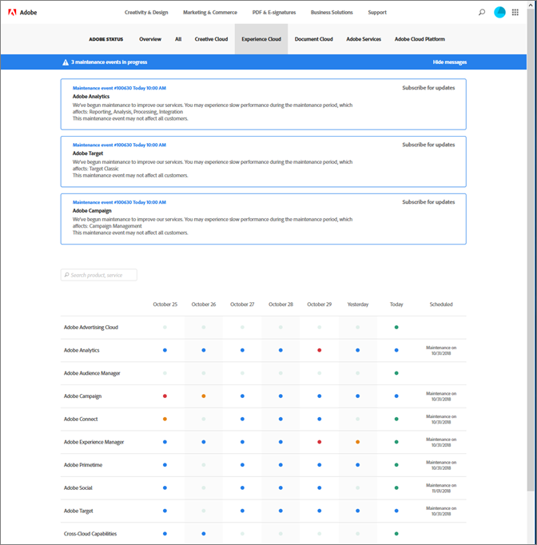

# Systeemstatusupdates en proactieve meldingen

Gebruik de pagina [!UICONTROL Adobe System Status] en proactieve meldingen om de status van [!DNL Adobe] producten en [!DNL Adobe Experience Cloud] oplossingen op de hoogte te houden. Met proactieve meldingen wordt u gewaarschuwd voor gebeurtenissen en onderhoudsgebeurtenissen.

## Systeemstatusupdates

Gebruik de pagina [!UICONTROL Adobe System Status] om de huidige status van [!DNL Target] en andere [!DNL Adobe] producten en [!DNL Adobe Experience Cloud] oplossingen te bekijken. Deze pagina helpt u bepalen of de problemen u zouden kunnen ontmoeten toe te schrijven aan systeemupdates of routineonderhoud.

Ga naar de volgende URL om de pagina [!UICONTROL System Status] te openen:

[https://status.adobe.com](https://status.adobe.com)

Als u de status van [!DNL Experience Cloud]-oplossingen wilt weergeven, inclusief [!DNL Target], klikt u op het tabblad [!UICONTROL Experience Cloud].

Bovenaan op de pagina vindt u informatie over onderhoudsgebeurtenissen die worden uitgevoerd en een koppeling om in te schrijven voor updates voor afzonderlijke oplossingen.

In de bovenstaande illustratie ondergingen [!DNL Adobe Analytics], [!DNL Adobe Target] en [!DNL Adobe Campaign] onderhoudsupdates. Alle andere producten en oplossingen functioneerden normaal. Het is altijd een goede gewoonte om deze pagina te controleren als u problemen ondervindt bij het gebruik van [!DNL Target].

Een melding in het product wordt altijd weergegeven tijdens de maandelijkse [!DNL Target]-release, maar soms treden kleine updates op en worden deze weergegeven op deze pagina.

De onderkant van de pagina bevat een kalender van de laatste zeven dagen met statussen voor elke oplossing per dag. Houd de muisaanwijzer boven een statusindicator voor meer informatie:

## Proactieve meldingen

Proactieve berichten zijn e-mailwaarschuwingen die naar geregistreerde klanten worden verzonden voor de volgende gebeurtenissen die zijn geopend tegen services die zijn opgenomen in het klantprofiel van de klant, zoals [!DNL Target]:

* De oplossing-vlakke Alarm (isoleert geen specifieke diensten binnen de oplossing)
* CSO&#39;s (outage Events) met ernst 1 en ernst 2
* CMR&#39;s (onderhoudsgebeurtenissen)

>[!NOTE]
>
>Je moet je inschrijven om deze berichten te ontvangen. Neem contact op met uw [!DNL Adobe] Customer Success Manager (CSM) of [!DNL Adobe] Account Executive (AE) om het registratieproces te starten.

De volgende illustraties zijn voorbeelden van de e-mailwaarschuwing voor proactieve meldingen:

